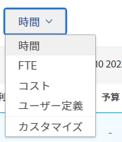
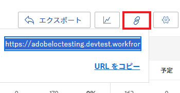
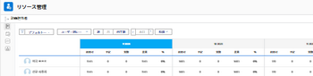

# リンクを使用してリソースプランナーユーザービューを共有する

Adobe Workfront では、ダッシュボードに外部ページとして埋め込むことのできるリソースプランナーのユーザービューに対する一意の URL を生成するか、新しいブラウザータブで別々に開くことができます。これは、リソースプランナーの情報を、リソース領域に直接アクセスできない可能性のあるユーザーと共有する場合に役立ちます。

## アクセス要件

以下が必要です。

<table style="table-layout:auto"> 
 <col> 
 <col> 
 <tbody> 
  <tr> 
   <td role="rowheader">Adobe Workfront プラン*</td> 
   <td> 
Pro 以上
 </td> 
  </tr> 
  <tr> 
   <td role="rowheader">Adobe Workfront ライセンス*</td> 
   <td> 
プラン 
 </td> 
  </tr> 
  <tr> 
   <td role="rowheader">アクセスレベル設定*</td> 
   <td> 
リソース管理、プロジェクト、ユーザーへの表示またはそれ以上のアクセス権限
 
コスト情報を表示するための財務データへの表示アクセス権限 
 
<b>メモ</b>：アクセス権がない場合は、Workfront 管理者に、アクセスレベルに追加の制限を設定しているかどうかを問い合わせてください。Workfront 管理者がアクセスレベルを変更する方法について詳しくは、<a href="../../administration-and-setup/add-users/configure-and-grant-access/create-modify-access-levels.md" class="MCXref xref">カスタムアクセスレベルの作成または変更</a>を参照してください。
 </td> 
  </tr> 
  <tr> 
   <td role="rowheader">オブジェクト権限</td> 
   <td> 
リソースプランナーに表示するプロジェクトへの表示またはそれ以上の権限
 
追加のアクセス権のリクエストについて詳しくは、<a href="../../workfront-basics/grant-and-request-access-to-objects/request-access.md" class="MCXref xref">オブジェクトへのアクセス権のリクエスト</a>を参照してください。
 </td> 
  </tr> 
 </tbody> 
</table>

&#42;保有するプラン、ライセンスタイプ、アクセス権を確認するには、Workfront 管理者に問い合わせてください。

リソースプランナのユーザービューに対する一意の URL を生成する際は、次の点を考慮してください。

* 一意の URL は、ユーザービューに対してのみ取得できます。URL を生成するオプションは、プロジェクトビューまたはロールビューにはありません。
* この URL は、作業やレビューのライセンスを持つユーザーなど、他のユーザーと共有できます。\
  他のユーザーと共有する URL からリソースプランナーの情報を表示するには、そのユーザーが他のユーザーを表示するアクセス権を持っている必要があります。
* URL を他のユーザーと共有する際に、次の情報が保存されます。

   * 期間のタイプ（週、月、四半期）。
   * 適用するフィルター。
   * 表示のタイプ（時間または FTE）。

リソースプランナーのユーザービューで一意の URL を取得し、他のユーザーと共有する手順は、次のとおりです。

1. Adobe Workfront の右上隅にある&#x200B;**メインメニュー**&#x200B;アイコン  をクリックします。

1. 「**リソース**」をクリックします。
1. で、「**ユーザー別に表示**」を選択します。
1. （オプション）リソースプランナーに表示する情報の期間を選択します。次の中から選択します。

   * 週
   * 月
   * 四半期

1. （オプション）情報の表示を **FTE** 別にするか&#x200B;**時間**&#x200B;別にするかを選択します。\
   

1. （オプション）リソースプランナーにフィルターを適用します。\
   フィルターの適用について詳しくは、[リソースプランナーで情報をフィルタリング](../../resource-mgmt/resource-planning/filter-resource-planner.md)を参照してください。

1. **ハイパーリンク**&#x200B;アイコンをクリックします。\
   

1. 「**URL をコピー**」をクリックします。\
   この結果、ユーザービューにあるリソースプランナーの一意の URL がクリップボードにコピーされます。

1. （オプション）次のいずれかの操作を行います。

   * URL を別のアプリケーションに貼り付けて、別のユーザーに送信します。\
     そのユーザーは、ユーザービューでリソースプランナーを表示するのに、Workfront にログインする必要があります。
   * 新しいブラウザーのタブまたはウィンドウを開き、コピーしたリンクを貼り付け、Enter キーを押して、リソースプランナーを新しいタブまたはウィンドウで開きます。
   * 次の操作を実行します。

     <!--   
     <MadCap:conditionalText data-mc-conditions="QuicksilverOrClassic.Draft mode">   
     (NOTE:&nbsp;turn this into a numbered list)   
     </MadCap:conditionalText>   
     -->

      1. **レポート**／**ダッシュボード**／**新規ダッシュボード**／**外部ページを追加**&#x200B;をクリックします。

      1. クリップボードにコピーしたリンクを、**URL** フィールドに貼り付けます。
      1. 「**保存**」、「**保存して閉じる**」の順にクリックします。\
         これにより、URL がダッシュボードに埋め込まれ、リソースプランナーのユーザービューが別のダッシュボードに表示されます。

1. （オプション）URL をダッシュボードに埋め込んだ場合は、そのダッシュボードをレイアウトテンプレートに追加するか、リソース管理エリアにアクセスできない他のユーザーと共有することを検討します。\
   レイアウトテンプレートへのダッシュボードの追加について詳しくは、[レイアウトテンプレートを作成および管理](../../administration-and-setup/customize-workfront/use-layout-templates/create-and-manage-layout-templates.md)を参照してください。\
   ダッシュボードの共有について詳しくは、[ダッシュボードを共有](../../reports-and-dashboards/dashboards/creating-and-managing-dashboards/share-dashboard.md)を参照してください。\
   共有 URL を表示するとき、ユーザーは、最初にリソースプランナーに適用した設定で情報を確認できます。共有 URL を表示するには、Workfront にログインする必要があります。\
   
