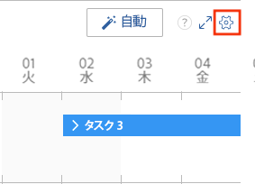
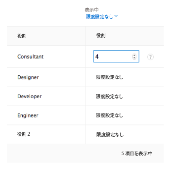

# スケジュール領域で未割り当てタスクとタスクを自動的に割り当てます

>[!IMPORTANT]
>  
>この記事で説明するスケジュール機能は、2023 年 1 月の 23.1 リリースから廃止され、Adobe Workfrontから削除されました。   
>  
>  この記事は、2023 年初頭の 23.1 リリースの直後にも削除されます。 現時点では、ブックマークを適宜更新することをお勧めします。 
> 
> これで、ワークロードバランサーを使用して、リソースの作業をスケジュールできます。 
>  
> ワークロード・バランサを使用したリソースのスケジュール設定の詳細は、「 [ワークロードバランサー](../../resource-mgmt/workload-balancer/workload-balancer.md). 

<!-- 

>[!CAUTION] 
> 
> 
> The information in this article refers to the Adobe Workfront's Scheduling tools. The Scheduling areas have been removed from the Preview environment and will be removed from the Production environment in **January 2023**.  
>  Instead, you can schedule resources in the Workload Balancer.  
> 
>*  For information about scheduling resources using the Workload Balancer, see the section [The Workload Balancer](../../resource-mgmt/workload-balancer/workload-balancer.md). 
> 
>*  For more information about the deprecation and removal of the Scheduling tools, see [Deprecation of Resource Scheduling tools in Adobe Workfront](../../resource-mgmt/resource-mgmt-overview/deprecate-resource-scheduling.md). 
-->

スケジューリングツールを使用すると、Adobe Workfrontが使用可能なユーザー間で現在の作業割り当てを分析し、まだ割り当てられていないタスクや問題に対して、インテリジェントで論理的な割り当てを提案できます。 提案された割り当てを最終処理する前に変更できます。

Workfrontは、現在選択されている日付範囲の「未割り当て」領域で使用可能なタスクと問題を調べ、各項目の割り当てを一度に提案します。 「未割り当て」領域で使用できる項目の数を制限するフィルターを作成できます。

システム管理者が、Workfrontがシステムレベルでリソースの可用性を計算する方法を決定します（時間と FTE の可用性を考慮）。 このシステム全体の設定に応じて、リソースの可用性は、デフォルトのスケジュールまたはユーザーのスケジュールを使用して計算されます。 詳しくは、 [Workfrontがスケジューリング領域のリソース時間と FTE の可用性を計算する方法を設定します](../../resource-mgmt/resource-scheduling/calculate-hours-fte-scheduling-area.md).

## アクセス要件

この記事の手順を実行するには、次のアクセス権が必要です。

<table style="table-layout:auto"> 
 <col> 
 <col> 
 <tbody> 
  <tr> 
   <td role="rowheader">Adobe Workfront plan*</td> 
   <td> 
任意
 </td> 
  </tr> 
  <tr> 
   <td role="rowheader">Adobe Workfront license*</td> 
   <td> 
仕事以上
 </td> 
  </tr> 
  <tr> 
   <td role="rowheader">アクセスレベル*</td> 
   <td> 
プロジェクト、タスク、問題へのアクセス権を表示または高くする
 
<strong>メモ</strong>

まだアクセス権がない場合は、Workfront管理者に、アクセスレベルに追加の制限を設定しているかどうかを問い合わせてください。 Workfront管理者がアクセスレベルを変更する方法について詳しくは、 <a href="../../administration-and-setup/add-users/configure-and-grant-access/create-modify-access-levels.md" class="MCXref xref">カスタムアクセスレベルの作成または変更</a>.
 </td>
</tr> 
  <tr> 
   <td role="rowheader">オブジェクト権限</td> 
   <td> 
プロジェクト、タスク、および割り当てを更新するタスクに、権限以上を貢献する
 
追加のアクセス権のリクエストについて詳しくは、 <a href="../../workfront-basics/grant-and-request-access-to-objects/request-access.md" class="MCXref xref">オブジェクトへのアクセスのリクエスト </a>.
 </td> 
  </tr> 
 </tbody> 
</table>

*保有するプラン、ライセンスの種類、アクセス権を確認するには、Workfront管理者にお問い合わせください。

## 前提条件 {#prerequisites}

Workfrontは独自のアルゴリズムを使用して、割り当て提案を決定します。 最良の結果を容易に得るために、Workfrontで次の情報が正しいことを確認してください。

* タスクおよび問題の情報。次の情報が含まれます。

   * ロールの割り当て\
      役割に割り当てられていないタスクやタスクに対する提案は行われません。
   * 予定時間数\
      現在、タスクまたは問題に予定時間がない場合、Workfrontは作業を自動的に割り当てる際に、1 日 4 時間の予定時間を想定します。 これらの時間は、作業項目に自動的に割り当てられません。これらは、より現実的な割り当て分布を確実にするためにのみ使用されます。
   * 計画開始日と計画完了日

* 次のようなユーザー情報。

   * プライマリプロファイルでのユーザーとセカンダリの役割の割り当て
   * プロジェクトチーム情報

## 役割の制限を設定

役割の制限は、特定の役割を持ち、作業を自動的に割り当てることができるユーザーの数を制御します。 役割に基づくタスクが多数のユーザーに分散されないように、役割制限はプロジェクト単位で機能します。

次のシナリオでは、役割の制限がプロジェクトに適用される方法を示します。

* **シナリオ 1**:プロジェクトチームに割り当てられたユーザーがない場合は、ロール制限を使用してタスクを割り当てます。\
   例えば、プロジェクトチームにユーザーが割り当てられていないプロジェクトがあるとします。 このプロジェクトには、割り当てる必要のある 10 個のプロジェクト管理タスクがあり、プロジェクトマネージャーの役割に対する役割の制限を 1 に設定しました。 ロールの制限が 1 に設定されているので、1 つのプロジェクトマネージャに 10 個のタスクをすべて割り当てます。

* **シナリオ 2**:役割の制限がプロジェクトチームに割り当てられたユーザー数より大きい場合は、追加のユーザーにタスクが割り当てられます。\
   例えば、1 人のライターがプロジェクトチームに割り当てられたプロジェクトがあるとします。 このプロジェクトには割り当てる必要のある 12 個のライタータスクがあり、ライターの役割に対する役割の制限は 2 個に設定されています。 ロールの制限が 2 に設定されているので、プロジェクトチームライターと追加ライターの間に 12 のタスクをすべて割り当てます。

* **シナリオ 3**:ロールの制限がプロジェクトチームに割り当てられたユーザー数より少ない場合は、ロールの制限が上書きされます。\
   たとえば、4 人の設計者がプロジェクトチームに割り当てられたプロジェクトがあるとします。 このプロジェクトには、割り当てる必要のある 8 つのデザイナータスクがあり、デザイナーの役割に対する役割の制限を 2 に設定しました。 役割の制限が 2 に設定されている場合でも、4 人のプロジェクトチームデザイナーの間に 8 つのタスクをすべて割り当てます。

ジョブ・ロールの割当の制限を設定する手順は、次のとおりです。

1. 複数のプロジェクトのスケジュールタイムライン、または個々のプロジェクトのスケジュールタイムラインに移動します。

   * **複数のプロジェクトの場合**:  次をクリック： **メインメニュー** アイコン  Workfrontの右上隅にある **リソース > ワークロードバランサー**&#x200B;を選択し、「 **スケジュール** をクリックします。
   * **個々のプロジェクトの場合**:プロジェクトに移動し、 **ワークロードバランサー** セクションを開き、 **スケジュール** を選択します。

1. 次をクリック： **設定** アイコン\
   

1. 「自動リソーススケジュール設定」セクションで、 **制限** 列は **役割** 列に正の数を入力します。\
   Workfrontは変更を自動的に保存します。

   >[!NOTE]
   >
   >現在のプロジェクトチームメンバーは、ロール制限の設定に関係なく、すべての推奨作業を自動的に実施できます。

   

1. （オプション） **表示中** メニューを使用して、目的の表示オプションを選択します。
1. リソースのスケジュール領域に戻るには、 **スケジュールに戻る**.

## タスクとタスクを自動的に割り当てる

（複数のプロジェクトのリソースをスケジュールする場合）「スケジュール」タブ、（個々のプロジェクトのリソースをスケジュールする場合）「スタッフ」タブのどちらであるかに関わらず、スケジューリングタイムラインでユーザーにタスクとタスクを割り当てます。

「未割り当て」領域でWorkfrontがタスクおよびタスクの割り当てを自動的に提案できるようにするには、次の手順に従います。

1. 複数のプロジェクトのスケジュールタイムライン、または個々のプロジェクトのスケジュールタイムラインに移動します。

   * **複数のプロジェクトの場合**:  次をクリック： **メインメニュー** アイコン  Workfrontの右上隅にある **リソース > ワークロードバランサー**&#x200B;を選択し、「 **スケジュール** をクリックします。
   * **個々のプロジェクトの場合**:プロジェクトに移動し、 **ワークロードバランサー** セクションを開き、 **スケジュール** を選択します。

1. （オプション）フィルターを作成して、スケジュールタイムラインの「未割り当て」領域に表示するコンテンツをカスタマイズします。\
   フィルターの作成について詳しくは、 [スケジュール領域の情報のフィルタリング](../../resource-mgmt/resource-scheduling/filter-scheduling-area.md#creating-and-modifying-filters-on-the-scheduling-tab-for-projects) in [スケジュール領域の情報のフィルタリング](../../resource-mgmt/resource-scheduling/filter-scheduling-area.md) [スケジュール領域の情報のフィルタリング](../../resource-mgmt/resource-scheduling/filter-scheduling-area.md)

   >[!TIP]
   >
   >最も適格なユーザーにWorkfrontが確実に作業を割り当てるには、次の手順に従います。
   >
   >* 未割り当て領域に表示されるタスク (Portfolio、プログラム、プロジェクトなど ) に影響を与える情報のみをフィルターします。
   >* スケジュールタイムラインで割り当て可能なユーザーに影響する情報はフィルタリングしないことをお勧めします。 これにより、Workfrontがすべての潜在的な担当者を表示できなくなり、十分な割り当てを行えなくなる可能性があります。

1. （オプション）スケジュールタイムラインに表示される日付範囲を変更します。詳しくは、 [スケジュール領域の日付範囲を調整する](../../resource-mgmt/resource-scheduling/get-started-resource-scheduling.md#adjusting-the-date-range-for-which-data-is-displayed) in [リソーススケジュールの概要](../../resource-mgmt/resource-scheduling/get-started-resource-scheduling.md). Workfrontは、スケジュールタイムラインの表示可能な日付範囲内のタスクおよびイシューに対してのみ割り当てをおこないます。

1. 次をクリック： **自動** ボタンをクリックします。\
   \
   Workfrontが各タスクまたは問題に対して割り当てを提案 **未割り当て** 領域

   >[!TIP]
   >
   >割り当てを提案するには、タスクとタスクが既にロールに割り当てられている必要があります。 最適な結果を得るには、タスクと問題に、 [前提条件](#prerequisites).

   提案された割り当ては、次のように、各タスクまたは問題の周囲に点線の輪郭で区別されます。\
   **提案されたタスク割り当て：**

   **既存のタスク割り当て：**

1. （オプション）割り当てを最終処理する前に、提案または既存の割り当てを変更できます。

   >[!NOTE]
   >
   >既存の割り当てを変更すると、その割り当ては提案済みの状態に変わります。

   * アイテムを別のユーザーに割り当てる手順は、次のとおりです。

      * タスクまたはタスクを、割り当てる別のユーザーの行にドラッグします。

         <!--      
        <MadCap:conditionalText data-mc-conditions="QuicksilverOrClassic.Draft mode">      
        (NOTE: lists in this article need to be reformatted and maybe split - too many levels in)      
        </MadCap:conditionalText>      
        -->

         特定のユーザーに対して 1 日あたり最大 10 個のタスクが表示されます。 リストを展開して、そのユーザーに現在割り当てられているすべてのタスクを表示できます。 （スケジュールタイムラインで割り当てを行うと、10 個を超えるタスクが一時的に表示される場合があります）。\
         項目をドラッグすると、タスクまたは問題を解放し、割り当てを完了する前に、次の情報が表示されます。

         * ユーザーの行にドロップインジケーターが表示されます。 これにより、割り当てを行う前に項目が割り当てられている場所を確認できます。
         * スケジューリング・タイムラインでユーザー割り当てが有効になっている場合、割り当てが完了すると、赤い割り当て超過指標が表示され、ユーザーの割り当て超過が発生します。\
            割り当て超過の指標について詳しくは、 [配分指標](../../resource-mgmt/resource-scheduling/manage-allocations-scheduling-areas.md#understanding-allocation-indicators).

         * 割り当てを受け取る資格がないユーザーは淡色表示になります。
      * 割り当てるタスクまたは問題を展開し、 **割り当て** 「 」フィールドに割り当てるユーザーの名前を入力し、ドロップダウンリストでユーザーの名前をクリックします。\
         
   * 割り当てを延期するには、まだ割り当ての準備ができていないタスクまたは問題をドラッグして、 **未割り当て** 領域

1. 次をクリック： **割り当てを行う** ボタンをクリックして、提案された割り当てを確定します。\
   または\
   クリック **キャンセル** 提案されたすべての割り当てを元の職に戻す
