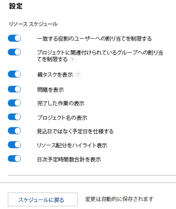
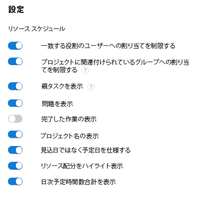
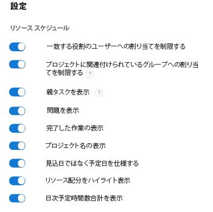
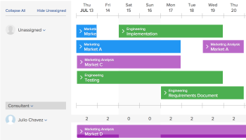
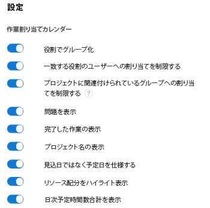
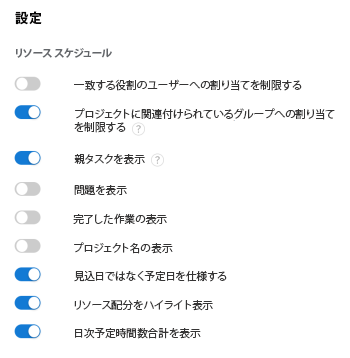
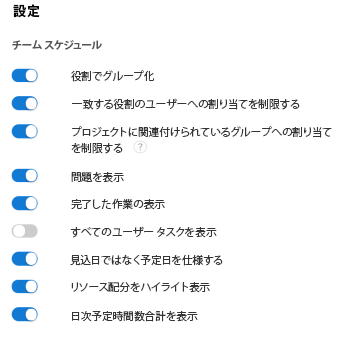

# [ 集計 ] 領域で設定を行う

>[!IMPORTANT]
>  
>この記事で説明するスケジュール機能は、2023 年 1 月の 23.1 リリースから廃止され、Adobe Workfrontから削除されました。   
>  
>  この記事は、2023 年初頭の 23.1 リリースの直後にも削除されます。 現時点では、ブックマークを適宜更新することをお勧めします。 
> 
> これで、ワークロードバランサーを使用して、リソースの作業をスケジュールできます。 
>  
> ワークロード・バランサを使用したリソースのスケジュール設定の詳細は、「 [ワークロードバランサー](../../resource-mgmt/workload-balancer/workload-balancer.md). 

<!--  

>[!CAUTION] 
> 
> 
> The information in this article refers to the Adobe Workfront's Scheduling tools. The Scheduling areas have been removed from the Preview environment and will be removed from the Production environment in **January 2023**. 
>  Instead, you can schedule resources in the Workload Balancer.  
> 
>*  For information about scheduling resources using the Workload Balancer, see the section [The Workload Balancer](../../resource-mgmt/workload-balancer/workload-balancer.md). 
> 
>*  For more information about the deprecation and removal of the Scheduling tools, see [Deprecation of Resource Scheduling tools in Adobe Workfront](../../resource-mgmt/resource-mgmt-overview/deprecate-resource-scheduling.md). 
-->

様々な設定を指定して、スケジュールタイムラインに表示する方法と情報をカスタマイズできます。

## アクセス要件

この記事の手順を実行するには、次のアクセス権が必要です。

<table style="table-layout:auto"> 
 <col> 
 <col> 
 <tbody> 
  <tr> 
   <td role="rowheader">Adobe Workfront plan*</td> 
   <td> 
任意
 </td> 
  </tr> 
  <tr> 
   <td role="rowheader">Adobe Workfront license*</td> 
   <td> 
仕事以上
 </td> 
  </tr> 
  <tr> 
   <td role="rowheader">アクセスレベル*</td> 
   <td> 
プロジェクト、タスク、問題へのアクセス権以上の表示
 
<b>メモ</b>

まだアクセス権がない場合は、Workfront管理者に、アクセスレベルに追加の制限を設定しているかどうかを問い合わせてください。 Workfront管理者がアクセスレベルを変更する方法について詳しくは、 <a href="../../administration-and-setup/add-users/configure-and-grant-access/create-modify-access-levels.md" class="MCXref xref">カスタムアクセスレベルの作成または変更</a>.
 </td>
</tr> 
  <tr> 
   <td role="rowheader">オブジェクト権限</td> 
   <td> 
プロジェクト、タスク、問題に権限以上を貢献する
 
追加のアクセス権のリクエストについて詳しくは、 <a href="../../workfront-basics/grant-and-request-access-to-objects/request-access.md" class="MCXref xref">オブジェクトへのアクセスのリクエスト </a>.
 </td> 
  </tr> 
 </tbody> 
</table>

*保有するプラン、ライセンスの種類、アクセス権を確認するには、Workfront管理者にお問い合わせください。

## スケジュールタイムラインに表示する問題の設定

<!--

(NOTE: ALL THE SECTIONS BELOW ARE LINKED TO PRODUCT. DO NOT CHANGE TITLES) 

-->

スケジュールタイムラインのタスクに加えて、問題を表示するように設定できます。\
チームの「スケジュール設定」セクションでリソースをスケジュールする場合、タスクに加えてイシューもデフォルトで表示されます。 プロジェクトのリソースをスケジュールする場合、デフォルトではタスクのみが表示されます。

1. 複数のプロジェクト、個々のプロジェクト、またはチームのスケジューリングタイムラインに移動します。

   * **複数のプロジェクトの場合**:  次をクリック： **メインメニュー** アイコン  Workfrontの右上隅にある **リソース > ワークロードバランサー**&#x200B;を選択し、「 **スケジュール** をクリックします。
   * **個々のプロジェクトの場合**:プロジェクトに移動し、 **ワークロードバランサー** セクションを開き、 **スケジュール** を選択します。
   * **チームの場合**:次をクリック： **メインメニュー** アイコン  Workfrontの右上隅で、 **チーム**、チームを選択して、 **ワークロードバランサー** 左のパネルで、「 **スケジュール** を選択します。

1. 次をクリック： **設定** アイコンをクリックします。

1. [ リソースのスケジュール設定 ] ダイアログボックスで、 **問題を表示** オプション。\
   

1. クリック **スケジュールに戻る**. 

## 完了した作業をスケジュールタイムラインに表示するように設定します

既に「完了」とマークされている作業を表示するように、スケジュールタイムラインを設定できます。 デフォルトでは、完了した作業はスケジュールタイムラインに表示されません。 

1. 複数のプロジェクト、個々のプロジェクト、またはチームのスケジューリングタイムラインに移動します。

   * **複数のプロジェクトの場合**:  次をクリック： **メインメニュー** アイコン  Workfrontの右上隅にある **リソース > ワークロードバランサー**&#x200B;を選択し、「 **スケジュール** をクリックします。
   * **個々のプロジェクトの場合**:プロジェクトに移動し、 **ワークロードバランサー** セクションを開き、 **スケジュール** を選択します。
   * **チームの場合**:次をクリック： **メインメニュー** アイコン  Workfrontの右上隅で、 **チーム**、チームを選択して、 **ワークロードバランサー** 左のパネルで、「 **スケジュール** を選択します。

1. 次をクリック： **設定** アイコンをクリックします。

1. [ リソースのスケジュール設定 ] ダイアログボックスで、 **完了した作業を表示** オプション。\
   

1. クリック **スケジュールに戻る**.\
   完了した作業は、作業項目の右上隅にチェックマークが付いて表示されます。

## スケジュールタイムラインに表示するプロジェクト名を設定 

プロジェクト名を設定して、各タスクとイシューをスケジュールタイムラインに表示することができます。 これにより、ユーザーがスケジュールタイムラインを表示して、タスクまたは問題が存在するプロジェクトの名前をすばやく確認できます。

プロジェクト名の表示を有効にすると、各タスクとイシューのスケジュールタイムライン上の垂直方向のスペースが多くなり、タスクやイシューの数が 1 つのビューに表示されるのが少なくなります。

デフォルトでは、プロジェクト名はタスクやスケジューリングタイムラインの問題には表示されません。

スケジュールタイムラインでタスクと問題に関するプロジェクト名を表示するには：

1. 複数のプロジェクトのスケジュールタイムラインまたはチームのスケジュールタイムラインに移動します。

   * **複数のプロジェクトの場合**:  次をクリック： **メインメニュー** アイコン  Workfrontの右上隅にある **リソース > ワークロードバランサー**&#x200B;を選択し、「 **スケジュール** をクリックします。
   * **チームの場合**:次をクリック： **メインメニュー** アイコン  Workfrontの右上隅で、 **チーム**、チームを選択して、 **ワークロードバランサー** 左のパネルで、「 **スケジュール** を選択します。

1. 次をクリック： **設定** アイコンをクリックします。

1. [ リソーススケジュール設定 ] ダイアログボックスで、次のオプションを有効にします。 **プロジェクト名を表示**.\
   

1. クリック **スケジュールに戻る**.\
   スケジュールタイムラインの各タスクとイシューには、タスクまたはイシューが存在するプロジェクトの名前が表示されます。\
   

## 予定タイムラインに表示する予定日の設定

デフォルトでは、予定日はスケジュールタイムラインで使用されます。 または、予定日を使用するようにスケジュールタイムラインを設定できます。

計画日と予定日に関する次の情報を考慮します。

* タスクの計画日は、タスクの制約や期間の種類に応じて、手動で設定することも、自動的に設定することもできます。 詳しくは、 [タスク制約の概要](../../manage-work/tasks/task-constraints/task-constraint-overview.md) および  [タスクの期間と期間のタイプの概要](../../manage-work/tasks/taskdurtn/task-duration-and-duration-type.md) .

   問題の計画日は、ユーザーが問題に対して手動で設定します。 ただし、システム管理者は、問題が発生した場合に計画日を調整することをユーザーに制限できます。

* タスクとタスクの両方の予想日は自動的に設定されます。 予定日について詳しくは、 [プロジェクト、タスクおよび問題に関する予定完了日の概要](../../manage-work/projects/planning-a-project/project-projected-completion-date.md).

>[!NOTE]
>
>スケジューリングタイムラインで「推定日」を使用すると、ユーザー割り当て情報が表示されない。 ユーザー割り当ての詳細については、「 [スケジュール領域で未割り当てタスクとタスクを手動で割り当てる](../../resource-mgmt/resource-scheduling/manually-assign-items-scheduling-areas.md).

予定日に応じてタスクと問題を表示するようにスケジュールタイムラインを設定するには： 

1. 複数のプロジェクト、個々のプロジェクト、またはチームのスケジューリングタイムラインに移動します。

   * **複数のプロジェクトの場合**:  次をクリック： **メインメニュー** アイコン  Workfrontの右上隅にある **リソース > ワークロードバランサー**&#x200B;を選択し、「 **スケジュール** をクリックします。
   * **個々のプロジェクトの場合**:プロジェクトに移動し、 **ワークロードバランサー** セクションを開き、 **スケジュール** を選択します。
   * **チームの場合**:次をクリック： **メインメニュー** アイコン  Workfrontの右上隅で、 **チーム**、チームを選択して、 **ワークロードバランサー** 左のパネルで、「 **スケジュール** を選択します。

1. 次をクリック： **設定** アイコンをクリックします。

1. [ リソーススケジュール設定 ] ダイアログボックスで、 **予定日の代わりに計画済みを使用** オプション。
1. クリック **スケジュールに戻る**.

## スケジュールタイムラインでのユーザーの表示方法の設定

>[!NOTE]
>
>この節は、チームのリソースをスケジュールする場合にのみ適用されます（チームの「スケジュール設定」セクションから）。 複数のプロジェクトのリソースを（「スケジュール設定」タブから）スケジュールする場合、または 1 つのプロジェクトのリソースを（「スタッフ」タブから）スケジュールする場合、ユーザーはアルファベット順に表示できません。彼らは常に役割別に整理されている。

チームのリソースをスケジュールする際に、スケジューリングタイムラインにアルファベット順またはロール別に表示するユーザーを設定できます。 デフォルトでは、ユーザーはアルファベット順に表示されます（役割は表示されません）。

1. 次をクリック： **メインメニュー** アイコン  Workfrontの右上隅にある「チーム」をクリックします。 チームはデフォルトで選択されています。

1. 次をクリック： **設定** アイコンをクリックします。

1. [ 設定 ] ダイアログボックスで、 **グループ — 役割別** オプション。\
   このオプションを無効にすると、ユーザーはアルファベット順に表示され、役割はスケジュールタイムラインに表示されません。\
   このオプションを有効にすると、ロールがスケジュールタイムラインに表示され、ユーザーはそれぞれのロール内にグループ化されます。 特定のユーザーがシステムで複数のロールを定義している場合、そのユーザーはスケジュールタイムラインの各適切なロールの下に複数回表示されます。\
   

1. クリック **スケジュールに戻る**.

## スケジュールタイムラインに親タスクを表示するかどうかを設定します

<!--

(NOTE: This section is linked to the UI in a tooltip inside the Settings of the scheduler. do not rename/ remove/ edit the tag!! - Resource Scheduling (People> Scheduling>Settings>Show Parent Tasks tooltip)

-->

親タスクの表示は、アクセスするスケジュールタイムラインに応じて異なります。 

* [複数のプロジェクトの親タスクを表示](#display-parent-tasks-for-multiple-projects)
* [プロジェクトまたはチームの親タスクを表示](#display-parent-tasks-for-a-project-or-a-team)

### 複数のプロジェクトの親タスクを表示 {#display-parent-tasks-for-multiple-projects}

「スケジュール設定」セクションで複数のプロジェクトのリソースをスケジュールする場合、親タスクを表示するかどうかは、次の設定によって異なります。

* プロジェクトの完了モード。
* プロジェクトの概要完了モード。
* [ スケジュール ] タブの [ 親タスクの表示 ] 設定。

次の表に、親タスクが「スケジュール設定」タブに表示される場合と、サブタスクのみが表示される場合を示します。 

| **親タスク設定を表示** | **プロジェクトの完了モード** | **プロジェクトの概要完了モード** | **スケジュールタイムラインに表示されるタスクのタイプ** |
|---|---|---|---|
| 無効 | 手動 | 自動 | サブタスクのみ |
| 無効 | 手動 | 手動 | サブタスクのみ |
| 無効 | 自動 | 自動 | サブタスクのみ |
| 無効 | 自動 | 手動 | サブタスクのみ |
| 有効 | 自動 | 手動 | サブタスクと親タスク |
| 有効 | 自動 | 自動 | サブタスクのみ |
| 有効 | 手動 | 手動 | サブタスクと親タスク |
| 有効 | 手動 | 自動 | サブタスクのみ |

設定に関する情報&#x200B;**完了モード** そして **概要完了モード** 各プロジェクトのフィールドについては、この記事の「設定」の節を参照してください。 [プロジェクトを編集](../../manage-work/projects/manage-projects/edit-projects.md).

複数のプロジェクトの「スケジュール設定」セクションで、手動で「親タスクを表示」設定を設定できます。 

「親タスクを表示」設定を構成するには： 

1. 次をクリック： **メインメニュー** アイコン  Workfrontの右上隅にある **リソース > ワークロードバランサー**&#x200B;を選択し、「 **スケジュール** をクリックします。
1. 次をクリック： **設定** アイコンをクリックします。

1. [ リソースのスケジュール設定 ] ダイアログボックスで、このオプションを有効にするかどうかを選択します。 **親タスクを表示します。**
このオプションを有効にすると、上の表に示すように、すべてのプロジェクトの親タスクが、プロジェクトの「要約完了モード」と「完了モード」の設定に従って表示されます。 このオプションは、デフォルトで有効になっています。
\
   

1. クリック **スケジュールに戻る** をクリックします。

### プロジェクトまたはチームの親タスクを表示 {#display-parent-tasks-for-a-project-or-a-team}

プロジェクトの「スタッフ」セクションまたは「スケジュール」セクションでリソースをスケジュールする場合、「親タスク」が表示されるかどうかは、次の設定によって異なります。

* プロジェクトの完了モード。
* プロジェクトの概要完了モード。

設定に関する情報 **完了モード** そして **概要完了モード** 各プロジェクトのフィールドについては、この記事の「設定」の節を参照してください。 [プロジェクトを編集](../../manage-work/projects/manage-projects/edit-projects.md).

次の表に、プロジェクトの「スタッフ」セクションまたは「スケジュール」セクションに親タスクが表示される場合と、サブタスクのみが表示される場合の概要を示します。 

| プロジェクトの完了モード | プロジェクトの概要完了モード | 「スケジュール設定」セクションに表示されるタスクのタイプ | チームのスケジュール設定セクションに表示されるタスクのタイプ |
|---|---|---|---|
| 手動 | 自動 | サブタスクのみ | サブタスクのみ |
| 手動 | 手動 | サブタスクと親タスク | サブタスクのみ |
| 自動 | 自動 | サブタスクのみ | サブタスクのみ |
| 自動 | 手動 | サブタスクと親タスク | サブタスクのみ |
| 自動 | 手動 | サブタスクと親タスク | サブタスクのみ |
| 自動 | 自動 | サブタスクのみ | サブタスクのみ |
| 手動 | 手動 | サブタスクと親タスク | サブタスクのみ |
| 手動 | 自動 | サブタスクのみ | サブタスクのみ |

## 日次予定時間をスケジュールタイムラインに表示するかどうかを設定します

各ユーザーの計画時間の日別合計を表示するようにスケジュール・タイムラインを設定するには、次の手順に従います。 

1. 複数のプロジェクト、個々のプロジェクト、またはチームのスケジューリングタイムラインに移動します。

   * **複数のプロジェクトの場合**:  次をクリック： **メインメニュー** アイコン  Workfrontの右上隅にある **リソース > ワークロードバランサー**&#x200B;を選択し、「 **スケジュール** をクリックします。
   * **個々のプロジェクトの場合**:プロジェクトに移動し、 **ワークロードバランサー** セクションを開き、 **スケジュール** を選択します。
   * **チームの場合**:次をクリック： **メインメニュー** アイコン  Workfrontの右上隅で、 **チーム**、チームを選択して、 **ワークロードバランサー** 左のパネルで、「 **スケジュール** を選択します。

1. 次をクリック： **設定** アイコンをクリックします。

1. 設定ダイアログボックスで、次のオプションを有効にします。

   *  **日別予定時間の合計を表示**:各ユーザーの日別計画時間の合計を表示します。
   * **リソース割り当てのハイライト表示**:タスクと問題に対するユーザーの配分を強調表示し、ユーザーの割り当てが超過した日を強調表示します。\
      これらのオプションは、デフォルトでは無効になっています。\
      

1. クリック **スケジュールに戻る**.\
   各日のユーザーに割り当てられた計画時間の合計が表示されます。\
   ユーザーの割り当てが超過した日の計画時間は、赤でハイライト表示されます。\
   ユーザー割り当ての詳細については、「 [スケジュール領域で未割り当てタスクとタスクを手動で割り当てる](../../resource-mgmt/resource-scheduling/manually-assign-items-scheduling-areas.md).

## すべてのユーザータスクをスケジュールタイムラインに表示するかどうかを設定します

>[!NOTE]
>
>このオプションは、個々のプロジェクトのリソースを（プロジェクトの「スケジュール設定」セクションから）スケジュールする場合にのみ適用されます。 このオプションは、複数のプロジェクトのリソースをスケジュールする場合（「スケジュール設定」セクションから）、またはチームのリソースをスケジュールする場合（「チームのスケジュール設定」セクションから）は使用できません。

（表示中のプロジェクトに関連付けられたタスクだけでなく）各ユーザーに割り当てられたすべてのタスクをスケジュールタイムラインに表示するかどうかを設定するには、次の手順に従います。

1. スケジューリングタイムラインを設定するプロジェクトに移動し、各ユーザーに割り当てられているすべてのタスクを表示します。
1. 次をクリック： **ワークロードバランサー** セクション内の「 」セクション ( **さらに表示**) を選択し、「 **スケジュール** を選択します。
1. 次をクリック： **設定** アイコンをクリックします。

1. 「設定」領域で、このオプションを有効にするかどうかを選択します。 **すべてのユーザータスクを表示**.\
   このオプションを有効にすると、タスクの場所に関係なく、各ユーザーに割り当てられたすべてのタスクがスケジュールタイムラインに表示されます。\
   このオプションはデフォルトでは無効になっています。\
   

1. クリック **スケジュールに戻る**.
