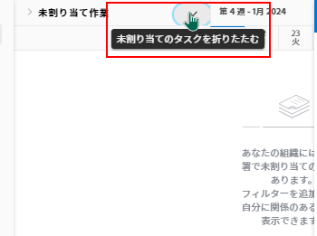

# リソーススケジュールの概要

>[!IMPORTANT]
>  
>この記事で説明するスケジュール機能は、2023 年 1 月の 23.1 リリースから廃止され、Adobe Workfrontから削除されました。   
>  
>  この記事は、2023 年初頭の 23.1 リリースの直後にも削除されます。 現時点では、ブックマークを適宜更新することをお勧めします。 
> 
> これで、ワークロードバランサーを使用して、リソースの作業をスケジュールできます。 
>  
> ワークロード・バランサを使用したリソースのスケジュール設定の詳細は、「 [ワークロードバランサー](../../resource-mgmt/workload-balancer/workload-balancer.md). 

<!--  

>[!CAUTION] 
> 
> 
> The information in this article refers to the Adobe Workfront's Scheduling tools. The Scheduling areas have been removed from the Preview environment and will be removed from the Production environment in **January 2023**.   
>  Instead, you can schedule resources in the Workload Balancer.  
> 
>*  For information about scheduling resources using the Workload Balancer, see the section [The Workload Balancer](../../resource-mgmt/workload-balancer/workload-balancer.md). 
> 
>*  For more information about the deprecation and removal of the Scheduling tools, see [Deprecation of Resource Scheduling tools in Adobe Workfront](../../resource-mgmt/resource-mgmt-overview/deprecate-resource-scheduling.md). 
-->

<!--

(NOTE: LINKED TO THE PRODUCT FROM: ALL SCHEDULING TOOLS: GLOBAL, TEAM, PROJECT STAFFING *** LINKED TO LOTS OF ARTICLES, AS WELL!) 

(NOTE: Alina: this article should be divided in multiple articles, but CAREFULLY because some sections are linked to the UI)

-->

Adobe Workfrontのリソーススケジュール機能を使用すると、タスクや問題を適切なユーザーに簡単に割り当てることができます。 ジョブの役割とユーザーの可用性の両方を考慮して、タスクまたはイシューを完了できるユーザーを決定できます。

以下の節では、Workfrontの「スケジュール設定」領域の使用に関する詳細について説明します。

## Workfrontのスケジュールツールを使用するための前提条件

>[!IMPORTANT]
>
>この記事で説明する前提条件は、Workfrontの「スケジュール設定」領域にのみ適用されます。 ワークロードバランサーの使用に関するベストプラクティスの詳細は、 [ワークロードバランサーの概要](../../resource-mgmt/workload-balancer/overview-workload-balancer.md).

Workfrontのリソーススケジュール機能を正しく使用するには、まず、自分、自分のプロジェクト、自分のタスクと問題が次の前提条件を満たしていることを確認する必要があります。

* [ユーザーの前提条件](#user-prerequisites)
* [プロジェクトの前提条件](#project-prerequisites)
* [タスクと問題の前提条件](#task-and-issue-prerequisites)

### ユーザーの前提条件 {#user-prerequisites}

次の各条件が満たされた場合は、「スケジューリング」タブ、「スタッフ」タブ、または「作業時間」タブから使用できる生産資源スケジューリング・ツールを使用できます。

**リソースをリソースマネージャーとしてスケジュールする場合（「スケジュール設定」タブから）:**

* リソースを管理するプロジェクトのリソースマネージャとして指定されます。

   プロジェクトのリソースマネージャーの指定の詳細については、「 [プロジェクトまたはテンプレートに対するリソースマネージャの指定](../../manage-work/projects/planning-a-project/designate-resource-managers-for-projects-and-templates.md).

* プランライセンスを持つユーザーです。

デフォルトでは、ユーザーは、システムで定義されたジョブロール（プライマリジョブロールまたはセカンダリジョブロール）を持ち、そのジョブロールがタスクに割り当てられたジョブロールまたはタスクに現在表示されている問題に一致する場合にのみ、スケジュールタイムラインに表示されます **未割り当て** 領域を指定します。 この機能を無効にすると、タスクの役割割り当てに一致する役割がユーザープロファイルに定義されているかどうかに関係なく、タスクとタスクを任意のユーザーに割り当てることができます。 詳しくは、 [スケジュール領域の役割およびグループメンバーシップに関係なく、ユーザー割り当てを許可します](../../resource-mgmt/resource-scheduling/assignments-regardless-of-role-or-group-scheduling-areas.md).

デフォルトでは、割り当ては、タスクまたは割り当て先のタスクの役割割り当てに一致する役割がユーザープロファイルで定義されているユーザーに対してのみ実行できます。

**（プロジェクトの「スタッフ」タブから）プロジェクトチームのメンバーとしてリソースをスケジュールする場合：**

* プロジェクトを表示、投稿、管理する権限を持っている
* プランまたは作業用ライセンスをお持ちです

<!--
<note type="note">  If Workfront has not removed the Use New Scheduling Area option from your Scheduling settings, users must have a Plan license and Manage permissions to the project to view the Scheduling timeline. For more information about the removal of the Use New Scheduling Area option, see the article
<a href="../../product-announcements/announcements/announcement-archive/replace-flash-tools.md" class="MCXref xref">Replacement of Flash-based tools in Adobe Workfront</a>.
</note>
-->

**（「作業」タブから）チームメンバーとしてリソースをスケジュールする場合：**

* チームのメンバーです\
   チームのすべてのメンバーが、スケジュールタイムラインに表示されます。 チームに割り当てられ、ユーザーに割り当てられていないタスクとタスクは、「未割り当て」領域に表示されます。 チームに割り当てられたタスクとタスク、およびチームのユーザーに割り当てられたタスクは、割り当て先のユーザーの行に表示されます。

### プロジェクトの前提条件 {#project-prerequisites}

この節で説明するプロジェクトの前提条件は、スケジューリングタイムラインからリソースマネージャーとしてリソースをスケジュールする場合にのみ適用されます。

管理中のプロジェクトの作業項目をスケジュールタイムラインに表示するには、次のいずれかのステータス（またはこれらのステータスのいずれかと同じステータス）になっている必要があります。「計画」、「現行」または「承認済」。 デフォルトでは、「現在」ステータスのプロジェクトのみが表示されます。

プロジェクトのステータスの詳細については、「 [ステータスの作成または編集](../../administration-and-setup/customize-workfront/creating-custom-status-and-priority-labels/create-or-edit-a-status.md).

<!--

(NOTE: [! I assume this doesn't apply when using the Staffing tab on a single project? The project can be in whatever status?]) 

-->

### タスクと問題の前提条件 {#task-and-issue-prerequisites}

Workfrontのリソーススケジュールツールを使用する際に最も効果的になるように、システムのタスクと問題に次の条件が定義されていることを確認します。

* 期間
* 計画開始日
* 予定時間数\
   ユーザー割り当てを変更するには、予定時間が必要です（記事を参照）。 [スケジューリング領域でユーザー割り当てを管理します](../../resource-mgmt/resource-scheduling/manage-allocations-scheduling-areas.md).

   >[!NOTE]
   >
   >リソーススケジュールカードの [ 予定時間 ] フィールドには、タスクの予定時間ではなく、すべての workPerDay 値の合計が実際に表示されます。 workPerDay の値は、計画時間の値をタスク期間で割って計算されます。 ゼロ以外の期間の場合、値は通常、タスクの予定時間に一致しますが、丸めによる小さな相違が発生する場合があります。 期間が 0 日の場合、計画時間には 0 時間と表示されます。

* 役割の割り当て

## [ 集計 ] 領域で情報を表示する

* [[ 集計 ] 領域で情報を探して表示する](#locate-and-view-information-in-the-scheduling-areas)
* [リソース割り当てと詳細の表示](#view-resource-assignments-and-details)
* [スケジュール領域のタスクと問題を最小限に抑える](#minimize-tasks-and-issues-on-the-scheduling-areas)
* [スケジュール領域の日付範囲を調整する](#adjust-the-date-range-of-the-scheduling-areas)

### [ 集計 ] 領域で情報を探して表示する {#locate-and-view-information-in-the-scheduling-areas}

リソースをスケジュールする場所に応じて、Workfrontの次の領域でスケジュールタイムラインにアクセスできます。

* 複数のプロジェクトの場合は、「集計」領域で
* スケジュール設定セクションのプロジェクトの場合
* チームの場合は、「スケジュール」セクションで、

1. 複数のプロジェクト、個々のプロジェクト、またはチームのスケジューリングタイムラインに移動します。

   * **複数のプロジェクトの場合**:  次をクリック： **メインメニュー** アイコン  Workfrontの右上隅にある **リソース > ワークロードバランサー**&#x200B;を選択し、「 **スケジュール** をクリックします。
   * **個々のプロジェクトの場合**:プロジェクトに移動し、 **ワークロードバランサー** セクションを開き、 **スケジュール** を選択します。
   * **チームの場合**:次をクリック： **メインメニュー** アイコン  Workfrontの右上隅で、 **チーム**、チームを選択して、 **ワークロードバランサー** 左のパネルで、「 **スケジュール** を選択します。

1. （オプション） **フルスクリーン** アイコン：スケジュールタイムラインの右上隅にあります。\
   \
   スケジュールタイムラインは、フルスクリーンモードで表示されます。 スケジューリングタイムラインをフルスクリーンモードで表示する場合、スケジューリングタイムラインは画面全体を占めます。その他の情報（チームまたはプロジェクトの情報、グローバルナビゲーションバー、ブラウザの情報など）はすべて非表示になります。

1. （オプション）フルスクリーンモードを終了するには、次のいずれかの操作を行います。

   * 次をクリック： **フルスクリーン** アイコン
   * Esc キーを押します。

### リソース割り当てと詳細の表示 {#view-resource-assignments-and-details}

現在のリソース割り当て、およびスケジューリングタイムライン上の個々のタスクと問題に関するその他の詳細を表示できます。

1. 複数のプロジェクト、個々のプロジェクト、またはチームのスケジューリングタイムラインに移動します。

   * **複数のプロジェクトの場合**:  次をクリック： **メインメニュー** アイコン  Workfrontの右上隅にある **リソース > ワークロードバランサー**&#x200B;を選択し、「 **スケジュール** をクリックします。
   * **個々のプロジェクトの場合**:プロジェクトに移動し、 **ワークロードバランサー** セクションを開き、 **スケジュール** を選択します。
   * **チームの場合**:次をクリック： **メインメニュー** アイコン  Workfrontの右上隅で、 **チーム**、チームを選択して、 **ワークロードバランサー** 左のパネルで、「 **スケジュール** を選択します。

1. （オプション）スケジュールタイムラインに表示するコンテンツをカスタマイズするには、 [スケジュール領域の情報のフィルタリング](../../resource-mgmt/resource-scheduling/filter-scheduling-area.md).
1. タスクまたはイシューを展開して、次の情報を表示します。

   * **プロジェクト：** タスクが存在するプロジェクトの名前とリンク。

   * **日付：** タスクに関連付けられた開始日と期限日です。

   * **予定時間：** タスクに関連付けられた予定時間数。\
      予定時間は、タスクがユーザーまたはジョブの役割に割り当てられている場合にのみ表示されます。

   * **先行アイコン：** タスクに関連付けられている先行タスク。 先行タスクアイコンは、タスクに関連付けられた先行タスクがある場合にのみ表示されます。 先行タスクが完了し、タスクを実行する準備が整うと、先行タスクのアイコンは緑色になります。

   * **割り当て：** タスクに関連付けられたユーザーまたはジョブの役割の割り当て。 ジョブの役割の割り当ては、ユーザー割り当ての横の括弧内に表示されます。\
      チームの割り当ては表示されません。\
      Contribute がタスクまたはイシューにアクセスできる場合は、タスクまたはイシュー期間内の各日にユーザーが割り当てられる時間を変更できます。 ユーザー割り当ての変更の詳細については、「 [スケジューリング領域でユーザー割り当てを管理します](../../resource-mgmt/resource-scheduling/manage-allocations-scheduling-areas.md).

### スケジュール領域のタスクと問題を最小限に抑える {#minimize-tasks-and-issues-on-the-scheduling-areas}

タスクと問題を最小限に抑えると、多数のユーザーの割り当てを 1 つの画面に表示できます。\
スケジューリングタイムライン上のすべてのタスクと問題は、デフォルトで最小化されています。

タスクと問題を最小化すると、次の操作を実行できます。

* タスク期間の表示
* プロジェクトの色を表示
* 「未割り当て」領域のタスクを、スケジュール設定タイムラインでユーザーに割り当てます

タスクと問題を最小化すると、次の操作を実行できなくなります。

* タスク名を表示
* 既にユーザーに割り当てられているタスクをドラッグし、再割り当てする
* タスクを展開して詳細を表示

「日別予定時間数の合計を表示」設定を有効にした場合、タスクと問題が最小化されている場合は、次の操作のみ実行できます。

* 各ユーザーの日別計画時間の合計を表示します。

この節で説明するように、タスクと問題を最小限に抑えると、変更内容は自分に対してのみ表示されます。 タスクと問題は、展開するか、ブラウザーセッションが終了するまで最小化されたままになります。 （ページを更新しても、最小化したタスクや問題が展開された状態に戻ることはありません）。

スケジュール設定のタイムラインで、個々のユーザー、ジョブの役割、またはすべてのユーザーに表示されるタスクや問題を最小限に抑えることができます。

* [個々のユーザーのタスクと問題を最小化](#minimize-tasks-and-issues-for-individual-users)
* [ジョブロールのタスクと問題を最小化](#minimize-tasks-and-issues-for-a-job-role)
* [すべてのユーザーのタスクと問題を最小化](#minimize-tasks-and-issues-for-all-users)

#### 個々のユーザーのタスクと問題を最小化 {#minimize-tasks-and-issues-for-individual-users}

1. タスクと問題を最小限に抑えるスケジュールタイムラインのユーザーの横にあるキャレットをクリックします。\
   \
   タスクと問題の表示方法は、次の設定によって異なります。

   * 以下を有効にした場合、 **日別予定時間の合計を表示** 次の条件が適用されます。

      * ユーザーが表示する予定時間のみ
      * タスクと問題は非表示です
   * 以下を有効にした場合、 **日別予定時間の合計を表示** ユーザーのタスクと問題が最小化されました。\
      

#### ジョブロールのタスクと問題を最小化 {#minimize-tasks-and-issues-for-a-job-role}

特定のジョブの役割に関連付けられているすべてのユーザーのタスクや問題を最小限に抑えることができます。

1. タスクと問題を最小限に抑えたいユーザーが含まれるスケジュールタイムラインのジョブの役割の横にあるキャレットをクリックします。\
   \
   この役割に関連付けられているすべてのユーザーのタスクと問題は、 **日別予定時間の合計を表示** 設定。\
   この設定を有効にした場合、タスクとタスクは非表示になり、ユーザーの予定時間のみが表示されます。\
   

#### すべてのユーザーのタスクと問題を最小化 {#minimize-tasks-and-issues-for-all-users}

1. クリック **すべて折りたたむ** をクリックします。\
   \
   または\
   Shift キーを押しながら、スケジュールタイムライン上の任意のユーザーまたはジョブの役割の横にあるキャレットをクリックします。\
   \
   すべてのユーザーと役割のタスクと問題は、 **日別予定時間の合計を表示** 有効にすると、タスクと問題は非表示になります。\
   この **日別予定時間の合計を表示** は、ユーザーに対して「予定時間」のみが表示されます。 タスクと問題は、未割り当て領域に対して最小化されたままになります。\
   

### スケジュール領域の日付範囲を調整する {#adjust-the-date-range-of-the-scheduling-areas}

デフォルトでは、現在の日付から始まる 14 日間（週末を含む）がスケジュールタイムラインに表示されます。

次のいずれかのオプションを使用して、スケジュールタイムラインに表示されるデータの日付範囲を変更します。

* **日付範囲オプション：** 現在の日付範囲をクリックし、タイムラインに表示する週数を選択します。 「日」（1 日）、「1 週間」（7 日）、「2 週間」（14 日）、「3 週間」（21 日）、「4 週間」（28 日）または「6 週間」（42 日）を表示できます。\
   スケジュールタイムラインの日付範囲を調整する際は、次の点を考慮してください。

   * 選択した日付範囲オプションは、次回スケジュールタイムラインにアクセスしたときに保持されます。

      <!--   
     
(NOTE: [! Not sure if this is going to apply to all 3 scheduling areas...]) 
   
     -->

   * [ 日 ] ビューでスケジュールタイムラインを表示すると、ユーザーの割り当ては表示されません。\
      

* **カレンダー：** 現在の日付範囲をクリックし、現在の日付の前または後の日をクリックします。 現在の日から選択した日までの時間が新しい範囲になります。\
   

* **今日：** このオプションをクリックすると、現在の日付が表示されます。 その後、現在の日が日付範囲の左端に表示されます。\
   左右の矢印をクリックして、過去または将来の日付を表示します。

   >[!NOTE]
   >
   >選択した時間枠は、ページを更新する際に保持されます。

   

* **日付範囲のドラッグ&amp;ドロップ：** スケジュールタイムラインの上部にある日付範囲をドラッグします。\
   

## [ 集計 ] 領域で設定を行う

特定の情報は、デフォルトでスケジュールタイムラインに表示されます。 また、追加情報を表示するように設定を指定することもできます。

スケジュール設定タイムラインでの設定について詳しくは、次の記事を参照してください。

[[ 集計 ] 領域で設定を行う](../../resource-mgmt/resource-scheduling/configure-settings-scheduling-areas.md)

[スケジュール領域の役割およびグループメンバーシップに関係なく、ユーザー割り当てを許可します](../../resource-mgmt/resource-scheduling/assignments-regardless-of-role-or-group-scheduling-areas.md)

[スケジュール領域で未割り当てタスクとタスクを自動的に割り当てます](../../resource-mgmt/resource-scheduling/automatically-assign-items-scheduling-areas.md)

## [ 集計 ] 領域の情報をフィルタします

フィルターを作成することで、スケジュールタイムラインに表示する内容を定義できます。

詳しくは、 [スケジュール領域の情報のフィルタリング](../../resource-mgmt/resource-scheduling/filter-scheduling-area.md).

## ユーザー割り当てと割り当ての変更

* [ユーザー割り当てを変更](#modify-user-assignments)
* [ユーザー割り当てを変更](#modify-user-allocations)

### ユーザー割り当てを変更 {#modify-user-assignments}

ユーザー割り当ては、スワップツールを使用するか、スケジュールタイムラインから直接タスクや問題を変更することで、「スケジュール」タブ（プロジェクトのリソースをスケジュールする場合）で変更できます。 タスクやタスクをスケジュールタイムラインから直接変更することで、（チームのリソースをスケジュールする際に）「作業中」タブからユーザーの割り当てを変更できます。

詳しくは、 [スケジュール領域で未割り当てタスクとタスクを手動で割り当てる](../../resource-mgmt/resource-scheduling/manually-assign-items-scheduling-areas.md).

### ユーザー割り当てを変更 {#modify-user-allocations}

タスクまたはタスクの予定時間をユーザーに割り当てる方法を指定できます。 計画時間は、次の方法で分割できます。

* タスクまたはイシューに割り当てられたユーザーの間。
* タスクまたはイシューの期間全体。

詳しくは、 [スケジューリング領域でユーザー割り当てを管理します](../../resource-mgmt/resource-scheduling/manage-allocations-scheduling-areas.md).
