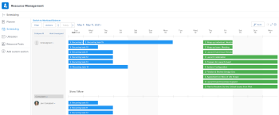
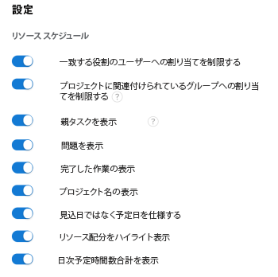

# スケジューリング領域でユーザー割り当てを管理します

>[!IMPORTANT]
>  
>この記事で説明するスケジュール機能は、2023 年 1 月の 23.1 リリースから廃止され、Adobe Workfrontから削除されました。   
>  
>  この記事は、2023 年初頭の 23.1 リリースの直後にも削除されます。 現時点では、ブックマークを適宜更新することをお勧めします。 
> 
> これで、ワークロードバランサーを使用して、リソースの作業をスケジュールできます。 
>  
> ワークロード・バランサを使用したリソースのスケジュール設定の詳細は、「 [ワークロードバランサー](../../resource-mgmt/workload-balancer/workload-balancer.md). 

<!--  

>[!CAUTION] 
> 
> 
> The information in this article refers to the Adobe Workfront's Scheduling tools. The Scheduling areas have been removed from the Preview environment and will be removed from the Production environment in **January 2023**.   
>  Instead, you can schedule resources in the Workload Balancer.  
> 
>*  For information about scheduling resources using the Workload Balancer, see the section [The Workload Balancer](../../resource-mgmt/workload-balancer/workload-balancer.md). 
> 
>*  For more information about the deprecation and removal of the Scheduling tools, see [Deprecation of Resource Scheduling tools in Adobe Workfront](../../resource-mgmt/resource-mgmt-overview/deprecate-resource-scheduling.md). 

-->

ユーザー割り当ては、作業項目の完了にユーザーが費やす時間を示す時間数です。 作業項目の計画時間に含まれます。

この記事では、リソーススケジュール領域を使用して、タスクまたは問題に割り当てられたユーザーの 1 日の時間別配分を更新する方法について説明します。 ユーザーの割り当て全体の管理およびタスクへのジョブの役割については、 [タスクに関するユーザーと役割の割り当て時間を管理](../../manage-work/tasks/assign-tasks/manage-allocation-hours-on-tasks.md). 問題に対するユーザーおよびジョブの役割の割り当て全体を更新することはできません。

Adobe Workfrontの次の領域でユーザー割り当てを表示できます。

* [ リソース ] 領域の [ スケジュール ] セクションで、
* （単一のプロジェクトのリソースをスケジュールする場合）プロジェクトの「スケジュール設定」セクション。
* チームの [ スケジュール ] セクション（チームのリソースをスケジュールする場合）。

## アクセス要件

以下が必要です。

<table style="table-layout:auto"> 
 <col> 
 <col> 
 <tbody> 
  <tr> 
   <td role="rowheader">Adobe Workfront plan*</td> 
   <td> 
任意
 </td> 
  </tr> 
  <tr> 
   <td role="rowheader">Adobe Workfront license*</td> 
   <td> 
仕事以上
 </td> 
  </tr> 
  <tr> 
   <td role="rowheader">アクセスレベル*</td> 
   <td> 
プロジェクト、タスク、問題へのアクセス権を表示または高くする
 
<b>メモ</b>

まだアクセス権がない場合は、Workfront管理者に、アクセスレベルに追加の制限を設定しているかどうかを問い合わせてください。 Workfront管理者がアクセスレベルを変更する方法について詳しくは、 <a href="../../administration-and-setup/add-users/configure-and-grant-access/create-modify-access-levels.md" class="MCXref xref">カスタムアクセスレベルの作成または変更</a>.
 </td>
</tr> 
  <tr> 
   <td role="rowheader">オブジェクト権限</td> 
   <td> 
プロジェクト、タスク、問題に対する権限の寄与
 
追加のアクセス権のリクエストについて詳しくは、 <a href="../../workfront-basics/grant-and-request-access-to-objects/request-access.md" class="MCXref xref">オブジェクトへのアクセスのリクエスト </a>.
 </td> 
  </tr> 
 </tbody> 
</table>

*保有するプラン、ライセンスの種類、アクセス権を確認するには、Workfront管理者にお問い合わせください。

## 「計画」領域のユーザー割当

この記事で説明するように、ユーザーに時間を割り当て始める前に、Workfrontでのリソーススケジュールの仕組みを理解しておいてください ( [リソーススケジュールの概要](../../resource-mgmt/resource-scheduling/get-started-resource-scheduling.md).

自分が所属する個々のチームのタスクや課題に対して、自分がプロジェクトチームのメンバーである個々のプロジェクト、またはリソースマネージャである複数のプロジェクトに対して、リソースをスケジュールできます。

次の節では、Workfrontでユーザー割り当てを有効にして管理する方法について説明します。

* [「スケジューリング」領域を使用して作業を割り当てます。](#use-the-scheduling-areas-to-assign-work)
* [[ タスクの編集 ] ボックスまたは [ 懸案事項の編集 ] ボックスで設定された配分と、[ 予定 ] 領域で設定された配分](#allocations-set-on-the-edit-task-or-the-edit-issue-boxes-vs-in-the-scheduling-areas)
* [配分指標](#allocation-indicators)
* [予定時間のデフォルト配分](#default-allocation-for-planned-hours)
* [割り当てを表示および変更できるユーザー](#who-can-view-and-modify-allocations)
* [スケジュール領域のタイムゾーンに関する考慮事項](#time-zone-considerations-in-the-scheduling-areas)

### 「スケジューリング」領域を使用して作業を割り当てます。 {#use-the-scheduling-areas-to-assign-work}

スケジュールタイムラインで新しい作業をユーザーに割り当てる際に、タスクまたは問題の予定時間をユーザーに割り当てる方法を指定できます。\
予定時間の詳細については、 [計画時間の概要](../../manage-work/tasks/task-information/planned-hours.md).

計画時間は、次の方法で分割できます。

* タスクまたはタスクに割り当てられたユーザーの間
* タスクまたはイシューの期間中\
   例えば、営業関連のタスクは、タスク期間の終わりに向けて、より多くの作業が必要になる場合があります。 この時間の不均一な配分をタスクに計画できます。

>[!TIP]
>
>スケジュール領域から複数のプロジェクトのリソースをスケジュールする場合、すべてのユーザーと作業項目がスケジュールタイムラインに表示されるわけではありません。 スケジュールタイムラインに表示される情報について詳しくは、 [リソーススケジュールの概要](../../resource-mgmt/resource-scheduling/get-started-resource-scheduling.md).

### [ タスクの編集 ] ボックスまたは [ 懸案事項の編集 ] ボックスで設定された配分と、[ 予定 ] 領域で設定された配分 {#allocations-set-on-the-edit-task-or-the-edit-issue-boxes-vs-in-the-scheduling-areas}

Workfront内の次の場所で、タスクまたはイシューのユーザー割り当てを変更できます。

* スケジュールタイムライン\
   スケジューリングタイムラインは、次の領域にあります。

   * [ リソース ] 領域の [ スケジュール ] セクションで、
   * （単一のプロジェクトのリソースをスケジュールする場合）プロジェクトの「スケジュール設定」セクション。
   * チームの [ スケジュール ] セクション（チームのリソースをスケジュールする場合）。

   スケジューリング・タイムラインからユーザー割り当てを変更する場合 ( [ユーザー割り当てを変更](#modify-user-allocations) この記事の節では、タスクまたはイシューの各ユーザーに対する割り当て、およびタスクまたはイシュー期間内の各日に対する割り当てを定義できます。\
   

* タスクを編集または問題を編集ダイアログボックス\
   ユーザー割り当てを編集する際に、タスクまたは問題の編集ダイアログボックス ( [タスクに対するユーザーまたはロールの割り当て率の管理](../../manage-work/tasks/assign-tasks/manage-allocation-percentage-on-tasks.md)) を使用する場合は、各ユーザーに対してタスクまたはイシュー全体に対する割り当てを定義できます。 これらの配分を 1 日単位で管理する場合は、「スケジュール設定」タイムラインで、「 [ユーザー割り当てを変更](#modify-user-allocations) 」の節を参照してください。

   >[!IMPORTANT]
   >
   >[ タスクの編集 ] または [ 問題 ] ダイアログボックスからユーザー割り当てを変更すると、スケジュールタイムラインで以前に設定した割り当てが上書きされます。 また、スケジューリングタイムラインで割り当てに加えた変更は、[ タスクの編集 ] ダイアログボックスまたは [ タスクの問題 ] ダイアログボックスには反映されません。

ユーザー割り当てを管理する際には、タスクの編集や問題を利用するのではなく、スケジュール設定タイムラインを使用することをお勧めします。これには、次の利点があります。

* 割り当て指標を使用してユーザーが過剰に割り当てられているタイミングを明確に確認できます ( [配分指標](#allocation-indicators) 」セクションに入力します。
* 1 人のユーザーに対して、別のユーザーに対してより多くの時間を割り当てることができます。\
   割り当て指標は、割り当てられたユーザーと他のユーザーとの比較方法を視覚的に表します ( [配分指標](#allocation-indicators) 」セクションに入力します。

* ある日の作業に、別の日の作業に割り当てる時間を増やすことができます。\
   割り当てインジケーターは、割り当てられたユーザーが特定の日にどのように行動したかを視覚的に示します。詳しくは、 [配分指標](#allocation-indicators).

* すべてのリソースの職責は、スケジュール設定タイムラインで 1 か所で実行できます。

### 配分指標 {#allocation-indicators}

様々な視覚的インジケーターを使用して、特定の日に作業するためにユーザーが割り当てられているレベルに関する迅速な情報を提供できます。

Workfrontがユーザーの可用性をシステムレベルで計算する方法（時間単位および FTE の可用性を考慮）は、システム管理者が決定します。 このシステム全体の設定に応じて、ユーザーの可用性は、デフォルトのスケジュールまたはユーザーのスケジュールを使用して計算されます。 詳しくは、 [Workfrontがスケジューリング領域のリソース時間と FTE の可用性を計算する方法を設定します](../../resource-mgmt/resource-scheduling/calculate-hours-fte-scheduling-area.md).

* **配分の網掛け**
配分は、ユーザーに割り当てられたタスクに網掛けの形式で視覚的に表示されます。 暗い網掛けは、指定された日に割り当てられたユーザーの FTE（フルタイム相当）の割合として割り当てられた時間を示します。 (Workfrontで FTE を設定する方法について詳しくは、 [Workfrontがスケジューリング領域のリソース時間と FTE の可用性を計算する方法を設定します](../../resource-mgmt/resource-scheduling/calculate-hours-fte-scheduling-area.md).)\
   例えば、1 人のユーザーが、予定時間が 4 時間、期間が 1 日のタスクに割り当てられているとします。 ユーザーの FTE は、システム内で 1 と定義されています（つまり、ユーザーはフルタイムステータスで、つまり週に 40 時間、または 1 日に 8 時間で作業するようにスケジュールされています）。 特定の日のタスクに対する網掛けは、タスクの垂直方向のスペースの半分を占めます。これは、その日の FTE（4 時間）の半分がユーザーに割り当てられることを示しています。\
   \
   タスクまたはタスクには、作業項目に割り当てられたすべてのユーザーの累積配分が表示されます。 作業項目を展開して、作業項目に割り当てられているユーザーや、各ユーザーに割り当てられている時間数など、詳細を表示できます。\
   網掛けは、 **未割り当て** 領域を選択します。\
   

* **各ユーザーの各日の日別合計：** 各日に特定のユーザーに割り当てられた計画時間の合計を表示できます。 この情報は、スケジュールタイムラインの各ユーザーの行の先頭に表示されます。 この情報は、デフォルトでは表示されません。 これは、 [ユーザー割り当てを有効にする](#enable-user-allocations). 日別合計を決定する際には、次のステータスのプロジェクトのタスクが含まれます。「現行」、「計画」または「承認済」。\
   

* **割り当て超過指標**
特定の日にユーザーに割り当てられた計画時間の合計数が、そのユーザーが 1 日に（すべてのタスクにわたって）1 日の作業時間数を超えると、そのユーザーはその日に過剰割り当てされたと見なされます。\
   ユーザーの割り当てが超過すると、各タスクの概要を示す赤いバーが表示されます。\
   ユーザーの割り当て超過を判断する際には、次のステータスのプロジェクトのタスクが含まれます。「現行」、「計画」または「承認済」。\
   ユーザーが 1 日で働く時間数は、各ユーザーのプロファイルの FTE フィールドで定義されます。詳しくは、 [Workfrontがスケジューリング領域のリソース時間と FTE の可用性を計算する方法を設定します](../../resource-mgmt/resource-scheduling/calculate-hours-fte-scheduling-area.md).\
   \
   次を有効にした場合、 **日別予定時間の合計を表示** そして **リソース割り当てのハイライト表示** 「 」オプションを選択すると、ユーザーの割り当てが超過した場合に、計画時間の 1 日の合計数が赤で表示されます。 デフォルトでは、時間は 10 番目に近い値（1.3 など）に表示されます。\
   

### 予定時間のデフォルト配分 {#default-allocation-for-planned-hours}

Workfrontは、割り当てられたユーザーと日に、次のように計画時間を配分しようとします。

* 複数のユーザーがタスクまたはイシューに割り当てられている場合、時間はユーザー間で均等に分割されます。\
   配分には、タスクに既に行われた高度な割り当てが反映されます。\
   高度な割り当ての詳細については、 [高度な割り当てを作成](../../manage-work/tasks/assign-tasks/create-advanced-assignments.md).

* タスクの期間または問題の期間が複数日にわたる場合、計画時間は日数およびタスクに割り当てられたすべてのユーザーの間で、ユーザーのスケジュールに基づいて均等に配分されます。
* タスクの予定時間が複数日にわたる場合、異なるタイムゾーンのタスクを表示しているユーザーは、タスクの期間や、予定開始日または予定完了日に違いが生じる場合があります。

デフォルトでは、時間は最も近い小数点以下 2 桁に表示されます（例：1.33）。 右にスクロールすると、さらに表示されます。\

### 割り当てを表示および変更できるユーザー {#who-can-view-and-modify-allocations}

次のタイプのユーザーは、Workfrontでユーザー割り当てを表示または変更できます。

* **リソースマネージャ：** リソースマネージャである任意のプロジェクトに対するタスクおよびタスクのユーザー割り当てを表示および変更できます。 これは、「人」領域のスケジュールタイムラインまたはプロジェクトの「スタッフ配置」タブで実行できます。\
   リソースマネージャがプロジェクト全体でタスクや問題を変更する方法については、 [スケジュール領域で未割り当てタスクとタスクを手動で割り当てる](../../resource-mgmt/resource-scheduling/manually-assign-items-scheduling-areas.md).

* **プランおよび作業用ユーザ：** 新しい [ 自分の作業カレンダー ] またはチームの作業カレンダーを使用して、自分が割り当てられているタスクとタスクの割り当てを表示できます。\
   タスクや問題に対する Contribute のアクセス権を持っている場合は、割り当ての表示に加えて、割り当てを変更できます。

   <!--
  <MadCap:conditionalText data-mc-conditions="QuicksilverOrClassic.Draft mode">
  (NOTE: Article is conditioned to classic.)
  </MadCap:conditionalText>
  -->

### スケジュール領域のタイムゾーンに関する考慮事項  {#time-zone-considerations-in-the-scheduling-areas}

スケジューリングタイムラインを表示しているユーザーが、タスクの予定時間が個々の日の合計割り当て時間と等しくない場合、不整合が生じることがあります。 これは、1 人のユーザーのオペレーティングシステムのタイムゾーン設定で、計画開始日または計画完了日が別のユーザーと異なる場合に発生する可能性があります。

たとえば、タスクの計画完了日が11/3/18の午前 11:00 に設定されている場合、MST では、タスクを表示するオーストラリアのユーザーは、翌日の11/4/18の午前 1:00 に計画完了日が表示されます。 オーストラリアのユーザーが11/4/18に時間を割り当てた場合、割り当てられた時間は MST のユーザーには表示されません。 ただし、これらの時間は、プロジェクトの計画時間に常に考慮されます。

## ユーザー割り当てを有効にする {#enable-user-allocations}

スケジュールタイムラインでは、ユーザー割り当て機能はデフォルトで無効になっています。 この節で説明するユーザー割り当て機能を使用する前に、まず有効にする必要があります。

>[!NOTE]
>
>ユーザー割り当ては、スケジュールタイムラインで「計画日」を使用するように設定されている場合にのみ有効にできます。 予定タイムラインが予定日を使用するように設定されている場合、ユーザー割当ては表示できません。 計画日または予定日を使用する計画タイムラインの設定の詳細は、「計画タイムラインに表示する予定日の構成」を参照してください。 [[ 集計 ] 領域で設定を行う](../../resource-mgmt/resource-scheduling/configure-settings-scheduling-areas.md).

スケジューリング・タイムラインでユーザー割当てを有効にするには、次の手順に従います。

1. 複数のプロジェクト、個々のプロジェクト、またはチームのスケジューリングタイムラインに移動します。

   * **複数のプロジェクトの場合**:  次をクリック： **メインメニュー** アイコン  Workfrontの右上隅にある **リソース > ワークロードバランサー**&#x200B;を選択し、「 **スケジュール** をクリックします。
   * **個々のプロジェクトの場合**:プロジェクトに移動し、 **ワークロードバランサー** セクションを開き、 **スケジュール** を選択します。
   * **チームの場合**:次をクリック： **メインメニュー** アイコン  Workfrontの右上隅で、 **チーム**、チームを選択して、**ワークロードバランサー** 左のパネルで、「**スケジュール** を選択します。

   

1. 次をクリック： **設定** アイコンをクリックします。\
   \
   [ リソーススケジュール設定 ] ダイアログボックスが表示されます。\
   

1. スケジューリングタイムラインにユーザー割り当てを表示するには、次のオプションのいずれかまたは両方を有効にします。

   <table style="table-layout:auto"> 
    <col> 
    <col> 
    <tbody> 
     <tr> 
      <td role="rowheader">リソース配分をハイライト表示</td> 
      <td> 
スケジュールタイムラインに、タスクと問題に関するユーザー配分の網掛けを表示します。 
 
このオプションはデフォルトでは無効になっています。
 </td> 
     </tr> 
     <tr> 
      <td role="rowheader">日次予定時間数合計を表示</td> 
      <td>スケジュールタイムラインで各ユーザーに 1 日に割り当てられた計画時間の合計数を表示します。 計画時間は、10 分の 1 に近い時間（例：1.3）に表示されます。 このオプションはデフォルトでは無効になっています。</td> 
     </tr> 
    </tbody> 
   </table>

1. （オプション） **問題を含める** 「 」セクションで、イシューをスケジュールタイムラインに表示するかどうかを選択します。\
   このオプションはデフォルトでは無効になっています。

1. クリック **スケジュールに戻る**.\
   スケジュールタイムラインにユーザー割り当てが表示されるようになりました。\
   

## ユーザー割り当てを変更 {#modify-user-allocations}

タスクまたはイシューのユーザー割り当ては、スケジュールタイムライン（この節で説明）またはタスクまたはイシューの編集ダイアログボックスから変更できます。 詳しくは、 [[ タスクの編集 ] ボックスまたは [ 懸案事項の編集 ] ボックスで設定された配分と、[ 予定 ] 領域で設定された配分](#allocations-set-on-the-edit-task-or-the-edit-issue-boxes-vs-in-the-scheduling-areas).

デフォルトでは、ユーザーはタスクに割り当てられるか、タスク間で均等に割り当てられます。期間内の日数は、 [予定時間のデフォルト配分](#default-allocation-for-planned-hours).

スケジューリング・タイムラインでタスクまたはイシューのユーザー割当てを変更する手順は、次のとおりです。

1. 複数のプロジェクト、個々のプロジェクト、またはチームのスケジューリングタイムラインに移動します。

   * **複数のプロジェクトの場合**:  次をクリック： **メインメニュー** アイコン  Workfrontの右上隅にある **リソース > ワークロードバランサー**&#x200B;を選択し、「 **スケジュール** をクリックします。
   * **個々のプロジェクトの場合**:プロジェクトに移動し、 **ワークロードバランサー** セクションを開き、 **スケジュール** を選択します。
   * **チームの場合**:次をクリック： **メインメニュー** アイコン  Workfrontの右上隅で、 **チーム**、チームを選択して、**ワークロードバランサー** 左のパネルで、「**スケジュール** を選択します。

   

1. スケジュールタイムラインでユーザー割り当てが有効になっていることを確認します ( [ユーザー割り当てを有効にする](#enable-user-allocations) 」の節を参照してください。
1. ユーザー割り当てを管理するタスクを展開します。\
   デフォルトでは、割り当てられたユーザーとタスク期間の日数に、計画時間が均等に分割されます。 週末（土曜日と日曜日）は時間は追加されません。 詳しくは、 [予定時間のデフォルト配分](#default-allocation-for-planned-hours) 」の節を参照してください。

1. 特定の日に時間を調整するユーザーの「 」フィールドをクリックします。

   >[!NOTE]
   >
   >時間の変更後に元の配分を維持するには、 **キャンセル**.

1. 調整された時間数を指定します。
1. 「**保存**」をクリックします。\
   タスクの合計時間数が元の予定時間数と等しい場合にのみ、変更を保存できます。 この数は、 **予定時間** タスクのフィールド 合計が計画時間の合計数と等しくない場合、数は赤で表示されます。\
   

## ユーザー割り当てをリセットする条件

Workfrontは、タスクまたはプロジェクトで多数のアクションが実行された場合に、スケジュールタイムラインで手動で編集したユーザー割り当てをリセットします。 一般に、タスクと問題に関する計画時間数がこのプロセスで変更された場合、Workfrontは、プロジェクトのタイムラインが再計算されるたびにユーザー割り当てをリセットします。\
プロジェクトのタイムラインの再計算について詳しくは、 [プロジェクトタイムラインを再計算](../../manage-work/projects/manage-projects/recalculate-project-timeline.md).

スケジューリングタイムラインでユーザー割り当てをリセットする可能性のある最も一般的な条件は次のとおりです。

* タスクをイテレーションに追加する。\
   繰り返しには固定日付があるので、タスクと割り当ての日付が再計算されます。\
   繰り返しがタスクの日付に与える影響について詳しくは、 [既存の反復にストーリーを追加する](../../agile/use-scrum-in-an-agile-team/iterations/add-stories-to-existing-iteration.md).

* タスクの期間タイプを「労力主導型」に変更します。
* 1 人以上の担当者が割り当てられている場合にタスクの期間タイプを計算割り当てに変更する。\
   タスクの期間について詳しくは、 [タスクの期間と期間のタイプの概要](../../manage-work/tasks/taskdurtn/task-duration-and-duration-type.md).

* プロジェクトの「計画開始日」と「計画完了日」を変更します。\
   プロジェクトの計画日については、 [プロジェクトの概要計画開始日](../../manage-work/projects/planning-a-project/project-planned-start-date.md) および [プロジェクトの完了予定日を設定](../../manage-work/projects/planning-a-project/project-planned-completion-date.md).

   タスクの計画完了日については、 [タスクの概要計画完了日](../../manage-work/tasks/task-information/task-planned-completion-date.md).

* タスク制約が柔軟な制約の場合は、先行タスクの日付を変更します。\
   例えば、できるだけ早く、またはできるだけ遅く。\
   タスク制約の詳細については、 [タスク制約の概要](../../manage-work/tasks/task-constraints/task-constraint-overview.md).

* 予定時間のタスクまたはタスクの数を変更します。

   Workfrontでの予定時間について詳しくは、 [計画時間の概要](../../manage-work/tasks/task-information/planned-hours.md).
