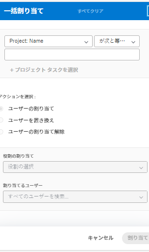
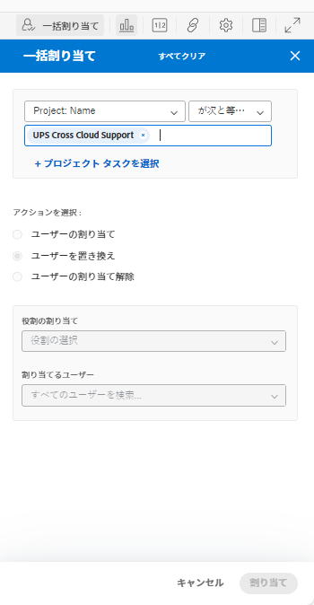
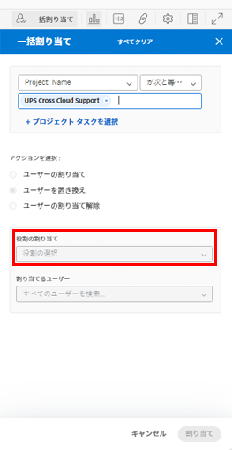
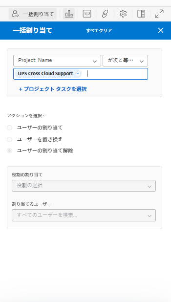
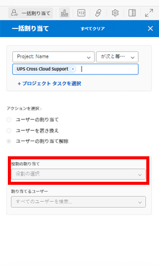

# [ スケジュール ] 領域のタスクに対する複数のユーザ割り当てを変更する

>[!IMPORTANT]
>  
>この記事で説明するスケジュール機能は、2023 年 1 月の 23.1 リリースから廃止され、Adobe Workfrontから削除されました。   
>  
>  この記事は、2023 年初頭の 23.1 リリースの直後にも削除されます。 現時点では、ブックマークを適宜更新することをお勧めします。 
> 
> これで、ワークロードバランサーを使用して、リソースの作業をスケジュールできます。 
>  
> ワークロード・バランサを使用したリソースのスケジュール設定の詳細は、「 [ワークロードバランサー](../../resource-mgmt/workload-balancer/workload-balancer.md). 

<!--   

>[!CAUTION] 
> 
> 
> The information in this article refers to the Adobe Workfront's Scheduling tools. The Scheduling areas have been removed from the Preview environment and will be removed from the Production environment in **January 2023**.  
>  Instead, you can schedule resources in the Workload Balancer.  
> 
>*  For information about scheduling resources using the Workload Balancer, see the section [The Workload Balancer](../../resource-mgmt/workload-balancer/workload-balancer.md). 
> 
>*  For more information about the deprecation and removal of the Scheduling tools, see [Deprecation of Resource Scheduling tools in Adobe Workfront](../../resource-mgmt/resource-mgmt-overview/deprecate-resource-scheduling.md). 

This article refers to modifying user assignments for multiple tasks using the Scheduling area of Adobe Workfront. Also see the following articles for modifying assignments on multiple tasks in other areas:

* For information about modifying assignments on multiple tasks in a task list, see [Modify multiple user assignments in a task list](../../manage-work/tasks/assign-tasks/modify-multiple-assignments-in-task-list.md). 
* For information about scheduling resources using the new Workload Balancer, see the section [The Workload Balancer](../../resource-mgmt/workload-balancer/workload-balancer.md).
-->
リソーススケジューラを使用すると、複数のタスクに同時にユーザーを割り当てることができます。

>[!NOTE]
>
>この記事は、複数のプロジェクトのリソースをスケジュールする場合（「スケジュール設定」セクションから）、または単一のプロジェクトのリソースをスケジュールする場合（「スケジュール設定」セクションから）にのみ適用されます。この節で説明するように、チームのリソースをスケジュールする場合（「スケジュール」セクションから）、複数のタスクに対するユーザー割り当てを管理することはできません。

## アクセス要件

以下が必要です。

<table style="table-layout:auto"> 
 <col> 
 <col> 
 <tbody> 
  <tr> 
   <td role="rowheader">Adobe Workfront plan*</td> 
   <td> 
任意
 </td> 
  </tr> 
  <tr> 
   <td role="rowheader">Adobe Workfrontライセンスの概要*</td> 
   <td> 
仕事以上
 </td> 
  </tr> 
  <tr> 
   <td role="rowheader">アクセスレベル*</td> 
   <td> 
プロジェクト、タスク、問題へのアクセス権を表示または高くする
 
<b>注意</b> まだアクセス権がない場合は、Workfront管理者に、アクセスレベルに追加の制限を設定しているかどうかを問い合わせてください。 Workfront管理者がアクセスレベルを変更する方法について詳しくは、 <a href="../../administration-and-setup/add-users/configure-and-grant-access/create-modify-access-levels.md" class="MCXref xref">カスタムアクセスレベルの作成または変更</a>.
 </td> 
  </tr> 
  <tr> 
   <td role="rowheader">オブジェクト権限</td> 
   <td> 
プロジェクト、タスク、および割り当てを更新するタスクに、権限以上を貢献する
 
追加のアクセス権のリクエストについて詳しくは、 <a href="../../workfront-basics/grant-and-request-access-to-objects/request-access.md" class="MCXref xref">オブジェクトへのアクセスのリクエスト </a>.
 </td> 
  </tr> 
 </tbody> 
</table>

*保有するプラン、ライセンスの種類、アクセス権を確認するには、Workfront管理者にお問い合わせください。

## [ 集計 ] 領域で複数の割り当てを行う場合の考慮事項

1 つ以上のプロジェクトをまたいで、複数のタスクやタスクに対するユーザー割り当てをすばやく管理できます（変更はスケジューリングタイムラインに反映されます）。

ジョブロールに現在割り当てられているすべてのタスクにユーザーを割り当てたり、ユーザー間でユーザー割り当てを交換したり、すべてのタスクからユーザーを割り当て解除したりできます。

例：

* リソースマネージャは、新しいプロジェクトでのユーザー割り当てを行う役割を担います。 プロジェクトは元々テンプレートとして作成され、ジョブの役割は既にプロジェクト内の様々なタスクに割り当てられています。 リソースマネージャーが、現在ジョブの役割に割り当てられているすべてのタスクに特定のユーザーを割り当てようとしています。
* 3 つの異なるプロジェクトの 45 タスクが Jackie Simms に割り当てられます。 Jackie は組織を退社し、リソースマネージャは自分のタスクを別のユーザーに再割り当てする必要があります。

>[!NOTE]
>
>複数のタスクのユーザー割り当てを管理する際は、次の制限事項を考慮してください。
>
>* 複数のプロジェクトのリソースをスケジュールする場合、管理するプロジェクトは、次のいずれかのステータス（またはこれらのステータスのいずれかに等しいステータス）になっている必要があります。「計画」、「現行」または「承認済」。 プロジェクトのステータスの詳細については、 [ステータスの作成または編集](../../administration-and-setup/customize-workfront/creating-custom-status-and-priority-labels/create-or-edit-a-status.md).
>* 単一のプロジェクトに対してリソースをスケジュールする場合、プロジェクトの状態はこの機能の使用に影響を与えません。
>* 以下のライセンスを持つユーザーに対して、リソースを変更できます。計画、作業、レビュー リクエストライセンスを持つユーザーに対しては、リソースの変更を行うことはできません。
>

## 1 つ以上のプロジェクトのユーザー割り当てを管理

1. 複数のプロジェクトのスケジュールタイムライン、または個々のプロジェクトのスケジュールタイムラインに移動します。

   * **複数のプロジェクトの場合**:  次をクリック： **メインメニュー** アイコン  Workfrontの右上隅にある **リソース > ワークロードバランサー**&#x200B;を選択し、「 **スケジュール** をクリックします。
   * **個々のプロジェクトの場合**:プロジェクトに移動し、 **ワークロードバランサー** セクションを開き、 **スケジュール** を選択します。

1. クリック **アクション**.\
   

1. 内 **プロジェクトを選択** 「スケジュール」タブで複数のプロジェクトのスケジュール・タイムラインを表示するか、個々のプロジェクトのスケジュール・タイムラインを表示するか（「スタッフ」タブで表示）に応じて、次のいずれかを実行します。

   * **複数のプロジェクトの場合：** 割り当ての変更を行うプロジェクトの名前を入力し、ドロップダウンリストに表示されたら名前をクリックします。 または、ドロップダウン矢印をクリックして、プロジェクトのリストから選択します。 複数のプロジェクトに対して割り当てを変更するには、この手順を繰り返します。\
      リソースマネージャを使用するすべてのプロジェクトで割り当てを変更する場合は、このフィールドを空白にします。

      >[!NOTE]
      >
      >プロジェクトは、次の場合にのみ選択できます。
      >
      >   
      >   
      >   * プロジェクトのリソースマネージャーとして指定されています\
         >     詳しくは、 [プロジェクトまたはテンプレートに対するリソースマネージャの指定](../../manage-work/projects/planning-a-project/designate-resource-managers-for-projects-and-templates.md).
      >   
      >   * プロジェクトのステータスは、次のいずれかです（または、ステータスがこれらのステータスの 1 つに等しい場合）。計画、現在または承認済み\
         >     プロジェクトのステータスの詳細については、 [ステータスの作成または編集](../../administration-and-setup/customize-workfront/creating-custom-status-and-priority-labels/create-or-edit-a-status.md).
      >   
      >   * プランライセンスを持つユーザーです。

   * **個々のプロジェクトの場合：** この **プロジェクトを選択** フィールドは変更できません。 この **プロジェクトを選択** 「 」フィールドには、常に表示しているプロジェクトの名前が含まれます。

1. （オプション）「 **タスクを指定** 個々のタスクに対する割り当ての変更を変更する場合。 個々のタスクを指定する場合、 **プロジェクトを選択** フィールドは無視されます。\
   内 **タスクを選択** フィールドに、割り当てを変更するタスクの名前を入力します。 この手順を繰り返して、追加のタスクに割り当ての変更を加えます。\
   このフィールドを空白にすると、手順 3 で選択したプロジェクト内のすべてのタスクが影響を受けます。\
   個々のタスクに対して割り当てを変更すると、指定したタスクのすべてのサブタスクに変更が適用されます。 スケジュールタイムラインに問題が表示されるように設定されている場合は、タスクに関連するすべての問題にも変更が適用されます。詳しくは、 [様々な設定を指定して、スケジュールタイムラインに表示する方法と情報をカスタマイズできます。](../../resource-mgmt/resource-scheduling/configure-settings-scheduling-areas.md#configuring-issues-to-display-on-the-scheduling-timeline) in [[ 集計 ] 領域で設定を行う](../../resource-mgmt/resource-scheduling/configure-settings-scheduling-areas.md).

1. 次のセクションのいずれかに進みます。

   * [ユーザーの割り当て](#assign-a-user)
   * [ユーザーのスワップ](#swap-a-user)
   * [ユーザーの割り当て解除](#unassign-a-user)

### ユーザーの割り当て {#assign-a-user}

選択したプロジェクト内の特定の役割に現在割り当てられているすべてのタスクにユーザーを割り当てることができます。

この方法でユーザーを割り当てても、ユーザーは次のタイプのタスクに割り当てられません。

* 既にユーザーに割り当てられているタスクの割り当て
* 完了したタスク

選択したプロジェクトまたはタスク全体のタスクにユーザーを割り当てるには、次の手順に従います。

1. 選択 **ユーザーを割り当て** 内 **アクションを選択** 」セクションに入力します。\
   

1. 内 **ロールを選択** 「 」フィールドで、ドロップダウン矢印をクリックして役割のリストから選択します。 指定したプロジェクト内のタスクに現在割り当てられているロールのみが表示されます。\
   ユーザーを割り当てると、ここで選択した役割がユーザーに置き換えられます。

1. 内 **割り当てるユーザーを選択** 「 」フィールドで、ドロップダウン矢印をクリックして、ユーザーのリストから選択します。\
   この **一致する役割を持つユーザーに割り当てを制限** 「設定」領域の「 」オプションが有効になっている場合、選択できるのは、選択した役割がプライマリ設定で割り当てられている（「設定の役割」または「他の役割」）場合のみです。 このオプションが無効な場合は、割り当てる別のユーザーの名前を入力できます。そのユーザーがシステムで一致する役割を定義していない場合でも入力できます。 このオプションは、デフォルトで有効になっています。\
   このオプションについて詳しくは、 [スケジュール領域の役割およびグループメンバーシップに関係なく、ユーザー割り当てを許可します](../../resource-mgmt/resource-scheduling/assignments-regardless-of-role-or-group-scheduling-areas.md). デフォルトでは、割り当ては、タスクまたは割り当て先のタスクの役割割り当てに一致する役割がユーザープロファイルで定義されているユーザーに対してのみ実行できます。

1. クリック **割り当て**.\
   1 回のアクションで最大 1,000 個の割り当てを実行できます。 選択した項目が 1,000 件を超える割り当ての変更を行う場合は、選択を再調整して、もう一度試してください。

### ユーザーのスワップ {#swap-a-user}

ユーザーのタスク割り当てを、選択したプロジェクト内の別のユーザーのタスク割り当てと入れ替えることができます。

このセクションで説明したように、ユーザーのタスク割り当てをスワップする場合、[ 完了 ] とマークされている割り当てはスワップされません。

ユーザーのタスク割り当てを別のユーザーのタスク割り当てと交換するには、次の手順に従います。

1. 選択 **ユーザーのスワップ** 内 **アクションを選択** 」セクションに入力します。\
   

1. 内 **ユーザーを選択** 「 」フィールドで、ドロップダウン矢印をクリックして、ユーザーのリストから選択します（または入れ替えるユーザーの名前を入力し、ドロップダウンリストに表示されたら名前をクリックします）。\
   ユーザーは、指定したプロジェクト内の 1 つ以上の不完全なタスクに割り当てられた場合にのみ表示されます。

1. （条件付き） **ロールを選択** 選択したユーザーが、役割が異なる複数のタスクに割り当てられている場合にのみ、フィールドが表示されます。 ( ユーザーのタスクに設定されたジョブの役割を表示するには、 **担当者の役割** タスクの [ 割り当ての詳細設定 ] ダイアログボックスの列 ( [高度な割り当てを作成](../../manage-work/tasks/assign-tasks/create-advanced-assignments.md)) をクリックします。\
   内 **ロールを選択** 「 」フィールドで、置き換えるタスクのタイプを決定する役割を選択します。 この役割を持つユーザーが割り当てられたタスクのみが新しいユーザーに割り当てられます。\
   例えば、Hanna Marin はプロジェクトの 5 つのタスクに割り当てられます。 2 つのタスクでは、彼女の仕事の役割は「エンジニア」として定義されます。 残りの 3 つのタスクでは、仕事の役割は「デザイナー」と定義されます。 「役割を選択」フィールドで「デザイナー」を選択した場合、Hanna の職位が「デザイナー」として定義されている 3 つのタスクすべてに対する割り当てを変更したいことを意味します。 「エンジニア」として定義された 2 つのタスクは変更されません。\
   

1. 内 **割り当てるユーザーを選択** 「 」フィールドで、ドロップダウン矢印をクリックして、ユーザーのリストから選択します。 ユーザーは、（ユーザー設定で定義された）役割が、置き換えるユーザーに割り当てられた作業の役割と一致する場合にのみ、割り当てることができます。\
   この **一致する役割を持つユーザーに割り当てを制限** 「設定」領域の「 」オプションが有効になっている場合は、（ユーザー設定で定義された）役割が、置き換えるユーザーに割り当てられた作業の役割と一致する場合にのみ、ユーザーが割り当てを実行できます。 このオプションが無効な場合は、割り当てる別のユーザーの名前を入力できます。そのユーザーがシステムで一致する役割を定義していない場合でも入力できます。 このオプションは、デフォルトで有効になっています。\
   このオプションについて詳しくは、 [スケジュール領域の役割およびグループメンバーシップに関係なく、ユーザー割り当てを許可します](../../resource-mgmt/resource-scheduling/assignments-regardless-of-role-or-group-scheduling-areas.md). デフォルトでは、割り当ては、タスクまたは割り当て先のタスクの役割割り当てに一致する役割がユーザープロファイルで定義されているユーザーに対してのみ実行できます。\
   置き換えるユーザーが、選択したプロジェクトのタスクの複数のロールに割り当てられ、 **ロールを選択** フィールド、 **割り当てるユーザーを選択** 「 」フィールドには、指定した役割をすべて持つユーザーのみが表示されます。

1. クリック **スワップ**.\
   1 回のアクションで最大 1,000 個の割り当てを実行できます。 選択した項目が 1,000 件を超える割り当ての変更を行う場合は、選択を再調整して、もう一度試してください。

### ユーザーの割り当て解除 {#unassign-a-user}

選択したプロジェクトまたは選択したタスクでユーザーが割り当てられているすべてのタスクから、ユーザーの割り当てを解除できます。 ユーザーの割り当てを解除すると、そのユーザーに割り当てられていたタスクは、ユーザーの割り当て前の割り当て状態に戻ります。

ユーザーがシステムで定義された主要な役割を持ち、そのユーザーの割り当てを解除した場合、そのユーザーの割り当てを解除すると、タスクはユーザーの主要な役割に自動的に割り当てられます。 または、割り当てられるユーザーの前に割り当てられた役割に割り当てられます。

ユーザーがシステムで定義された主な役割を持たず、ユーザーの割り当てを解除した場合、ユーザーの割り当てを解除すると、タスクは未割り当て状態になります。

完了とマークされたタスクは割り当てを解除できません。

選択したプロジェクト全体のタスクまたは選択したタスクのタスクからユーザーの割り当てを解除するには、次の手順に従います。

1. 選択 **ユーザーの割り当て解除** 内 **アクションを選択** 」セクションに入力します。\
   

1. 内 **ユーザーを選択** 「 」フィールドで、ドロップダウン矢印をクリックして、ユーザーのリストから選択します（または割り当てを解除するユーザーの名前を入力し、ドロップダウンリストに表示されたら名前をクリックします）。 一度に 1 人のユーザーの割り当てを解除することができます。
1. （条件付き） **ロールを選択** 選択したユーザーが、役割が異なる複数のタスクに割り当てられている場合にのみ、フィールドが表示されます。 ( ユーザーのタスクに設定されているジョブの役割を表示するには、 **担当者の役割** タスクの [ 割り当ての詳細設定 ] ダイアログボックスの列 ( [高度な割り当てを作成](../../manage-work/tasks/assign-tasks/create-advanced-assignments.md)) をクリックします。\
   内 **ロールを選択** 「 」フィールドで、割り当てを解除するタスクのタイプを決定する役割を選択します。 この役割を持つユーザーが割り当てられているタスクのみ割り当てが解除されます。\
   例えば、Hanna Marin はプロジェクトの 5 つのタスクに割り当てられます。 2 つのタスクでは、彼女の仕事の役割はエンジニアとして定義されます。 残りの 3 つのタスクでは、ジョブの役割はデザイナーとして定義されます。 「役割を選択」フィールドで「Designer」を選択した場合、Designer の役割が Designer として定義されている 3 つのタスクすべてで Hanna の割り当てを解除します。 Engineer として定義された 2 つのタスクは変更されません。\
   

1. クリック **割り当て解除**.\
   1 回のアクションで最大 1,000 個の割り当てを実行できます。 選択した項目が 1,000 件を超える割り当ての変更を行う場合は、選択を再調整して、もう一度試してください。
