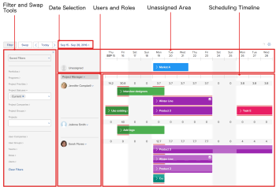

# スケジューリング領域の概要

>[!IMPORTANT]
>  
>この記事で説明するスケジュール機能は、2023 年 1 月の 23.1 リリースから廃止され、Adobe Workfrontから削除されました。   
>  
>  この記事は、2023 年初頭の 23.1 リリースの直後にも削除されます。 現時点では、ブックマークを適宜更新することをお勧めします。 
> 
> これで、ワークロードバランサーを使用して、リソースの作業をスケジュールできます。 
>  
> ワークロード・バランサを使用したリソースのスケジュール設定の詳細は、「 [ワークロードバランサー](../../resource-mgmt/workload-balancer/workload-balancer.md). 

<!--  

>[!CAUTION] 
> 
> 
> The information in this article refers to the Adobe Workfront's Scheduling tools. The Scheduling areas have been removed from the Preview environment and will be removed from the Production environment in **January 2023**.  
>  Instead, you can schedule resources in the Workload Balancer.  
> 
>*  For information about scheduling resources using the Workload Balancer, see the section [The Workload Balancer](../../resource-mgmt/workload-balancer/workload-balancer.md). 
> 
>*  For more information about the deprecation and removal of the Scheduling tools, see [Deprecation of Resource Scheduling tools in Adobe Workfront](../../resource-mgmt/resource-mgmt-overview/deprecate-resource-scheduling.md). 

-->

次の節では、Adobe Workfront内のスケジュール領域にアクセスできる場所と、スケジュール領域で使用できる機能について説明します。

## Workfront地域でのリソースのスケジュール設定

Workfrontでは、次の領域でリソースをスケジュールできます。

* **リソースマネージャーになっているすべてのプロジェクトの場合** ( **スケジュール** 領域 ) Workfrontの「スケジュール設定」領域を使用すると、リソースマネージャは複数のプロジェクトにわたってリソースの割り当てを行うことができます。

* **プロジェクトチームのメンバーの場合の個々のプロジェクト** ( **スケジュール** プロジェクトの領域 ):

   プロジェクト内のスケジュール領域を使用すると、プロジェクトチームのメンバーは、プロジェクトの作業をプロジェクトチームのユーザーに割り当てることができます。

* **個々のチームのメンバーである** ( **スケジュール** チームのセクション ) チームのスケジュールセクションを使用すると、チームメンバーは、複数のプロジェクトからチームに割り当て済みの作業を個々のチームメンバーに割り当てることができます。

## 「スケジュール設定」領域で使用できる機能

スケジュール領域には、タスクとタスク、および現在のリソース割り当てが表示されます。\

* [フィルターツールとスワップツール](#filter-and-swap-tools)
* [日付の選択](#date-selection)
* [未割り当て領域](#unassigned-area)
* [ユーザーとロール](#users-and-roles)
* [スケジュールタイムライン](#scheduling-timeline)

### フィルターツールとスワップツール {#filter-and-swap-tools}

* **フィルタツール：** スケジュールタイムラインに表示されるコンテンツをフィルターできます。 フィルターツールの使用について詳しくは、 [スケジュール領域の情報のフィルタリング](../../resource-mgmt/resource-scheduling/filter-scheduling-area.md).
* **スワップツール：** （「スケジュール設定」タブまたは「スタッフ配置」タブでプロジェクトのリソースをスケジュールする場合にのみ使用できます）複数のプロジェクト間で、タスクへのユーザーの割り当て、スワップ、割り当て解除をすばやく行えます。 詳しくは、 [スケジュール領域で未割り当てタスクとタスクを手動で割り当てる](../../resource-mgmt/resource-scheduling/manually-assign-items-scheduling-areas.md).

### 日付の選択 {#date-selection}

スケジュールタイムラインに表示するデータの日付範囲を調整できます。 デフォルトでは、日付範囲は現在の日から 2 週間（週末を含む 14 日連続）です。

### 未割り当て領域 {#unassigned-area}

* [リソースマネージャとしてリソースをスケジュールする場合（「スケジュール設定」領域の複数のプロジェクトの場合）](#when-scheduling-resources-as-the-resource-manager-for-multiple-projects-in-the-scheduling-area)
* [プロジェクトチームのメンバーとして（プロジェクトから）リソースをスケジュールする場合](#when-scheduling-resources-as-a-member-of-the-project-team-from-a-project)
* [（チームから）チームメンバーとしてリソースをスケジュールする場合](#when-scheduling-resources-as-a-team-member-from-a-team)

#### リソースマネージャとしてリソースをスケジュールする場合（「スケジュール設定」領域の複数のプロジェクトの場合） {#when-scheduling-resources-as-the-resource-manager-for-multiple-projects-in-the-scheduling-area}

この **未割り当て** スケジュールタイムラインの領域には、次の条件をすべて満たすタスクおよびタスクのみが表示されます。

* ユーザーに割り当てられていません。
* チームに割り当てられていません。\
   タスクまたはイシューがチームに割り当てられている場合、そのタスクまたはイシューは **未割り当て** チーム割り当てに加えて、タスクまたはタスクがロールに割り当てられている場合は領域。\
   タスクまたはタスクに、ユーザーが満たしていない追加のジョブロールの割り当てがある場合は、タスクまたはタスクも表示されます。\
   例えば、タスクが次の 3 つのジョブの役割に割り当てられているとします。デザイナー、製品マネージャー、開発者。 このタスクは、Designer のジョブロールを持つユーザー A と、Product Manager のジョブロールを持つユーザー B に割り当てます。 このシナリオでは、開発者ジョブの役割がユーザーに割り当てられていないので、タスクは、スケジュールタイムラインの「未割り当て」領域に表示されます。

#### プロジェクトチームのメンバーとして（プロジェクトから）リソースをスケジュールする場合 {#when-scheduling-resources-as-a-member-of-the-project-team-from-a-project}

この **未割り当て** スケジュールタイムラインの上部にある領域には、次の条件を満たすタスクと問題が表示されます。

* プロジェクトに関連付けられていますが、プロジェクトチームのユーザーには割り当てられていません。\
   プロジェクトに関連付けられ、プロジェクトチームのユーザーに割り当てられたタスクは、タスクが割り当てられたユーザーの行に表示されます。
* プロジェクトに関連付けられていますが、プロジェクトチームに属さないメンバーに割り当てられています。

   <!--
  
(NOTE:&nbsp;[! Is it even possible to have the task assigned to a member who is not part of the project team? If so, then would this end up in the Unassigned area?])

  -->

#### **（チームから）チームメンバーとしてリソースをスケジュールする場合** {#when-scheduling-resources-as-a-team-member-from-a-team}

この **未割り当て** スケジュールタイムラインの上部にある領域には、次の条件を満たすタスクと問題が表示されます。

* チームに割り当てられ、チームの他のユーザーに割り当てられていません。\
   チームに割り当てられたタスクと、チームのユーザーに割り当てられたタスクは、タスクが割り当てられたユーザーの行に表示されます。
* チームと、チームのメンバーでないユーザーの両方に割り当てられます。

### ユーザーとロール {#users-and-roles}

* [リソースマネージャとしてリソースをスケジュールする場合（「スケジュール設定」領域の複数のプロジェクトの場合）](#when-scheduling-resources-as-the-resource-manager-for-multiple-projects-in-the-scheduling-area)
* [プロジェクトチームのメンバーとして（プロジェクトから）リソースをスケジュールする場合](#when-scheduling-resources-as-a-member-of-the-project-team-from-a-project)
* [（チームから）チームメンバーとしてリソースをスケジュールする場合](#when-scheduling-resources-as-a-team-member-from-a-team)

#### リソースマネージャとしてリソースをスケジュールする場合（「スケジュール設定」領域の複数のプロジェクトの場合） {#when-scheduling-resources-as-the-resource-manager-for-multiple-projects-in-the-scheduling-area-1}

未割り当てタスクの 1 つを割り当てる資格があるユーザーは、 **未割り当て** 領域 ユーザーは、次の状況で、タスクまたはイシューが割り当てられるスケジュールタイムライン上で使用できます。

* デフォルトでは、ユーザーは、システムで定義されたジョブロール（プライマリジョブロールまたはセカンダリジョブロール）を持ち、そのジョブロールがタスクに割り当てられたジョブロールまたはタスクに現在表示されている問題に一致する場合にのみ、スケジュールタイムラインに表示されます **未割り当て** 領域を指定します。 この機能を無効にすると、タスクの役割割り当てに一致する役割がユーザープロファイルに定義されているかどうかに関係なく、タスクとタスクを任意のユーザーに割り当てることができます。 詳しくは、 [スケジュール領域の役割およびグループメンバーシップに関係なく、ユーザー割り当てを許可します](../../resource-mgmt/resource-scheduling/assignments-regardless-of-role-or-group-scheduling-areas.md).\
   Workfrontシステムで複数のジョブロールが指定されている場合、ユーザーとユーザーに割り当てられたタスクがスケジューリングタイムラインに複数回表示されることがあります。\
   タスクまたはタスクが割り当てられた後も、一致する役割が割り当てられたタスクまたはタスクが残っていない場合でも、ユーザーはスケジューリングタイムラインに留まります。 これにより、割り当て後に必要な変更を加えることができます。\
   タスクがジョブの役割に割り当てられていない場合は、フィルタ要件を満たすすべてのユーザーが表示されます。 フィルターについて詳しくは、 [スケジュール領域の情報のフィルタリング](../../resource-mgmt/resource-scheduling/filter-scheduling-area.md).

* これらは、 **ユーザー** フィールド **フィルター** タブをクリックします。\
   フィルターについて詳しくは、 [スケジュール領域の情報のフィルタリング](../../resource-mgmt/resource-scheduling/filter-scheduling-area.md).\
   チームのリソースをスケジュールする場合は（[ 作業時 ] タブで）、チーム割り当ても表示されます。

これらのユーザーに割り当てられたその他のタスクや問題もタイムラインに表示されます。

特定の日にユーザーが割り当てられたレベルを確認できます。詳しくは、 [スケジューリング領域でユーザー割り当てを管理します](../../resource-mgmt/resource-scheduling/manage-allocations-scheduling-areas.md). 少なくとも Contribute 権限を持っていないタスクは、スケジュールタイムラインに灰色のバーで表示されます。

#### プロジェクトチームのメンバーとして（プロジェクトから）リソースをスケジュールする場合 {#when-scheduling-resources-as-a-member-of-the-project-team-from-a-project-1}

チームの各メンバーは、ユーザーのジョブロールの割り当てや、「未割り当て」領域のタスクのロールの割り当てに関係なく、スケジュールタイムラインに常に表示されます。

システムで複数のジョブロールが定義されている場合、次のいずれかの基準を満たすと、スケジュールタイムラインにユーザーが複数回表示されます。

* タスクまたは問題が **未割り当て** ユーザーに関連付けられているジョブロールに割り当てられる領域。
* ジョブの役割が割り当てられたプロジェクトにタスクまたは問題があり、それらのタスクまたは問題は、システムでそのジョブの役割が定義されたユーザーに割り当てられます。

#### （チームから）チームメンバーとしてリソースをスケジュールする場合 {#when-scheduling-resources-as-a-team-member-from-a-team-1}

チームの各メンバーは、ユーザーのジョブロールの割り当てや、「未割り当て」領域のタスクのロールの割り当てに関係なく、スケジュールタイムラインに常に表示されます。

特定の日にユーザーが割り当てられたレベルを確認できます。詳しくは、 [スケジューリング領域でユーザー割り当てを管理します](../../resource-mgmt/resource-scheduling/manage-allocations-scheduling-areas.md). 少なくとも Contribute 権限を持っていないタスクは、スケジュールタイムラインに灰色のバーとして表示されます。

### スケジュールタイムライン {#scheduling-timeline}

* **デフォルトコンテンツ：** デフォルトでは、「 」セクションで定義された要件を満たすすべてのタスク [タスクと問題の前提条件](../../resource-mgmt/resource-scheduling/get-started-resource-scheduling.md#task-and-issue-prerequisites) 内 [リソーススケジュールの概要](../../resource-mgmt/resource-scheduling/get-started-resource-scheduling.md) 「現在」のステータスを持つすべてのプロジェクトの記事は、スケジュールタイムラインに表示されます。

   <!--
  <MadCap:conditionalText data-mc-conditions="QuicksilverOrClassic.Draft mode">
  (NOTE: [! true for teams? - Yes, but really we're focusing on tasks, and the team assignment.])
  </MadCap:conditionalText>
  -->

   ステータスの異なる問題やプロジェクトの表示など、スケジュールタイムラインに表示する内容をカスタマイズするには、「 [スケジュール領域の情報のフィルタリング](../../resource-mgmt/resource-scheduling/filter-scheduling-area.md).

   特定のユーザーに対して 1 日あたり最大 10 個のタスクが表示されます。 リストを展開して、そのユーザーに現在割り当てられているすべてのタスクを表示できます。

* **親タスク：** 親タスクをタイムラインに表示するかどうかは、複数の設定によって異なります。 詳しくは、 [[ 集計 ] 領域で設定を行う](../../resource-mgmt/resource-scheduling/configure-settings-scheduling-areas.md) 記事。

* **色分け：** スケジュールタイムラインのタスクと問題は、そのタスクが属するプロジェクトに応じて色分けされます。 特定のプロジェクトに関連付けられている色はカスタマイズできません。

   チームの作業をスケジュールする場合（「スタッフ」タブから）、色は **すべてのユーザータスクを表示** 」オプションが有効になっている。 詳しくは、 [[ 集計 ] 領域で設定を行う](../../resource-mgmt/resource-scheduling/configure-settings-scheduling-areas.md) 記事。

* **タスク期間：** タスクの期間は、各タスクのタイムラインに表示されます（タスクは、期間と等しい日数を通じて物理的に範囲に広がります）。 スケジュールタイムラインからタスクの期間を調整することはできません。

* **オフタイム：** オフ時間は、特定のユーザーに対してオフがスケジュールされた日の列に、明るい灰色のインジケーターでスケジューリングタイムライン上に表されます。\
   オフ時間は、次の情報に基づいて、各ユーザーに対して設定します。

   ユーザーの個人のタイムオフカレンダー。 個人のタイムオフカレンダーについて詳しくは、 [Adobe Workfrontでの個人の休日の設定](../../workfront-basics/manage-your-account-and-profile/configuring-your-user-profile/personal-time-overview.md).

   ユーザーに割り当てられるスケジュール。 これは、デフォルトのスケジュールまたはカスタムのスケジュールの場合があります。 スケジュールについて詳しくは、 [スケジュールの作成](../../administration-and-setup/set-up-workfront/configure-timesheets-schedules/create-schedules.md).

* **週末：** 週末は、スケジューリングタイムライン上で、土曜日と日曜日に淡い灰色の陰影で表されます。 スケジュールタイムラインで週末として設定される曜日は設定できません。 週末には、ユーザーの作業スケジュールを設定できます。
