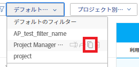

# リソース使用率情報の表示

<!-- Audited: 01/2024 -->

<!--

(NOTE:&nbsp;this is linked to the UI from the Utilization report. ALWAYS keep this information. DO NOT DELETE!!)

-->

リソースの使用率は、使用率レポートで表示できます。

<!--

(NOTE: Vazgen's response about these hours ie below and he asked us to NOT document them:

It queries Assignments first to get the tasks, issues, projects to display in the view. And then from those gets the hours.

In some cases, like for Planned Hours, it takes them from Assignments

But Budgeted Hours come from projects.

And Actual Hours are their own object - Hour)

-->

<!--

This report displays information about the assignments on work items for projects in your environment, like Planned, Actual, and Budgeted Hours, FTE, or Cost.&nbsp;These are hours,&nbsp;FTE, or costs associated with the assignments and not with the tasks and issues themselves.(PRIVATE NOTE:&nbsp;Vazgen's response about these hours: It queries Assignments first to get the tasks, issues, projects to display in the view. And then from those gets the hours. In some cases, like for Planned Hours, it takes them from Assignments; But Budgeted Hours come from projects. And Actual Hours are their own object - Hour.)

-->

## アクセス要件

使用率レポートにアクセスするには、次の条件を満たす必要があります。

<table style="table-layout:auto"> 
 <col> 
 <col> 
 <tbody> 
  <tr> 
   <td role="rowheader">Adobe Workfrontプラン</td> 
   <td>
新規：任意

       
または

       
現在： Pro 以上
 </td> 
  </tr> 
  <tr> 
   <td role="rowheader">Adobe Workfrontライセンス</td> 
   <td>
新規：標準

       
または

       
現在：プラン
 </td> 
  </tr> 
  <tr> 
   <td role="rowheader">アクセスレベル設定</td> 
   <td> 
次の項目へのアクセス権を表示または高くします。
 
    <ul> 
     <li> 
リソース管理 
 </li> 
     <li> 
プロジェクト
 </li> 
     <li> 
ポートフォリオ
 </li> 
     <li> 
プログラム
 </li> 
     <li> 
コスト別に情報を表示する場合は、財務データ
 </li> 
    </ul> </td> 
  </tr> 
  <tr> 
   <td role="rowheader">オブジェクトの権限</td> 
   <td> 
[ リソース ] 領域の [ 使用率 ] セクションにアクセスするためのプロジェクト、ポートフォリオ、およびプログラムへのアクセスを表示します
 
  
 
プロジェクトへのアクセスを管理して、プロジェクトの [ 使用率 ] セクションにアクセスします
 
  </td> 
  </tr> 
 </tbody> 
</table>

この表の情報の詳細については、 [Workfrontドキュメントのアクセス要件](/help/quicksilver/administration-and-setup/add-users/access-levels-and-object-permissions/access-level-requirements-in-documentation.md).

<!--

You must have View access to the projects you want to view utilization information for as described in this section. If you are still unable to access this information, contact your Workfront administrator. (NOTE:&nbsp;replaced with above table)

-->

<!--

<h2>Prerequisites for accessing utilization information</h2>

(NOTE: drafted, replaced with above table)

To access utilization information as described in this section, ensure that the following conditions are met:

<ul>
<li>You have at least&nbsp;View access to the project, program, or portfolio for which you want to view the utilization information.</li>
<li>Your Workfront administrator must grant you at least View access to&nbsp;Financial&nbsp;Data in your Access Level to be able to view cost and revenue information in the Utilization report. The Workfront administrator must enable both View Role Billing & Cost Rates as well as View User Billing &&nbsp;Cost Rates when they grant you the View access to Financial Data. For information about granting access to&nbsp;Financial&nbsp;Data, see <a href="../../administration-and-setup/add-users/configure-and-grant-access/grant-access-financial.md" class="MCXref xref">Grant access to financial data</a>. </li>
<li>

(NOTE:&nbsp;drafted. No longer the case.) 

The Utilization tab is included on any layout template that is assigned to you and that is applied to either the projects you view or to the Reporting area. 

The Utilization section is included on any layout template that is assigned to you and that is applied to either the projects you view or to the Resourcing area. 

</li>
<li>

The Utilization tab is available by default in the Reporting area if the system administrator has not assigned a custom layout template to you. 

The Utilization section is available by default in the Resourcing area if the system administrator has not assigned a custom layout template to you. 

</li>
</ul>

-->

## 使用率レポートの概要 {#overview-of-the-utilization-report}

[ 稼働状況 ] レポートでは、プロジェクト、プログラム、ポートフォリオの進捗状況、コスト、売上高を 1 つのレポートに表示できます。 また、売上高とコストを比較することもできます。

「生産資源」領域で稼働状況レポートを表示して、複数のプロジェクト間の稼働状況を表示したり、1 つのプロジェクトのレベルで表示して、そのプロジェクトに関連する個々の生産資源（役職ロールおよびユーザー）の稼働状況を表示したりできます。

使用率レポートへのアクセスと使用について詳しくは、 [使用率レポートを使用して、進捗状況、コスト、売上高を追跡する](#track-progress-cost-and-revenue-with-the-utilization-report) 」の節を参照してください。

### 時間の追跡（進行状況） {#track-hours-progress}

予算時間と計画時間を実際の時間と比較して表示することで、進捗を追跡できます。

プロジェクト、プログラム、またはポートフォリオの進捗状況を追跡する場合、タスクと問題の両方に対する進捗状況が利用状況レポートに含まれます。

時間の追跡時に使用可能な使用率レポートには、次の情報が含まれます。

<table style="table-layout:auto"> 
 <col> 
 <col> 
 <thead> 
  <tr> 
   <th><strong>時間表示時の列タイトル</strong> </th> 
   <th><strong>関数</strong> </th> 
  </tr> 
 </thead> 
 <tbody> 
  <tr> 
   <td scope="col"><strong>予算時間</strong> </td> 
   <td scope="col"> 
含まれるプロジェクトに対する合計予算時間。 含まれるプロジェクトの全期間の合計予算時間を表示するか、指定した日付範囲のみの合計予算時間を表示できます（個々の週または月を指定できます）。 
 
予算時間は、ビジネス・ケースの「生産資源予算設定」領域または「生産資源プランナ」で使用可能な情報から入力されます。<em>.</em>
 
予算時間は、次の行の「使用率」レポートに表示されます。
 
    <ul> 
     <li> 予算時間は、次のように、「使用率」レポートで、役職ロール別および個々のユーザー別に要約されます。 <strong>個々のユーザー：</strong> 予算時間は、使用率レポートで各ユーザーに関して要約されます。 これらの予算時間は、含まれるプロジェクトでユーザーが割り当てられたタスクおよび問題に関連付けられます。 （対応するジョブの役割の行を展開して、そのジョブの役割を持つユーザーのリストを表示できます）。 <strong>ジョブの役割：</strong> 予算時間は、使用率レポートのジョブの役割別に要約されます。 予算時間は、次のシナリオの結果、特定の職務ロールに表示されます。
     <ul>
     <li>ジョブの役割は、予算時間が関連付けられているタスクまたは問題に割り当てられるユーザーの主なジョブの役割として定義されます。 </li> 
       <li>1 つのプロジェクトの使用状況情報を表示する場合、タスクや問題に割り当てがないか、別のユーザに割り当てられている役割が、別のユーザに割り当てられている役割が、別のユーザに割り当てられているか、別のチームに割り当てられます。</li> 
       <li>複数のプロジェクト、プログラム、またはポートフォリオの使用状況情報を表示する場合、時間を割り当てられたユーザーの役割は、タスクまたはプロジェクトの問題に役割が割り当てられた場合にのみ使用されます。 </li> 
       <li>ジョブの役割は、予算時間が関連付けられているタスクまたはタスクに割り当てられ、タスクまたはタスクに割り当てられたユーザーには、システムで定義されたジョブの役割がありません。</li> 
      </ul></li> 
    </ul> 
    <ul> 
     <li> 
<strong>未割り当て時間数</strong>：予算時間は、タスクまたは問題に関連しており、タスクまたは問題に割り当てられているユーザーまたは役割がない場合は、未割り当て時間セクションの使用状況レポートに表示されます。 このセクションは、この説明に一致するプロジェクトに時間がかかっている場合と、プロジェクトによる使用率レポートの表示時にのみ表示されます。 
 
このセクションは、この説明に一致するプロジェクトに時間がかかっている場合と、プロジェクトによる使用率レポートの表示時にのみ表示されます。 
 </li> 
    </ul> 
予算時間の詳細については、 <a href="/help/quicksilver/manage-work/projects/project-finances/budgeted-labor-cost.md#locate-the-budgeted-hours-of-a-project">プロジェクトの予算時間の検索</a> in <a href="/help/quicksilver/manage-work/projects/project-finances/budgeted-labor-cost.md">プロジェクトの予算労務費と予算時間の把握</a>.
 </td> 
  </tr> 
  <tr> 
   <td scope="col"><strong>予定時間</strong> </td> 
   <td scope="col">

各タスクおよび問題の割り当てに関連付けられた、含まれるプロジェクトの計画時間。 含まれるプロジェクトの全期間に対する、プロジェクトの全割当の合計予定時間を表示できます。また、指定した日付範囲に対する計画時間の合計を表示することもできます（個々の週または月を指定できます）。

<strong>ヒント </strong>

期間が 0 の品目からの計画時間は考慮されません。 

[ 稼働状況 ] レポートの [ 計画時間 ] では、タスクまたは問題の期間中に計画時間が再割り当てされたかどうかが考慮されます。 

ワークロード・バランサを使用して時間単位のユーザーの日割りを変更した場合、使用率レポートで選択した日付にタスクの期間または問題の期間の一部のみが含まれていると、使用率レポートのデータに影響が及ぶ可能性があります。 

ユーザーの割当ての変更の詳細は、 <a href="../workload-balancer/manage-user-allocations-workload-balancer.md">ワークロードバランサーでのユーザー割り当ての管理</a>.

計画時間は、次の行の [ 稼働状況 ] レポートに表示されます。

<ul>

<li>計画時間は、次のように、稼働状況レポートで、ジョブの役割別および個々のユーザー別に要約されます。 
<ul>

<li><strong>個々のユーザー</strong>：各ユーザーの予定時間は、使用率レポートに要約されます。 これらの予定時間は、含まれるプロジェクトでユーザーが割り当てられたタスクおよびタスクに関連付けられます。 （対応するジョブの役割の行を展開して、そのジョブの役割を持つユーザーのリストを表示できます）。

<li><strong>ジョブの役割</strong>：計画時間は、単一のプロジェクトの使用率レポートで、ジョブの役割別に要約されます。 計画時間は、次のシナリオの結果、特定のジョブ・ロールに表示されます。  
<ul>

<li>ジョブの役割は、タスクまたは計画時間が関連付けられている問題に割り当てられるユーザーの主なジョブの役割として定義されます。

<li>1 つのプロジェクトの使用率情報を表示する場合、次のシナリオでは、ジョブロールに関連する時間はジョブロールに表示されません。   
<ul>

<li>タスクまたはタスクに割り当てがありません

<li>ジョブロール割り当てのないユーザーが割り当てられています

<li>ユーザーに別のジョブの役割が割り当てられています

<li>チームがタスクまたはイシューに割り当てられています
</li>   
</ul>

<li>複数のプロジェクト、プログラム、またはポートフォリオの使用状況情報を表示する場合、時間を割り当てられたユーザーの役割は、タスクまたはプロジェクトの問題に役割が割り当てられた場合にのみ使用されます。 複数のプロジェクトの稼働状況レポートを表示する場合、役割の時間が別々に表示されることはありません。

<li>ジョブの役割は、[ 予定時間 ] が関連付けられたタスクまたはタスクに割り当てられ、タスクまたはタスクに割り当てられたユーザーには、システムで定義されたジョブの役割がありません。
</li>  
</ul>

<li><strong>未割り当て時間数</strong>：計画時間は、タスクまたは問題に関連付けられていて、タスクまたは問題に割り当てられているユーザーまたは役割がない場合は、「未割り当て時間」セクションの使用率レポートに表示されます。 このセクションは、この説明に一致するプロジェクトに時間がかかっていて、1 つのプロジェクトの使用率レポートを表示している場合にのみ表示されます。  予定時間の詳細については、 <a href="../../manage-work/tasks/task-information/planned-hours.md">計画時間の概要</a>.
</li> 
</ul>
</li> 
</ul> </td> 
  </tr> 
  <tr> 
   <td><strong>実際の時間</strong> </td> 
   <td> 
 タスク、問題、 そして、プロジェクトで を参照してください。 含まれるプロジェクトの全期間の合計実績時間を表示することも、指定した日付範囲の合計実績時間のみを表示することもできます（個々の週または月を指定できます）。 
 
<strong>警告：</strong> 使用状況レポートには、プロジェクトに記録された時間、子タスク、タスク、タスク、および 1 つ以上の割り当てを持つ親タスクが含まれます。 割り当てのない親タスクに記録される時間は含まれません。 親タスクを作業タスクとして使用し、子タスクのみをリソースに割り当てることをお勧めします。 
 
実際の時間は、次のいずれかの行の使用率レポートに表示されます。
 
    <ul> 
     <li> 実績時間は、次のように、プロジェクトの使用率レポートで、ジョブの役割別および個々のユーザー別に要約されます。 <strong>個々のユーザー：</strong> 実際の時間は、時間を記録したユーザーの行の使用率レポートに表示されます。 （対応するジョブの役割の行を展開して、そのジョブの役割を持ち、時間を記録したユーザーのリストを表示できます）。 <strong>ジョブの役割：</strong> これらの役割に関連するユーザーが記録した実際の時間は、対応するジョブの役割の行の使用率レポートに要約されます。 実際の時間は、次のシナリオの結果、特定のジョブの役割に表示されます。 
      <ul> 
       <li>ジョブの役割は、時間を記録したユーザーの主要なジョブの役割として定義されます</li> 
       <li>タスクまたはタスクに割り当てがありません</li> 
       <li>別のユーザーがジョブロール割り当てを持たずに割り当てられています</li> 
       <li>別のユーザーが別のジョブの役割を持って割り当てられています</li> 
       <li> 
チームが割り当てられます
 </li> 
      </ul></li>  
     
時間のログにジョブの役割がプロファイルに関連付けられていない場合、[ 使用率 ] レポートに使用されるジョブの役割は、時間が記録されるタスクまたは問題に割り当てられたジョブの役割、またはタスクまたは問題のプライマリ所有者に関連付けられたジョブの役割です。 
 
     <li><strong>その他の時間：</strong> 実際の時間は、[ その他の時間 ] セクションの [ 使用状況 ] レポートに、時間内にログインしたユーザーの行に表示されます。 時間は、時間を記録したユーザーがシステムで定義されたジョブの役割を持たない場合に、このセクションに表示されます。 このセクションは、この説明と一致するプロジェクトに時間がある場合にのみ表示されます。 </li> 
    </ul> </td> 
  </tr> 
  <tr> 
   <td><strong>予算差異（時間）</strong> </td> 
   <td> 
合計予算時間から、含まれるプロジェクトの合計実績時間を引いた値。 含まれるプロジェクトの全期間の予算差異の合計を表示するか、指定した日付範囲の予算差異のみを表示できます（個々の週または月を指定できます）。 
 
正の値の場合は、緑で表示されます。 これは、合計予算時間が実際の時間よりも大きいことを示しています。
 
負の値の場合は、赤で表示されます。 これは、合計予算時間が実際の時間よりも少ないことを示しています。
 
  
 </td> 
  </tr> 
  <tr> 
   <td><strong>計画差異（時間）</strong> </td> 
   <td> 
計画時間の合計から、含まれるプロジェクトの実際の時間の合計を引いた値。 含まれるプロジェクトの全期間の計画差異の合計を表示するか、指定した日付範囲の計画差異のみを表示できます（個々の週または月を指定できます）。
 
正の値の場合は、緑で表示されます。 これは、計画時間の合計が実際の時間よりも大きいことを示しています。
 
負の値の場合は、赤で表示されます。 これは、計画時間の合計が実際の時間より少ないことを示しています。
 </td> 
  </tr> 
 </tbody> 
</table>

### コストの追跡 {#track-cost}

コストを追跡するには、予算原価と計画原価が実際原価とどのように比較されるかを表示します。

プロジェクト、プログラム、またはポートフォリオのコストを追跡する場合、使用率レポートの情報はタスクから取得されます。 タスクのコスト情報は、「稼働状況」レポートで常に使用できます。 タスクのコストは、タスクのコストタイプに基づいて計算されます。 タスクのコストタイプについて詳しくは、 [Workfrontがタスクのコストタイプを計算する方法](/help/quicksilver/manage-work/projects/project-finances/track-costs.md#how-workfront-calculates-cost-types-for-tasks) in [コストの追跡](/help/quicksilver/manage-work/projects/project-finances/track-costs.md).

次の方法で、「稼働状況」レポートにコスト情報を表示できます。

* 特定の週または月、またはプロジェクト全体、プログラムまたはポートフォリオ全体に対して
* ロール別または個人別、プロジェクト用

使用率レポートの通貨は、プロジェクトで設定された通貨によって決まります。 プロジェクトの通貨を調整する方法については、 [プロジェクトの通貨を変更](../../manage-work/projects/project-finances/change-project-currency.md).

コストを追跡する際に、使用率レポートで次の情報を使用できます。

<table style="table-layout:auto"> 
 <col> 
 <col> 
 <thead> 
  <tr> 
   <th><strong>コスト表示時の列タイトル</strong> </th> 
   <th> 
<strong>関数</strong> 
 </th> 
  </tr> 
 </thead> 
 <tbody> 
  <tr> 
   <td scope="col"><strong>予算コスト</strong> </td> 
   <td scope="col"> 
含まれるプロジェクトの予算コスト。 含まれるプロジェクトの全期間の合計予算原価を表示できます。または、指定した日付範囲に対してのみ予算原価の合計を表示できます（個々の週または月を指定できます）。
 
使用率レポートの予算原価は役割別の原価に焦点を当てているので、Workfrontの他の領域の予算労務費と同じ計算になります。 予算労務費の計算方法の詳細は、次を参照してください： <a href="../../manage-work/projects/project-finances/budgeted-labor-cost.md" class="MCXref xref">プロジェクトの予算労務費と予算時間の把握</a>.
 </td> 
  </tr> 
  <tr> 
   <td scope="col"><strong>計画コスト</strong> </td> 
   <td scope="col"> 
含まれるプロジェクトの計画コストの合計。 含まれるプロジェクトの全期間の計画原価の合計を表示することも、指定した日付範囲の計画原価の合計のみを表示することもできます（個々の週または月を指定できます）。
 
週、月および四半期表示では、計画コストは、ジョブの役割またはユーザーのコスト・レートが有効な日付となる、選択した期間の平均として計算されます。

プロジェクトの計画コストの計算方法については、 <a href="/help/quicksilver/manage-work/projects/project-finances/track-costs.md#how-workfront-calculates-planned-budgeted-and-actual-costs">Workfrontが計画原価、予算原価および実績原価を計算する方法</a> in <a href="/help/quicksilver/manage-work/projects/project-finances/track-costs.md">コストの追跡</a>.
 </td>
  </tr> 
  <tr> 
   <td scope="col"><strong>実際のコスト</strong> </td> 
   <td scope="col"> 
含まれるプロジェクトの合計実績コスト。 含まれるプロジェクトの全期間の合計実績コストを表示するか、指定した日付範囲のみの合計実績コストを表示できます（個別の週または月を指定できます）。
 
プロジェクトの実際のコストの計算方法については、 <a href="/help/quicksilver/manage-work/projects/project-finances/track-costs.md#how-workfront-calculates-planned-budgeted-and-actual-costs">Workfrontが計画原価、予算原価および実績原価を計算する方法</a> in <a href="/help/quicksilver/manage-work/projects/project-finances/track-costs.md">コストの追跡</a>.
 </td>
  </tr> 
  <tr> 
   <td><strong>予算差異（原価）</strong> </td> 
   <td scope="col"> 
予算原価の合計から、含まれるプロジェクトの実績原価の合計を引いた値。 含まれるプロジェクトの全期間の予算差異の合計を表示するか、指定した日付範囲の予算差異のみを表示できます（個々の週または月を指定できます）。
 
正の値の場合は、緑で表示されます。 これは、合計予算原価が実績原価よりも大きいことを示します。
 
負の値の場合は、赤で表示されます。 これは、合計予算原価が実績原価よりも少ないことを示しています。
 </td>
  </tr> 
  <tr> 
   <td><strong>計画差異（原価）</strong> </td> 
   <td> 
計画原価の合計から、含まれるプロジェクトの実績原価の合計を引いた値。 含まれるプロジェクトの全期間の計画差異の合計を表示するか、指定した日付範囲の計画差異のみを表示できます（個々の週または月を指定できます）。 
 
正の値の場合は、緑で表示されます。 これは、計画コストの合計が実際のコストよりも大きいことを示します。
 
負の値の場合は、赤で表示されます。 これは、計画原価の合計が実際原価よりも少ないことを示しています。
 </td> 
  </tr> 
 </tbody> 
</table>

### 売上高の追跡 {#track-revenue}

予算収益および計画収益と実際の収益との比較を表示して、収益を追跡できます。

プロジェクト、プログラム、またはポートフォリオの売上高を追跡する場合、タスクからの収益のみが使用率レポートに含まれます。

次の表に示す情報は、売上高の追跡時に使用率レポートで利用できます。

特定のフィールドと、Workfrontでの計算方法について詳しくは、 [コストの追跡](../../manage-work/projects/project-finances/track-costs.md) および [請求と売上高の概要](../../manage-work/projects/project-finances/billing-and-revenue-overview.md).

<table style="table-layout:auto"> 
 <col> 
 <col> 
 <thead> 
  <tr> 
   <th><strong>売上高表示時の列タイトル</strong> </th> 
   <th> <strong>関数</strong></th> 
  </tr> 
 </thead> 
 <tbody> 
  <tr> 
   <td scope="col"><strong>予算収益</strong> </td> 
   <td scope="col"> 
含まれるプロジェクトでの役割請求率を掛けた合計予算時間。 含まれるプロジェクトの全期間における合計予算収益を表示するか、指定した日付範囲に対してのみ合計予算収益を表示できます（個々の週または月を指定できます）。
 </td> 
  </tr> 
  <tr> 
   <td scope="col"><strong>計画収益</strong> </td> 
   <td scope="col"> 
[ 稼働状況 ] レポートの [ 予定収益 ] は、プロジェクトのタスクに割り当てられたリソースに割り当てられた予定時間に関連する収益です。
 
Workfrontは、次の式を使用して、使用率レポートのプロジェクト計画収益を計算します。
 
<code>Project Planned Revenue = SUM (All Tasks Planned Revenue)</code> 
 
   
<b>注意</b>
   
「稼働率」レポートに表示されるプロジェクトの「計画収益」は、「プロジェクトの詳細」領域およびプロジェクト・レポートに表示される「計画収益」とは異なります。 
 
「プロジェクトの詳細」領域の「計画収益」には、タスクの収益とプロジェクトの固定収益が反映されます。 「稼働状況」レポートの「計画収益」には、プロジェクト内のタスクに関連付けられた計画収益が表示されます。 
 
     
Example: </b>">  
      
プロジェクトに 10 時間のタスクが 1 つあり、時間レートが$20 のコンサルタントに割り当てられ、プロジェクトに$100 の固定売上高がある場合、使用率レポートには計画収益（タスクの時間に関連付けられた計画収益）が$200 と表示されます。 「プロジェクトの詳細」セクションには、$300（タスクからの計画収益およびプロジェクトの固定売上高）が表示されます。 
 
     
 
タスクとプロジェクトの稼働率レポート以外の計画収益の詳細は、 <a href="../../manage-work/projects/project-finances/billing-and-revenue-overview.md" class="MCXref xref">請求と売上高の概要</a>.
 
 
[ 稼働状況 ] レポートで、タスクに設定された [ 収益タイプ ] が考慮される、含まれるプロジェクトの計画収益の計算方法と表示方法。 
 
プロジェクト内の各タスクの売上高タイプに応じて、次のシナリオが存在します。 
 
<strong>固定売上高：</strong> タスクの割り当てに関係なく、タスクの売上高は常にタスクに指定された固定金額を使用して計算されます。
 
<b>重要</b>

Workfrontの他の領域とは異なり、使用率レポートでは、固定収益をタスクの予定時間数で均等に割ることで、固定収益タスクの予定収益を計算します。 
 
例えば、タスクの売上高が$200 の場合などです。 タスクに予定時間が 4 時間ある場合、各時間は$50 になります。 これは、ユーザーおよび役割レベルで配布されます。 この配分は、使用率レポートに固有です。
 
<b>注意</b>

「固定収益」タスクがあり、タスクに「計画時間」がない場合、「収益」は「使用率」レポートに表示されません。これは、「収益」タスクを時間に配分する方法がないためです。 「固定収益」を持ち、アサイメントを持たないタスクに対して計画時間がある場合、「収益」は「未割当収益」と表示されます。 
 
<strong>1 時間ごとの役割：</strong> タスクの収益は、特定のロールに設定された請求率と、そのロールに関連する計画時間数を掛けた値を使用して計算されます。 Workfrontでは次の数式が使用されます。
 
<code>ロール時間別計画収益= SUM（全タスクのロールからの計画時間） *ロール請求率</code>

<b>注意：</b> フォーミュラ内の請求時間率では、レートの有効日変更が考慮されます。
   
<strong>1 時間ごとのユーザー：</strong> タスクの売上高は、特定のユーザーに設定された請求率と、そのユーザーに関連する計画時間数を掛けた値を使用して計算されます。 Workfrontでは次の数式が使用されます。
 
<code>ユーザー時間別収益= SUM（全タスクのユーザーからの予定時間） *ユーザー請求率</code> 
 
<b>注意：</b> フォーミュラ内の請求時間率では、レートの有効日変更が考慮されます。
 
<b>時間別またはユーザー別の役割と固定</b> 
 
<b>重要</b>

Workfrontの他の領域とは異なり、使用率レポートでは、固定売上高をタスク上の予定時間数で均等に割って計画収益を計算します。 
 
次のケースが存在します。 

<ul>
<li> 
<strong>時間別ロール+固定：</strong> タスクの収益は、特定のロールに設定された請求率と、ロールに関連する計画時間数を掛けた値を使用して計算されます。 また、タスクに指定された固定金額がロールレートに追加されます。 Workfrontでは次の数式が使用されます。
 
<code>ロール時間別+固定計画収益= [SUM（全タスクのロールからの予定時間） *ロール請求率] + SUM（タスクの上限または固定金額/タスクの予定時間）</code> 
 </li>
<li> 
<strong>ユーザーの時間別+固定：</strong> 特定のユーザーに設定された請求率。そのユーザーのタスクに関する計画時間数を掛けたものです。 また、タスクに指定された固定金額がユーザー率に追加されます。 Workfrontでは次の数式が使用されます。
 
<code>ユーザーの 1 時間ごと+固定計画収益= [SUM（全タスクのユーザーからの予定時間） *ユーザー請求率] + SUM（タスクの上限または固定金額/タスクの予定時間）</code> 
 </li>
</ul> 
<b>役割またはユーザーの 1 時間ごと（上限あり）</b> 
 
<b>重要</b>

Workfrontの他の領域とは異なり、計画収益が上限を超える場合、上限金額を超える金額は固定収益と見なされます。 計画収益は、固定収益をタスク上の計画時間数で均等に割り、その上限金額と、役割またはユーザーの時間別収益を加算して計算されます。  
 
次のケースが存在します。 

<ul>
<li> 
<strong>ロール時間別（キャップ付き）:</strong> タスクは「ロール」「時間別」と同じように 1 時間ごとに請求されますが、指定できる最大キャップ金額があります。 Workfrontでは次の数式が使用されます。
 
<code>ロール時間別（最大計画収益を含む） = [SUM（すべてのタスクと問題に関するロールからの予定時間） *ロール請求率] +タスクの上限金額+ SUM（タスクの上限金額/計画時間）</code> 
 </li>
<li> 
<strong>ユーザー 1 時間ごと（キャップ付き）:</strong> タスクは 1 時間ごとにユーザー時間ごとに請求されますが、指定できる最大上限金額があります。 Workfrontでは次の数式が使用されます。 
 
<code>ユーザーの 1 時間ごと（最大計画収益を含む） = [SUM（全タスクのユーザーからの予定時間） *ユーザー請求率] +タスクの上限金額+ SUM（タスクの上限金額/計画時間）</code> 
 </li>
</ul> 
計画収益の計算時に考慮される役割またはユーザーの詳細は、 <a href="../../manage-work/projects/project-finances/billing-and-revenue-overview.md" class="MCXref xref">請求と売上高の概要</a>.
 </td>
</tr> 
  <tr> 
   <td><strong>実際の売上高</strong> </td>
   <td> 
実際の収益は、タスクの実際の時間とプロジェクトの実績に関連付けられた収益です。 実際の売上高の詳細は、 <a href="/help/quicksilver/manage-work/projects/project-finances/billing-and-revenue-overview.md#track-revenue-amounts">売上高の追跡</a> in <a href="/help/quicksilver/manage-work/projects/project-finances/billing-and-revenue-overview.md">請求と売上高の概要</a>.

「使用率」レポートで、含まれるプロジェクトの実際の収益を計算する方法は、タスクに設定された収益タイプに応じて、次のように異なります。
 
<strong>固定売上高：</strong> タスクの割り当てに関係なく、タスクの売上高は常にタスクに指定された固定金額を使用して計算されます。
 
<b>重要</b>

Workfrontの他の分野とは異なり、使用率レポートでは、固定売上高をタスクに記録された時間数で均等に割って実際の売上高を計算します。 
 
 
 
例えば、タスクの実績売上高が$200 の場合などです。 タスクに実際の時間が 4 時間ある場合、1 時間あたり$50 となります。 これは、ユーザーおよび役割レベルで配布されます。 この配分は、使用率レポートに固有です。
 
<b>注意</b>

「固定収益」タスクがあり、タスクに実績時間がない場合は、「実績収益」は「使用率」レポートに表示されません。これは、時間を配分する方法がないためです。 
 
<strong>1 時間ごとの役割：</strong> タスクの売上高は、特定のロールに設定された請求率と実際の時間数を掛けた値を使用して計算されます。
 
Workfrontでは次の数式が使用されます。
 
<code>ロール時間別実績収益= SUM（全タスクのロールからの実績時間） *ロール請求率</code> 
 
<b>注意：</b> フォーミュラ内の請求時間率では、レートの有効日変更が考慮されます。
 
<strong>1 時間ごとのユーザー：</strong> タスクの売上高は、特定のユーザーに設定された請求率と、そのユーザーのタスクに対して記録された時間数を掛けた値を使用して計算されます。 Workfrontでは次の数式が使用されます。
 
<code>ユーザー時間別実績収益= SUM（全タスクのユーザーからの実績時間） *ユーザー請求率</code>
 
<b>注意：</b> フォーミュラ内の請求時間率では、レートの有効日変更が考慮されます。
 
<b>ロールまたはユーザーの時間別+固定</b> 
 
<b>重要</b>

Workfrontの他の分野とは異なり、使用率レポートでは、固定売上高をタスクに記録された時間数で均等に割って実際の売上高を計算します。 
 
次のケースが存在します。 

<ul>
<li> 
<strong>時間別ロール+固定：</strong> 特定のロールに設定された請求率。そのロールを持つユーザーがタスクに対して記録した時間数を掛けたものです。 また、タスクに指定された固定金額がロールレートに追加されます。 
 
Workfrontでは次の数式が使用されます。
 
<code>ロール時間別+固定収益= [SUM（全タスクのロールからの実績時間） *ロール請求率] + SUM（タスクの上限または固定金額/タスクの実績時間）</code> 
 </li>
<li> 
<strong>ユーザーの時間別+固定：</strong> 特定のユーザーに設定された請求率。そのユーザーのタスクに対して記録された時間数を掛けたものです。 また、タスクに指定された固定金額がユーザー率に追加されます。 
 
Workfrontでは次の数式が使用されます。
 
<code>ユーザーの 1 時間別+固定売上高= [SUM（全タスクのロールからの実際の時間） *ユーザー請求率] + SUM（タスクの上限または固定金額/タスクのユーザー時間）</code> 
 </li>
</ul> 
<b>役割またはユーザーの 1 時間ごと（上限あり）</b> 
 
<b>重要</b>

Workfrontの他の領域とは異なり、計画収益が上限を超える場合、上限金額を超える金額は固定収益と見なされます。 計画収益は、固定収益をタスク上の計画時間数で均等に割り、その上限金額と、役割またはユーザーの時間別収益を加算して計算されます。  
 
次のケースが存在します。

<ul>
<li> 
<strong>ロール時間別（キャップ付き）:</strong> タスクは「ロール」「時間別」と同じように 1 時間ごとに請求されますが、指定できる最大キャップ金額があります。 Workfrontでは次の数式が使用されます。
 
<code>実際の売上高の上限を含む 1 時間ごとの役割= [SUM（すべてのタスクと問題に関するロールからの実際の時間） *ロール請求率] +タスクの上限金額+ SUM（上限金額/タスクの実績時間）</code>
 </li>
<li> 
<strong>ユーザー 1 時間ごと（キャップ付き）:</strong> タスクは 1 時間ごとにユーザー時間ごとに請求されますが、指定できる最大上限金額があります。
 
 Workfrontでは次の数式が使用されます。
 
<code>実際の売上高の上限を含む 1 時間ごとのユーザー= [SUM（すべてのタスクと問題に関するロールからの実際の時間） *ユーザー請求率] +タスクの上限金額+ SUM（上限金額/タスクの実績時間）</code> 
 </li>
</ul>

<strong>プロジェクトの売上高</strong>：プロジェクトにログオンした時間に関連付けられる売上高は、時間を記録するユーザーの主要なジョブロールの 1 時間あたりの請求数を考慮して計算されます。 プロジェクトに時間を記録することはお勧めしません。 

<b>注意</b>

プライマリがジョブ・ロールに関連付けられていない場合、またはユーザー・ロールの 1 時間あたりの請求がゼロの場合、Workfrontはユーザーの 1 時間あたりの請求金額を使用して実際の収益を計算します。 ユーザーのプロファイルに時間あたりの請求額がない場合、実際の売上高は 0 になります。 

</td> 
  </tr> 
  <tr> 
   <td><strong>予算差異（収益用）</strong> </td> 
   <td> 
含まれるプロジェクトの実績収益から予算収益を引いた合計。 含まれるプロジェクトの全期間の予算差異の合計を表示するか、指定した日付範囲の予算差異のみを表示できます（個々の週または月を指定できます）。
 
正の値の場合は、緑で表示されます。 これは、合計予算収益が実際の収益よりも大きいことを示します。
 
負の値の場合は、赤で表示されます。 これは、合計予算収益が実際の収益よりも少ないことを示しています。
 </td>
  </tr> 
  <tr> 
   <td><strong>計画差異（収益用）</strong> </td> 
   <td> 
含まれるプロジェクトの実際の売上高から計画収益の合計を引いた値。 含まれるプロジェクトの全期間の計画差異の合計を表示するか、指定した日付範囲の計画差異のみを表示できます（個々の週または月を指定できます）。 
 
正の値の場合は、緑で表示されます。 これは、計画収益の合計が実際の収益よりも大きいことを示しています。
 
負の値の場合は、赤で表示されます。 これは、計画収益の合計が実際の収益よりも少ないことを示しています。
 </td>
  </tr> 
 </tbody> 
</table>

<!--Note from the table about Actual revenue: 
     
Actual Revenue is displayed in the Utilization report only after the task is marked as Complete or Done (or a status that equates with Complete).

    -->

<!--More notes from the table: 
     
(NOTE:&nbsp;the note below is duplicated in this article: /Content/Manage work/Projects/Project Finances/billing-and-revenue-overview.html and in the glossary)

   -->

### 収益と計画原価および実績原価の比較 {#compare-revenue-against-planned-and-actual-costs}

計画収益と共に計画原価または実績原価を表示できます。 利益 (%) も表示されます（利益は売上高 — コスト/売上高として計算されます）。

収益と計画原価および実績原価を比較する場合は、次の情報が「使用率」レポートで使用可能です。

<table style="table-layout:auto"> 
 <col> 
 <col> 
 <thead> 
  <tr> 
   <th><strong>収益対コスト（計画済）を表示する際の列タイトル</strong> </th> 
   <th> <strong>関数</strong></th> 
  </tr> 
 </thead> 
 <tbody> 
  <tr> 
   <td scope="col"><strong>計画コスト</strong> </td> 
   <td scope="col"> 含まれるプロジェクトの計画コストの合計。 含まれるプロジェクトの全期間の計画原価の合計を表示することも、指定した日付範囲の計画原価の合計のみを表示することもできます（個々の週または月を指定できます）。 </td> 
  </tr> 
  <tr> 
   <td scope="col"><strong>計画収益</strong> </td> 
   <td scope="col"> 
「計画収益」は、タスクの計画時間に関連付けられた収益です。 
 
含まれるプロジェクトの [ 稼働状況 ] レポートでの計画収益の計算方法と表示方法は、タスクに設定された収益タイプに応じて異なります。詳しくは、 <a href="#track-revenue" class="MCXref xref">売上高の追跡</a> 」の節を参照してください。
 </td> 
  </tr> 
  <tr> 
   <td scope="col"><strong>余白</strong> </td> 
   <td scope="col"> 
利益の割合は、次のように計算されます。
 
<code>Planned Revenue - Planned Cost / Planned Revenue * 100. </code>
 
<b>メモ</b>

計画収益が 0 に等しい場合、利益は 0 と表示されます。 
 </td>
</tr> 
  <tr> 
   <td scope="col"> 
<strong>収益対コスト（実績）を表示する際の列タイトル</strong> 
  </td> 
   <td scope="col">
<strong>関数</strong>
</td> 
  </tr> 
  <tr> 
   <td scope="col"><strong>実際のコスト</strong> </td> 
   <td scope="col"> 
含まれるプロジェクトの合計実績コスト。 含まれるプロジェクトの全期間の合計実績コストを表示するか、指定した日付範囲のみの合計実績コストを表示できます（個別の週または月を指定できます）。
 </td> 
  </tr> 
  <tr> 
   <td scope="col"><strong>実際の売上高</strong> </td> 
   <td> 
「実績収益」は、タスクの実績時間に関連付けられた収益です。
 
実際の売上高は、タスクが完了または完了（または完了と同じステータス）とマークされた後にのみ、使用率レポートに表示されます。
 
[ 稼働状況 ] レポートで、含まれるプロジェクトの実際の売上高を計算する方法は、タスクに設定された収益タイプに応じて異なります。詳しくは、 <a href="#track-revenue" class="MCXref xref">売上高の追跡</a> 」の節を参照してください。 
 </td> 
  </tr> 
  <tr> 
   <td scope="col"><strong>余白</strong> </td> 
   <td> 
利益の割合は、次のように計算されます。
 
実際の収益 — 実際の原価/実際の収益* 100。 
 
<b>メモ</b>

実際の売上高が 0 の場合、利益は 0 と表示されます。 
 </td>
</tr> 
 </tbody> 
</table>

<!--Note from the table from above "Function" header in the middle of the table; right after the "Planned Revenue"/"Margin" definition: 
     
(NOTE: This needs to be either split in two tables of formatted differently)

    -->

## 使用率レポートを使用して、進捗状況、コスト、売上高を追跡する {#track-progress-cost-and-revenue-with-the-utilization-report}

プロジェクト、プログラムまたはポートフォリオの進捗状況やコストを追跡できます。

特定の週または月の使用状況レポートの情報を表示したり、プロジェクトの全期間の情報を表示したりできます。

稼働状況レポートを使用して 1 つ以上のプロジェクトの進捗状況またはコストを追跡する手順は、次のとおりです。

1. 個々のプロジェクト、複数のプロジェクト、プログラム、またはポートフォリオの使用状況情報を表示するかどうかに応じて、次のいずれかの操作を行います。

   * 単一のプロジェクトの使用率情報を表示する手順は、次のとおりです。

      1. 使用状況情報を表示するプロジェクトに移動し、「 **その他を表示 > 使用率**.
      1. 個々のプロジェクトを表示する場合は、利用状況情報が自動的に表示され、フィルタを適用する必要はありません。\
         使用率レポートをフィルタする場合は、フィルタを適用し、 **実行**.\
         使用率レポートのフィルタリング方法については、 [使用状況情報のフィルタリング](#filter-utilization-information) 」を参照してください。\
         個々のユーザーとロールの使用状況情報が表示されます（ユーザーは、関連するロール内にグループ化されます）。

   * 複数のプロジェクトの使用率情報を表示する手順は、次のとおりです。

     {{step1-to-utilization-report}}

      1. 使用率レポートにフィルターを適用し、 **実行**.
使用率レポートを実行する前に、フィルタで 1 つ以上のプロジェクトを指定する必要があります。 使用率レポートのフィルタリング方法については、 [使用状況情報のフィルタリング](#filter-utilization-information) 」を参照してください。\
         個々のロールおよびプロジェクトの使用状況情報が表示されます（ロールは、関連するプロジェクト内にグループ化されます）。

   * プログラムの使用率情報を表示する手順は、次のとおりです。

     {{step1-to-utilization-report}}

      1. クリック **表示**>**プログラム**.
      1. 使用率レポートにフィルターを適用し、 **実行**.\
         [ 使用率 ] レポートを実行する前に、フィルタで 1 つ以上のプログラムを指定する必要があります。 使用率レポートのフィルタリング方法については、 [使用状況情報のフィルタリング](#filter-utilization-information) 」を参照してください。\
         個々のプロジェクトおよびプログラムの使用状況情報が表示されます（プロジェクトは、関連するプログラム内にグループ化されます）。

   * ポートフォリオの使用率情報を表示する手順は、次のとおりです。

     {{step1-to-utilization-report}}

      1. クリック **表示**>**Portfolio**.
      1. 使用率レポートにフィルターを適用し、 **実行**.\
         使用率レポートを実行する前に、フィルターで 1 つ以上のポートフォリオを指定する必要があります。 使用率レポートのフィルタリング方法については、 [使用状況情報のフィルタリング](#filter-utilization-information) 」を参照してください。\
         個々のプロジェクト、プログラム、ポートフォリオの使用状況情報が表示されます（プロジェクトは、関連するプログラム内にグループ化され、プログラムは、関連するポートフォリオ内にグループ化されます）。

1. 使用率レポートの右上隅で、 **表示**&#x200B;をクリックし、メニューで次のいずれかを選択します。

   * **コスト**
   * **時間**
   * **売上高**
   * **収益とコスト（計画済み）**
   * **売上高とコスト（実際）**

   選択したオプションによって、レポートで使用できる列と情報が決まります。
   

1. （オプション）使用状況情報を表示する日付範囲を選択します。 指定した週または月の情報を、 **全体** 列。 プロジェクト全体、プログラムまたはポートフォリオの情報は、常に **全体** 列。\
   詳しくは、 [情報を表示する日付範囲を調整](#adjust-the-date-range-for-which-information-is-displayed) 」を参照してください。

1. （オプション）任意の列タイトルをクリックして、使用状況レポートをその列の情報で並べ替えます。 並べ替えは、レポートに複数の項目を含める場合にのみ機能します。 例えば、複数のプロジェクト（またはポートフォリオやプログラム）を見ている場合に、レポートの結果を並べ替えることができます。 一度に 1 つのプロジェクト（または 1 つのポートフォリオまたは 1 つのプログラム）しか表示していない場合は、結果を並べ替えることはできません。
1. 「 」セクションの情報を使用します。 [使用率レポートの概要](#overview-of-the-utilization-report) この記事では、使用率レポートの各列について説明します。

## 使用状況情報のフィルタリング {#filter-utilization-information}

プロジェクトの使用状況レポートに表示される内容をフィルタリングできます。 タスク、問題、役割およびカスタムデータをフィルタリングできます。 フィルタを適用すると、選択した基準に基づく情報が [ 使用率 ] レポートに表示されます。

新しいフィルターを作成するか、以前に作成したフィルターを適用できます。

### フィルターの作成または変更 {#create-or-modify-a-filter}

フィルタを作成すると、使用率レポートにアクセスできるすべてのWorkfrontユーザーも、作成したフィルタにアクセスできます。 同様に、既存のフィルタを変更すると、[ 使用率 ] レポートにアクセスできるすべてのユーザのフィルタが変更されます。

フィルターを作成または変更するには、次の手順に従います。

1. 使用率レポートを開きます。
詳しくは、 [使用率レポートを使用して、進捗状況、コスト、売上高を追跡する](#track-progress-cost-and-revenue-with-the-utilization-report) 」をクリックします。

1. 次をクリック： **フィルター** アイコンをクリックして、フィルターオプションを表示します。
1. （条件付き）既存のフィルターを変更するには、 **フィルター** ドロップダウンメニューから、変更するフィルターを選択します。
1. フィルターを作成または変更するには、次の情報を指定します。

   * **PORTFOLIO:** [ 使用率 ] レポートに含める情報を含むポートフォリオの名前を入力し、ドロップダウンリストに表示されたら名前をクリックします\
     この手順を繰り返して、複数のポートフォリオの情報を使用率レポートに含めます。\
     システムのすべてのポートフォリオをフィルターに含めるには、 **すべて追加**. （このオプションは、システム内のポートフォリオが 10 件未満の場合にのみ使用できます）。

   * **プログラム：** [ 使用率 ] レポートに含める情報を含むプログラムの名前を入力し、ドロップダウンリストに表示されたら名前をクリックします。\
     このプロセスを繰り返して、複数のタスクの情報を使用率レポートに含めます。\
     フィルターで既にポートフォリオを指定している場合、指定するプログラムは、既にフィルターに含まれているポートフォリオからのものである必要があります。 存在しない場合、プログラムのデータは使用率レポートに含まれません。\
     システムのすべてのプログラムをフィルタに含めるには、 **すべて追加**. （このオプションは、システム内のプログラムが 20 件未満の場合にのみ使用できます。）

   * **プロジェクト：** 使用率レポートに含める情報を含むプロジェクトの名前を入力し、ドロップダウンリストに表示されたら名前をクリックします。\
     このプロセスを繰り返して、複数のプロジェクトからの情報を使用率レポートに含めます。\
     フィルターで既にポートフォリオまたはプログラムを指定している場合、指定するプロジェクトは、既にフィルターに含まれているポートフォリオまたはプログラムの 1 つに含まれている必要があります。 そうでない場合、プロジェクトのデータは使用率レポートに含まれません。\
     システムのすべてのプロジェクトをフィルターに含めるには、 **すべて追加**. （このオプションは、システム内のプロジェクト数が 250 件未満の場合にのみ使用できます）。

   * **タスク：** [ 使用率 ] レポートに含める情報を含むタスクの名前を入力し、ドロップダウンリストに表示されたら名前をクリックします。\
     このプロセスを繰り返して、複数のタスクの情報を使用率レポートに含めます。\
     フィルタで既にポートフォリオ、プログラム、またはプロジェクトを指定している場合は、指定するタスクは、既にフィルタに含まれているポートフォリオ、プログラム、またはプロジェクトのいずれかに属している必要があります。 存在しない場合、タスクのデータは使用率レポートに含まれません。

   * **問題：** 使用率レポートに含める情報を含む問題の名前を入力し、ドロップダウンリストに表示されたら名前をクリックします。\
     このプロセスを繰り返して、複数の問題からの情報を使用率レポートに含めます。\
     フィルターで既にポートフォリオ、プログラム、またはプロジェクトを指定している場合は、指定する問題は、既にフィルターに含まれているポートフォリオ、プログラム、またはプロジェクトのいずれかに含まれている必要があります。 そうでない場合、問題のデータは使用率レポートに含まれません。\
     問題のコスト情報が、使用率レポートに含まれない場合があります。 問題のコスト情報が使用率レポートに含まれる場合の詳細は、 [使用率レポートを使用して、進捗状況、コスト、売上高を追跡する](#track-progress-cost-and-revenue-with-the-utilization-report) 」を参照してください。

   * **役割：** 使用率レポートに表示するロールの名前を入力し、ドロップダウンリストに表示されたら名前をクリックします。 この手順を繰り返して、追加の役割を含めます。
「使用率」レポートには、指定したロールの情報のみが表示されます。 例えば、タスクに 10 の実績時間が含まれているとします。 そのうち 6 時間はデザイナーの役割から、4 時間はデベロッパーの役割からです。 Designer の役割別に使用率レポートをフィルタする場合、開発者の役割から 4 時間の時間がレポートから除外されます。

   * **フィルタールールの追加：** クリック **フィルタールールを追加**&#x200B;をクリックし、フィルターするフィールド名を入力します。 フィールドが使用可能な場合は、関連付け可能な各オブジェクトに対してが設定されます。 フィールドの名前をクリックして、フィルターに追加します。

     >[!IMPORTANT]
     >
     >フィールドラベルではなく、フィールド名を入力する必要があります。 フィールドラベルは、オブジェクトに添付されたカスタムフォームに表示されます。 ラベルとカスタムフィールドの名前の違いについて詳しくは、  [カスタムフォームの作成または編集](../../administration-and-setup/customize-workfront/create-manage-custom-forms/create-or-edit-a-custom-form.md).

     列に表示されるフィールドの詳細については、 [Adobe Workfrontの用語集](../../workfront-basics/navigate-workfront/workfront-navigation/workfront-terminology-glossary.md).\
     フィルターのフィルターおよび条件修飾子を選択します。 使用可能な修飾子については、 [フィルターおよび条件修飾子](../../reports-and-dashboards/reports/reporting-elements/filter-condition-modifiers.md).

1. 新しいフィルターを作成するには、 **フィルターを保存**.\
   または\
   既存のフィルターを変更するには、 **フィルターを保存** ボタンをクリックし、 **新しいフィルターの保存**.
Adobe Analytics の **フィルター名** フィールドにフィルターの名前を入力し、 **保存**.
「使用率」領域には、フィルターに含めた情報がフィルターされます。

### 保存済みフィルターの適用 {#apply-a-saved-filter}

1. 使用率レポートを開きます。
詳しくは、 [使用率レポートを使用して、進捗状況、コスト、売上高を追跡する](#track-progress-cost-and-revenue-with-the-utilization-report) 」をクリックします。

1. クリック **保存済みフィルター**&#x200B;を選択し、適用するフィルターをドロップダウンリストから選択します。

### フィルターの複製 {#duplicate-a-filter}

1. 使用率レポートを開きます。
詳しくは、 [使用率レポートを使用して、進捗状況、コスト、売上高を追跡する](#track-progress-cost-and-revenue-with-the-utilization-report) 」をクリックします。

1. クリック **保存済みフィルター**&#x200B;をクリックし、複製するフィルターの上にマウスポインターを置いて、 **複製** アイコン。

   

   [ フィルタを複製 ] ダイアログボックスが表示されます。

1. Adobe Analytics の **フィルター名** フィールドで、新しいフィルターの名前を入力し、 **保存**.

### フィルターの名前を変更する {#rename-a-filter}

フィルタの名前を変更すると、使用率レポートにアクセスできるすべてのWorkfrontユーザに、入力した新しい名前が表示されます。

フィルタの名前を変更するには、次の手順に従います。

1. 使用率レポートを開きます。
詳しくは、 [使用率レポートを使用して、進捗状況、コスト、売上高を追跡する](#track-progress-cost-and-revenue-with-the-utilization-report) 」をクリックします。

1. クリック **保存済みフィルター**&#x200B;をクリックし、名前を変更するフィルターの上にマウスポインターを置いて、 **名前を変更** アイコン。

   

   [ フィルタ名を変更 ] ダイアログボックスが表示されます。

1. Adobe Analytics の **フィルター名** フィールドで、新しいフィルターの名前を入力し、 **保存**.

### フィルターの削除 {#delete-a-filter}

フィルタを削除すると、使用率レポートにアクセスできるすべてのWorkfrontユーザーのフィルタが削除されます。

フィルターを削除するには：

1. 使用率レポートを開きます。
詳しくは、 [使用率レポートを使用して、進捗状況、コスト、売上高を追跡する](#track-progress-cost-and-revenue-with-the-utilization-report) 」をクリックします。

1. クリック **保存済みフィルター**&#x200B;をクリックし、削除するフィルターの上にマウスポインターを置いて、 **削除** アイコン。

   

1. クリック **削除** フィルタを削除するかどうかを尋ねるプロンプトが表示されたら、

## 情報を表示する日付範囲を調整 {#adjust-the-date-range-for-which-information-is-displayed}

使用状況情報が表示される日付範囲を調整できます。 過去の日付または将来の日付を選択できます。 加えた変更は、自分に対してのみ表示されます。

1. 使用率レポートを開きます。
詳しくは、 [使用率レポートを使用して、進捗状況、コスト、売上高を追跡する](#track-progress-cost-and-revenue-with-the-utilization-report) 」をクリックします。

1. の横の日付範囲をクリックします。 **書き出し** 」ボタンをクリックします。

   デフォルトでは、現在の週が選択されています。

1. 次のオプションから選択します。

   * **週：** 指定した週（日曜日から土曜日）を選択するには、このオプションを選択します。
   * **月：** 特定の月を選択するには、このオプションを選択します。

   選択した日付範囲は、 **全体** 列。\
   Workfrontでは、1 週間表示と 1 ヶ月表示のどちらを表示するかが記憶されます。 次回使用率レポートにアクセスする際には、選択したオプションに応じて、現在の週または今月が表示されます。

## 使用状況情報のエクスポート

プロジェクト、プログラムまたはポートフォリオの使用状況情報をWorkfrontから書き出すことができます。 情報は、XLSX、TSV、およびPDF形式でのみ書き出すことができます。

Microsoft Excel で表示すると、負の数が括弧で囲まれて表示されます。

使用率情報をエクスポートする手順は、次のとおりです。

1. 使用率レポートを開きます。
詳しくは、 [使用率レポートを使用して、進捗状況、コスト、売上高を追跡する](#track-progress-cost-and-revenue-with-the-utilization-report) 」をクリックします。

1. クリック **書き出し** をクリックします。

1. 次のオプションから選択します。

   * **PDF:** レポートをPDF形式で書き出します。 レポートの印刷を計画している場合は、この形式が推奨されます。\
     次のいずれかを選択 **レター — 縦**, **レター — 横**&#x200B;または **その他のサイズ** (Legal (8.5&quot; x 14&quot;)、Ledger (11&quot; x 17&quot;)、および A4 でのエクスポートのオプションを提供します )。
使用するオペレーティングシステムによっては、ファイルを開くか保存するかを選択できます。 関連するアプリケーションでファイルを開くか、コンピューターに保存します。

   * **Excel:** レポートを XLSX 形式で書き出します。 Excel でのデータの詳細な分析を計画している場合は、この形式をお勧めします。
使用するオペレーティングシステムによっては、ファイルを開くか保存するかを選択できます。 関連するアプリケーションでファイルを開くか、コンピューターに保存します。

   * **タブ区切り：** レポートを TSV 形式でエクスポートします。 データをサードパーティのソフトウェアにインポートし、さらに分析を行う場合は、この形式をお勧めします。
使用するオペレーティングシステムによっては、ファイルを開くか保存するかを選択できます。 関連するアプリケーションでファイルを開くか、コンピューターに保存します。

1. 記事の情報を読む [データを書き出し](../../reports-and-dashboards/reports/creating-and-managing-reports/export-data.md) を参照してください。

## 使用率情報をグラフで表示する

使用率レポートのデータは、グラフビューで視覚化できます。

1. 使用率レポートを開きます。
詳しくは、 [使用率レポートを使用して、進捗状況、コスト、売上高を追跡する](#track-progress-cost-and-revenue-with-the-utilization-report) 」をクリックします。

1. 使用率レポートの右上隅で、 **グラフ** アイコン。

   

   使用率レポートは、グラフ表示で表示されます。

1. （オプション）適切なオプションを **表示** ドロップダウンメニュー。
1. （オプション）レポート上の特定の時点のデータを表示するには、その時点のデータを表示します。

   

1. （オプション）フィルターを調整して、グラフに表示する情報を変更します。 フィルターの調整について詳しくは、 [使用状況情報のフィルタリング](#filter-utilization-information) 」を参照してください。
1. （オプション）グラフレポートの期間を設定します。詳しくは、 [情報を表示する日付範囲を調整](#adjust-the-date-range-for-which-information-is-displayed) 」を参照してください。
