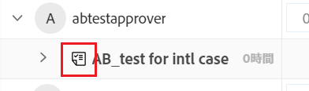
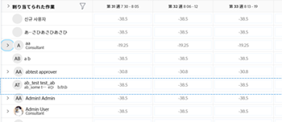

# ドラッグ＆ドロップによるワークロードバランサーでの作業の割り当て

<!--remove production and preview preferences at release-->

Adobe Workfront ワークロードバランサーを使用して作業アイテムを正しいユーザーにドラッグ＆ドロップすることで、作業アイテムを割り当てることができます。

ワークロードバランサーを使用してユーザーに作業アイテムを割り当てる方法の概要については、[ワークロードバランサーでの作業割り当ての概要](../../resource-mgmt/workload-balancer/assign-work-in-workload-balancer.md)を参照してください。

## アクセス要件

この記事の手順を実行するには、次のアクセス権が必要です。

<table style="table-layout:auto"> 
 <col> 
 <col> 
 <tbody> 
  <tr> 
   <td role="rowheader">Adobe Workfront プラン*</td> 
   <td> 
任意 
 </td> 
  </tr> 
  <tr> 
   <td role="rowheader">Adobe Workfront ライセンス*</td> 
   <td> 
プラン（リソースエリアのワークロードバランサーでワークを割り当てます）

   
ワーク（チームまたはプロジェクトのワークロードバランサーでワークを割り当てます）

 </td> 
  </tr> 
  <tr> 
   <td role="rowheader">アクセスレベル*</td> 
   <td> 
以下の項目についてアクセス権を編集します。
 
    <ul> 
     <li> 
リソース管理
 </li> 
     <li> 
プロジェクト
 </li> 
     <li> 
タスク
 </li> 
     <li> 
イシュー
 </li> 
    </ul> 
<b>メモ</b>

まだアクセス権がない場合は、Workfront 管理者に問い合わせて、アクセスレベルに追加の制限が設定されているかどうかを確認してください。Workfront 管理者がアクセスレベルを変更する方法について詳しくは、「<a href="../../administration-and-setup/add-users/configure-and-grant-access/create-modify-access-levels.md" class="MCXref xref">カスタムアクセスレベルの作成または変更</a>」を参照してください。
 </td>
</tr> 
  <tr> 
   <td role="rowheader">オブジェクト権限</td> 
   <td> 
プロジェクト、タスク、イシューに対する参加以上の権限（割り当ての作成を含む）
 
追加のアクセス権のリクエストについて詳しくは、<a href="../../workfront-basics/grant-and-request-access-to-objects/request-access.md" class="MCXref xref">オブジェクトへのアクセス権のリクエスト</a>を参照してください。
 </td> 
  </tr> 
 </tbody> 
</table>

&#42;保有するプラン、ライセンスタイプ、アクセス権を確認するには、Workfront 管理者に問い合わせてください。

## ドラッグ＆ドロップによるアイテムの割り当て

未割り当て作業エリアからアイテムをユーザーに割り当てたり、割り当てられた作業エリアで既に割り当て済みのアイテムを別のユーザーに再割り当てたりできます。

1. 作業を割り当てるワークロードバランサーに移動します。

   ワークロードバランサーを使用して、リソース領域、プロジェクト、またはチームレベルで作業をユーザーに割り当てることができます。ワークロードバランサーの Workfront 内の場所について詳しくは、[ワークロードバランサーの検索](../../resource-mgmt/workload-balancer/locate-workload-balancer.md)を参照してください。

1. （オプション）**未割り当て作業**&#x200B;エリアに移動し、フィルターを適用して、ユーザーに割り当てられていないタスクとイシューを表示します

   または

   アイテムを再割り当てする場合は、**割り当てられた作業**&#x200B;エリアに移動し、ユーザーの名前を展開して、そのユーザーに割り当てられている作業アイテムを表示します。

1. （条件付き）プロジェクトのワークロードバランサーで、**すべてのユーザーを表示**&#x200B;アイコン  をクリックして、すべての Workfront ユーザーを表示します。

   これにより、表示するアクセス権を持つすべてのユーザーが表示されます。

   プロジェクトチームにも属し、既にプロジェクトのアイテムに割り当てられているユーザーは、割り当てられた作業エリアで名前の右側にプロジェクトアイコンが表示されます。

   

   >[!TIP]
   >
   >* 「すべてのユーザーを表示」オプションは、プロジェクトのワークロードバランサーでのみ使用できます。
   >* フィルターを使用して、重要なユーザーのみを表示します。例えば、フィルターを使用して、チームまたはグループのユーザーのみを表示します。

1. 予定または見込みのタイムラインを示す作業アイテムのバーをクリックし、**割り当てられた**&#x200B;エリア内のユーザーの名前の上にドラッグします。

   作業アイテムをドロップするためにポインタを合わせたユーザーがハイライト表示されます。

   >[!TIP]
   >
   >ポインタを合わせているユーザーの予定時間数は、作業アイテムからの毎日の予定時間数でリアルタイムに更新され、新しいアイテムの追加が全体の割り当てに与える影響を示します。

   

1. 準備が整ったら、選択した作業アイテムを、割り当てられたエリアのユーザーの名前と同じ行にドロップします。アイテムが割り当てられ、ユーザーに割り当てられた予定時間数が、作業アイテムからの新しい時間で更新されます。

   ユーザーが実行できない担当業務にアイテムが割り当てられていた場合、アイテムは割り当てられた作業エリアのユーザー名の下に表示され、未割り当て作業エリアにも残り、そのアイテムに関連付けられている担当業務がユーザーによってまだ置き換えられていないことが示されます。

   >[!TIP]
   >
   >* 設定エリアで「プロジェクト別にグループ化」を有効にした場合、割り当てられたタスクは対応するプロジェクトの下に表示されます。この設定が無効な場合、割り当てられたタスクがユーザーエリアに表示されます。
   >
   >
   >     作業アイテムを並べ替えるためのワークロードバランサーの基準に従って、アイテムが表示されます。詳しくは、[ワークロードバランサーの操作](../../resource-mgmt/workload-balancer/navigate-the-workload-balancer.md)を参照してください。
   >
   >
   >* 「プロジェクトのワークロードバランサーのすべてのユーザーを表示する」を有効にし、プロジェクト上のアイテムに以前に割り当てられていないユーザーに割り当てられたアイテムを表示すると、そのユーザーはプロジェクトチームに追加されます。詳しくは、[プロジェクトチームの管理](../../manage-work/projects/planning-a-project/manage-project-team.md)を参照してください。

1. （オプション）割り当てられた作業エリアでユーザーの名前の下にある作業アイテムのバーをクリックし、ドラッグして未割り当て作業エリアにドロップすると、割り当てが解除されます。そのアイテムはユーザーから割り当てが解除されますが、担当業務にまだ割り当てられている場合があります。その場合は、未割り当て作業エリアに表示されます。アイテムが別のユーザーに割り当てられている場合、そのアイテムは、割り当てられた作業エリアで、まだ割り当てられているユーザーの名前の下に引き続き表示されます。
1. （オプション）**割り当てを表示する**&#x200B;アイコン  をクリックし、**その他メニュー** ／**割り当てを編集する**&#x200B;をクリックします。

   <!--
   (make sure these are still called this, and that the icon has not changed)
   -->
   または

   日次または週次の割り当てをダブルクリックして、ユーザーが作業アイテムに割り当てられる時間数を変更します。

   ワークロードバランサーでのユーザー割り当ての変更については、[ワークロードバランサーでのユーザー割り当ての管理](../../resource-mgmt/workload-balancer/manage-user-allocations-workload-balancer.md)の記事で「ユーザー割り当ての変更」の節を参照してください。

   ワークロードバランサーを使用して作業アイテムから割り当てを削除する方法については、[ワークロードバランサーでの作業の割り当て解除](../../resource-mgmt/workload-balancer/unassign-work-in-workload-balancer.md)を参照してください。

