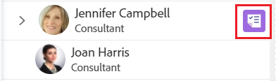
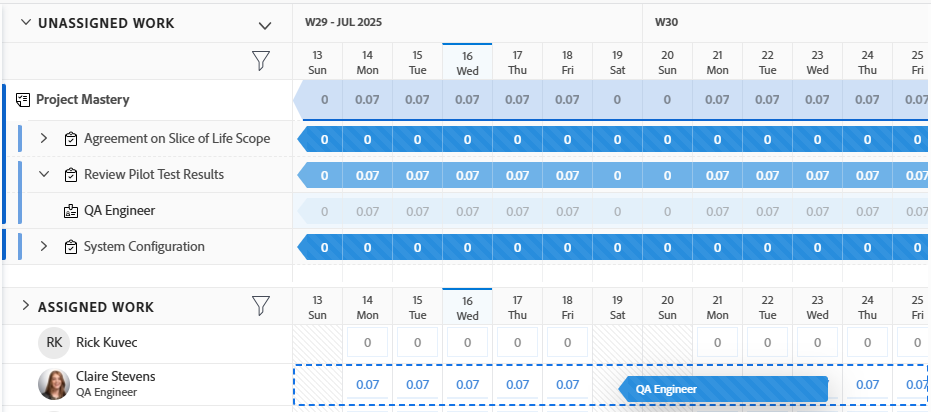

# ドラッグ＆ドロップによるワークロードバランサーでの作業の割り当て

Adobe Workfront ワークロードバランサーを使用して作業アイテムを正しいユーザーにドラッグ＆ドロップすることで、作業アイテムを割り当てることができます。

ワークロードバランサーを使用してユーザーに作業アイテムを割り当てる方法の概要については、[ワークロードバランサーでの作業割り当ての概要](../../resource-mgmt/workload-balancer/assign-work-in-workload-balancer.md)を参照してください。

## アクセス要件

+++ 展開すると、この記事の機能のアクセス要件が表示されます。

<table style="table-layout:auto"> 
 <col> 
 <col> 
 <tbody> 
  <tr> 
   <td>Adobe Workfront パッケージ</td> 
   <td>
任意
</td>
  </tr>
  <tr> 
   <td>Adobe Workfront プラン</td> 
   <td>
標準

       
計画：リソーシング領域でワークロードバランサーを使用する場合、作業：チームまたはプロジェクトのワークロードバランサーを使用する場合
</td>
  </tr>
  <tr> 
   <td>アクセスレベル設定</td> 
   <td> 
以下の項目についてアクセス権を編集します。
 
    <ul> 
     <li>リソース管理</li> 
     <li>プロジェクト</li> 
     <li>タスク</li> 
     <li>イシュー</li> 
    </ul>
   </td> 
  </tr> 
  <tr> 
   <td>オブジェクト権限</td> 
   <td>プロジェクト、タスク、イシューに対する参加以上の権限（割り当ての作成を含む）</td> 
  </tr> 
 </tbody> 
</table>

詳しくは、[Workfront ドキュメントのアクセス要件](/help/quicksilver/administration-and-setup/add-users/access-levels-and-object-permissions/access-level-requirements-in-documentation.md)を参照してください。

+++

## ドラッグ＆ドロップによるアイテムの割り当て

未割り当て作業エリアからアイテムをユーザーに割り当てたり、割り当てられた作業エリアで既に割り当て済みのアイテムを別のユーザーに再割り当てたりできます。

1. 作業を割り当てるワークロードバランサーに移動します。

   ワークロードバランサーを使用して、リソース領域、プロジェクト、またはチームレベルで作業をユーザーに割り当てることができます。 ワークロードバランサーの Workfront 内の場所について詳しくは、[ワークロードバランサーの検索](../../resource-mgmt/workload-balancer/locate-workload-balancer.md)を参照してください。

1. （オプション）「**未割り当て作業**」エリアに移動し、フィルターを適用して、ユーザーに割り当てられていないタスク、問題、役割の割り当てを表示します

   または

   アイテムを再割り当てする場合は、**割り当てられた作業**&#x200B;エリアに移動し、ユーザーの名前を展開して、そのユーザーに割り当てられている作業アイテムを表示します。

   >[!NOTE]
   >
   >「役割の割り当てを表示」設定が有効になっている場合、役割の割り当ては未割り当て作業領域の作業項目の下に表示されます。 詳しくは、[&#x200B; ワークロードバランサーの移動](/help/quicksilver/resource-mgmt/workload-balancer/navigate-the-workload-balancer.md)の「[&#x200B; ビューのカスタマイズ &#x200B;](/help/quicksilver/resource-mgmt/workload-balancer/navigate-the-workload-balancer.md#customize-the-view)」を参照してください。

1. （条件付き）プロジェクトのワークロードバランサーで、**すべてのユーザーを表示** アイコン をクリックして、すべてのWorkfront ユーザーを表示します。

   これにより、表示するアクセス権を持つすべてのユーザーが表示されます。

   プロジェクトチームにも属し、既にプロジェクトのアイテムに割り当てられているユーザーは、割り当てられた作業エリアで名前の右側にプロジェクトアイコンが表示されます。

   

   >[!TIP]
   >
   >* 「すべてのユーザーを表示」オプションは、プロジェクトのワークロードバランサーでのみ使用できます。
   >* フィルターを使用して、重要なユーザーのみを表示します。 例えば、フィルターを使用して、チームまたはグループのユーザーのみを表示します。

1. 予定または予定されたタイムラインを示す作業項目または役割の割り当てのバーをクリックし、**割り当て**&#x200B;領域のユーザーの時間にドラッグします。

   作業アイテムをドロップするためにポインタを合わせたユーザーがハイライト表示されます。

   役割の割り当てをドラッグ&amp;ドロップすると、現在の役割が役割の割り当てと一致しない場合、ユーザーはオレンジ色で強調表示されます。 役割が一致しない場合でも、作業をユーザーに割り当てることができます。

   >[!TIP]
   >
   >ポインタを合わせているユーザーの予定時間数は、作業アイテムからの毎日の予定時間数でリアルタイムに更新され、新しいアイテムの追加が全体の割り当てに与える影響を示します。

   

1. 準備ができたら、選択した作業項目または役割の割り当てを、「割り当て済み領域」のユーザー名と同じ行にドロップします。 アイテムが割り当てられ、ユーザーに割り当てられた予定時間数が、作業アイテムからの新しい時間で更新されます。

   「役割の割り当てを表示」設定が有効でなく、ユーザーが実行できない役割に作業項目が割り当てられている場合、割り当てられた作業領域にユーザー名の下に項目が表示されます。 また、未割り当て作業領域に残り、関連する担当業務がまだユーザーに置き換えられていないことを示します。

   >[!TIP]
   >
   >* 設定エリアで「プロジェクト別にグループ化」を有効にした場合、割り当てられたタスクは対応するプロジェクトの下に表示されます。 この設定が無効な場合、割り当てられたタスクがユーザーエリアに表示されます。
   >
   >
   >     作業アイテムを並べ替えるためのワークロードバランサーの基準に従って、アイテムが表示されます。 詳しくは、[ワークロードバランサーの操作](../../resource-mgmt/workload-balancer/navigate-the-workload-balancer.md)を参照してください。
   >
   >
   >* 「プロジェクトのワークロードバランサーのすべてのユーザーを表示する」を有効にし、プロジェクト上のアイテムに以前に割り当てられていないユーザーに割り当てられたアイテムを表示すると、そのユーザーはプロジェクトチームに追加されます。 詳しくは、[プロジェクトチームの管理](../../manage-work/projects/planning-a-project/manage-project-team.md)を参照してください。

1. （オプション）割り当てられた作業エリアでユーザーの名前の下にある作業アイテムのバーをクリックし、ドラッグして未割り当て作業エリアにドロップすると、割り当てが解除されます。 そのアイテムはユーザーから割り当てが解除されますが、担当業務にまだ割り当てられている場合があります。その場合は、未割り当て作業エリアに表示されます。 アイテムが別のユーザーに割り当てられている場合、そのアイテムは、割り当てられた作業エリアで、まだ割り当てられているユーザーの名前の下に引き続き表示されます。
1. （オプション）「**割り当てを表示」アイコン** 「をクリックしてから、**詳細メニュー** 「/**割り当てを編集**」をクリックします。

   <!--
   (make sure these are still called this, and that the icon has not changed)
   -->
   または

   日次または週次の割り当てをダブルクリックして、ユーザーが作業アイテムに割り当てられる時間数を変更します。

   ワークロードバランサーでのユーザー割り当ての変更については、[ワークロードバランサーでのユーザー割り当ての管理](../../resource-mgmt/workload-balancer/manage-user-allocations-workload-balancer.md)の記事で「ユーザー割り当ての変更」の節を参照してください。

   ワークロードバランサーを使用して作業アイテムから割り当てを削除する方法については、[ワークロードバランサーでの作業の割り当て解除](../../resource-mgmt/workload-balancer/unassign-work-in-workload-balancer.md)を参照してください。

