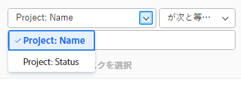
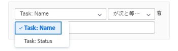
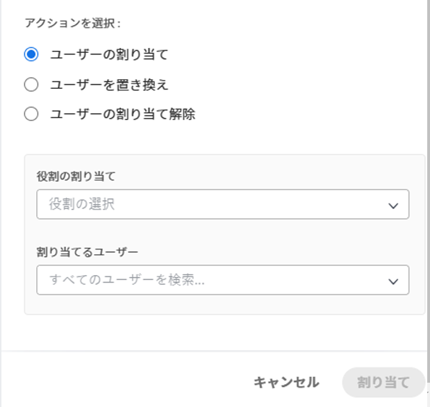
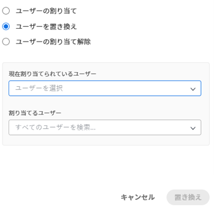
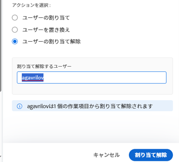

# ワークロードバランサーを使用して作業を一括で割り当てる

<!--drafted
The highlighted information on this page refers to functionality not yet generally available. It is available only in the Preview environment. 
-->

Adobe Workfront Workload Balancer を使用して、作業項目を手動でユーザーに割り当てることができます。

ワークロード・バランサを使用してユーザーに作業を割り当てる方法の一般的な情報については、 [ワークロードバランサーでの作業割り当ての概要](../../resource-mgmt/workload-balancer/assign-work-in-workload-balancer.md).

## アクセス要件

この記事の手順を実行するには、次のアクセス権が必要です。

<table style="table-layout:auto"> 
 <col> 
 <col> 
 <tbody> 
  <tr> 
   <td role="rowheader">Adobe Workfront plan*</td> 
   <td> 
任意 
 </td> 
  </tr> 
  <tr> 
   <td role="rowheader">Adobe Workfront license*</td> 
   <td> 
リソース領域でワークロードバランサーを使用する場合の計画

   
チームまたはプロジェクトのワークロードバランサーを使用する場合の作業

</td> 
  </tr> 
  <tr> 
   <td role="rowheader">アクセスレベル*</td> 
   <td> 
次へのアクセスを編集します。
 
    <ul> 
     <li> 
リソース管理
 </li> 
     <li> 
プロジェクト
 </li> 
     <li> 
タスク
 </li> 
     <li> 
イシュー
 </li> 
    </ul> 
<b>メモ</b>

まだアクセス権がない場合は、Workfront管理者に、アクセスレベルに追加の制限を設定しているかどうかを問い合わせてください。 Workfront管理者がアクセスレベルを変更する方法について詳しくは、 <a href="../../administration-and-setup/add-users/configure-and-grant-access/create-modify-access-levels.md" class="MCXref xref">カスタムアクセスレベルの作成または変更</a>.
 </td>
</tr> 
  <tr> 
   <td role="rowheader">オブジェクトの権限</td> 
   <td> 
割り当ての作成を含むプロジェクト、タスク、および問題に権限以上を貢献する
 
追加のアクセス権のリクエストについて詳しくは、 <a href="../../workfront-basics/grant-and-request-access-to-objects/request-access.md" class="MCXref xref">オブジェクトへのアクセスのリクエスト </a>.
 </td> 
  </tr> 
 </tbody> 
</table>

&#42;保有するプラン、ライセンスの種類、アクセス権を確認するには、Workfront管理者に問い合わせてください。

## ワークロードバランサーで一括割り当てを行う際の考慮事項

* 1 つ以上のプロジェクトで、複数のタスクやタスクに対するユーザー割り当てをすばやく管理できます。 割り当ての変更は、ワークロードバランサーに即座に表示されます。
* 完了した作業項目や、完了したプロジェクト上の項目にリソースを割り当てることはできません。
* ユーザーを一括で割り当てる際には、次の操作を実行できます。

   * 現在ジョブの役割に割り当てられているすべての作業項目にユーザーを割り当てます。
   * ユーザー間のユーザー割り当てを置き換えます。
   * すべての作業項目からユーザーの割り当てを解除します。

**例**

* 複数の新規プロジェクトでユーザー割り当てを行う必要があります。 プロジェクトは元々テンプレートから作成され、ジョブの役割は既にプロジェクト内の様々なタスクに割り当てられています。 特定のユーザー Jackie Simms を、現在ジョブの役割に割り当てられているすべてのタスクに割り当てます。 「割り当て」機能を使用して、これらのタスクを Jackie Simms に割り当てることができます。
* 3 つの異なるプロジェクトの 45 タスクが Jackie Simms に割り当てられます。 Jackie は組織を退社し、次に、別のユーザーにタスクを再割り当てする必要があります。 「置換」機能を使用して、これらのタスクを新しい担当者に割り当てることができます。
* 2 つの異なるプロジェクトをまたいで 10 個のタスクが別のユーザー Rick Kuvec に割り当てられます。 Rick が誤ってこれらのタスクに割り当てられたことに気づいたのですが、現時点で誰に割り当てる必要があるかは不明です。 Rick のすべてのタスクへの割り当てを同時に解除する必要があります。 [ 割り当て解除 ] 機能を使用して、これらのタスクから Rick を削除できます。

## ワークロードバランサーで作業を一括で割り当てる

1. 作業を割り当てるワークロードバランサーに移動します。

   リソースエリア、プロジェクト、またはチームレベルのワークロードバランサーを使用して、作業をユーザーに割り当てることができます。 ワークロードバランサーのWorkfront内の場所について詳しくは、 [ワークロード・バランサの検索](../../resource-mgmt/workload-balancer/locate-workload-balancer.md).

1. クリック **一括割り当て**  ワークロードバランサーの最上部に表示されます。

   ワークロードバランサーの右側に「一括割り当て」パネルが開きます。

1. （条件付き）リソース領域からワークロードバランサーにアクセスする場合、またはチームの場合は、 **プロジェクト：名前** ドロップダウンメニューを開き、フィルタモディファイヤを使用して、割り当てを行うプロジェクトを選択します。 プロジェクトは、「名前」（デフォルトのオプション）または「ステータス」(Status) で選択できます。

Workfrontフィルター修飾子について詳しくは、 [フィルターと条件修飾子](../../reports-and-dashboards/reports/reporting-elements/filter-condition-modifiers.md).

>[!NOTE]
>
>プロジェクトのワークロード・バランサにアクセスする場合は、デフォルトで「プロジェクト名」が選択されます。

1. （オプション）「 **プロジェクトタスクを選択** 割り当てを行う 1 つ以上のタスクを選択し、 **タスク：名前** ドロップダウンメニューから、「名前」（これはデフォルトのオプション）または「ステータス」(Status) でタスクを選択し、フィルタ修飾子を使用して特定のタスクを検索します。

Workfrontフィルター修飾子について詳しくは、 [フィルターと条件修飾子](../../reports-and-dashboards/reports/reporting-elements/filter-condition-modifiers.md).

>[!NOTE]
>
>タスクは「完了」ステータスでは選択できません。

>[!TIP]
>
>タスクとタスクの一括割り当てを行う場合は、この選択を空白のままにします。

1. （オプション） **削除** アイコン  選択した条件の 1 つの横に

   または

   クリック **すべてクリア** （「一括割り当て」パネルの右上隅）をクリックして、すべての選択を削除します。

1. 次のいずれかのオプションを選択し、次の手順に進みます。

   * [ユーザーを割り当て](#assign-user)
   * [ユーザーの置換](#replace-user)
   * [ユーザーの割り当てを解除](#unassign-user)

   >[!TIP]
   >
   >選択したフィルターに一致する項目がない場合は、これらのオプションは淡色表示になります。

### ユーザーの割り当て {#assign-user}

ワークロード・バランサで一括割り当てを使用してユーザーを割り当てると、次の処理が行われます。

* ユーザーは、選択したプロジェクト内の指定したロールに現在割り当てられているすべての作業項目に割り当てられます。
* ユーザーは、次のタイプの作業項目に割り当てられていません。

   * 既にユーザーに割り当てられている項目。
   * 完了した項目。

* 選択したユーザーが指定したロールに関連付けられていない場合、ロールはユーザーの「プライマリロール」に置き換えられます。

以前にジョブ・ロールに割り当てられた作業項目にユーザーを割り当てる手順は、次のとおりです。

1. 前述のように、ワークロードバランサーで一括割り当てを使用して作業項目の割り当てを開始し、「 」を選択します。 **割り当て**.

1. Adobe Analytics の **役割の割り当て** 「 」フィールドで、ドロップダウン矢印をクリックして役割のリストから選択します。 指定したプロジェクト内で現在割り当てられているロールのみが表示されます。 必須フィールドです。

   

1. Adobe Analytics の **割り当てるユーザー** 「 」フィールドで、ドロップダウン矢印をクリックして、推奨ユーザーのリストから選択するか、別のユーザー名を入力します。

   次の領域からユーザーを選択します。

   * **推奨割り当て**：選択した役割を満たすことができ、スマート割り当ての条件に一致するユーザー。 詳しくは、 [スマート割り当ての概要](../../manage-work/tasks/assign-tasks/smart-assignments.md).
   * **その他の割り当て**：選択した役割を果たすことができる、システム内のすべてのユーザー。

     >[!TIP]
     >
     >「その他の割り当て」領域には、最初の 50 人のユーザーのみが表示されます。

   ユーザーを選択すると、Workfrontに、指定したユーザーが割り当てられる項目の数と、そのユーザーが置き換えるジョブの役割に関するメモが表示されます。

   >[!TIP]
   >
   >ユーザーのすべての役割が、ユーザー名の下のリストに表示されます。

1. クリック **割り当て**.

   指定したロールは、選択したユーザーに置き換えられます。

   選択したロールが選択したユーザーに置き換えられた作業項目の数に関する確認が表示されます。

   

### ユーザーを置き換え {#replace-user}

作業項目に既に割り当てられているユーザを、選択したプロジェクト内の別のユーザに置き換えることができます。

ワークロード・バランサで一括割り当てを使用してユーザーを別のユーザーに置き換えると、次の処理が行われます。

* 置き換えユーザーは、選択したプロジェクト内の元のユーザーに現在割り当てられているすべての作業項目に割り当てられます。

* 新しいユーザーは、既に完了とマークされている作業項目に割り当てられていません。
* 1 人目のユーザーに関連付けられた役割が 2 人目のユーザーの役割のいずれとも一致しない場合、2 人目のユーザーはプライマリの役割に割り当てられます。

ユーザーを別のユーザーに置き換えるには、次の手順を実行します。

1. 前述のように、ワークロードバランサーで作業項目の割り当てを開始し、「 」を選択します。 **置換**.
1. Adobe Analytics の **現在割り当てられているユーザー** 「 」フィールドで、ドロップダウン矢印をクリックして、ユーザーのリストから選択します。 指定したプロジェクト内の不完全な作業項目に現在割り当てられているユーザーのみが表示されます。 必須フィールドです。

   

1. Adobe Analytics の **割り当てるユーザー** 「 」フィールドで、ドロップダウン矢印をクリックして、推奨ユーザーのリストから選択するか、別のユーザー名を入力します。 既定でリストに表示されるユーザーは、スマート割り当ての基準に一致します。 詳しくは、 [スマート割り当ての概要](../../manage-work/tasks/assign-tasks/smart-assignments.md).

   Workfrontには、現在割り当てられているユーザーが 2 番目のユーザーを置き換える項目の数と、置き換える役割に関するメモが表示されます。

   

1. クリック **置換**.

   選択した最初のユーザーは、選択したプロジェクトのすべての作業項目の 2 番目のユーザーに置き換えられます。

   元のユーザー割り当てが選択した 2 番目のユーザーに置き換えられた作業項目の数に関する確認が表示されます。

### ユーザーの割り当てを解除 {#unassign-user}

選択したプロジェクトでユーザーが割り当てられているすべての作業項目から、ユーザーの割り当てを解除できます。

ワークロード・バランサで一括割り当てを使用して、すべての割り当てからユーザーの割り当てを解除すると、次の処理が行われます。

* 指定したユーザーが、割り当てられているすべての作業項目から削除されます。
* 未割り当てユーザーがジョブロールに関連付けられている場合、ジョブロールは、ユーザーが削除されても作業項目に割り当てられたままになります。

* 指定したユーザーが完了した作業項目に割り当てられた場合、ユーザーはそれらの作業項目に割り当てられたままになります。

ユーザーとジョブの役割の割り当ての詳細については、 [ワークロードバランサーでの作業割り当ての概要](../../resource-mgmt/workload-balancer/assign-work-in-workload-balancer.md).

選択したプロジェクトの作業項目、または選択したタスクやタスクが割り当てられている問題に対して、ユーザーの割り当てを解除するには、次の手順に従います。

1. 前述のように、ワークロードバランサーで作業項目の割り当てを開始し、「 」を選択します。 **割り当て解除**.

1. Adobe Analytics の **割り当てを解除するユーザー** 「 」フィールドで、ドロップダウン矢印をクリックして、ユーザーのリストから選択します。 指定したプロジェクト内の不完全な作業項目に現在割り当てられているユーザーのみが表示されます。 必須フィールドです。

   

   Workfrontは、現在割り当てられているユーザーが割り当てられていない項目の数に関するメモを表示します。

   

1. クリック **割り当て解除**.\
   指定したユーザーが削除された作業項目の数に関する確認が表示されます。

 
