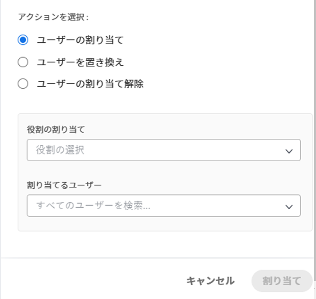

# ワークロードバランサーを使用して一括で作業を割り当てる

<!--Audited: 07/2024-->

Adobe Workfront Workload Balancerを使用して、複数のタスクやイシューにリソースを一括で割り当てることができます。

ワークロードバランサーを使用してユーザーに作業アイテムを割り当てる方法の概要については、[ワークロードバランサーでの作業割り当ての概要](../../resource-mgmt/workload-balancer/assign-work-in-workload-balancer.md)を参照してください。

## アクセス要件

+++ 展開すると、この記事の機能のアクセス要件が表示されます。

<table style="table-layout:auto"> 
 <col> 
 <col> 
 <tbody> 
  <tr> 
   <td>Adobe Workfront パッケージ</td> 
   <td>
任意
</td>
  </tr>
  <tr> 
   <td>Adobe Workfront プラン</td> 
   <td>
標準

       
計画：リソーシング領域でワークロードバランサーを使用する場合、作業：チームまたはプロジェクトのワークロードバランサーを使用する場合
</td>
  </tr>
  <tr> 
   <td>アクセスレベル設定</td> 
   <td> 
以下の項目についてアクセス権を編集します。
 
    <ul> 
     <li>リソース管理</li> 
     <li>プロジェクト</li> 
     <li>タスク</li> 
     <li>イシュー</li> 
    </ul>
   </td> 
  </tr> 
  <tr> 
   <td>オブジェクト権限</td> 
   <td>プロジェクト、タスク、イシューに対する参加以上の権限（割り当ての作成を含む）</td> 
  </tr> 
 </tbody> 
</table>

詳しくは、[Workfront ドキュメントのアクセス要件](/help/quicksilver/administration-and-setup/add-users/access-levels-and-object-permissions/access-level-requirements-in-documentation.md)を参照してください。

+++

## ワークロードバランサーで一括割り当てを行う際の考慮事項

* 1つ以上のプロジェクトをまたいで、複数のタスクやイシューに対するリソースの割り当てをすばやく管理できます。 割り当ての変更は、すぐにワークロードバランサーに表示されます。
* 完了済みの作業アイテムや、完了済みのプロジェクト上のアイテムにリソースを割り当てることはできません。
* ジョブロールとユーザーを一括で割り当てる場合は、次の操作を実行できます。

   * すべての有効な組み合わせで、ユーザーとロール間の割り当てを置き換えます。
   * すべての作業アイテムからユーザーの割り当てを解除する。

**例**

* 複数の新規プロジェクトでユーザーを割り当てる必要があります。 プロジェクトは元々テンプレートから作成され、担当業務は既にプロジェクト内の様々なタスクに割り当てられています。 現在担当業務に割り当てられているすべてのタスクに、特定のユーザー Jackie Simms を割り当てようとしています。 置換関数を使用して、これらのタスクをJackie Simmsに割り当てることができます。
* 3 つの異なるプロジェクトの 45 のタスクが Jackie Simms に割り当てられています。 Jackie は退職したため、別のユーザーにタスクを割り当て直す必要があります。 置換機能を使用すると、これらのタスクを新しい担当者に割り当てることができます。
* 2 つの異なるプロジェクトの 10 個のタスクが、別のユーザー Rick Kuvec に割り当てられます。 Rickが誤ってこれらのタスクに割り当てられていることに気づきますが、現時点では誰に割り当てる必要があるのかわかりません。 Rick のすべてのタスクへの割り当てを同時に解除する必要があります。 割り当て解除機能を使用すると、これらのタスクから Rick を削除できます。

## ワークロードバランサーで一括で作業を割り当てる

1. 作業を割り当てるワークロードバランサーに移動します。

   ワークロードバランサーを使用して、リソース領域、プロジェクト、またはチームレベルで作業をユーザーに割り当てることができます。 ワークロードバランサーの Workfront 内の場所について詳しくは、[ワークロードバランサーの検索](../../resource-mgmt/workload-balancer/locate-workload-balancer.md)を参照してください。

1. ワークロードバランサーの上部にある「**一括割り当て** 」をクリックします。

   ワークロードバランサーの右側に一括割り当てパネルが開きます。

1. （条件付き）リソースエリアからワークロードバランサーにアクセスする場合や、チームのワークロードバランサーにアクセスする場合は、**プロジェクト: 名前**&#x200B;ドロップダウンメニューを展開し、フィルター修飾子を使用して、割り当ての対象となる任意の数のプロジェクトを選択します。 プロジェクトは、名前（これがデフォルトのオプション）またはステータスを基準に選択できます。

   Workfront フィルター修飾子については、[フィルターおよび条件修飾子](../../reports-and-dashboards/reports/reporting-elements/filter-condition-modifiers.md)を参照してください。

   >[!NOTE]
   >
   >プロジェクトのワークロードバランサーにアクセスする場合は、プロジェクト名がデフォルトで選択されています。

   

1. （オプション）「**プロジェクトタスクを選択**」をクリックして、割り当ての対象となる任意の数のタスクを選択したあと、**タスク: 名前**&#x200B;ドロップダウンメニューで名前（これがデフォルトのオプション）またはステータスを基準にタスクを選択し、フィルター修飾子を使用して特定のタスクを検索します。

   Workfront フィルター修飾子については、[フィルターおよび条件修飾子](../../reports-and-dashboards/reports/reporting-elements/filter-condition-modifiers.md)を参照してください。

   >[!NOTE]
   >
   >完了ステータスのタスクは選択できません。

   

   >[!TIP]
   >
   >イシューやタスクの一括割り当てを行う場合は、この選択を空白のままにします。

1. （オプション）選択した条件の1つの横にある&#x200B;**削除** アイコン をクリックします

   または

   一括割り当てパネルの右上隅にある「**すべてクリア**」をクリックすると、選択した項目がすべて削除されます。

1. 次のいずれかのオプションを選択し、下記の手順に進みます。

   * [&#x200B; リソースを置換](#replace-user)
   * [リソースを割り当て解除](#unassign-user)

   >[!TIP]
   >
   >選択したフィルターに一致する項目がない場合は、これらのオプションはグレー表示になります。

<!--

### Assign user {#assign-user}

When you assign a user using Bulk Assignments in the Workload Balancer, the following things occur:

* A user is assigned to all work items currently assigned to a specified role within the selected projects.
* The user is not assigned to the following types of work items:

   * Items that are already assigned to a user.
   * Completed items.

* If the user you selected is not associated with the specified role, the role is replaced by the user in the user's Primary Role.

To assign a user to work items previously assigned to job roles:

1. Start assigning work items using Bulk Assignments in the Workload Balancer as described above and select **Assign**. 

1. In the **Role assignment** field, click the drop-down arrow to choose from a list of roles. Only roles currently assigned within the specified projects are displayed. This is a required field. 

   

1. In the **User to assign** field, click the drop-down arrow to choose from a list of suggested users or to type another user's name.

   Select users from the following areas:

   * **Suggested Assignments**: Users who can fulfill the selected role and who match the criteria for Smart Assignments. For more information, see [Smart assignments overview](../../manage-work/tasks/assign-tasks/smart-assignments.md).
   * **Other Assignments**: All users in the system who can fulfill the selected role. 
   
      >[!TIP]
      >
      >Only the first 50 users are listed in the Other Assignments area.

   After selecting a user, Workfront displays a note about the number of items where the user you specified will be assigned and what job role they will replace.

   >[!TIP]
   >
   >All the roles of the user display in the list, under the user's name.

1. Click **Assign**.

   The specified roles are replaced with the users that you selected.

   You receive a confirmation about how many work items have had the selected role replaced with the selected user.

   

-->

### リソースを置換 {#replace-user}

作業項目に既に割り当てられているリソースを、選択したプロジェクト内の別のリソースに置き換えることができます。

リソースの置き換えには、次の操作を行うことができます。

* 役割を持つ役割
* ユーザーを持つユーザー
* 役割を持つユーザー
* ユーザーの役割

ワークロードバランサーで一括割り当てを使用してリソースを別のリソースに置き換えると、次のことが発生します。

* 置換リソースは、選択したプロジェクト内の元のリソースに現在割り当てられているすべての作業項目に割り当てられます。
* 新しいリソースは、既に「完了」とマークされている作業項目には割り当てられていません。
* ユーザーからユーザーへの置換の場合、最初のユーザーに関連付けられたロールが2番目のユーザーのロールのいずれかと一致しない場合、2番目のユーザーはプライマリロールに割り当てられます。

リソースを別のリソースに置き換えるには：

1. 前述のように、ワークロードバランサーの一括割り当て領域で作業項目を選択し、**リソースの置換**&#x200B;を選択します。
1. 「**現在割り当て済みリソース**」フィールドで、ドロップダウン矢印をクリックして、リソースのリストから選択します。 指定したプロジェクト内の未完了の作業項目に現在割り当てられているリソースのみが表示されます。 必須フィールドです。

   

1. 「**割り当てるリソース**」フィールドで、ドロップダウン矢印をクリックして、提案されたリソースのリストから選択するか、別の担当業務またはユーザー名を入力します。 最初にデフォルトでリストされたリソースは、スマート割り当ての基準と一致します。 詳しくは、[スマート割り当ての概要](../../manage-work/tasks/assign-tasks/smart-assignments.md)を参照してください。

   Workfrontには、現在割り当てられているリソースが2番目のリソースを置き換えるアイテムの数に関するメモが表示されます。

1. 「**置換**」をクリックします。

   最初のリソースは、選択したプロジェクトまたはタスクのすべての作業項目の2番目のリソースに置き換えられます。

   元の割り当てが選択した2番目のリソースに置き換えられた作業項目の数に関する確認が表示されます。

### リソースを割り当て解除 {#unassign-user}

選択したプロジェクトで割り当てられているすべての作業項目から、リソースの割り当てを解除できます。

ワークロードバランサーの一括割り当てを使用して、ユーザーをすべての割り当てから割り当て解除すると、次の処理が行われます。

* 指定したユーザーは、割り当てられているすべての作業項目から削除されます。
* 割り当て解除されたユーザーが担当業務に関連付けられている場合、その担当業務は、ユーザーが削除されても作業アイテムに割り当てられたままになります。

* 指定したユーザーが完了した作業アイテムに割り当てられている場合、そのユーザーはそれらの作業アイテムに割り当てられたままになります。

ユーザーと担当業務の割り当てについて詳しくは、[ワークロードバランサーでの作業割り当ての概要](../../resource-mgmt/workload-balancer/assign-work-in-workload-balancer.md)を参照してください。

選択したプロジェクトの作業アイテム、または選択したタスクやタスクが割り当てられているイシューに対して、ユーザーの割り当てを解除するには：

1. 前述のように、ワークロードバランサーの一括割り当て領域で作業項目を選択し、**リソースの割り当て解除**&#x200B;を選択します。

1. 「**割り当て解除するユーザー**」フィールドで、ドロップダウン矢印をクリックして、ユーザーのリストから選択します。 指定したプロジェクト内で未完了の作業アイテムに現在割り当てられているユーザーのみが表示されます。 必須フィールドです。

   

   Workfront に、現在割り当てられているユーザーが割り当て解除される項目の数に関するメモが表示されます。

1. 「**割り当て解除**」をクリックします。\
   指定したユーザーが削除された作業アイテムの数に関する確認が表示されます。

