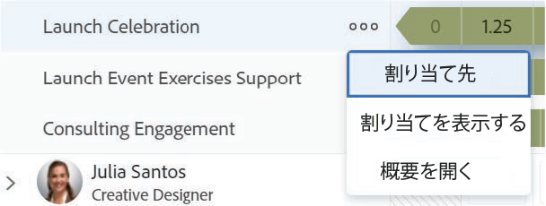
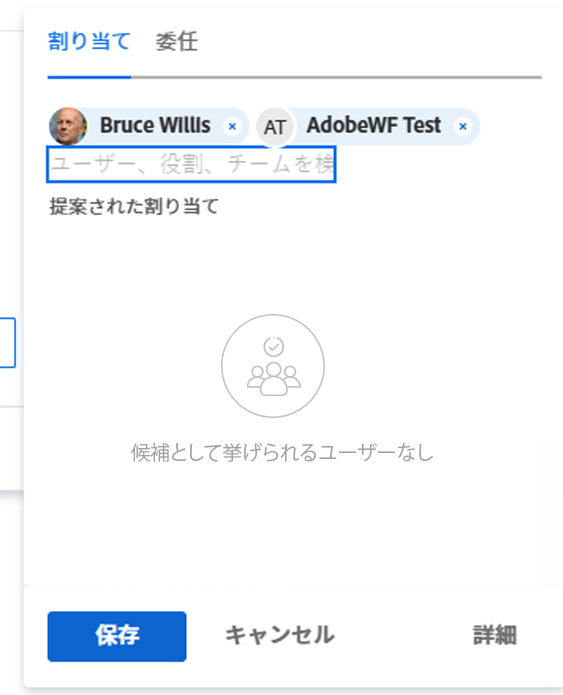

# ワークロードバランサーを使用して作業を手動で割り当てる

Adobe Workfront Workload Balancer を使用して、作業項目を手動でユーザーに割り当てることができます。

ワークロード・バランサを使用してユーザーに作業を割り当てる方法の一般的な情報については、 [ワークロードバランサーでの作業割り当ての概要](../../resource-mgmt/workload-balancer/assign-work-in-workload-balancer.md).

## アクセス要件

この記事の手順を実行するには、次のアクセス権が必要です。

<table style="table-layout:auto"> 
 <col> 
 <col> 
 <tbody> 
  <tr> 
   <td role="rowheader">Adobe Workfront plan*</td> 
   <td> 
任意 
 </td> 
  </tr> 
  <tr> 
   <td role="rowheader">Adobe Workfront license*</td> 
   <td> 
リソース領域でワークロードバランサーを使用する場合の計画

   
チームまたはプロジェクトのワークロードバランサーを使用する場合の作業

 </td> 
  </tr> 
  <tr> 
   <td role="rowheader">アクセスレベル*</td> 
   <td> 
次へのアクセスを編集します。
 
    <ul> 
     <li> 
リソース管理
 </li> 
     <li> 
プロジェクト
 </li> 
     <li> 
タスク
 </li> 
     <li> 
イシュー
 </li> 
    </ul> 
<b>メモ</b>

まだアクセス権がない場合は、Workfront管理者に、アクセスレベルに追加の制限を設定しているかどうかを問い合わせてください。 Workfront管理者がアクセスレベルを変更する方法について詳しくは、 <a href="../../administration-and-setup/add-users/configure-and-grant-access/create-modify-access-levels.md" class="MCXref xref">カスタムアクセスレベルの作成または変更</a>.
 </td>
</tr> 
  <tr> 
   <td role="rowheader">オブジェクトの権限</td> 
   <td> 
割り当ての作成を含むプロジェクト、タスク、および問題に権限以上を貢献する
 
追加のアクセス権のリクエストについて詳しくは、 <a href="../../workfront-basics/grant-and-request-access-to-objects/request-access.md" class="MCXref xref">オブジェクトへのアクセスのリクエスト </a>.
 </td> 
  </tr> 
 </tbody> 
</table>

&#42;保有するプラン、ライセンスの種類、アクセス権を確認するには、Workfront管理者に問い合わせてください。

## ワークロードバランサーでの作業の手動割り当て

まだユーザーに割り当てられていない作業項目を割り当てたり、ワークロードバランサーでユーザーに割り当てられている項目を再割り当てしたりできます。

1. 作業を割り当てるワークロードバランサーに移動します。

   リソースエリア、プロジェクト、またはチームレベルのワークロードバランサーを使用して、作業をユーザーに割り当てることができます。 ワークロードバランサーのWorkfront内の場所について詳しくは、 [ワークロード・バランサの検索](../../resource-mgmt/workload-balancer/locate-workload-balancer.md).

1. （オプション） **未割り当ての作業** 領域を開き、フィルターを適用してタスクまたは問題を表示します

   または

   次に移動： **割り当てられた作業** 項目を再割り当てする場合は、領域を開き、ユーザーの名前を展開して、割り当てられた作業項目を表示します。

1. 次をクリック： **その他のメニュー**  作業項目名の左側に移動し、 **これをに割り当てる**.

   

   >[!TIP]
   >
   >次のショートカットを使用して、タスクやタスクを割り当てることもできます。
   >
   >* Windows の場合：Ctrl キーを押しながらタスクバーまたはイシューバーをクリックします。
   >* Mac:Cmd キーを押しながらタスクバーまたはイシューバーをクリックします。

1. 次のいずれかの操作を行います。

   * 項目に割り当てるユーザー、ジョブの役割、またはチームの名前の入力を開始します **担当者、役割またはチームを検索** フィールドに値を入力する場合は、リストに表示される項目を選択し、「 **保存**.

   >[!TIP]
   >
   >ユーザーを追加する際には、アバター、ユーザーのプライマリの役割、電子メールアドレスに注目して、同じ名前のユーザーを区別します。
   >
   >ユーザーを追加したときに表示するには、少なくとも 1 つのジョブの役割に関連付ける必要があります。
   >
   > ユーザーがユーザーの電子メールを表示するには、アクセスレベルで [ 連絡先情報の表示 ] 設定を有効にしておく必要があります。 詳しくは、 [ユーザーへのアクセス権の付与](../../administration-and-setup/add-users/configure-and-grant-access/grant-access-other-users.md).

   

   >[!TIP]
   >
   > お使いの環境でWorkfrontまたはグループ管理者が委任を有効にしている場合は、「割り当て」タブを使用して、ユーザーをタスクまたはイシューに割り当てます。 作業項目に委任されたユーザーを表示するには、「委任」タブを使用します。 作業の委任について詳しくは、 [タスクと問題の委任を管理](../../manage-work/delegate-work/how-to-delegate-work.md).

   これにより、指定された担当者に作業項目が割り当てられるか、再割り当てされます。

   項目をチームまたはジョブロールにのみ割り当てた場合、その項目は「未割り当て作業」領域にのみ表示されます。 作業項目をワークロードバランサーの「割り当て済み作業」領域に表示するには、作業項目をユーザーに割り当てる必要があります。

   >[!TIP]
   >
   >複数のユーザー、ジョブの役割またはチームを割り当てることができます。 アクティブなユーザー、ジョブの役割およびチームのみを割り当てることができます。
   >
   >
   >非アクティブ化前にユーザー、ジョブの役割、またはチームが割り当てられた場合、そのユーザーは作業項目に割り当てられたままになります。 この場合、次の操作をお勧めします。
   >
   >   
   >   
   >   * 作業項目をアクティブなリソースに再割り当てする。
   >   * 非アクティブなチームのユーザーをアクティブなチームに関連付け、作業項目をアクティブなチームに再割り当てします。
   >   
   >

   * クリック **詳細** 」をクリックして、「高度な割り当て」にアクセスします。

     高度な割り当ての作成の詳細については、 [高度な割り当てを作成](../../manage-work/tasks/assign-tasks/create-advanced-assignments.md).

1. （オプション） **割り当てアイコンを表示** 」、「 **その他のメニュー**  > **割り当てを編集**.

   または

   日次または週次の配分をダブルクリックして、ユーザーが作業項目に割り当てられる時間を変更します。

   ワークロードバランサーでのユーザー割り当ての変更の詳細は、この記事の「ユーザー割り当ての変更」の節を参照してください [ワークロードバランサーでのユーザー割り当ての管理](../../resource-mgmt/workload-balancer/manage-user-allocations-workload-balancer.md).

   ワークロード・バランサを使用して作業項目から割り当てを削除する方法については、 [ワークロードバランサーでの作業の割り当て解除](../../resource-mgmt/workload-balancer/unassign-work-in-workload-balancer.md).

    
