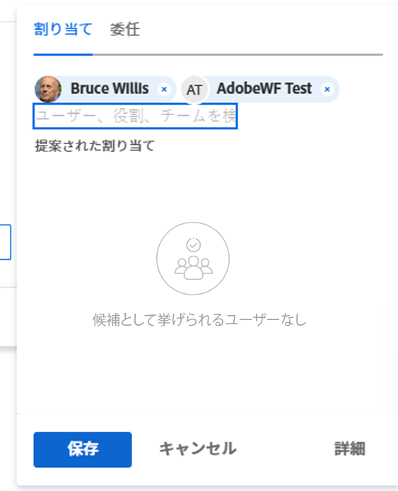

# ワークロードバランサーを使用して作業を手動で割り当てる

Adobe Workfront ワークロードバランサーを使用すると、作業アイテムを手動でユーザーに割り当てることができます。

ワークロードバランサーを使用してユーザーに作業アイテムを割り当てる方法の概要については、[ワークロードバランサーでの作業割り当ての概要](../../resource-mgmt/workload-balancer/assign-work-in-workload-balancer.md)を参照してください。

## アクセス要件

+++ 展開すると、この記事の機能のアクセス要件が表示されます。

<table style="table-layout:auto"> 
 <col> 
 <col> 
 <tbody> 
  <tr> 
   <td>Adobe Workfront パッケージ</td> 
   <td>
任意
</td>
  </tr>
  <tr> 
   <td>Adobe Workfront プラン</td> 
   <td>
標準

       
計画：リソーシング領域でワークロードバランサーを使用する場合、作業：チームまたはプロジェクトのワークロードバランサーを使用する場合
</td>
  </tr>
  <tr> 
   <td>アクセスレベル設定</td> 
   <td> 
以下の項目についてアクセス権を編集します。
 
    <ul> 
     <li>リソース管理</li> 
     <li>プロジェクト</li> 
     <li>タスク</li> 
     <li>イシュー</li> 
    </ul>
   </td> 
  </tr> 
  <tr> 
   <td>オブジェクト権限</td> 
   <td>プロジェクト、タスク、イシューに対する参加以上の権限（割り当ての作成を含む）</td> 
  </tr> 
 </tbody> 
</table>

詳しくは、[Workfront ドキュメントのアクセス要件](/help/quicksilver/administration-and-setup/add-users/access-levels-and-object-permissions/access-level-requirements-in-documentation.md)を参照してください。

+++

## ワークロードバランサーで手動による作業の割り当て

まだユーザーに割り当てられていない作業アイテムを割り当てたり、ワークロードバランサーでユーザーに割り当てられているアイテムを再割り当てしたりできます。

1. 作業を割り当てるワークロードバランサーに移動します。

   ワークロードバランサーを使用して、リソース領域、プロジェクト、またはチームレベルで作業をユーザーに割り当てることができます。 ワークロードバランサーの Workfront 内の場所について詳しくは、[ワークロードバランサーの検索](../../resource-mgmt/workload-balancer/locate-workload-balancer.md)を参照してください。

1. （オプション）「**未割り当て作業**」エリアに移動し、フィルターを適用してタスク、問題、または役割の割り当てを表示します。

   または

   アイテムを再割り当てする場合は、**割り当てられた作業**&#x200B;エリアに移動し、ユーザーの名前を展開して、そのユーザーに割り当てられている作業アイテムを表示します。

   >[!NOTE]
   >
   >「役割の割り当てを表示」設定が有効になっている場合、役割の割り当ては未割り当て作業領域の作業項目の下に表示されます。 詳しくは、[ ワークロードバランサーの移動](/help/quicksilver/resource-mgmt/workload-balancer/navigate-the-workload-balancer.md)の「[ ビューのカスタマイズ ](/help/quicksilver/resource-mgmt/workload-balancer/navigate-the-workload-balancer.md#customize-the-view)」を参照してください。

1. 作業項目名または役割の割り当ての左側にある&#x200B;**詳細メニュー** をクリックし、「**これを**&#x200B;に割り当て」をクリックします。

   に割り当てる

   >[!TIP]
   >
   >次のショートカットを使用して、タスクやイシューを割り当てることもできます。
   >
   >* Windows の場合：Ctrl キーを押しながらタスクまたはイシューバーをクリックします。
   >* Mac の場合：Cmd キーを押しながらタスクまたはイシューバーをクリックします。

1. 次のいずれかの操作を行います。

   * 「**ユーザー、チーム、グループまたは会社を検索**」フィールドに項目に割り当てたいユーザー名、役職名、チーム名を入力し、リストに表示されたら選択し、「**保存**」をクリックします。

   >[!TIP]
   >
   >ユーザーを追加する際には、アバター、ユーザーのプライマリの役割、メールアドレスに注目して、同じ名前のユーザーを区別します。
   >
   >ユーザーを追加したときに表示するには、少なくとも 1 つの担当業務に関連付ける必要があります。
   >
   > ユーザーがユーザーのメールを表示するには、アクセスレベルで、連絡情報の表示の設定を有効にしておく必要があります。 詳しくは、[ユーザーへのアクセス権の付与](../../administration-and-setup/add-users/configure-and-grant-access/grant-access-other-users.md)を参照してください。

   

   >[!TIP]
   >
   > お使いの環境で Workfront 管理者またはグループ管理者が委任を有効にしている場合は、「割り当て」タブを使用して、ユーザーをタスクまたはイシューに割り当てます。 作業アイテムにデリゲートされたユーザーを表示するには、「デリゲーション」タブを使用します。 作業の委任について詳しくは、[ タスクと問題の委任](../../manage-work/delegate-work/how-to-delegate-work.md)を参照してください。

   これにより、指定された担当者に作業アイテムが割り当てられるか、再割り当てされます。

   項目をチームまたは担当業務にのみ割り当てた場合、その項目は未割り当て作業エリアにのみ表示されます。 作業アイテムをワークロードバランサーの割り当て済み作業エリアに表示するには、作業アイテムをユーザーに割り当てる必要があります。

   >[!TIP]
   >
   >複数のユーザー、担当業務やチームを割り当てることができます。 アクティブなユーザー、担当業務およびチームのみを割り当てることができます。
   >
   >
   >非アクティブ化前にユーザー、担当業務やチームが、非アクティブ化される前に割り当てられた場合、ユーザー、担当業務やチームは作業アイテムに割り当てられたままになります。 この場合、以下の操作をお勧めします。
   >
   >   
   >   
   >   * 作業アイテムをアクティブなリソースに再割り当てする。
   >   * 非アクティブ化されたチームのユーザーをアクティブなチームに関連付け、作業アイテムをアクティブなチームに再割り当てする。
   >   
   >

   * 「**詳細**」をクリックして、「高度な割り当て」にアクセスします。

     高度な割り当ての実行について詳しくは、[高度な割り当てを作成](../../manage-work/tasks/assign-tasks/create-advanced-assignments.md)を参照してください。

1. （オプション）「**割り当てを表示」アイコン** 「をクリックしてから、**詳細メニュー** 「/**割り当てを編集**」をクリックします。

   または

   日次または週次の割り当てをダブルクリックして、ユーザーが作業アイテムに割り当てられる時間数を変更します。

   ワークロードバランサーでのユーザー割り当ての変更については、[ワークロードバランサーでのユーザー割り当ての管理](../../resource-mgmt/workload-balancer/manage-user-allocations-workload-balancer.md)の記事で「ユーザー割り当ての変更」の節を参照してください。

   ワークロードバランサーを使用して作業アイテムから割り当てを削除する方法については、[ワークロードバランサーでの作業の割り当て解除](../../resource-mgmt/workload-balancer/unassign-work-in-workload-balancer.md)を参照してください。

    
