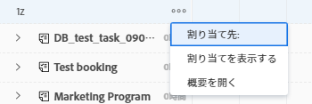
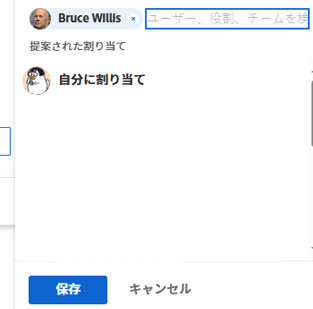

# ワークロードバランサーでの作業割り当ての概要

リソースマネージャーは、Adobe Workfront ワークロードバランサーを使用して、まだユーザーに割り当てられていない作業アイテムを表示したり、それらのアイテムをユーザーに割り当てることができます。

ワークロード・バランサの一般情報については、 [ワークロードバランサーの概要](../../resource-mgmt/workload-balancer/overview-workload-balancer.md).

Workfront のその他のエリアにあるユーザーに作業アイテム（タスクとイシュー）を割り当てることができます。ただし、ワークロードバランサーを使用すると、ユーザーの空き時間を簡単に把握し、割り当てられているその他のアイテムをすべて明確に確認してから、さらに作業を割り当てることができます。

Workfront のその他のエリアでの作業アイテムの割り当てについて詳しくは、次の記事を参照してください。

* [タスクの割り当て](../../manage-work/tasks/assign-tasks/assign-tasks.md)
* [イシューの割り当て](../../manage-work/issues/manage-issues/assign-issues.md)

## ワークロードバランサーでのユーザーの空き時間

ワークロードバランサーで、ユーザーの空き時間に合わせて作業を割り当てることができます。適切な量の作業を割り当て、ユーザーに割り当てを超過しないようにするには、ユーザーに割り当てられた作業アイテムの計画時間の合計が、ユーザーの日次または週次の割り当てと一致する必要があります。

Workfront がユーザーの空き時間を計算する方法を理解する必要があります。

Workfront は、次の情報を使用して、ワークロードバランサーでのユーザーのキャパシティを計算します。

* リソース管理の環境設定。Workfront の管理者が、設定のリソース管理エリアで次のいずれかを使用するように選択することで、空き時間の計算方法を決定します。

   * Workfront システムとユーザーの FTE のデフォルトのスケジュール。
   * ユーザープロファイルエリアに表示される、ユーザーのスケジュール。

     これにより、ユーザーの日別および週別の空き時間が計算されます。選択したスケジュールに対するスケジュールの例外は、ワークロードバランサーでのユーザーのキャパシティに反映されます。

  詳しくは、[リソース管理の環境設定の指定](../../administration-and-setup/set-up-workfront/configure-system-defaults/configure-resource-mgmt-preferences.md)を参照してください。

  スケジュールについて詳しくは、[スケジュールの作成](../../administration-and-setup/set-up-workfront/configure-timesheets-schedules/create-schedules.md)を参照してください。

* ユーザーの休暇。これは、ユーザーが休暇を取る予定の日を示します。

  詳しくは、 [個人の休日を設定](../../workfront-basics/manage-your-account-and-profile/configuring-your-user-profile/personal-time-overview.md).

* ユーザーの作業時間。これは、オーバーヘッドを含まずに、実際のプロジェクト関連作業を実行するためにユーザーが使用できる FTE 時間の割合を示します。「作業時間」の値を 1 に設定すると、プロジェクト関連の作業でユーザーがフルタイム相当の時間をすべて使用できることを示します。

## ワークロードバランサーでの作業の割り当て

まだユーザーに割り当てられていない作業アイテムを割り当てたり、ワークロードバランサーでユーザーに割り当てられているアイテムを再割り当てしたりできます。

ワークロードバランサーで作業を割り当てるには、次の方法を使用します。

* 各アイテムを手動で割り当て、一度に 1 つのアイテムに設定します。

  アイテムを手動で一度に 1 つずつ割り当てる際に、詳細な割り当てを行うことができます。

  詳しくは、[ワークロードバランサーを使用した作業の手動割り当て](../../resource-mgmt/workload-balancer/assign-work-in-workload-balancer-manually.md)を参照してください。

* 割り当てる必要のあるユーザーに作業アイテムをドラッグ＆ドロップして、一度に 1 つのアイテムを追加します。

  詳しくは、[ワークロードバランサーでドラッグ＆ドロップによる作業の割り当て](../../resource-mgmt/workload-balancer/assign-work-in-workload-balancer-by-drag-and-drop.md)を参照してください。

* 「一括割り当て」オプションを使用して、一度に複数のアイテムを割り当てます。アイテムを一度に複数のユーザーに割り当てるルールを定義できます。

  詳しくは、[ワークロードバランサーを使用した作業の一括割り当て](../../resource-mgmt/workload-balancer/assign-work-in-workload-balancer-in-bulk.md)を参照してください。

作業の割り当て解除について詳しくは、[ワークロードバランサーでの作業の割り当て解除](../../resource-mgmt/workload-balancer/unassign-work-in-workload-balancer.md)を参照してください。

## ワークロードバランサーの割り当てエリア

ワークロードバランサーを使用して、リソース領域、プロジェクト、またはチームレベルで作業をユーザーに割り当てることができます。Workfront 内でのワークロードバランサーの場所の詳細については、[ワークロードバランサーの検索](../../resource-mgmt/workload-balancer/locate-workload-balancer.md)を参照してください。

ワークロードバランサーには、次の 2 つのエリアがあり、作業アイテムを表示できます。

* **未割り当ての作業**：ユーザーに割り当てられていないアイテムを表示します。
* **割り当てられた作業**：ユーザーに割り当てられているアイテムを表示します。

次の表に、各エリアに表示されるアイテムを割り当てに基づいて示します。

<table style="table-layout:auto"> 
 <col> 
 <col> 
 <col> 
 <tbody> 
  <tr> 
   <td><strong>割り当てのタイプ</strong> </td> 
   <td colspan="2"><strong>割り当てが表示されるエリア</strong> </td> 
  </tr> 
  <tr> 
   <td> </td> 
   <td>未割り当て作業 </td> 
   <td>割り当てられた作業 </td> 
  </tr> 
  <tr data-mc-conditions=""> 
   <td>未割り当てのアイテム </td> 
   <td>✔ </td> 
   <td> </td> 
  </tr> 
  <tr> 
   <td>チーム</td> 
   <td>✔</td> 
   <td> </td> 
  </tr> 
  <tr data-mc-conditions=""> 
   <td>役割 </td> 
   <td>✔ </td> 
   <td> </td> 
  </tr> 
  <tr> 
   <td>役割とチーム</td> 
   <td>✔</td> 
   <td> </td> 
  </tr> 
  <tr> 
   <td>ユーザー</td> 
   <td> </td> 
   <td>✔</td> 
  </tr> 
  <tr> 
   <td>ユーザーとチーム</td> 
   <td> 
 
 </td> 
   <td>✔</td> 
  </tr> 
  <tr> 
   <td>ユーザー、役割、チーム</td> 
   <td>✔*</td> 
   <td>✔**</td> 
  </tr> 
  <tr data-mc-conditions=""> 
   <td> 
ユーザーおよび役割
 </td> 
   <td>✔*</td> 
   <td>✔**</td> 
  </tr> 
 </tbody> 
</table>

&#42;作業アイテムをユーザーと役割に割り当てると、その役割がプライマリ担当者である場合にのみ、未割り当て作業エリアに表示されます。

&#42;&#42;作業アイテムがユーザーと別のエンティティに割り当てられると、その作業アイテムは、ユーザーがプライマリ担当者の場合にのみ、割り当てられた作業エリアに表示されます。

ワークロードバランサーの未割り当てエリアと割り当てエリアについて詳しくは、[ワークロードバランサーのナビゲート](../../resource-mgmt/workload-balancer/navigate-the-workload-balancer.md)を参照してください。

## 担当業務、チーム、ユーザーに対する複数の割り当てに関する考慮事項

作業アイテムに複数のリソースを割り当てる際は、次の点を考慮してください。

* ユーザーのプロファイルには、複数の担当業務を関連付けることができます。ユーザーと担当業務の関連付けについて詳しくは、[ユーザーのプロファイルの編集](../../administration-and-setup/add-users/create-and-manage-users/edit-a-users-profile.md)を参照してください。

* 通常、タスクやイシューはまず、1 つまたは複数の担当業務またはチームに割り当てられます。プロジェクトを開始する準備が整ったら、ユーザーに割り当てる必要が生じる場合もあります。\
  1 つまたは複数の役割にタスクまたはイシューが割り当てられ、続いてユーザーも割り当てられた場合、Adobe Workfront は次のルールに従って、ユーザー（が存在する場合）に関連付ける担当業務を決定します。

   * 割り当てられた担当業務が 1 つだけで、これがユーザーの主要役割に一致する場合、タスクやイシューは主要役割を果たすユーザーのみに割り当てられます。
   * 複数の役割が割り当てられ、そのうち少なくとも 1 つがユーザーのセカンダリの役割と一致する場合、タスクまたはイシューは、その他の役割の 1 つ（複数の一致がある場合は Workfront がランダムに選択したもの）を果たすユーザー、および追加されたすべての役割に割り当てられます。
   * 1 つ以上の担当業務が割り当てられ、ユーザーの役割に一致するものがない場合、タスクまたはイシューは 1 つまたは複数の役割、およびユーザーの両方とに割り当てられます。

* タスクまたはイシューがチームに割り当てられ、ユーザーも割り当てられた場合、そのタスクまたはイシューはチームとユーザーの両方に割り当てられたままになります。

<!--

<h2 data-mc-conditions="QuicksilverOrClassic.Quicksilver"> Manually assign one item at a time</h2>

(NOTE: Moved manual assignment and drag-and-drop to their own articles) 

<ol>
<li value="1">Go to the Workload Balancer.</li>
<li value="2"> 
Go to the <strong>Unassigned Work</strong> area and apply a filter to view work items
 
Or
 
Go to the <strong>Assigned Work</strong> area and expand the name of a user to view the work items assigned to them.
 <note type="important">
You cannot view and assign issues from the Unassigned Work area. You can only reassign issues already assigned to users in the Assigned Work area. Otherwise, you can assign issues from a list or at the issue level. For information, see
<a href="../../manage-work/issues/manage-issues/assign-issues.md" class="MCXref xref">Assign issues</a>.
</note> </li>
<li value="3"> 
Click the <strong>More menu</strong>  on the bar of a work item, then click <strong>Assign this to</strong>. 
 
  
 <note type="tip">

You can also use the following shortcuts to assign tasks or issues: 

<ul>
<li>In Windows: CTRL+click the task or issue bar. </li>
<li>In&nbsp;Mac: CMD+click the task or issue bar. </li>
</ul>
</note> </li>
<li value="4"> 
Start typing the name of a user, job role, or team that you want to assign to the item in the <strong>Search people, role or teams</strong> field, select it when it displays in the list, then click&nbsp;<strong>Save</strong>. 
 
  
 
This assigns or reassigns the work item to the specified assignees.
 
If you assign an item to just a team or a job role, the item displays only in the Unassigned Work area. You must assign work items to users in order to display them in the Assigned Work area of the Workload Balancer.
 <note type="tip">

You can assign multiple users or job roles, and you can assign only one team. You can assign only active users, job roles, and teams.

If a user, job role, or a team was assigned before they were deactivated, they remain assigned to the work item. In this case, we recommend the following: 

<ul>
<li> 
Reassign the work item to active resources. 
 </li>
<li> 
Associate the users in a deactivated team with an active team and reassign the work item to the active team. 
 </li>
</ul>
</note> </li>
<li value="5"> 
(Optional) Click the <strong>Show allocations icon</strong> , then click the <strong>More menu</strong>  > <strong>Edit allocations</strong>.
 
Or
 
Double-click a daily or weekly allocation to modify the amount of time the user is allocated to the work item.
 
For information about modifying user allocations in the Workload Balancer, see the "Modify user allocations"&nbsp;section in the article <a href="../../resource-mgmt/workload-balancer/manage-user-allocations-workload-balancer.md" class="MCXref xref">Manage user allocations in the Workload Balancer</a>.
 </li>
</ol>

<h2>Assign an item by dragging and dropping</h2>

(NOTE: consider retitling this to "Assign one item at a time by dragging and dropping" when bulk assignments will come???)&nbsp;

You can assign an item from the Unassigned Work area to a user, or you can reassign an already assigned item to another user in the Assigned Work area.

<ol>
<li value="1">Go to the Workload Balancer.</li>
<li value="2"> 
Go to the <strong>Unassigned Work</strong> area and apply a filter to view work items.
 <note type="important">
You cannot view and assign issues from the Unassigned Work area.
</note> </li>
<li value="3"> 
Click the bar of a work item that indicates either the planned or the projected timeline and drag it over the name of a user in the <strong>Assigned</strong> area.
 
The user you hover over to drop the work item to is highlighted.
 <note type="tip">
The Planned Hours for the user you're hovering over update in real time with the number of daily Planned Hours from the work item, to indicate what the impact of adding a new item might be to their overall allocation.
</note> 
  
 </li>
<li value="4"> 
When you are ready, drop the selected work item in the same line as the user's name in the Assigned Area. The item is assigned and the allocated Planned Hours are updated for the user with the new hours from the work item.
 <note type="tip">

If you enabled Group by Project in the Settings area, the assigned task displays under the corresponding project. If the setting is disabled, the assigned task displays in the user area. 

The item displays according to the Workload Balancer criteria for sorting work items.&nbsp;For more information, see <a href="../../resource-mgmt/workload-balancer/navigate-the-workload-balancer.md" class="MCXref xref">Navigate the Workload Balancer</a>.

</note> </li>
<li value="5"> 
(Optional) Click the <strong>Show allocations icon</strong> , then click the <strong>More menu</strong>  > <strong>Edit allocations</strong>. (NOTE: make sure these are still called this, and that the icon has not changed)
 
Or
 
Double-click a daily or weekly allocation to modify the amount of time the user is allocated to the work item.
 
For information about modifying user allocations in the Workload Balancer, see the "Modify user allocations"&nbsp;section in the article <a href="../../resource-mgmt/workload-balancer/manage-user-allocations-workload-balancer.md" class="MCXref xref">Manage user allocations in the Workload Balancer</a>.
 </li>
</ol> 

<h2>Assign items in bulk</h2>

(NOTE: This is also a separate article. Should we keep this section or the separate article?) 

&nbsp;

-->

<!--

<h2>Unassign work items in the Workload Balancer</h2>

(NOTE: moved this section to a new article. Draft here at release to preview) 

You can either unassign items from users and move them to the Unassigned Work area, or reassign them to other users. 

To unassign work items from users: 

<ol>
<li value="1">In the Workload Balancer, go to the <strong>Assigned Work</strong> area and expand a user.</li>
<li value="2">Do 
<MadCap:conditionalText data-mc-conditions="QuicksilverOrClassic.Draft mode">
one of
</MadCap:conditionalText>
the following:
<ul>
<li class="preview" data-mc-conditions="QuicksilverOrClassic.Draft mode">
Find the item you want to unassign in a user's area, click it, drag and drop it in the Unassigned area or in another user's area. 
</li>
<li>
Click the <strong>More</strong> icon  to the right of the name of a work item, click&nbsp;<strong>Assign this to</strong> , then remove the name of the entities assigned to the work item or enter another name and click&nbsp;<strong>Save</strong>.

</li>
</ul>
The item displays in the Unassigned Work area if it matches the filtering criteria for that area and it is not assigned to any users or it displays in the user area if it is assigned to that user. 
<note type="tip">
Unassigned issues do not display in the Unassigned area.
</note>
For information about filtering information in the Workload Balancer, see <a href="../../resource-mgmt/workload-balancer/filter-information-workload-balancer.md" class="MCXref xref">Manage filters in the Workload Balancer</a>. 
</li>
</ol>

-->
