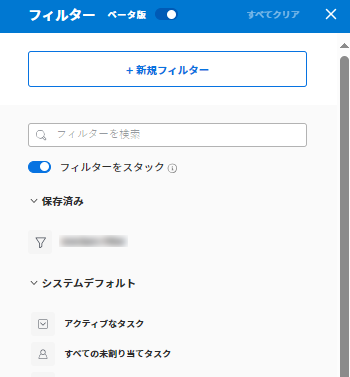
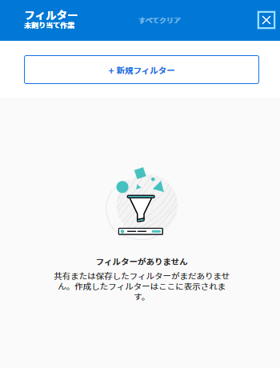
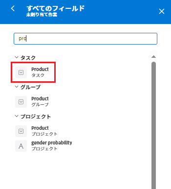
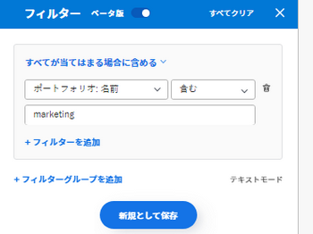
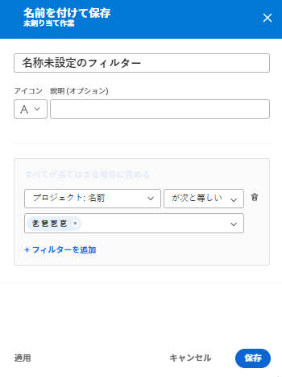
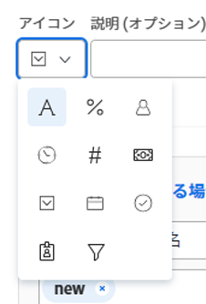
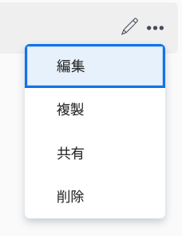
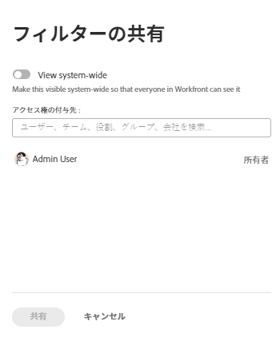
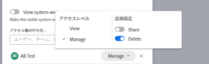
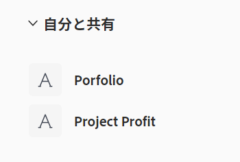

# ワークロードバランサーの情報のフィルタリング

<!--
(when they add custom fields to fitlering, add the caveat you added for the Resource Planner : only field NAMES and not LABELS are to be found in the drop-down >> ADD THIS IN THE STEP BELOW WHEN ADDING A FILTER)
-->

リソース・マネージャとして、ワークロード・バランサを使用して、ユーザーのワークロードを表示および管理できます。 ワークロード・バランサの詳細は、次の記事を参照してください。

* [ワークロードバランサーの概要](../../resource-mgmt/workload-balancer/overview-workload-balancer.md)
* [ワークロード・バランサのナビゲート](../../resource-mgmt/workload-balancer/navigate-the-workload-balancer.md)

>[!IMPORTANT]
>
>作業項目を効率的に検索し、管理するユーザーや項目に焦点を当てるには、ワークロードバランサーでフィルターを使用することを強くお勧めします。 これにより、リソースの割り当てを管理する前に、正しい情報を表示できます。
>
>新しいフィルタを保存して適用し、ワークロード・バランサから移動すると、ログオフして再度ログオンした後も、フィルタは保持されます。

この記事では、ワークロードバランサーのフィルタに関する情報を説明します。 Workfrontのフィルターについて詳しくは、 [Adobe Workfrontのフィルターの概要](../../reports-and-dashboards/reports/reporting-elements/filters-overview.md).

## アクセス要件

以下が必要です。

<table style="table-layout:auto"> 
 <col> 
 </col> 
 <col> 
 </col> 
 <tbody> 
  <tr> 
   <td role="rowheader">Adobe Workfront plan*</td> 
   <td> 
任意のプラン
 </td> 
  </tr> 
  <tr> 
   <td role="rowheader">Adobe Workfront license*</td> 
   <td> 
リソース領域でワークロードバランサーを使用する場合の計画

   
チームまたはプロジェクトのワークロードバランサーを使用する場合の作業

 </td> 
  </tr> 
  <tr> 
   <td role="rowheader">アクセスレベル*</td> 
   <td> 
次の項目へのアクセス権を表示または高くします。
 
    <ul> 
     <li> 
リソース管理
 </li> 
     <li> 
プロジェクト
 </li> 
     <li> 
タスク
 </li> 
     <li> 
問題
 </li> 
     <li data-mc-conditions="QuicksilverOrClassic.Quicksilver"> 
フィルター、表示、グループ化
 </li> 
    </ul> 
フィルターの作成または編集時に、フィルター、ビュー、グループへのアクセス権を編集 
 
<b>メモ</b>

まだアクセス権がない場合は、Workfront管理者に、アクセスレベルに追加の制限を設定しているかどうかを問い合わせてください。 Workfront管理者がアクセスレベルを変更する方法について詳しくは、 <a href="../../administration-and-setup/add-users/configure-and-grant-access/create-modify-access-levels.md" class="MCXref xref">カスタムアクセスレベルの作成または変更</a>.
 </td>
</tr> 
  <tr> 
   <td role="rowheader">オブジェクト権限</td> 
   <td> 
プロジェクト、タスク、問題に対する権限を表示またはそれ以上に設定します

   
編集または削除するフィルターに対する権限を管理します

     
 
追加のアクセス権のリクエストについて詳しくは、 <a href="../../workfront-basics/grant-and-request-access-to-objects/request-access.md" class="MCXref xref">オブジェクトへのアクセスのリクエスト </a>.
 </td> 
  </tr> 
 </tbody> 
</table>

*保有するプラン、ライセンスの種類、アクセス権を確認するには、Workfront管理者にお問い合わせください。

## ワークロードバランサーのフィルターの概要

ワークロード・バランサでフィルタを使用する場合は、次の点を考慮してください。

* ワークロードバランサーにアクセスする場所によっては、Workfrontが既に情報をフィルタリングしている可能性があります。 事前適用済みフィルターについて詳しくは、 [ワークロードバランサーでの事前適用済みフィルター](#pre-applied-filters-in-the-workload-balancer) 」を参照してください。
* フィルターは、保存せずに作成して適用することも、保存して後で再利用することもできます。
* 保存せずにフィルターを適用した場合は、ページを更新して元のリストに戻すことができます。
* 自分が作成したフィルターや、自分が作成および共有している他のユーザーに対するフィルターを表示できます。
* 共有フィルターを削除または編集すると、そのフィルターは、共有されているすべてのユーザーに対しても削除または編集されます。
* ある領域のワークロードバランサーにフィルタを作成した場合、他の領域では使用できません。

   例えば、リソース領域で作成されたフィルターは、プロジェクトやチームのワークロードバランサーでは使用できません。

   ワークロード・バランサの場所の詳細は、 [ワークロード・バランサの検索](../../resource-mgmt/workload-balancer/locate-workload-balancer.md).

* 選択したフィルタに一致する項目のみを表示できます。この項目は、ワークロードバランサーの画面に表示されるタイムライン内の日付にも一致します。

## ワークロードバランサーでの事前適用済みフィルター {#pre-applied-filters-in-the-workload-balancer}

ワークロード・バランサは、次の 2 つの異なる領域に情報を表示します。

* **未割り当て作業領域**:まだユーザーに割り当てられていない作業項目
* **割り当てられた作業領域**:ユーザーに割り当てられた作業項目。

   各領域に何が表示されるかについては、 [ワークロード・バランサのナビゲート](../../resource-mgmt/workload-balancer/navigate-the-workload-balancer.md).

>[!IMPORTANT]
>
>ワークロードバランサーの各領域には、互いに独立して機能する独自のフィルターセットがあります。 両方のフィルターを設定して、各領域に表示する情報を指定する必要があります。

ワークロードバランサーには、ユーザーとその作業項目が表示されます。
ユーザーに割り当てられた作業項目は、項目の日付が画面に表示される時間枠と一致する場合にのみ表示されます。

次の表に示すように、ワークロード・バランサのアクセス元に応じて、未割り当て領域と割り当て済み領域は、特定の基準で既にフィルタされています。

<table style="table-layout:auto"> 
 <col> 
 <col> 
 <col> 
 <tbody> 
  <tr> 
   <td role="rowheader"><strong>Workfront・エリア（ワークロード・バランサにアクセスする場所）</strong></td> 
   <td><b>デフォルトで未割り当て作業領域に表示される項目</b> </td> 
   <td><b>デフォルトで「割り当て済み作業」領域に表示される項目</b> </td> 
  </tr> 
  <tr> 
   <td role="rowheader">リソース領域</td> 
   <td>デフォルトでは、ここに項目は表示されません。 この領域の作業項目を表示するには、フィルターをカスタマイズする必要があります。</td> 
   <td>任意のチームのメンバーおよび作業項目のユーザー。 </td> 
  </tr> 
  <tr> 
   <td role="rowheader">チーム</td> 
   <td>チームまたはチームに割り当てられ、ジョブの役割を持つ作業項目です。 </td> 
   <td> 
選択したチームとその作業項目のメンバーであるユーザー。
 </td> 
  </tr> 
  <tr> 
   <td role="rowheader">プロジェクト</td> 
   <td> 
未割り当ての作業項目または選択したプロジェクトのチームまたはジョブの役割に割り当てられた項目が、この領域に表示されます。
 </td> 
   <td> 
システムの既定のフィルタ時に、選択したプロジェクトの少なくとも 1 つの作業項目とプロジェクトの作業項目に割り当てられたユーザー <b>このプロジェクトの作業項目</b> が選択されている。 

システムのデフォルトフィルターの場合 <b>このプロジェクトの作業項目</b> 選択を解除すると、プロジェクトの「割り当てられた作業」領域に、選択したプロジェクトの少なくとも 1 つの項目に割り当てられたユーザーのすべての作業項目が表示されます。  
 このフィルターは、デフォルトでは選択されていません。

<b>メモ</b>

プロジェクトのワークロードバランサーで、「すべてのユーザーを表示」オプションを有効にして、システム内のすべてのユーザーを表示できます。 詳しくは、 <a href="../workload-balancer/navigate-the-workload-balancer.md" class="MCXref xref">ワークロード・バランサのナビゲート</a>

</td> 
  </tr> 
 </tbody> 
</table>

## ワークロードバランサーフィルターの作成

ワークロード・バランサの未割り当て作業領域と割り当て作業領域のフィルタを作成するプロセスは、ワークロード・バランサにアクセスする場所に関係なく同じです。 ワークロード・バランサの特定の詳細は、 [ワークロード・バランサの検索](../../resource-mgmt/workload-balancer/locate-workload-balancer.md).

一からフィルターを作成することも、定義済みフィルターの 1 つを編集することもできます。 編集可能な既存のフィルターについて詳しくは、 [ワークロードバランサーの既存のフィルターの編集](#edit-an-existing-filter-in-the-workload-balancer) 」の節を参照してください。

1. ワークロードバランサーに移動します。

   ワークロード・バランサへのアクセスの詳細は、 [ワークロード・バランサのナビゲート](../../resource-mgmt/workload-balancer/navigate-the-workload-balancer.md).

1. 次をクリック： **フィルター** アイコン  の右上隅に **未割り当ての作業** または **割り当てられた作業** 領域

   右側にフィルタービルダーボックスが表示されます。 フィルターを作成する領域の名前がボックスのヘッダーに表示されます。

   

1. （オプションおよび条件付き）リソース領域のワークロードバランサーにアクセスする場合、事前定義済みのデフォルトフィルターが既に割り当て済み作業領域に適用されている場合があります。 デフォルトのフィルターのコピーを編集して保存できます。

   >[!TIP]
   >
   >デフォルトのフィルターには、任意のチームに属するユーザーとその作業項目が表示されます。 このフィルターのコピーを編集できます。

   次にアクセスする場合、 [!UICONTROL ワークロードバランサー] プロジェクトから、[!UICONTROL このプロジェクトの作業項目]「 」フィルターが既に適用されている可能性があります。 このプロジェクトのユーザーに割り当てられた作業項目のみが表示されます。 このフィルターを複製して保存できます。

   デフォルトでは、 [!UICONTROL ワークロードバランサー] プロジェクトのすべてのユーザーに割り当てられているすべての作業項目が表示されます。

1. クリック **新しいフィルター。**

   

1. フィルターを作成するには、次の手順を実行します。

   1. 最初のドロップダウンメニューでフィールド名を選択するか、 **フィールドを参照** をクリックして、デフォルトで表示されないフィールドの名前を入力します。

      >[!IMPORTANT]
      >
      >カスタムフィールドを参照する場合は、フィールドラベルではなくフィールド名を入力する必要があります。 フィールドラベルは、オブジェクトに添付されたカスタムフォームに表示されます。 ラベルとカスタムフィールドの名前の違いについて詳しくは、 [カスタムフォームの作成または編集](../../administration-and-setup/customize-workfront/create-manage-custom-forms/create-or-edit-a-custom-form.md).

   1. （条件付き）クリックした場合 **フィールドを参照**」で、 **検索** フィールドを選択し、リストに表示される場合に選択します。

      

      >[!TIP]
      >
      >次のセクションからフィールドを選択できます。
      >
      >* **最近の選択**:最近フィルターしたフィールド。
      >* **推奨フィールド**:最も一般的に使用されるフィールド。

   1. 2 番目のドロップダウンメニューからモディファイヤを選択します。 Workfrontフィルター修飾子について詳しくは、 [フィルターと条件修飾子](../../reports-and-dashboards/reports/reporting-elements/filter-condition-modifiers.md).
   1. フィルターを適用するフィールドの値を選択または入力します。

      >[!NOTE]
      >
      > 特定のポートフォリオの作業オブジェクトを表示する場合は、次のフィルタを適用できます。&quot;Portfolio名にマーケティングが含まれています。&quot; 名前に「マーケティング」が含まれる任意のポートフォリオに属する作業項目が表示されます。
      >
      >

   1. （オプション） **削除** アイコン  をクリックして、フィルタ条件を削除します。

1. （オプション）「 **フィルターを追加** 別のフィルター条件を追加するには、手順 4 の操作を繰り返します。

   <!--(NOTE: ensure this stays correct)-->

1. クリック **適用** をクリックします。この場合、選択したワークロード・バランサ・エリアにフィルタの結果を保存せずに適用します。

   作業項目のリストが左側で更新されます。

   >[!IMPORTANT]
   >
   >追加したすべてのフィルタ文が同時に true の場合、結果はワークロードバランサーに表示されます。

   フィルターは、ページを更新するまで保持されます。

   この **適用** ボタンが **新規として保存** 」ボタンをクリックします。

1. クリック **新規として保存** をクリックして、後で使用するためのフィルターを保存します。

   

   >[!TIP]
   >
   >クリック **キャンセル** は、いつでもフィルターの作成領域に戻ります。

1. 選択 **名称未設定フィルター** 新しいフィルターの名前を入力します。
1. 新しいフィルターのアイコンを **アイコン** ドロップダウンメニュー。

   

1. （オプション）フィルターに固有な情報を示す説明を追加します。 フィルターのリストで、フィルター名の下に説明が表示されます。
1. 「**保存**」をクリックします。

   保存済みフィルターは、フィルターボックスの「マイフィルター」領域に表示されます。

   保存済みフィルターの適用について詳しくは、 [ワークロードバランサーの保存済みフィルターの削除](#delete-a-saved-filter-in-the-workload-balancer) 」を参照してください。

1. （条件付き） **フィルターアイコン**  の右上隅に **未割り当ての作業** または **割り当てられた作業** 現在適用されているフィルターの名前または数を示すツールチップを表示する領域。

   

## フィルターの複製

フィルターを複製して編集し、新しいフィルターを作成できます。

1. ワークロードバランサーに移動します。

   ワークロード・バランサへのアクセスの詳細は、 [ワークロード・バランサのナビゲート](../../resource-mgmt/workload-balancer/navigate-the-workload-balancer.md).

1. 次をクリック： **フィルター** アイコン  の右上隅に **未割り当ての作業** または **割り当てられた作業** 領域

   右側にフィルタービルダーボックスが表示されます。 フィルターを作成する領域の名前がボックスのヘッダーに表示されます。

1. 既存のフィルターの上にマウスを移動し、 **詳細** メニュー を選択し、「 **複製**.

   

   >[!TIP]
   >
   > フィルターの編集中に、 **詳細** メニューをクリックし、 **複製**.

1. 複製したフィルターに関する次の情報を編集します。

   * 名前

      デフォルトでは、新しいフィルター名は「（元のフィルター名）コピー」です。

   * アイコン
   * 説明
   * 任意のフィールド、修飾子または値。

1. （オプション）「 **フィルターを追加** をクリックして、複製したフィルターに文を追加します。
1. クリック **保存** 複製したフィルターを **マイフィルター** 領域

   元のフィルターは変更されず、複製されたフィルターは新しいフィルターとして保存されます。

## ワークロードバランサーの既存のフィルターの編集 {#edit-an-existing-filter-in-the-workload-balancer}

ワークロードバランサーで保存済みフィルターを編集できます。

>[!TIP]
>
>他のユーザーと共有されているフィルターを編集すると、変更内容も表示されます。

1. ワークロードバランサーに移動します。

   ワークロード・バランサへのアクセスの詳細は、 [ワークロード・バランサのナビゲート](../../resource-mgmt/workload-balancer/navigate-the-workload-balancer.md).

1. 次をクリック： **フィルターアイコン**  の右上隅に **未割り当て** または **割り当てられた作業** 領域\
   右側にフィルタービルダーが表示されます。

1. 編集するフィルターにマウスを移動し、 **編集** .

   

1. 次のいずれかの操作を行います。

   * 任意のフィルター文を変更する
   * クリック **フィルターを追加** 新しいフィルターステートメントを追加するには
   * 次をクリック： **削除** アイコン  をクリックして、既存のフィルター文を削除します。

1. （オプション）「 **適用**.

   結果は、左側のワークロードバランサーで更新され、フィルタに加えた変更が示されます。

1. クリック **保存します。**

   左側のワークロードバランサーの結果が更新され、選択した新しい情報でフィルタが更新されます。

## ワークロードバランサーの保存済みフィルターの削除 {#delete-a-saved-filter-in-the-workload-balancer}

フィルターを削除する前に、次の点を考慮してください。

* 削除したフィルターは復元できません。
* 定義済みフィルターは削除できません。
* 未保存のフィルターは削除できません。 これらは、ログアウトしてWorkfrontに再度ログインすると、自動的に削除されます。
* 共有フィルターを削除すると、その共有フィルターは、その共有先のすべてのユーザーに対しても削除されます。
* 保存済みのフィルタをすべて削除すると、元のデフォルトに従ってワークロードバランサーが表示されます。

>[!NOTE]
>
>他のユーザーと共有されているフィルターを削除すると、そのフィルターも削除されます。

1. ワークロードバランサーに移動
1. 次をクリック： **フィルターアイコン**  の右上隅に **未割り当ての作業** または **割り当てられた作業** 領域\
   右側にフィルタービルダーボックスが表示されます。

1. フィルターの上にマウスを移動して、 **詳細** メニュー を選択し、「 **削除**.
   

   >[!TIP]
   >
   >フィルターの編集中に、 **詳細** メニューをクリックし、 **削除**.

1. （オプション）「 **キャンセル** 削除を避け、フィルターのリストに戻るには、次の手順を実行します。
1. クリック **削除** 削除を確定します。

   このフィルターは、ユーザーおよび権限を持つすべてのユーザーに対して削除されます。

## ワークロードバランサーでのフィルターの共有

自分が作成したフィルターや、他のユーザーが自分に共有しているフィルターを共有できます。

ワークロードバランサーでフィルタを共有する際は、次の点を考慮してください。

* フィルターをアクティブなユーザー、チーム、役割および会社と共有したり、Workfrontインスタンス内のすべてのユーザーに対して表示できるようにしたりできます。
* リソース領域で共有するフィルターは、プロジェクトまたはチームのワークロードバランサーに表示されません。
* 他のユーザーと共有しているワークロードバランサーフィルターは、Workfrontの他の領域には表示されません。

フィルターを共有するには：

1. ワークロードバランサーに移動
1. 次をクリック： **フィルターアイコン**  の右上隅に **未割り当ての作業** または **割り当てられた作業** 領域\
   右側にフィルタービルダーボックスが表示されます。

1. フィルターの上にマウスを移動して、 **詳細** メニュー を選択し、「 **共有。**

   

   >[!TIP]
   >
   > フィルターの編集中に、 **詳細** メニューをクリックし、 **共有**.

   「フィルター共有」ボックスが表示されます。

1. を有効にします。 **システム全体を表示** 設定。 これにより、Workfrontのユーザーはフィルターを表示する権限を持ちます。

   または

   でフィルターを共有するユーザー、チーム、役割、グループまたは会社の名前の入力を開始します **へのアクセス権を付与** フィールドに入力します。

   

1. （オプション）フィルターに対する権限を編集するエンティティの名前の横にある右矢印をクリックし、 **表示** または **管理** オプション。

   

1. （オプション）次のいずれかの操作をおこなって、エンティティの追加の権限を有効または無効にします。

   1. クリック **表示** を無効にします。 **共有** オプション。 これはデフォルトで有効になっています。

   1. クリック **管理** を無効にし、 **共有** または **削除** オプション。 これらは、デフォルトで有効になっています。
   >[!TIP]
   >
   >ユーザーは、自分のアクセスレベルより高い権限を受け取ることはできません。 アクセスレベルでフィルターを編集するアクセス権がない場合、フィルターを管理する権限を受け取ることはできません。 Workfrontでは、これらのユーザーの「管理」オプションが無効になっており、このオプションは淡色表示になっています。

1. クリック **共有**. フィルターは、指定したエンティティと共有されます。

   共有したフィルターが「 **自分と共有済み** 領域を選択します。

   

<!--   

## Add a filter to your favorites list

You can mark a filter as a favorite for quicker access to it. 

The filters that you mark as a favorite do not count towards your system Favorites list. There is no limit for how many filters you can favorite. 

1. Go to the Workload Balancer
1. Click the **Filter** icon  in the upper-right corner of the **Unassigned Work** or **Assigned Work** areas. The filter builder box displays on the right. 
1. Mouse over a filter, then click the **Favorite** . 
(NOTE: insert screen shot here with Favorite as part of this menu - same as above ones but with Favorite)
1. The filter is listed in the **Favorited** section inside the filter panel. 
1. (Optional) Click the **Favorite** icon again to remove the filter from the list of favorite filters
(I logged bugs for "Favorited" and "Unfavorite" wordings - make sure these have not updated)
-->
