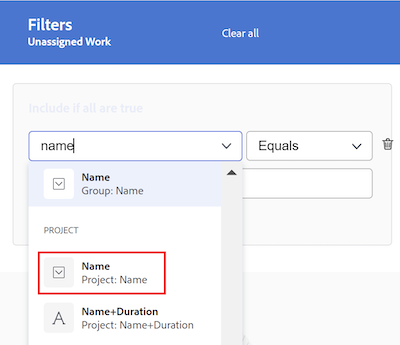

# ワークロードバランサーでの情報のフィルタリング

<!-- Audited: 6/2025 -->

<!--
(when they add custom fields to fitlering, add the caveat you added for the Resource Planner : only field NAMES and not LABELS are to be found in the drop-down >> ADD THIS IN THE STEP BELOW WHEN ADDING A FILTER)
-->

リソース管理者は、ワークロードバランサーを使用して、ユーザーのワークロードを表示および管理できます。ワークロードバランサーについて詳しくは、次の記事を参照してください。

* [ワークロードバランサーの概要](../../resource-mgmt/workload-balancer/overview-workload-balancer.md)
* [ワークロードバランサーの操作](../../resource-mgmt/workload-balancer/navigate-the-workload-balancer.md)

>[!IMPORTANT]
>
>作業アイテムを効率的に検索し、管理するユーザーやアイテムに焦点を当てるには、ワークロードバランサーでフィルターを使用することを強くお勧めします。これにより、リソースの割り当ての管理を開始する前に、正しい情報を表示できます。
>
>新しいフィルターを保存して適用した後にワークロードバランサーから移動する場合、ログオフして再度ログオンした後もフィルターは適用されます。

この記事では、ワークロードバランサーのフィルターについて説明します。Workfront のフィルターについて詳しくは、[フィルターの概要](../../reports-and-dashboards/reports/reporting-elements/filters-overview.md)を参照してください。

## アクセス要件

+++ 展開すると、この記事の機能のアクセス要件が表示されます。

<table style="table-layout:auto"> 
 <col> 
 </col> 
 <col> 
 </col> 
 <tbody> 
  <tr> 
   <td role="rowheader">Adobe Workfront プラン</td> 
   <td> 
任意
 </td> 
  </tr> 
  <tr> 
   <td role="rowheader">Adobe Workfront プラン</td> 
   <td>
新規：標準

       
現在：計画（リソース エリアでワークロードバランサーを使用している場合）

       
または

       
作業（チームまたはプロジェクトのワークロードバランサーを使用する場合）
</td>
  </tr>
  <tr> 
   <td role="rowheader">アクセスレベル設定</td> 
   <td> 
次の項目に対する表示以上のアクセス権：
 
    <ul> 
     <li>リソース管理</li> 
     <li>プロジェクト</li> 
     <li>タスク</li> 
     <li>イシュー</li>
     <li>フィルター、ビュー、グループ化</li>
    </ul>
    
フィルターを作成または編集する際に、フィルター、ビュー、グループへのアクセスを編集します 
 </td>
  </tr> 
  <tr> 
   <td role="rowheader">オブジェクト権限</td> 
   <td> 
プロジェクト、タスク、イシューに対する表示またはそれ以上の権限

   
編集または削除するフィルターに対する管理権限

   </td> 
  </tr> 
 </tbody> 
</table>

この表の情報について詳しくは、[Workfront ドキュメントのアクセス要件](/help/quicksilver/administration-and-setup/add-users/access-levels-and-object-permissions/access-level-requirements-in-documentation.md)を参照してください。

+++

## ワークロードバランサーのフィルターの概要

ワークロードバランサーでフィルターを使用する場合は、次の点を考慮してください。

* ワークロードバランサーのアクセス元によっては、Workfront が既に情報をフィルタリングしている可能性があります。詳しくは、この記事の次の節 [ ワークロードバランサーでの事前適用済みフィルター ](#pre-applied-filters-in-the-workload-balancer) を参照してください。
* フィルターは、保存せずに作成して適用することも、保存して後で再利用することもできます。
* 保存せずにフィルターを適用した場合は、ページを更新すると元のリストに戻すことができます。
* 自分が作成したフィルターや、他のユーザーが作成し自分と共有しているフィルターを表示できます。
* 共有フィルターを削除または編集すると、そのフィルターを共有したすべてのユーザーに対してそのフィルターも削除または編集されます。
* あるエリアでワークロードバランサーでフィルターを作成すると、他のエリアでは使用できません。

  例えば、「リソース」エリアで作成されたフィルターは、プロジェクトまたはチームのワークロードバランサーでは使用できません。

  ワークロードバランサーの場所について詳しくは、[ワークロードバランサーの使用場所](../../resource-mgmt/workload-balancer/locate-workload-balancer.md)を参照してください。

* 選択したフィルターがワークロードバランサー画面に表示されるタイムラインの日付と一致する場合、そのフィルターに一致する項目のみを表示できます。

## ワークロードバランサーでの事前適用済みフィルター {#pre-applied-filters-in-the-workload-balancer}

ワークロードバランサーには、2 つの異なる領域に情報が表示されます。

* **未割り当て作業エリア**：まだユーザーに割り当てられていない作業アイテム。
* **割り当てられた作業エリア**：ユーザーに割り当てられた作業項目。

  各エリアの表示項目について詳しくは、[ワークロードバランサーのナビゲート](../../resource-mgmt/workload-balancer/navigate-the-workload-balancer.md)を参照してください。

>[!IMPORTANT]
>
>ワークロードバランサーの各エリアには、互いに独立して機能する独自のフィルターセットがあります。両方のフィルターを設定して、各エリアに表示する情報を指定する必要があります。

ワークロードバランサーには、ユーザーとその作業アイテムが表示されます。
ユーザーに割り当てられた作業アイテムは、アイテムの日付が画面に表示される時間枠と一致する場合にのみ表示されます。

次の表に示すように、ワークロードバランサーのアクセス元に応じて、未割り当てエリアと割り当てられたエリアは、特定の基準で既にフィルタリングされています。

<table style="table-layout:auto"> 
 <col> 
 <col> 
 <col> 
 <tbody> 
  <tr> 
   <td role="rowheader"><strong>Workfront のエリア（ワークロードバランサーのアクセス元）</strong></td> 
   <td><b>デフォルトで未割り当て作業エリアに表示されるアイテム</b> </td> 
   <td><b>デフォルトで割り当てられた作業エリアに表示されるアイテム</b> </td> 
  </tr> 
  <tr> 
   <td role="rowheader">リソースエリア</td> 
   <td>デフォルトでは、ここにアイテムは表示されません。このエリアの作業アイテムを表示するには、フィルターをカスタマイズする必要があります。</td> 
   <td>自分のチームのメンバーであるユーザーと、そのユーザーの作業アイテム。 </td> 
  </tr> 
  <tr> 
   <td role="rowheader">チーム</td> 
   <td>チームまたはチームと担当業務にに割り当てられた作業アイテム。 </td> 
   <td> 
選択したチームのメンバーであるユーザーと、そのユーザーの作業アイテム。
 </td> 
  </tr> 
  <tr> 
   <td role="rowheader">プロジェクト</td> 
   <td> 
未割り当ての作業アイテム、または選択したプロジェクトでチームまたは担当業務に割り当てられたアイテムが、このエリアに表示されます。
 </td> 
   <td> 
<b> このプロジェクトの作業項目 </b> システムの既定のフィルターが選択されているときに、選択されたプロジェクトの少なくとも 1 つの作業項目と、プロジェクトの作業項目に割り当てられているユーザー。 

<b> このプロジェクトの作業項目 </b> システムのデフォルトフィルターの選択が解除されると、プロジェクトの割り当て済み作業エリアには、選択されたプロジェクトの少なくとも 1 つの項目に割り当てられたユーザーのすべての作業項目が表示されます。     このフィルターはデフォルトでは選択解除されています。

 <b> メモ </b>：プロジェクトのワークロードバランサーで <b> すべてのユーザーを表示 </b> オプションを有効にすると、システム内のすべてのユーザーを表示できます。 詳しくは、<a href="../workload-balancer/navigate-the-workload-balancer.md" class="MCXref xref">ワークロードバランサーを操作</a>を参照してください。

</td> 
  </tr> 
 </tbody> 
</table>

## ワークロードバランサーフィルターを作成する

ワークロードバランサーで未割り当ての作業エリアと割り当てられた作業エリアに対するフィルターを作成するプロセスは、ワークロードバランサーにアクセスする場所に関係なく同じです。 ワークロードバランサーの特定について詳しくは、[ワークロードバランサーを特定](../../resource-mgmt/workload-balancer/locate-workload-balancer.md)を参照してください。

フィルターを最初から作成することも、定義済みフィルターのいずれかを編集することもできます。編集可能な既存のフィルターについて詳しくは、この記事の[ワークロードバランサーの既存のフィルターを編集](#edit-an-existing-filter-in-the-workload-balancer)の節を参照してください。

1. ワークロードバランサーに移動します。

   ワークロードバランサーへのアクセスの詳細については、[ワークロードバランサーをナビゲート](../../resource-mgmt/workload-balancer/navigate-the-workload-balancer.md)を参照してください。

1. **未割り当ての作業** または **割り当てられた作業** エリアの右上隅にある **フィルター** アイコン  をクリックします。 右側に **フィルター** ボックスが表示され、フィルターを作成する領域の名前がヘッダーに表示されます。

   

1. （オプションおよび条件付き） **リソース** エリアのワークロードバランサーにアクセスすると、定義済みのデフォルトのフィルターが既に **割り当てられた作業** エリアに適用されている可能性があります。 デフォルトのフィルターのコピーを編集して保存できます。

   >[!TIP]
   >
   >デフォルトのフィルターには、任意のチームに属するユーザーとその作業アイテムが表示されます。このフィルターのコピーを編集できます。

   プロジェクトから [!UICONTROL  ワークロードバランサー ] にアクセスすると、**このプロジェクトの作業項目** フィルターが既に適用されている可能性があります。 このプロジェクトのユーザーに割り当てられた作業アイテムのみが表示されます。このフィルターのコピーを複製して保存できます。

   デフォルトでは、プロジェクトの [!UICONTROL  ワークロードバランサー ] には、プロジェクトのすべてのユーザーに割り当てられたすべての作業項目が表示されます。

1. 「**新規フィルター**」をクリックします。

1. フィルターを作成するには、次の手順を実行します。

   1. 最初のドロップダウンメニューでフィールド名を選択するか、ドロップダウンの下部にある **フィールドを参照** をクリックして、デフォルトでは表示されないフィールドの名前を入力します。

      >[!IMPORTANT]
      >
      >カスタムフィールドを参照する場合は、フィールドラベルではなくフィールド名を入力する必要があります。フィールドラベルは、オブジェクトに添付されたカスタムフォームに表示されます。ラベルとカスタムフィールドの名前の違いについて詳しくは、[ カスタムフォームの作成 ](/help/quicksilver/administration-and-setup/customize-workfront/create-manage-custom-forms/form-designer/design-a-form/design-a-form.md) を参照してください。

   1. （条件付き）「**フィールドを参照**」をクリックした場合は、**検索**&#x200B;フィールドにフィールドの名前を入力し、リストに表示されたらそれを選択します。

      

      >[!TIP]
      >
      >次のセクションからフィールドを選択できます。
      >
      >* **最近の選択**：最近フィルターしたフィールド。
      >* **候補**：最も一般的に使用されるフィールド。

   1. 2 番目のドロップダウンメニューから修飾子を選択します。Workfront フィルター修飾子について詳しくは、[フィルターおよび条件修飾子](../../reports-and-dashboards/reports/reporting-elements/filter-condition-modifiers.md)を参照してください。
   1. フィルタリングするフィールドの値を選択または入力します。

      >[!NOTE]
      >
      > 特定のポートフォリオの作業オブジェクトを表示する場合は、次のフィルターを適用できます。Portfolio ID が &lt; PORTFOLIO名 > と等しい。
      >
      >
      >
      >ステータスが「保留中」のプロジェクトを除外するには、次のフィルターを適用する必要があります。プロジェクト：ステータスが「保留中」でない。 これにより、「保留中」プロジェクトの作業項目がワークロードバランサーに表示されなくなります。
      >
      >

   1. （任意） **削除** アイコン  をクリックして、フィルター条件を削除します。

1. （オプション）「**フィルターを追加**」をクリックして別のフィルター条件を追加し、手順 4 からの操作を繰り返します。

   <!--(NOTE: ensure this stays correct)-->

1. 「**適用**」をクリックして、フィルターの結果を保存せずに「選択したワークロードバランサー」領域に適用します。 作業アイテムのリストが左側で更新されます。

   >[!IMPORTANT]
   >
   >追加したすべてのフィルターステートメントが同時に true の場合、結果がワークロードバランサーに表示されます。

   フィルターはページを更新するまで保持され、「**適用**」ボタンは「**新規保存** ボタンに置き換えられます。

1. 「**新規として保存**」をクリックして、後で使用するためのフィルターを保存します。

   >[!TIP]
   >
   >「**キャンセル**」をクリックすると、いつでもフィルター作成エリアに戻ります。

1. 「**名称未設定フィルター**」フィールドに、新しいフィルター名を入力します。
1. （オプション） **アイコン** ドロップダウンメニューから新しいフィルターのアイコンを選択します。

   

1. （任意）フィルター **説明** を追加します。 説明は、フィルターリストのフィルター名の下に表示されます。
1. 「**保存**」をクリックします。保存したフィルターは、フィルターボックスの **マイフィルター** 領域に表示されます。

   保存済みフィルターの適用について詳しくは、この記事の[ワークロードバランサーで保存済みフィルターを削除](#delete-a-saved-filter-in-the-workload-balancer)の節を参照してください。

1. （条件付き） **未割り当ての作業** または  フィルター** アイコン **フィルターアイコン** にマウスポインターを置くと、現在適用されている名前またはフィルター数のツールヒントが表示されます。

   

## フィルターを複製

フィルターを複製して編集し、新しいフィルターを作成できます。

1. ワークロードバランサーに移動します。

   ワークロードバランサーへのアクセスの詳細については、[ワークロードバランサーをナビゲート](../../resource-mgmt/workload-balancer/navigate-the-workload-balancer.md)を参照してください。

1. **未割り当ての作業** または **割り当てられた作業** エリアの右上隅にある **フィルター** アイコン  をクリックします。  右側に **フィルター** ボックスが表示され、フィルターを複製する領域の名前がヘッダーに表示されます。

1. 既存のフィルターの上にマウスポインターを置き、**その他** メニュー  をクリックします。
1. **複製** をクリックします。

   >[!TIP]
   >
   > フィルターの編集中に、**フィルターの編集** ボックスの左下隅にある  メニュー **その他** メニュー **をクリックしてから、「複製** をクリックすることができます。

1. 複製したフィルターに関する次の情報を編集します。

   * 名前
   * アイコン
   * 説明
   * 任意のフィールド、修飾子または値。

1. （オプション）「**フィルターを追加**」をクリックして、複製したフィルターにステートメントを追加します。
1. **保存** をクリックして、複製したフィルターを **マイフィルター** 領域に保存します。 元のフィルターは変更されず、複製されたフィルターは新しいフィルターとして保存されます。

## ワークロードバランサーの既存のフィルターを編集 {#edit-an-existing-filter-in-the-workload-balancer}

ワークロードバランサーで保存済みフィルターを編集できます。

>[!TIP]
>
>他のユーザーと共有されているフィルターを編集すると、変更内容も表示されます。

1. ワークロードバランサーに移動します。

   ワークロードバランサーへのアクセスの詳細については、[ワークロードバランサーをナビゲート](../../resource-mgmt/workload-balancer/navigate-the-workload-balancer.md)を参照してください。

1. 「**未割り当て**」または「**割り当てられた作業** エリアの右上隅にある「**フィルター**」アイコン  をクリックします。 右側にフィルタービルダーが表示されます。

1. 編集するフィルターにマウスポインターを置き、**編集** アイコン  をクリックします。

1. 次のいずれかの操作を行います。

   * フィルターステートメントを変更します。
   * 「**フィルターを追加**」をクリックして、新しいフィルターステートメントを追加します。
   * 既存のフィルターステートメントを削除するには、**削除** アイコン  をクリックします。

1. （任意）「**適用**」をクリックします。 左側のワークロードバランサーで結果が更新され、フィルターに加えた変更が示されます。

1. 「**保存**」をクリックします。左側のワークロードバランサーで結果が更新され、選択した新しい情報でフィルターが更新されます。

## ワークロードバランサーでの保存済みフィルターの削除 {#delete-a-saved-filter-in-the-workload-balancer}

フィルターを削除する前に、次の点を考慮してください。

* 削除したフィルターは復元できません。
* 定義済みフィルターは削除できません。
* 未保存のフィルターは削除できません。 ログアウトしてWorkfrontにログインし直すと、これらは自動的に削除されます。
* 共有フィルターを削除すると、その共有フィルターが共有されているすべてのユーザーに対して削除されます。
* 保存済みのフィルターをすべて削除すると、元のデフォルトに応じてワークロードバランサーが表示されます。

>[!NOTE]
>
>他のユーザーと共有されているフィルターを削除すると、その共有先のユーザーからも削除されます。

1. ワークロードバランサーに移動します。

   ワークロードバランサーへのアクセスの詳細については、[ワークロードバランサーをナビゲート](../../resource-mgmt/workload-balancer/navigate-the-workload-balancer.md)を参照してください。

1. **未割り当ての作業** または **割り当てられた作業** エリアの右上隅にある **フィルターアイコン**  をクリックします。 **フィルター** ボックスが右側に表示されます。

1. フィルターの上にマウスポインターを置き、**その他** メニュー  をクリックしてから、**削除** をクリックします。

   >[!TIP]
   >
   >フィルターの編集中に、[**フィルターの編集**] ボックスの左下隅にある  メニューをクリックし、[** 削除 **] をクリックできます**。

1. （任意）削除をキャンセルしてフィルターのリストに戻るには、「**キャンセル**」をクリックします。
1. 「**削除**」をクリックして削除を確定します。自分およびフィルターに対する権限を持つすべてのユーザーのために、フィルターが削除されます。

## ワークロードバランサーでのフィルターの共有

自分が作成したフィルターや、他のユーザーから共有されたフィルターを共有できます。

ワークロードバランサーでフィルターを共有する際は、次の点を考慮してください。

* フィルターをアクティブなユーザー、チーム、役割および会社と共有したり、Workfront インスタンス内のすべてのユーザーに表示にしたりできます。
* 「リソース」エリアで共有するフィルターは、プロジェクトまたはチームのワークロードバランサーに表示されません。
* 他のユーザーと共有しているワークロードバランサーのフィルターは、Workfront の他のエリアには表示されません。

フィルターを共有するには：

1. ワークロードバランサーに移動します。

   ワークロードバランサーへのアクセスの詳細については、[ワークロードバランサーをナビゲート](../../resource-mgmt/workload-balancer/navigate-the-workload-balancer.md)を参照してください。

1. **未割り当ての作業** または **割り当てられた作業** エリアの右上隅にある **フィルターアイコン**  をクリックします。 **フィルター** ボックスが右側に表示されます。

1. フィルターの上にマウスポインターを置き、**その他** メニュー  をクリックしてください。

1. 「**共有**」をクリックします。**フィルターの共有** ボックスが表示されます。

   >[!TIP]
   >
   > フィルターの編集中に、**フィルターの編集** ボックスの左下隅にある  メニューをクリックし、** 共有 **をクリックすることができます。**

1. **アクセス権の付与先** フィールドに、フィルターを共有するユーザー、チーム、役割、グループまたは会社の名前を入力し、表示されたら選択します。

1. （オプション）エンティティのフィルター権限を編集するには、名前の横の右矢印をクリックし、「**表示**」または「**管理** を選択します。

   

1. （オプション）以下のいずれかの操作を行って、エンティティに対する追加の権限を有効または無効にします。

   1. 「**表示**」をクリックし、「**共有**」オプションを無効にします。これはデフォルトで有効になっています。

   1. **管理** をクリックし、「**共有** または **削除** オプションを有効にします。

   >[!TIP]
   >
   >ユーザーは、自分のアクセス レベルよりも高い権限を受け取ることはできません。 アクセス レベルのフィルターを編集するアクセス権がない場合、フィルターを管理する権限を受け取ることはできません。 Workfrontは、これらのユーザーの「管理」オプションを無効にします。

1. 「**共有**」をクリックします。フィルターは指定したエンティティと共有され、共有フィルターが「**フィルター** ボックスの **自分と共有** エリアに表示されます。

   

<!--   

## Add a filter to your favorites list

You can mark a filter as a favorite for quicker access to it. 

The filters that you mark as a favorite do not count towards your system Favorites list. There is no limit for how many filters you can favorite. 

1. Go to the Workload Balancer
1. Click the **Filter** icon  in the upper-right corner of the **Unassigned Work** or **Assigned Work** areas. The filter builder box displays on the right. 
1. Mouse over a filter, then click the **Favorite** . 
(NOTE: insert screen shot here with Favorite as part of this menu - same as above ones but with Favorite)
1. The filter is listed in the **Favorited** section inside the filter panel. 
1. (Optional) Click the **Favorite** icon again to remove the filter from the list of favorite filters
(I logged bugs for "Favorited" and "Unfavorite" wordings - make sure these have not updated)
-->
