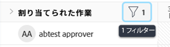

# ワークロードバランサーでの情報のフィルタリング

<!--
(when they add custom fields to fitlering, add the caveat you added for the Resource Planner : only field NAMES and not LABELS are to be found in the drop-down >> ADD THIS IN THE STEP BELOW WHEN ADDING A FILTER)
-->

リソース管理者は、ワークロードバランサーを使用して、ユーザーのワークロードを表示および管理できます。ワークロードバランサーについて詳しくは、次の記事を参照してください。

* [ワークロードバランサーの概要](../../resource-mgmt/workload-balancer/overview-workload-balancer.md)
* [ワークロードバランサーの操作](../../resource-mgmt/workload-balancer/navigate-the-workload-balancer.md)

>[!IMPORTANT]
>
>作業アイテムを効率的に検索し、管理するユーザーやアイテムに焦点を当てるには、ワークロードバランサーでフィルターを使用することを強くお勧めします。これにより、リソースの割り当てを管理する前に、正しい情報を表示できます。
>
>新しいフィルターを保存して適用し、ワークロードバランサーから移動した場合、ログオフして再度ログオンした後もフィルターは保持されます。

この記事では、ワークロードバランサーのフィルターについて説明します。Workfrontのフィルターについて詳しくは、 [フィルターの概要](../../reports-and-dashboards/reports/reporting-elements/filters-overview.md).

## アクセス要件

以下が必要です。

<table style="table-layout:auto"> 
 <col> 
 </col> 
 <col> 
 </col> 
 <tbody> 
  <tr> 
   <td role="rowheader">Adobe Workfront プラン*</td> 
   <td> 
任意のプラン
 </td> 
  </tr> 
  <tr> 
   <td role="rowheader">Adobe Workfront ライセンス*</td> 
   <td> 
プラン、リソース領域でワークロードバランサーを使用する場合

   
ワーク、チームまたはプロジェクトのワークロードバランサーを使用する場合

 </td> 
  </tr> 
  <tr> 
   <td role="rowheader">アクセスレベル*</td> 
   <td> 
次の項目に対する表示以上のアクセス権：
 
    <ul> 
     <li> 
リソース管理
 </li> 
     <li> 
プロジェクト
 </li> 
     <li> 
タスク
 </li> 
     <li> 
イシュー
 </li> 
     <li data-mc-conditions="QuicksilverOrClassic.Quicksilver"> 
フィルター、ビュー、グループ化
 </li> 
    </ul> 
フィルターの作成または編集時に、フィルター、ビュー、グループ化への編集アクセス権 
 
<b>メモ</b>

まだアクセス権がない場合は、Workfront 管理者に問い合わせて、アクセスレベルに追加の制限が設定されているかどうかを確認してください。Workfront 管理者がアクセスレベルを変更する方法について詳しくは、「<a href="../../administration-and-setup/add-users/configure-and-grant-access/create-modify-access-levels.md" class="MCXref xref">カスタムアクセスレベルの作成または変更</a>」を参照してください。
 </td>
</tr> 
  <tr> 
   <td role="rowheader">オブジェクト権限</td> 
   <td> 
プロジェクト、タスク、イシューに対する表示またはそれ以上の権限

   
編集または削除するフィルターに対する管理権限

     
 
追加のアクセス権のリクエストについて詳しくは、<a href="../../workfront-basics/grant-and-request-access-to-objects/request-access.md" class="MCXref xref">オブジェクトへのアクセス権のリクエスト</a>を参照してください。
 </td> 
  </tr> 
 </tbody> 
</table>

*保有するプラン、ライセンスタイプまたはアクセス権を確認するには、Workfront 管理者にお問い合わせください。

## ワークロードバランサーのフィルターの概要

ワークロードバランサーでフィルターを使用する場合は、次の点を考慮してください。

* ワークロードバランサーのアクセス元によっては、Workfront が既に情報をフィルタリングしている可能性があります。事前適用済みフィルターについて詳しくは、[ワークロードバランサーでの事前適用済みフィルター](#pre-applied-filters-in-the-workload-balancer)を参照してください。
* フィルターは、保存せずに作成して適用することも、保存して後で再利用することもできます。
* 保存せずにフィルターを適用した場合は、ページを更新すると元のリストに戻すことができます。
* 自分が作成したフィルターや、他のユーザーが作成し自分と共有しているフィルターを表示できます。
* 共有フィルターを削除または編集すると、そのフィルターは、共有しているすべてのユーザーに対しても削除または編集されます。
* あるエリアのワークロードバランサーにフィルターを作成した場合、他のエリアでは使用できません。

  例えば、リソースエリアで作成されたフィルターは、プロジェクトやチームのワークロードバランサーでは使用できません。

  ワークロードバランサーの場所について詳しくは、[ワークロードバランサーの使用場所](../../resource-mgmt/workload-balancer/locate-workload-balancer.md)を参照してください。

* 選択したフィルターに一致する項目のみを表示できます。この項目は、ワークロードバランサーの画面に表示されるタイムライン内の日付にも一致します。

## ワークロードバランサーでの事前適用済みフィルター {#pre-applied-filters-in-the-workload-balancer}

ワークロードバランサーは、次の 2 つの異なるエリアに情報を表示します。

* **未割り当て作業エリア**：まだユーザーに割り当てられていない作業アイテム。
* **割り当てられた作業エリア**：ユーザーに割り当てられた作業アイテム。

  各エリアの表示項目について詳しくは、[ワークロードバランサーのナビゲート](../../resource-mgmt/workload-balancer/navigate-the-workload-balancer.md)を参照してください。

>[!IMPORTANT]
>
>ワークロードバランサーの各エリアには、互いに独立して機能する独自のフィルターセットがあります。両方のフィルターを設定して、各エリアに表示する情報を指定する必要があります。

ワークロードバランサーには、ユーザーとその作業アイテムが表示されます。
ユーザーに割り当てられた作業アイテムは、アイテムの日付が画面に表示される時間枠と一致する場合にのみ表示されます。

次の表に示すように、ワークロードバランサーのアクセス元に応じて、未割り当てエリアと割り当てられたエリアは、特定の基準で既にフィルタリングされています。

<table style="table-layout:auto"> 
 <col> 
 <col> 
 <col> 
 <tbody> 
  <tr> 
   <td role="rowheader"><strong>Workfront のエリア（ワークロードバランサーのアクセス元）</strong></td> 
   <td><b>デフォルトで未割り当て作業エリアに表示されるアイテム</b> </td> 
   <td><b>デフォルトで割り当てられた作業エリアに表示されるアイテム</b> </td> 
  </tr> 
  <tr> 
   <td role="rowheader">リソースエリア</td> 
   <td>デフォルトでは、ここにアイテムは表示されません。このエリアの作業アイテムを表示するには、フィルターをカスタマイズする必要があります。</td> 
   <td>自分のチームのメンバーであるユーザーと、そのユーザーの作業アイテム。 </td> 
  </tr> 
  <tr> 
   <td role="rowheader">チーム</td> 
   <td>チームまたはチームと担当業務にに割り当てられた作業アイテム。 </td> 
   <td> 
選択したチームのメンバーであるユーザーと、そのユーザーの作業アイテム。
 </td> 
  </tr> 
  <tr> 
   <td role="rowheader">プロジェクト</td> 
   <td> 
未割り当ての作業アイテム、または選択したプロジェクトでチームまたは担当業務に割り当てられたアイテムが、このエリアに表示されます。
 </td> 
   <td> 
システムのデフォルトのフィルター（<b>このプロジェクトの作業アイテム</b>）が選択されている場合、選択したプロジェクトで 1 つ以上の作業アイテムに割り当てられたユーザーと、そのユーザーの作業アイテム。 

システムのデフォルトのフィルター（<b>このプロジェクトの作業アイテム</b>）が選択解除されている場合、プロジェクトの割り当てられた作業エリアに、選択したプロジェクトで 1 つ以上のアイテムに割り当てられたユーザーのすべての作業アイテムが表示されます。  
 このフィルターは、デフォルトでは選択されていません。

<b>メモ</b>

プロジェクトのワークロードバランサーで、「すべてのユーザーを表示」オプションを有効にして、システム内のすべてのユーザーを表示できます。詳しくは、<a href="../workload-balancer/navigate-the-workload-balancer.md" class="MCXref xref">ワークロードバランサーを操作</a>を参照してください。

</td> 
  </tr> 
 </tbody> 
</table>

## ワークロードバランサーフィルターを作成する

ワークロードバランサーの未割り当て作業エリアと割り当て作業エリアのフィルターを作成するプロセスは、ワークロードバランサーにアクセスする場所に関係なく同じです。ワークロードバランサーの特定について詳しくは、[ワークロードバランサーを特定](../../resource-mgmt/workload-balancer/locate-workload-balancer.md)を参照してください。

フィルターを最初から作成することも、定義済みフィルターのいずれかを編集することもできます。編集可能な既存のフィルターについて詳しくは、この記事の[ワークロードバランサーの既存のフィルターを編集](#edit-an-existing-filter-in-the-workload-balancer)の節を参照してください。

1. ワークロードバランサーに移動します。

   ワークロードバランサーへのアクセスの詳細については、[ワークロードバランサーをナビゲート](../../resource-mgmt/workload-balancer/navigate-the-workload-balancer.md)を参照してください。

1. **未割り当ての作業**&#x200B;エリア、または&#x200B;**割り当てられた作業**&#x200B;エリアの右上隅にある&#x200B;**フィルター**&#x200B;アイコン  をクリックします。

   右側にフィルタービルダーボックスが表示されます。フィルターを作成するエリアの名前が、ボックスのヘッダーに表示されます。

   

1. （オプションおよび条件付き）リソースエリアのワークロードバランサーにアクセスする場合、事前定義済みのデフォルトフィルターが既に割り当て済み作業エリアに適用されている場合があります。デフォルトのフィルターのコピーを編集して保存できます。

   >[!TIP]
   >
   >デフォルトのフィルターには、任意のチームに属するユーザーとその作業アイテムが表示されます。このフィルターのコピーを編集できます。

   プロジェクトから[!UICONTROL ワークロードバランサー]にアクセスする場合、「[!UICONTROL このプロジェクトの作業アイテム]」フィルターがすでに適用されている場合があります。このプロジェクトのユーザーに割り当てられた作業アイテムのみが表示されます。このフィルターのコピーを複製して保存できます。

   デフォルトでは、プロジェクトの[!UICONTROL ワークロードバランサー]には、プロジェクトのすべてのユーザーに割り当てられたすべての作業アイテムが表示されます。

1. 「**新しいフィルター**」をクリックします。

   

1. フィルターを作成するには、次の手順を実行します。

   1. 最初のドロップダウンメニューでフィールド名を選択するか、「**フィールドを参照**」をクリックして、デフォルトで表示されないフィールドの名前の入力を開始します。

      >[!IMPORTANT]
      >
      >カスタムフィールドを参照する場合は、フィールドラベルではなくフィールド名を入力する必要があります。フィールドラベルは、オブジェクトに添付されたカスタムフォームに表示されます。ラベルとカスタムフィールドの名前の違いについて詳しくは、[カスタムフォームを作成または編集](../../administration-and-setup/customize-workfront/create-manage-custom-forms/create-or-edit-a-custom-form.md)を参照してください。

   1. （条件付き）「**フィールドを参照**」をクリックした場合は、**検索**&#x200B;フィールドにフィールドの名前を入力し、リストに表示されたらそれを選択します。

      

      >[!TIP]
      >
      >次のセクションからフィールドを選択できます。
      >
      >* **最近の選択**：最近フィルターしたフィールド。
      >* **推奨フィールド**：最も一般的に使用されるフィールド。

   1. 2 番目のドロップダウンメニューから修飾子を選択します。Workfront フィルター修飾子について詳しくは、[フィルターおよび条件修飾子](../../reports-and-dashboards/reports/reporting-elements/filter-condition-modifiers.md)を参照してください。
   1. フィルタリングするフィールドの値を選択または入力します。

      >[!NOTE]
      >
      > 特定のポートフォリオの作業オブジェクトを表示する場合は、「ポートフォリオ名にマーケティングを含む」というフィルターを適用できます。名前に「マーケティング」が含まれる任意のポートフォリオに属する作業アイテムが表示されます。
      >
      >

   1. （オプション）**削除** アイコン  をクリックして、フィルター条件を削除します。

1. （オプション）「**フィルターを追加**」をクリックして別のフィルター条件を追加し、手順 4 からの操作を繰り返します。

   <!--(NOTE: ensure this stays correct)-->

1. 「**適用**」をクリックして、フィルターの結果を保存せずに、選択したワークロードバランサーエリアに適用します。

   作業アイテムのリストが左側で更新されます。

   >[!IMPORTANT]
   >
   >追加したすべてのフィルターステートメントが同時に true の場合、結果がワークロードバランサーに表示されます。

   フィルターは、ページを更新するまで保持されます。

   「**適用**」ボタンは「**新規として保存**」ボタンに置き換えられます。

1. 「**新規として保存**」をクリックして、後で使用するためのフィルターを保存します。

   

   >[!TIP]
   >
   >「**キャンセル**」をクリックすると、いつでもフィルター作成エリアに戻ります。

1. 「**名称未設定フィルター**」を選択し、代わりに新しいフィルターの名前を入力します。
1. 「**アイコン**」ドロップダウンメニューから新しいフィルターのアイコンを選択します。

   

1. （オプション）フィルターの説明を追加して、そのフィルターの特徴を示します。フィルターのリストで、フィルター名の下に説明が表示されます。
1. 「**保存**」をクリックします。

   保存済みフィルターは、フィルターボックスのマイフィルターエリアに表示されます。

   保存済みフィルターの適用について詳しくは、この記事の[ワークロードバランサーで保存済みフィルターを削除](#delete-a-saved-filter-in-the-workload-balancer)の節を参照してください。

1. （条件付き）**未割り当ての作業**&#x200B;エリアまたは&#x200B;**割り当てられた作業**&#x200B;エリアの右上隅にある&#x200B;**フィルタアイコンー**  の上にポインタを合わせると、現在適用されているフィルターの名前または数を示すツールヒントが表示されます。

   

## フィルターを複製

フィルターを複製して編集し、新しいフィルターを作成できます。

1. ワークロードバランサーに移動します。

   ワークロードバランサーへのアクセスの詳細については、[ワークロードバランサーをナビゲート](../../resource-mgmt/workload-balancer/navigate-the-workload-balancer.md)を参照してください。

1. **未割り当ての作業**&#x200B;エリア、または&#x200B;**割り当てられた作業**&#x200B;エリアの右上隅にある&#x200B;**フィルター**&#x200B;アイコン  をクリックします。

   右側にフィルタービルダーボックスが表示されます。フィルターを作成するエリアの名前が、ボックスのヘッダーに表示されます。

1. 既存のフィルターにポインタを合わせ、**その他**&#x200B;メニュー 、「**複製**」の順にクリックします。

   

   >[!TIP]
   >
   > フィルターの編集中は、編集フィルターボックスの左下隅にある&#x200B;**その他**&#x200B;メニューをクリックし、「**複製**」をクリックします。

1. 複製したフィルターに関する次の情報を編集します。

   * 名前

     デフォルトでは、新しいフィルター名は「（元のフィルター名）のコピー」です。

   * アイコン
   * 説明
   * 任意のフィールド、修飾子または値。

1. （オプション）「**フィルターを追加**」をクリックして、複製したフィルターにステートメントを追加します。
1. 「**保存**」をクリックして、複製したフィルターを&#x200B;**マイフィルター**&#x200B;エリアに保存します。

   元のフィルターは変更されず、複製されたフィルターは新しいフィルターとして保存されます。

## ワークロードバランサーの既存のフィルターを編集 {#edit-an-existing-filter-in-the-workload-balancer}

ワークロードバランサーで保存済みフィルターを編集できます。

>[!TIP]
>
>他のユーザーと共有されているフィルターを編集すると、変更内容も表示されます。

1. ワークロードバランサーに移動します。

   ワークロードバランサーへのアクセスについて詳しくは、[ワークロードバランサーのナビゲート](../../resource-mgmt/workload-balancer/navigate-the-workload-balancer.md)を参照してください。

1. **未割り当ての作業**&#x200B;エリア、または&#x200B;**割り当てられた作業**&#x200B;エリアの右上隅にある&#x200B;**フィルター**&#x200B;アイコン  をクリックします。\
   右側にフィルタービルダーが表示されます。

1. 編集するフィルターにマウスを移動して、「**編集**」 をクリックします。

   

1. 次のいずれかの操作を行います。

   * フィルターステートメントを変更する
   * 「**フィルターを追加**」をクリックして新しいフィルターステートメントを追加する
   * **削除**&#x200B;アイコン  をクリックして、既存のフィルターステートメントを削除する

1. （オプション）「**適用**」をクリックします。

   左側のワークロードバランサーで結果が更新され、フィルターに加えた変更が示されます。

1. 「**保存**」をクリックします。

   左側のワークロードバランサーで結果が更新され、選択した新しい情報でフィルターが更新されます。

## ワークロードバランサーでの保存済みフィルターの削除 {#delete-a-saved-filter-in-the-workload-balancer}

フィルターを削除する前に、次の点を考慮してください。

* 削除したフィルターは復元できません。
* 定義済みフィルターは削除できません。
* 未保存のフィルターは削除できません。これらのフィルターは、Workfront からログアウトして再度ログインすると、自動的に削除されます。
* 共有フィルターを削除すると、その共有先のすべてのユーザーからも削除されます。
* 保存済みのフィルターをすべて削除すると、元のデフォルトに応じてワークロードバランサーが表示されます。

>[!NOTE]
>
>他のユーザーと共有されているフィルターを削除すると、その共有先のユーザーからも削除されます。

1. ワークロードバランサーへ移動
1. 「**未割り当て作業**」エリア、または「**割り当てられた作業**」エリアの右上にある&#x200B;**フィルター**&#x200B;アイコン  をクリックします。\
   右側にフィルタービルダーボックスが表示されます。

1. フィルターにマウスを移動し、**その他**&#x200B;メニュー 、「**削除**」の順にクリックします。
   

   >[!TIP]
   >
   >フィルターの編集中に、「フィルターを編集」ボックスの左下にある&#x200B;**その他**&#x200B;メニューをクリックし、「**削除**」をクリックします。

1. （オプション）削除せずにフィルターのリストに戻るには、「**キャンセル**」をクリックします。
1. 「**削除**」をクリックして削除を確定します。

   このフィルターは、自分のほか、権限を持つすべてのユーザーに対して削除されます。

## ワークロードバランサーでのフィルターの共有

自分が作成したフィルターや、他のユーザーから共有されたフィルターを共有できます。

ワークロードバランサーでフィルターを共有する際は、次の点を考慮してください。

* フィルターをアクティブなユーザー、チーム、役割および会社と共有したり、Workfront インスタンス内のすべてのユーザーに表示にしたりできます。
* 「リソース」エリアで共有するフィルターは、プロジェクトまたはチームのワークロードバランサーに表示されません。
* 他のユーザーと共有しているワークロードバランサーのフィルターは、Workfront の他のエリアには表示されません。

フィルターを共有するには：

1. ワークロードバランサーへ移動
1. 「**未割り当て作業**」エリア、または「**割り当てられた作業**」エリアの右上にある&#x200B;**フィルター**&#x200B;アイコン  をクリックします。\
   右側にフィルタービルダーボックスが表示されます。

1. フィルターにマウスを移動し、**その他**&#x200B;メニュー 、「**共有**」の順にクリックします。

   

   >[!TIP]
   >
   > フィルターの編集中に、「フィルターを編集」ボックスの左下にある&#x200B;**その他**&#x200B;メニューをクリックし、「**共有**」をクリックします。

   「フィルターの共有」ボックスが表示されます。

1. 「**システム全体を表示**」を有効にします。これにより、Workfront のすべてのユーザーにフィルターを表示する権限が付与されます。

   または

   「**アクセス権の付与先**」フィールドで、フィルターを共有するユーザー、チーム、役割、グループまたは会社の名前を入力します。

   

1. （オプション）フィルターに対する権限を編集するエンティティの名前の横にある右向き矢印をクリックし、「**表示**」オプションまたは「**管理**」オプションを有効にします。

   

1. （オプション）以下のいずれかの操作を行って、エンティティに対する追加の権限を有効または無効にします。

   1. 「**表示**」をクリックし、「**共有**」オプションを無効にします。これはデフォルトで有効になっています。

   1. 「**管理**」をクリックし、「**共有**」オプションまたは「**削除**」オプションを無効にします。これらは、デフォルトで有効になっています。

   >[!TIP]
   >
   >ユーザーは、自分のアクセスレベルより高い権限を受け取ることはできません。アクセスレベルでフィルターを編集するアクセス権がない場合、フィルターを管理する権限を受け取ることはできません。Workfront はこれらのユーザーの「管理」オプションを無効にし、無効になったオプションはグレー表示になります。

1. 「**共有**」をクリックします。フィルターは、指定したエンティティと共有されます。

   共有したフィルターが、フィルターボックスの&#x200B;**自分と共有**&#x200B;エリアに表示されます。

   

<!--   

## Add a filter to your favorites list

You can mark a filter as a favorite for quicker access to it. 

The filters that you mark as a favorite do not count towards your system Favorites list. There is no limit for how many filters you can favorite. 

1. Go to the Workload Balancer
1. Click the **Filter** icon  in the upper-right corner of the **Unassigned Work** or **Assigned Work** areas. The filter builder box displays on the right. 
1. Mouse over a filter, then click the **Favorite** . 
(NOTE: insert screen shot here with Favorite as part of this menu - same as above ones but with Favorite)
1. The filter is listed in the **Favorited** section inside the filter panel. 
1. (Optional) Click the **Favorite** icon again to remove the filter from the list of favorite filters
(I logged bugs for "Favorited" and "Unfavorite" wordings - make sure these have not updated)
-->
