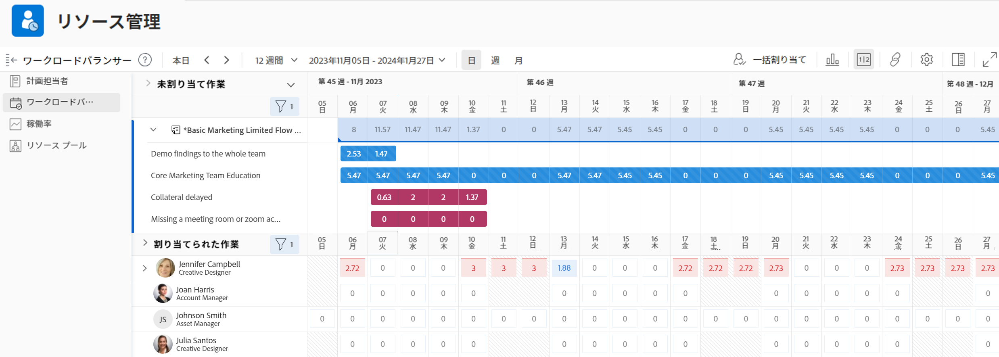
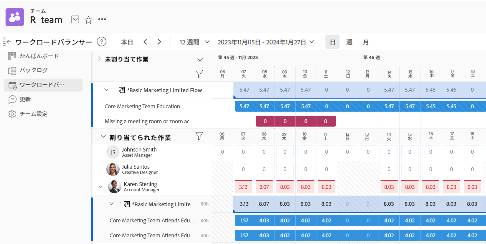

# ワークロードバランサーの使用場所

ワークロードバランサーを使用して、作業用のリソースをスケジュールリングしたり、リソースの空き時間と現在の割り当てをレビューしたりすることができます。

ワークロードバランサーには、以下の方法でアクセスできます。

* Adobe Workfront によって事前に定義されたいくつかの領域からアクセス
* カスタムセクションに追加してアクセス

この記事では、ワークロードバランサーにアクセスできるエリアについて説明します。

>[!NOTE]
>
>ワークロードバランサーにアクセスする方法に関係なく、ナビゲートし、リソースを管理する方法は同じです。
>
>ワークロードバランサーの詳細と、ワークロードバランサーを使用して作業用のリソースを管理およびスケジューリングする方法については、以下の記事を参照してください。
>
>* [ワークロードバランサーの概要](../../resource-mgmt/workload-balancer/overview-workload-balancer.md)
>* [ワークロードバランサーの操作](../../resource-mgmt/workload-balancer/navigate-the-workload-balancer.md)
>* [ワークロードバランサーでの作業割り当ての概要](../../resource-mgmt/workload-balancer/assign-work-in-workload-balancer.md)
>* [ワークロードバランサーでのユーザー割り当ての管理](../../resource-mgmt/workload-balancer/manage-user-allocations-workload-balancer.md)

## アクセス要件

+++ 展開すると、この記事の機能のアクセス要件が表示されます。

この記事の手順を実行するには、次のアクセス権が必要です。

<table style="table-layout:auto"> 
 <col> 
 <col> 
 <tbody> 
  <tr> 
   <td role="rowheader">Adobe Workfront プラン</td> 
   <td> 
任意 
 </td> 
  </tr> 
  <tr> 
   <td role="rowheader">Adobe Workfront プラン</td> 
   <td>
新規：標準

       
または

       
現在：リソース領域でワークロードバランサーを使用する場合は、計画します。 
       チームまたはプロジェクトのワークロードバランサーを使用する場合の作業
</td>
  </tr> 
   <td role="rowheader">アクセスレベル設定</td> 
   <td> 
次の項目に対する表示以上のアクセス権：
 
    <ul> 
     <li>リソース管理</li> 
     <li>プロジェクト</li> 
     <li>タスク</li> 
     <li>イシュー</li> 
    </ul> </td> 
  </tr> 
  <tr> 
   <td role="rowheader">オブジェクト権限</td> 
   <td>プロジェクト、タスク、イシューの表示またはそれ以上の権限</td> 
  </tr> 
 </tbody> 
</table>

この表の情報について詳しくは、[Workfront ドキュメントのアクセス要件](/help/quicksilver/administration-and-setup/add-users/access-levels-and-object-permissions/access-level-requirements-in-documentation.md)を参照してください。

+++

## 事前定義済みのエリアでワークロードバランサーにアクセス

以下の節では、Workfront 内でのワークロードバランサーにアクセスする場所を解説します。

### リソース領域での複数のプロジェクトを対象とするワークロードバランサーへのアクセス

{{step1-to-resourcing}}

1. 左側のパネルで&#x200B;**ワークロードバランサー**&#x200B;をクリックします。

   

   ワークロードバランサーのリソース領域には、デフォルトで以下の情報が表示されます。

   * **未割り当ての作業**：未割り当ての作業項目。
   * **割り当てられた作業**：システム内のすべてのアクティブユーザー。

     「割り当てられた作業」エリアにユーザーを表示する場合は、フィルターを使用することをお勧めします。詳しくは、「[ワークロードバランサーでの情報のフィルタリング](../workload-balancer/filter-information-workload-balancer.md)」を参照してください。

### チームのワークロードバランサーへのアクセス

{{step1-to-team}}

ホームチームのページが表示されます。

1. 左側のパネルで&#x200B;**ワークロードバランサー**&#x200B;をクリックします。

   

   チームのワークロードバランサーには、デフォルトで次の情報が表示されます。

   * **未割り当ての作業**：チームに割り当てられ、ユーザーには割り当てられていない項目。
   * **割り当てられた作業**：チームのメンバー全員とすべての割り当て。

     >[!TIP]
     >
     >チームメンバーには、チームに割り当てられている作業と、他のチームや役割に割り当てられている作業に割り当てられる場合があります。

### プロジェクトのワークロードバランサーへのアクセス

{{step1-to-projects}}

1. プロジェクトの名前をクリックして、プロジェクトページを開きます。
1. 左側のパネルの&#x200B;**ワークロードバランサー**&#x200B;をクリックします。「**さらに表示**」をクリックしてから&#x200B;**ワークロードバランサー**&#x200B;をクリックする必要がある場合があります。

   プロジェクトのワークロードバランサーが表示されます。

   

   プロジェクトのワークロードバランサーには、デフォルトで以下の情報が表示されます。

   * **未割り当ての作業**：担当業務やチームに割り当てられたが、ユーザーには割り当てられていないプロジェクトの項目。
   * **割り当てられた作業**：プロジェクトの項目に割り当てられたユーザー。

     >[!TIP]
     >
     >「すべてのユーザーを表示」オプションを有効にすると、プロジェクトの（割り当てられた作業領域の）ユーザーのみではなく、システム内のすべてのユーザーが表示されます。詳しくは、[ワークロードバランサーをナビゲート](../workload-balancer/navigate-the-workload-balancer.md)を参照してください。

## ワークロードバランサーのカスタムセクションへの追加

ワークロードバランサーは、任意のカスタムセクションに追加できます。

ワークロードバランサーをカスタムセクションに追加しても、すでにワークロードバランサーに適用したほとんどのカスタマイズは保持されます。

1. 次のいずれかのエリアに移動して、ワークロードバランサーにアクセスします。

   * リソースエリア
   * チーム
   * プロジェクト

1. [リンクを使用したワークロードバランサーの共有](../../resource-mgmt/workload-balancer/share-link-for-workload-balancer.md)の説明に従って、共有可能なリンクを取得し、それをクリップボードにコピーします。
1. [ダッシュボードへの外部 web ページの埋め込み](../../reports-and-dashboards/dashboards/creating-and-managing-dashboards/embed-external-web-page-dashboard.md)の説明に従って、外部ページを含んだダッシュボードを作成します。手順 2 で取得した共有可能なリンクを外部ページに使用します。

   <!--
      (NOTE: ensure this stays correct)
      -->

1. [カスタムタブまたはセクションの作成](../../workfront-basics/manage-your-account-and-profile/configuring-your-user-profile/create-custom-tabs.md)の説明に従って、カスタムセクションを作成し、ダッシュボードをカスタムタブに配置します。

   カスタムセクションからワークロードバランサにアクセスする場合は、手順 1 に示した元のエリアの 1 つから直接アクセスする場合と同じように表示できます。

   <!--
      (NOTE: ensure this stays correct)
     -->

1. （オプション）[レイアウトテンプレートを使用した左パネルのカスタマイズ](../../administration-and-setup/customize-workfront/use-layout-templates/customize-left-panel.md)の説明に従って、レイアウトテンプレートのカスタムタブを共有します。

<!--
For a team:

* From the Workload Balancer section of a team.

  You can adjust allocations and review or assign work from multiple projects to individual team members.

For a project:

  You can do the following when you use the Workload Balancer within a project:

   * Assign work on the project to users already assigned other work on the project.
   * Assign work to any user that might not be on the project.

   * View additional work that users are assigned to on other projects.
   * Adjust user allocations to work items.-->