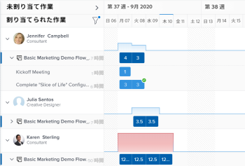
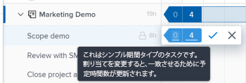

# ワークロードバランサーでのユーザー割り当ての管理

リソース・マネージャとして、作業をユーザーに割り当て、ワークロード・バランサから日単位、週単位、月単位の割り当てを管理し、使用可能なスケジュールに適合する時間数を割り当てることができます。

## アクセス要件 {#access-requirements}

以下が必要です。

<table style="table-layout:auto"> 
 <col> 
 <col> 
 <tbody> 
  <tr> 
   <td role="rowheader">Adobe Workfront plan*</td> 
   <td> <p>任意 </p> </td> 
  </tr> 
  <tr> 
   <td role="rowheader">Adobe Workfront license*</td> 
   <td> <p>チームまたはリソースエリアでワークロードバランサーを使用する場合の計画 </p>
   <p>プロジェクトのワークロードバランサーを使用する場合の作業 </p>
 </td> 
  </tr> 
  <tr> 
   <td role="rowheader">アクセスレベル設定*</td> 
   <td> <p>次へのアクセスを編集します。</p> 
    <ul> 
     <li> <p>リソース管理</p> </li> 
     <li> <p>プロジェクト</p> </li> 
     <li> <p>タスク</p> </li> 
     <li> <p>問題</p> </li> 
    </ul> <p>まだアクセス権がない場合は、Workfront管理者に、アクセスレベルに追加の制限を設定しているかどうかを問い合わせてください。 Workfront管理者がアクセスレベルを変更する方法について詳しくは、 <a href="../../administration-and-setup/add-users/configure-and-grant-access/create-modify-access-levels.md" class="MCXref xref">カスタムアクセスレベルの作成または変更</a>.</p> </td> 
  </tr> 
  <tr> 
   <td role="rowheader">オブジェクト権限</td> 
   <td> <p>割り当てを管理するタスクおよび問題に対する割り当てを行う権限以上をコントリビュートします。 </p> <p>または </p> <p>配賦の更新に加えて、計画時間を更新するタスクに対する権限を管理します。 ワークロード・バランサの計画時間の更新の詳細は、 <a href="#update-task-planned-hours-when-managing-user-allocations">ユーザー割り当て管理時のタスク計画時間の更新</a> 」の節を参照してください。 </p> <p>タスク権限について詳しくは、 <a href="../../workfront-basics/grant-and-request-access-to-objects/share-a-task.md">タスクの共有 </a><span> 権限に関する問題の詳細は、</span> <span href="../../workfront-basics/grant-and-request-access-to-objects/share-an-issue.md"><a href="../../workfront-basics/grant-and-request-access-to-objects/share-an-issue.md">イシューの共有 </a></span>. </p> <p>追加のアクセス権のリクエストについて詳しくは、 <a href="../../workfront-basics/grant-and-request-access-to-objects/request-access.md">オブジェクトへのアクセスのリクエスト </a>.</p> </td> 
  </tr> 
 </tbody> 
</table>

*保有するプラン、ライセンスの種類、アクセス権を確認するには、Workfront管理者にお問い合わせください。

## ユーザー割り当てを理解する

ユーザー割り当ては、特定の日、平日、週、月のいずれかで、作業項目を完了するのにユーザーが費やす時間を示す時間数です。 作業項目の計画時間に含まれます。

この記事では、タスクまたはタスクに割り当てられたユーザーの日別、週別、月別の時間別の割り当てを更新する方法について説明します。 ユーザーの割り当て全体の管理およびタスクへのジョブの役割については、 [タスクに関するユーザーと役割の割り当て時間を管理](../../manage-work/tasks/assign-tasks/manage-allocation-hours-on-tasks.md) .

* [ユーザー配分の概要](#user-allocation-overview)
* [ユーザー割り当てをリセットする条件](#criteria-that-reset-user-allocations)

### ユーザー配分の概要 {#user-allocation-overview}

ユーザーの割り当ては、ワークロード・バランサで時間またはパーセンテージ値で表示できます。 時間やパーセンテージを調整できます。

ユーザーの割り当ては、作業項目の予定時間数に含まれます。 予定時間については、 [計画時間の概要](../../manage-work/tasks/task-information/planned-hours.md).

タスクの計画時間は、タスクに割り当てられたユーザーのタスク期間内のすべての日数に均等に配分されます。 例えば、タスクの期間が 5 日で、合計が 10 時間の場合、タスクの日割り数は 2 時間になります。 週別配分は 10 時間です。 つまり、1 日 2 時間、タスクの作業にユーザーが割り当てられます。 ただし、ワークロード・バランサを使用して、ユーザーの日次割り当てを手動で変更できます。

>[!CAUTION]
>
>ワークロードバランサーには、1 作業項目あたり最大 1000 時間の計画時間と、1 項目の期間の最大 1000 日間のみが表示されます。 1,000 時間または 1,000 日の制限に達した後、ワークロードバランサーの割り当ては 0 と表示されます。 タスクを小さなサブタスクに分割して、より多くの予定時間や 1,000 日を超える期間に対応することをお勧めします。

ワークロード・バランサのタスクや問題に対する日次、週次、月次の割り当てを検索する際は、次の点を考慮します。

* 各ユーザーの作業項目に対するユーザーの日別、週別、月別の割り当てを表示できます。 週または月単位の配分を表示するには、週または月単位の表示を有効にします。
* ワークロード・バランサを使用して、タスクまたは問題に対するユーザーの日次、週次、月次の割り当てを変更できます。 ワークロード・バランサのビューの調整の詳細は、 [ワークロード・バランサのナビゲート](../../resource-mgmt/workload-balancer/navigate-the-workload-balancer.md).

   >[!NOTE]
   >
   >ユーザー割り当てを管理し、同じ作業項目に切り替えないで、常に使用する期間（日別、週別、月別）を決定することをお勧めします。 以前日次配分を更新した同じユーザーの週次配分を更新すると、ユーザーの日次配分が変更されます。

* 稼働日と非稼働日の両方の割り当てを更新できます。
* Workfrontがタスクの日次配分を自動的に計算する場合は、作業項目の計画開始日と計画完了日およびプロジェクトのスケジュールのタイムスタンプが重要です。

>[!INFO]
>
> 例えば、タスクの期間が「2 日間」、「2 時間予定」で、期間の最初の日の午後 12:00 に「計画開始」の時間が設定され、ユーザーが終了するプロジェクトスケジュールが「午後 5 時」に設定されているとします。 最初の日のユーザーの容量は 5 時間です。 2 日目のユーザーの処理能力は 8 時間です（スケジュールが午前 9 時に開始する場合）。
>
>Workfrontは、次の数式を使用して、期間の 2 日間における 2 時間の配分を計算します。
>
>
```
>
>   Daily allocation hours = (Total Planned Hours / Total of available hours) * Daily available hours
>```
>
>  この例では、各日の日別配分時間は次のようになります。
>   
>  (2 / 13) * 5 =最初の日の配分時間は 0.77
>
>  (2 / 13) * 8 = 2 日目の配分時間は 1.23
>
>  上の計算では、13 がタスクに使用可能な合計時間です。5 + 8 = 13


* 異なるタイムゾーンまたは異なるタイムゾーンのスケジュールの 2 人のユーザーは、同じ作業項目を表示している 2 人のユーザーに対して、配分額が異なって表示される場合があります。

* ユーザーがオフをスケジュールしている場合、その日または日の一部は灰色の背景で表示されます。 Workfront管理者が「設定」領域の「ユーザーのオフ」設定を有効にしてユーザーのオフ時間を考慮した場合、割り当てられた時間は、タイムラインの次の使用可能な日に移動します。 この設定が無効の場合、割り当てられた時間は、オフのマークが付いた日に残り、ユーザーは割り当て超過として表示されます。 詳しくは、 [システム全体のプロジェクト環境設定の指定](../../administration-and-setup/set-up-workfront/configure-system-defaults/set-project-preferences.md).

   >[!TIP]
   >
   >ユーザーが作業項目に割り当てられた後にオフタイムがマークされていた場合は、移動した配分を表示するには、プロジェクトのタイムラインを再計算する必要があります。 詳しくは、 [プロジェクトタイムラインを再計算](../../manage-work/projects/manage-projects/recalculate-project-timeline.md).

* タスクに複数のユーザーが割り当てられている場合、最初に各ユーザーに対して計画時間の量が均等に配分され、次にタスクの期間内に各日に対して均等に配分されます。 この配分は、各ユーザーのタスクへの割り当てになります。

   例えば、次のシナリオが存在する可能性があります。

   * 期間が 2 日で、10 時間の予定時間が 1 人のユーザーに割り当てられているタスクの場合、デフォルトでは、ユーザーの日割りは 1 日あたり 5 時間になります。
   * 期間が 2 日で、10 時間の予定時間が 2 人のユーザーに割り当てられているタスクの場合、各ユーザーの日割りは、デフォルトでは 1 日あたり 2.5 時間になります。

* タスクまたはイシューが計画完了日より前に完了した場合、残りの日数に割り当てられた時間数が切り捨てられ、ユーザーの全体的な配分にはカウントされません。 このアイコンは、「割り当てを表示」アイコンと「予測日付を表示」設定の両方が有効な場合にのみ表示されます。 ワークロード・バランサの設定の有効化の詳細は、 [ワークロード・バランサのナビゲート](../../resource-mgmt/workload-balancer/navigate-the-workload-balancer.md).

   

* ユーザーの割り当てが超過している場合、割り当てられた時間は、ユーザーフィールドに赤い背景で表示されます。
* ユーザーが予定の使用可能時間に対して割り当てを少なくしたり、割り当てを等しい時間にしたりすると、時間は青い背景で表示されます。
* ユーザーの配分をユーザーラインのグラフ表示で表示できます。 ユーザー割り当てに対してグラフ・ビューを有効にする方法の詳細は、この記事の「ワークロード・バランサのナビゲート」の節を参照してください [ワークロード・バランサのナビゲート](../../resource-mgmt/workload-balancer/navigate-the-workload-balancer.md).

   

### ユーザー割り当てをリセットする条件 {#criteria-that-reset-user-allocations}

再配布する変更済割り当てをトリガーするタスクの変更が一部ではありません。 ただし、リソースに対する調整済みの配分をリセットし、各担当者の作業項目の期間中にすべての日に均等に配分し直すアクションがいくつかあります。

>[!NOTE]
>
>作業項目の割り当ての自動配分を変更していない場合、割り当て先数、タスクの期間、または作業項目の予定時間の数が変更されると、時間はすべての担当者に均等に配分されます。

* [調整済配分をリセットするアクション](#actions-that-reset-adjusted-allocations)
* [調整済配分をリセットしないアクション](#actions-that-do-not-reset-adjusted-allocations)

#### 調整済配分をリセットするアクション {#actions-that-reset-adjusted-allocations}

次のアクションは、ユーザーの日次、週次、月次の割り当てを、ユーザーが手動で調整した後にリセットまたは変更します ( [ユーザー割り当てを変更](#modify-user-allocations) この記事の節：

* 期間内の日数を短縮する作業項目の長さを短くすると、失われた日から調整された割り当て時間が作業項目の最終日の割り当て量に追加されます。
* 割り当てまたは作業項目の計画時間数を変更すると、新しい計画時間数は、作業項目の全期間にわたって均等に再配分されます。
* 作業項目に担当者を追加または削除すると、タスクの予定時間が変更され、調整された値が均等に配分されます。

#### 調整済配分をリセットしないアクション {#actions-that-do-not-reset-adjusted-allocations}

作業項目に対する次の変更は、調整済の割り当てをリセットまたは変更するトリガーにはなりません。

* 作業項目の日数を移動しても、期間の日数は変更されない場合、調整後の割り当て値は変わらず、新しい日付に移動します。
* 期間の日数が増加する作業項目の期間を増やすと、調整された割り当て時間は、調整された日数に対して同じままになります。 割り当てられた時間が 0 の作業項目に日が追加されます。
* 作業項目に担当者を追加または削除しても、その項目の計画時間は変更されず、調整された値は変わりません。

## ワークロード・バランサでの計画時間の検索

ユーザーに割り当てられたタスクまたは問題の計画時間を見つけることで、ワークロード・バランサを使用して、タスクまたは問題に対するユーザー割り当てを変更できます。

ワークロード・バランサで計画時間を表示する際は、次の点を考慮してください。

* タスクまたは問題に対する計画時間の合計は、ワークロード・バランサの左側のタスクまたは問題名の横に表示されます。

* プロジェクトの計画時間の合計は、ワークロード・バランサの左側にあるプロジェクト名の横に表示されます。 これは、ワークロード・バランサのプロジェクトにリストされているすべてのタスクと問題に対する計画時間の合計を表し、プロジェクトの計画時間の合計は表しません。
* すべてのタスクとすべてのプロジェクトに対して 1 日または 1 週間に割り当てられた時間は、[ 割り当てを表示する ] 設定を手動で有効にした場合にのみ表示されます。 ワークロードバランサーでの設定の有効化の詳細は、 [ワークロード・バランサのナビゲート](../../resource-mgmt/workload-balancer/navigate-the-workload-balancer.md).

## ユーザー割り当てを変更 {#modify-user-allocations}

作業をユーザーに割り当てる際に、ワークロード・バランサでユーザー割り当てを変更して、割り当て超過がないようにしたり、リソース間の時間の正確なバランスを確保したりできます。 ユーザーの割り当て超過を特定する方法については、 [ユーザー配分の概要](#user-allocation-overview) 」を参照してください。

1. ユーザーにタスクと問題が割り当てられていることを確認します。 ワークロード・バランサでのユーザーへの作業の割り当ての詳細は、 [ワークロードバランサーでの作業割り当ての概要](../../resource-mgmt/workload-balancer/assign-work-in-workload-balancer.md).
1. ワークロードバランサーに移動します。
1. （オプション）「 **週** または **月** ：ユーザーの週次または月次の割り当てを管理します。

   

1. 内 **割り当てられた作業** 「 」領域で、割り当てを手動で変更するユーザーを探し、ユーザー名の左側にある右向き矢印をクリックして、ユーザーを展開します。

   

1. プロジェクト名の左側にある右向き矢印をクリックして、プロジェクトを展開し、ユーザーが割り当てられている作業項目を表示します。

   >[!TIP]
   >
   >ユーザー割り当ては、タスクおよびタスクに対してのみ変更できます。 プロジェクトのユーザー割り当てを変更することはできません。

1. （オプション） **割り当てアイコンを表示**  ：すべての作業項目の割当を表示します。

   タスクの名前とプロジェクトの名前は、タスクまたはプロジェクトのユーザーの割り当てに置き換えられます。

1. （オプション） **設定** アイコン  次のいずれかのオプションを選択します。

   1. **問題の時間を含める**. タスクの割り当てに加えて、問題の割り当ても管理できます。
   1. **完了した作業の表示** . これには、割り当てを管理するタイムラインで、完了し、スケジュールされた項目が表示されます。
   1. **残り時間を表示** オプション。 （ユーザー行で）各ユーザーの合計時間数が変更されます。 この設定を有効にすると、ワークロード・バランサは、各ユーザーが割り当てられた時間数ではなく、各ユーザーが作業に使用できる時間数を表示します。

      >[!TIP]
      >
      >この設定が有効な場合に割り当てを変更すると、ユーザー行の合計数が減少します。

   1. **プロジェクト** 内 **カラーテーマを選択** 」セクションに入力します。 各プロジェクトと各作業項目が一意の色で表示され、どの項目がどのプロジェクトに属しているかを理解しやすくなります。
   1. **割合** 内 **でのユーザー割り当ての表示** 」セクションに入力します。 割り当てが割合値で表示されます。 スケジュールに従ったユーザーの容量は 100%と見なされます。 例えば、ユーザーが 1 日 8 時間のスケジュールに関連付けられている場合、8 時間は 100%の容量になります。 1 日に 4 時間働くようにユーザーを割り当てる場合は、配分を 50%に更新します。

1. 次をクリック： **詳細** メニュー  作業項目の場合は、 **割り当てを編集**.


または

タスクまたはタスクのバーの日、週、月をダブルクリックします。

割り当てボックスが編集可能になります。

1. 各日、週または月の各配分のボックス内をクリックして、時間数や、各日、週または月に割り当てる割合値を手動で更新し、 **保存** アイコン .

   >[!TIP]
   >
   >次をクリック： **キャンセル** アイコン  調整した配分を削除します。

   

   ユーザー更新の割り当て。

   >[!TIP]
   >
   >タスクまたはイシューが計画完了日より前に完了した場合、残りの日数に割り当てられた時間数が切り捨てられ、ユーザーの全体的な配分にはカウントされません。 このアイコンは、「割り当てを表示」アイコンと「予測日付を表示」設定の両方が有効な場合にのみ表示されます。

   次のシナリオが存在します。

   * 期間タイプが単純でないタスクまたは問題のタスクの場合、割当の合計は、チェック・マーク・アイコンをクリックする前に、タスクの計画時間と一致する必要があります。
   * 「単純期間」タイプのタスクの場合、配賦の合計は「計画時間」より大きいか小さい場合があり、一致しない場合でもチェック・マーク・アイコンをクリックできます。 また、タスクの予定時間数も更新されます。 ワークロードバランサーからタスクの予定時間を更新するには、適切な権限とアクセス権が必要です。

      >[!TIP]
      >
      >タスクの「単純期間」タイプがタスクに含まれていることを示すために、割当の調整を開始すると、タスク名の右側にロックアイコンが表示されます。

      
   ワークロード・バランサの計画時間を更新するために満たす必要がある条件の詳細は、この記事の次のセクションを参照してください。 [ユーザー割り当て管理時のタスク計画時間の更新](#update-task-planned-hours-when-managing-user-allocations). タスクの期間のタイプについて詳しくは、 [タスクの期間と期間のタイプの概要](../../manage-work/tasks/taskdurtn/task-duration-and-duration-type.md).

1. （条件付き）タスクが複数のユーザーに割り当てられている場合、タスクに割り当てられた各ユーザーに対してこれらの手順を繰り返し、各ユーザーの割り当てを更新します。

   ワークロードバランサーを表示するアクセス権を持つユーザーが、同じユーザーと管理した同じプロジェクトを表示すると、管理したユーザーの更新された割り当てが表示されます。

## ユーザー割り当て管理時のタスク計画時間の更新 {#update-task-planned-hours-when-managing-user-allocations}

タスクのワークロード・バランサでユーザー割当を管理する際に、タスクの計画時間を更新できます。 これは、更新された割り当て時間の合計が、タスクの計画時間の元の合計と一致しない場合に発生します。

>[!IMPORTANT]
>
>* タスクの予定時間を更新すると、プロジェクトの進行状況に影響を与える場合があります。
>* 日次割当てを変更して計画時間を手動で更新すると、将来のタスクから割当てを削除する際に、計画時間に影響を与える可能性があります。 詳しくは、 [計画時間の概要](../../manage-work/tasks/task-information/planned-hours.md).
>
>* ワークロードバランサーの割り当てを更新することで、問題の予定時間を更新することはできません。
>


これは、次の条件が存在する場合に可能です。

* 適切な権限とアクセス権を持っているので、ワークロード・バランサから計画時間を管理できます。 これには、次のものが含まれます。

   * タスクに対する権限を管理します。
   * アクセス・レベルの「リソース管理」領域のワークロード・バランサ・アクセスで計画時間を更新します。

   ワークロードバランサーの使用に必要なアクセスの詳細は、この記事の次のセクションを参照してください。 [アクセス要件](#access-requirements) .

* タスクの期間のタイプはシンプルです。

   <!--
  <p data-mc-conditions="QuicksilverOrClassic.Draft mode">(NOTE:&nbsp;the statement above might include other duration types in the future)</p>
  -->
