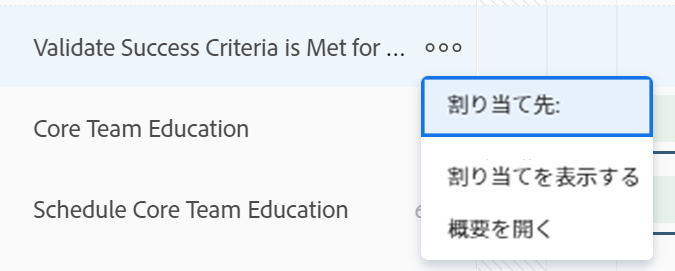

# ワークロードバランサーでユーザー割り当ての管理する

<!-- Audited: 01/2024 -->

このページでハイライト表示されている情報は、まだ一般に利用できない機能を示します。すべての顧客に対してプレビュー環境でのみ使用できるか、または迅速リリースを有効にした顧客の実稼動環境でのみ使用できます。

迅速リリースについて詳しくは、[組織での迅速リリースを有効または無効にする](/help/quicksilver/administration-and-setup/set-up-workfront/configure-system-defaults/enable-fast-release-process.md)を参照してください。

現在のリリースについて詳しくは、 [2024 年第 2 四半期リリースの概要](/help/quicksilver/product-announcements/product-releases/24-q2-release-activity/24-q2-release-overview.md).

リソースマネージャーとして、作業をユーザーに割り当て、ワークロードバランサーから日、週、月単位の割り当てを管理し、使用可能なスケジュールに適合する時間数を割り当てることができます。

## アクセス要件 {#access-requirements}

以下が必要です。

<table style="table-layout:auto"> 
 <col> 
 <col> 
 <tbody> 
  <tr> 
   <td role="rowheader">Adobe Workfront プラン</td> 
   <td> 
任意 
 </td> 
  </tr> 
  <tr> 
   <td role="rowheader">Adobe Workfront ライセンス</td> 
   <td>
   
リソース領域でワークロードバランサーを使用する場合は、次の操作が必要です。

   
新規：標準

   
または

   
現在：プラン

   
チームまたはプロジェクトのワークロードバランサーを使用する場合は、次の操作が必要です。

   
新規：標準

   
または

   
現在：作業

 </td> 
  </tr> 
  <tr> 
   <td role="rowheader">アクセスレベルの設定</td> 
   <td> 
以下の項目についてアクセス権を編集します。
 
    <ul> 
     <li> 
リソース管理
 </li> 
     <li> 
プロジェクト
 </li> 
     <li> 
タスク
 </li> 
     <li> 
イシュー
 </li> 
    </ul> </td> 
  </tr> 
  <tr> 
   <td role="rowheader">オブジェクト権限</td> 
   <td> 
割り当てを管理するタスクおよびイシューに対する割り当てを行う、参加以上の権限です。 
 
または 
 
割り当ての更新に加えて、予定時間数を更新するタスクに対する権限を管理します。ワークロードバランサーの予定時間数の更新について詳しくは、この記事の<a href="#update-task-planned-hours-when-managing-user-allocations">ユーザー割り当て管理時のタスク予定時間数の更新</a>の節を参照してください。
 </td> 
  </tr> 
 </tbody> 
</table>

この表の情報の詳細については、 [Workfrontドキュメントのアクセス要件](/help/quicksilver/administration-and-setup/add-users/access-levels-and-object-permissions/access-level-requirements-in-documentation.md).

## ユーザー割り当てについて

ユーザー割り当ては、特定の日、平日、週、月のいずれかで、作業項目を完了するのにユーザーが費やす時間を示す時間数です。作業項目の予定時間数に含まれます。

この記事では、タスクまたはタスクに割り当てられたユーザーの日次、週次、月次の時間別の割り当てを更新する方法について説明します。ユーザーの割り当て全体の管理およびタスクへのジョブの役割について詳しくは、 [タスクに関するユーザーと役割の割り当て時間を管理](../../manage-work/tasks/assign-tasks/manage-allocation-hours-on-tasks.md).

### ユーザー割り当ての概要 {#user-allocation-overview}

ユーザーの割り当ては、ワークロードバランサーで時間またはパーセンテージ値で表示できます。時間やパーセンテージを調整できます。

ユーザーの割り当ては、作業項目の予定時間数に含まれます。予定時間数については、[予定時間数の概要](../../manage-work/tasks/task-information/planned-hours.md)を参照してください。

タスクの予定時間数は、タスクに割り当てられたユーザーのタスク期間内のすべての日間に均等に割り当てられます。例えば、タスクの期間が 5 日で、予定時間数の合計が 10 時間の場合、タスクの日割り数は 2 時間になります。週次の割り当ては 10 時間です。つまり、1 日 2 時間、タスクの作業にユーザーが割り当てられます。ただし、ワークロードバランサーを使用して、ユーザーの日次割り当てを手動で変更できます。

>[!CAUTION]
>
>ワークロード・バランサには、ユーザーあたり最大 1,000 の予定時間（1 作業項目あたり）と、1 項目の期間の最大 1,000 日が表示されます。 1000 時間または 1000 日の制限に達した後、ワークロードバランサーの割り当ては 0 と表示されます。より多くの予定時間や 1,000 日を超える期間に対応するために、タスクを小さなサブタスクに分割することをお勧めします。

ワークロードバランサーのタスクやイシューに対する日次、週次、月次の割り当てを検索する際は、次の点を考慮します。

* 各ユーザーの作業項目に対するユーザーの日次、週次、月次の割り当てを表示できます。週または月単位の割り当てを表示するには、週または月単位の表示を有効にします。
* ワークロードバランサーを使用して、タスクまたはイシューに対するユーザーの日次、週次、月次の割り当てを変更できます。ワークロードバランサーのビューの調整について詳しくは、[ワークロードバランサーをナビゲート](../../resource-mgmt/workload-balancer/navigate-the-workload-balancer.md)を参照してください。

  >[!NOTE]
  >
  >ユーザー割り当てを管理し、同じ作業項目に切り替えない場合は、常に使用する期間（日次、週次、月次）を決定することをお勧めします。以前、日次の割り当てを更新した同じユーザーの週次の割り当てを更新すると、ユーザーの日次の割り当てが変更されます。

* 稼働日と非稼働日の両方の割り当てを更新できます。
* Workfrontがタスクの日次配分を自動的に計算する際は、作業項目の計画開始日と計画完了日およびプロジェクトのスケジュールのタイムスタンプが重要です。

  >[!INFO]
  >
  > 例えば、タスクの期間が 2 日、予定時間数は 2 時間の場合、予定開始時刻が期間の最初の日の午後 12 時、プロジェクトスケジュールの終了は午後 5 時に設定されているとします。最初の日のユーザーのキャパシティは 5 時間です。2 日目のユーザーのキャパシティは 8 時間です（スケジュールが午前 9 時に開始する場合）。
  >
  >Workfront は、次の数式を使用して、2 日間の期間における 2 時間の割り当てを計算します。
  >
  >`Daily allocation hours = (Total Planned Hours / Total of available hours) * Daily available hours`
  >
  >この例では、各日の日次割り当て時間は次のようになります。
  >   
  >(2 / 13) * 5 = 最初の日の 0.77 割り当て時間
  >
  >(2 / 13) * 8 = 2 日目の 1.23 割り当て時間
  >
  >上の計算では、13 がタスクに割り当てられる合計時間：5 + 8 = 13

* 異なるタイムゾーンまたは異なるタイムゾーンのスケジュールの 2 人のユーザーは、同じ作業項目を表示している 2 人のユーザーに対して、配分額が異なって表示される場合があります。

* ユーザーが休暇をスケジュールしている場合、その日または日の一部は灰色の背景で表示されます。Workfront 管理者が設定エリアのユーザーの休暇設定を有効にして、ユーザーの休暇時間を考慮した場合、割り当て時間数は、タイムラインで次に作業可能な日に移動します。この設定が無効となっている場合、休暇としてマークされた日に割り当てられた時間はそのまま残り、ユーザーには割り当て超過として表示されます。詳しくは、[システム全体のプロジェクト環境設定を指定](../../administration-and-setup/set-up-workfront/configure-system-defaults/set-project-preferences.md)を参照してください。

  >[!TIP]
  >
  >作業アイテムに割り当てられた後で、そのユーザーが休暇とマークされた場合は、プロジェクトのタイムラインを再計算して、変更後の割り当てを表示する必要があります。詳しくは、[プロジェクトタイムラインの再計算](../../manage-work/projects/manage-projects/recalculate-project-timeline.md)を参照してください。

* タスクに複数のユーザーが割り当てられている場合、最初に各ユーザーに対して予定時間数の量が均等に配分されてから、タスクの期間内の各日付に均等に配分されます。この配分は、タスクに対する各ユーザーの配分になります。

  例えば、以下のシナリオが考えられます。

   * 期間が 2 日で、1 人のユーザーに予定時間数として 10 時間が割り当てられているタスクの場合、デフォルトでは、ユーザーに対する 1 日の配分は 5 時間です。
   * 期間が 2 日で、2 人のユーザーに予定時間数として 10 時間が割り当てられているタスクの場合、デフォルトでは、それぞれのユーザーに対する 1 日の配分は 2.5 時間です。

* タスクまたはイシューが予定完了日より前に完了した場合、残りの日数に割り当てられた時間数が取り消され、これらの時間はユーザーの全体的な配分にはカウントされません。このアイコンは、割り当てを表示アイコンと「見込日を表示」設定の両方が有効となっている場合にのみ表示されます。ワークロードバランサーでの設定の有効化について詳しくは、[ワークロードバランサーの操作](../../resource-mgmt/workload-balancer/navigate-the-workload-balancer.md)を参照してください。

  

* ユーザーの割り当てが超過している場合、割り当て時間数は、ユーザーフィールドに赤い背景で表示されます。
* ユーザーに割り当てられている時間が過少な場合、またはスケジュールされた空き時間と同じ時間数が割り当てられている場合、時間数は青色の背景で表示されます。
* ユーザーの割り当ては、ユーザー行のグラフビューで表示できます。ユーザー割り当てに対してグラフビューを有効にする方法について詳しくは、[ワークロードバランサーの操作](../../resource-mgmt/workload-balancer/navigate-the-workload-balancer.md)の記事にある「ワークロードバランサーの操作」の節を参照してください。

  

### ユーザー割り当てをリセットする基準 {#criteria-that-reset-user-allocations}

すべてのタスクの変更によって、変更された割り当ての再配分がトリガーされるわけではありません。ただし、特定のアクションでは、リソースで既に調整済みの配分をリセットし、各担当者の作業アイテムで、期間中のすべての日に均等に再配分することができます。

>[!NOTE]
>
>作業アイテムの割り当ての自動配分を変更していない場合、担当者の数、タスクの期間や作業アイテムの予定時間数が変更された場合、時間はすべての担当者に均等に再配分されます。

#### 調整済みの割り当てをリセットするアクション {#actions-that-reset-adjusted-allocations}

次のアクションは、ユーザーの日次、週次、月次の割り当てを、 [ユーザー割り当てを変更](#modify-user-allocations) この記事の節：

* 期間内の日数を短縮する作業項目の長さを短くすると、失われた日数から調整された割り当て時間が作業項目の最終日の割り当て量に追加されます。
* 割り当てまたは作業アイテムの予定時間数を変更すると、新しい予定時間数が作業アイテムの期間全体で均等に再配分されます。
* 作業アイテムに担当者を追加または削除し、これによりタスクの予定時間数が変更されると、調整された値は均等に再配分されます。

#### 調整済みの割り当てをリセットしないアクション {#actions-that-do-not-reset-adjusted-allocations}

作業アイテムに対する以下の変更は、調整済みの配分のリセットまたは変更をトリガーしません。

* 作業アイテムの日付を動かしても、期間内の日数が同じであれば、調整済みの配分の値は変わらず、新しい日付に移動します。
* 期間内の日数を増やす作業項目の期間を増やすと、調整後の割り当て時間は、調整後の日数に対して同じままになります。 割り当て時間数が 0 の作業アイテムに日数が追加されます。
* 作業アイテムに担当者を追加または削除しても、その項目の予定時間数が変わらない場合、調整済みの値は変わりません。

## ワークロードバランサーの予定時間数を見つける

ユーザーに割り当てられたタスクやイシューの予定時間数を見つけることで、ワークロードバランサーを使用して、タスクやイシューに対するユーザー割り当てを変更することができます。

ワークロードバランサーで予定時間数を表示する際は、以下の点を考慮してください。

* タスクやイシューに対する予定時間数の合計は、ワークロードバランサーの左側にあるタスク名やイシュー名の横に表示されます。

* プロジェクトの予定時間数の合計は、ワークロードバランサーの左側にあるプロジェクト名の横に表示されます。これは、ワークロードバランサーのプロジェクトにリストされているすべてのタスクとイシューの予定時間数の合計を表すもので、プロジェクトの予定時間数の合計を表すものではありません。
* すべてのタスクとすべてのプロジェクトに対して 1 日または 1 週間に割り当てられた時間は、[ 割り当てを表示する ] 設定を手動で有効にした場合にのみ表示されます。 ワークロード・バランサの設定の有効化の詳細は、 [ワークロード・バランサのナビゲート](../../resource-mgmt/workload-balancer/navigate-the-workload-balancer.md).

## ユーザー割り当てを変更 {#modify-user-allocations}

ユーザーへの作業の割り当ての一環として、ワークロードバランサーでユーザーの割り当てを変更して、ユーザーが決して割り当て超過にならないようにしたり、リソース間の時間数の正確なバランスを確保したりできます。ユーザーが割り当て超過であるかどうかを特定する方法について詳しくは、この記事にある[ユーザー割り当ての概要](#user-allocation-overview)の節を参照してください。

1. ユーザーにタスクとイシューが割り当てられていることを確認します。ワークロードバランサーでのユーザーへの作業の割り当てについて詳しくは、[ワークロードバランサーでの作業割り当ての概要](../../resource-mgmt/workload-balancer/assign-work-in-workload-balancer.md)を参照してください。
1. ワークロードバランサーに移動します。
1. （オプション）**週**&#x200B;または&#x200B;**月**&#x200B;をクリックし、ユーザーの毎週または毎月の割り当てを管理します。

   

1. **割り当てられた作業**&#x200B;エリアで、割り当てを手動で変更するユーザーを探し、ユーザー名の左側にある右向き矢印をクリックして、ユーザーを展開します。

   

1. プロジェクト名の左側にある右向き矢印をクリックして、プロジェクトを展開し、ユーザーが割り当てられている作業アイテムを表示します。

   >[!TIP]
   >
   >ユーザー割り当ては、タスクとイシューに対してのみ変更できます。プロジェクトのユーザー割り当てを変更することはできません。

1. （オプション） **割り当てを表示** アイコン  ：すべての作業項目の割当を表示します。

   タスクの名前とプロジェクトの名前は、タスクまたはプロジェクトのユーザーの割り当てに置き換えられます。

1. （オプション） **設定** アイコン  をクリックし、次のいずれかのオプションを選択します。

   1. **問題からの時間数を含める**. タスクの割り当てに加えて、問題の割り当ても管理できます。
   1. **完了した作業を表示**. 割り当てを管理するタイムラインの期間中に既に完了し、予定されている項目が表示されます。
   1. **残り時間を表示**. （ユーザー行で）各ユーザーの合計時間数が変更されます。この設定を有効にすると、ワークロードバランサーは、各ユーザーが割り当てられた時間数ではなく、各ユーザーが作業に使用できる時間数を表示します。

      >[!TIP]
      >
      >この設定が有効な場合に割り当てを変更すると、ユーザー行の合計数が減少します。

   1. 「**カラーテーマを選択**」セクション内の&#x200B;**プロジェクト**。各プロジェクトと各作業アイテムが独自の色で表示され、どの項目がどのプロジェクトに属しているかを理解しやすくなります。
   1. 「**でのユーザー割り当ての表示**」セクション内の&#x200B;**割合**。割り当てが割合値で表示されます。スケジュールに従ったユーザーの処理能力は 100%と見なされます。例えば、ユーザーが 1 日あたり 8 時間のスケジュールに関連付けられている場合、8 時間は処理能力の 100%になります。1 日に 4 時間作業するようユーザーを割り当てる場合は、割り当てを 50％に更新します。

      >[!NOTE]
      >
      >Workfront 管理者が、設定のリソース管理エリアで、ユーザーの処理能力を計算するためにシステム全体で使用するスケジュールを決定します。詳しくは、[リソース管理の環境設定を設定](../../administration-and-setup/set-up-workfront/configure-system-defaults/configure-resource-mgmt-preferences.md)を参照してください。

1. 作業アイテムの&#x200B;**その他**&#x200B;メニュー  をクリックして、「**割り当てを編集**」をクリックします。

   

   または

   タスクまたはイシューのバーの日、週または月をダブルクリックします。

   割り当てボックスが編集可能になります。

1. 各日、週または月の各配分のボックス内をクリックして、時間数や、各日、週または月に割り当てる割合値を手動で更新し、 **保存** アイコン .

   >[!TIP]
   >
   >**キャンセル**&#x200B;アイコン  をクリックして、調整した割り当てを削除します。

   

   ユーザー更新の割り当て。

   >[!TIP]
   >
   >タスクまたはイシューが予定完了日より前に完了した場合、残りの日数に割り当てられた時間数が取り消され、これらの時間はユーザーの全体的な配分にはカウントされません。これは、 **割り当てを表示** アイコンと **推定日を表示** の設定が有効になっている。

   次のシナリオが存在します。

   * 期間タイプが「シンプル」以外のタスクまたはイシューの場合、チェックマークアイコンをクリックする前に、割り当ての合計がタスクの予定時間数と一致する必要があります。
   * 単純期間タイプのタスクの場合は、割当の合計が計画時間よりも大きいか小さい場合があり、一致しない場合でもチェック・マーク・アイコンをクリックできます。 この操作により、タスクの予定時間数も更新されます。ワークロードバランサーからタスクの予定時間数を更新するには、適切な権限とアクセス権が必要です。

     >[!TIP]
     >
     >割り当ての調整を開始すると、タスク名の右側にロックアイコンが表示され、期間タイプ「シンプル」がタスクに含まれていることを示します。

     

   ワークロード・バランサの計画時間を更新するために満たす必要がある条件の詳細は、 [ユーザー割り当て管理時のタスク計画時間の更新](#update-task-planned-hours-when-managing-user-allocations) 」の節を参照してください。 タスクの期間タイプについて詳しくは、[タスク期間と期間タイプの概要](../../manage-work/tasks/taskdurtn/task-duration-and-duration-type.md)を参照してください。

1. （条件付き）タスクが複数のユーザーに割り当てられている場合、タスクに割り当てられた各ユーザーに対してこれらの手順を繰り返し、各ユーザーの割り当てを更新します。

   ワークロードバランサーを表示するアクセス権を持ち、同じユーザーと管理した同じプロジェクトを表示するユーザーは、管理したユーザーの更新された割り当てを表示できるようになりました。

>[!TIP]
>
>作業項目名の右側に鉛筆アイコンが表示され、手動で調整されたことを示します。

## ユーザーの配分の管理時にタスクの予定時間数を更新 {#update-task-planned-hours-when-managing-user-allocations}

タスクのワークロードバランサーでユーザー割り当てを管理する際に、タスクの予定時間数を更新できます。これは、更新された割り当て時間の合計が、タスクの予定時間数の元の合計と一致しない場合に発生します。

>[!IMPORTANT]
>
>* タスクの予定時間数を更新すると、プロジェクトの進捗状況に影響を与える場合があります。
>* 毎日の割り当てを変更して予定時間数を手動で更新すると、将来のタスクから割り当てを削除する際に、予定時間数に影響を与える可能性があります。詳しくは、[予定時間数の概要](../../manage-work/tasks/task-information/planned-hours.md)を参照してください。
>
>* ワークロードバランサーの割り当てを更新することで、イシューの予定時間数を更新することはできません。

次の条件を満たした場合は、この操作が可能となります。

* ワークロードバランサーから予定時間数を管理できる、適切な権限とアクセス権を持っている。これには以下が含まれます。

   * タスクに対する管理権限。
   * 自身のアクセスレベルのリソース管理エリアにおいて、ワークロードバランサーで予定時間数を更新するアクセス権。

  ワークロードバランサーの使用に必要なアクセスの詳細については、 [アクセス要件](#access-requirements) 」の節を参照してください。

* タスクの期間タイプが「シンプル」です。

