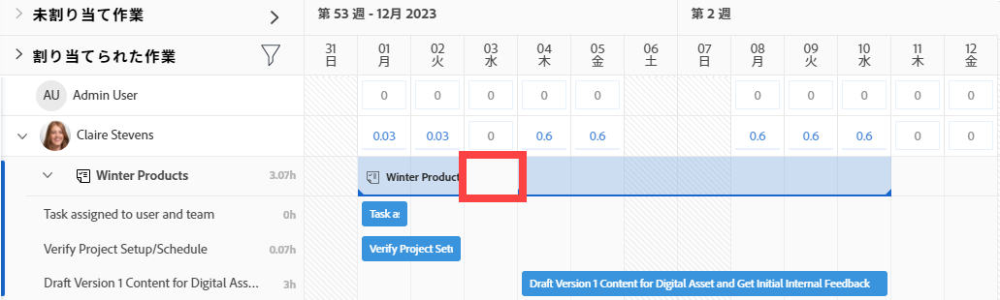
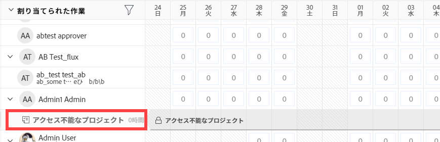
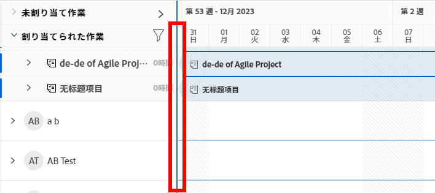
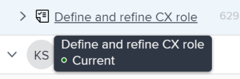
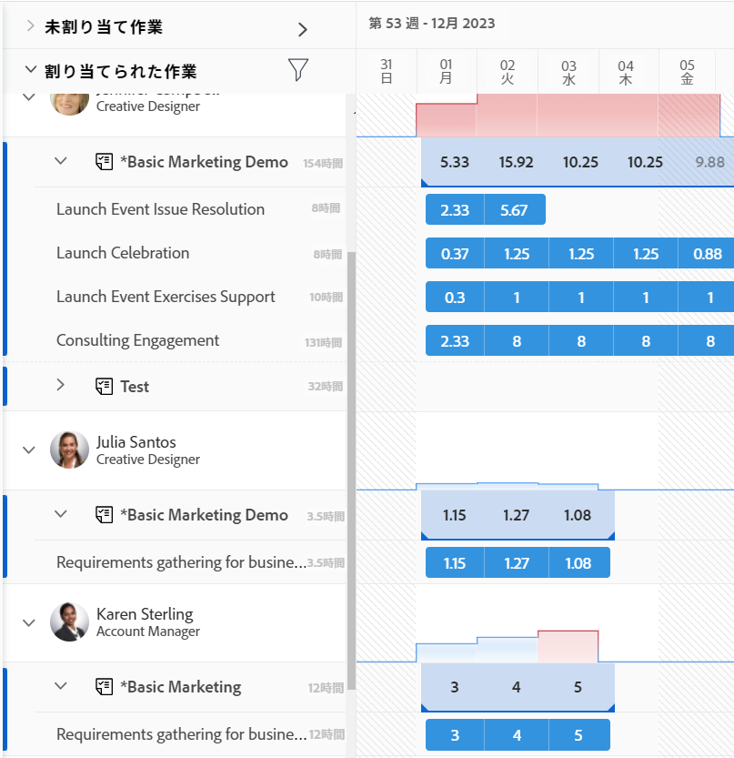
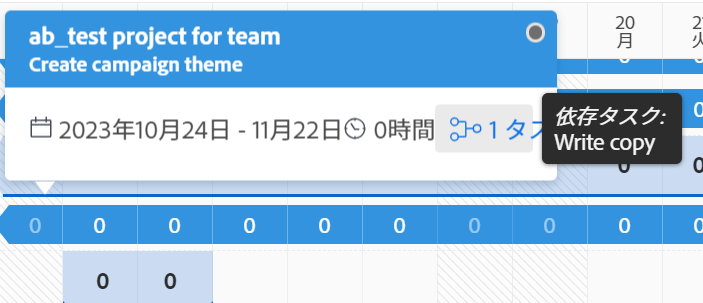

# ワークロードバランサーの操作

<!--Audited: 12/2024-->

Adobe Workfront のワークロードバランサーを使用すると、空き時間に基づいて作業をユーザーに割り当てることができます。 この記事では、設定やオプションを使用して、ワークロードバランサーを操作し、自分に関連する情報を表示する方法について説明します。 この記事で紹介されている他の記事では、ワークロードバランサーを使用してリソースや、リソースの作業の配分を管理する方法について説明しています。

ワークロードバランサーは、Adobe Workfront の複数の領域で使用できます。 操作方法はすべての領域で同様です。

ワークロードバランサーの場所について詳しくは、[ワークロードバランサーの検索](https://experienceleague.adobe.com/ja/docs/workfront/using/manage-resources/the-workload-balancer/locate-workload-balancer)を参照してください。

## アクセス要件

+++ 展開すると、この記事の機能のアクセス要件が表示されます。

<table style="table-layout:auto"> 
 <col> 
 <col> 
 <tbody> 
  <tr> 
   <td>Adobe Workfront パッケージ</td> 
   <td>
任意
</td>
  </tr>
  <tr> 
   <td>Adobe Workfront プラン</td> 
   <td>
標準

       
計画：リソーシング領域でワークロードバランサーを使用する場合、作業：チームまたはプロジェクトのワークロードバランサーを使用する場合
</td>
  </tr>
  <tr> 
   <td>アクセスレベル設定</td> 
   <td> 
次の項目に対する表示以上のアクセス権：
 
    <ul> 
     <li>リソース管理</li> 
     <li>プロジェクト</li> 
     <li>タスク</li> 
     <li>イシュー</li> 
    </ul>
   </td> 
  </tr> 
  <tr> 
   <td>オブジェクト権限</td> 
   <td>プロジェクト、タスク、イシューに対する表示またはそれ以上の権限</td> 
  </tr> 
 </tbody> 
</table>

詳しくは、[Workfront ドキュメントのアクセス要件](/help/quicksilver/administration-and-setup/add-users/access-levels-and-object-permissions/access-level-requirements-in-documentation.md)を参照してください。

+++

## ワークロードバランサーでの項目の表示に関する考慮事項

ワークロードバランサーを表示する際は、次の項目を考慮してください。

* ワークロードバランサーは、割り当てに応じて、2 つの別々のエリアに作業アイテムを表示します。 作業アイテムとユーザーは、次の領域に表示されます。

  * **未割り当て作業**：割り当てがない項目、あるいは担当業務またはチームにのみ割り当てられている項目。
  * **割り当てられた作業**：1 人以上のユーザーに割り当てられている項目。 割り当てられた項目は、割り当てられたユーザーの名前の下に表示されます。

  >[!NOTE]
  >
  >* 担当業務またはチームに割り当てられ、ユーザーにも割り当てられた作業アイテムは、未割り当て作業エリアと割り当てられた作業エリアの割り当てられたユーザーの名前の両方に表示されます。
  >* 作業アイテムがユーザーおよび担当業務に割り当てられ、担当業務がアイテムのプライマリ担当者として選択されている場合、未割り当て作業エリアに表示されます。
  >* 複数のユーザーに割り当てられた作業アイテムは、割り当てられた作業エリアのすべてのユーザーの名前に表示されます。
  >* 「役割の割り当てを表示」設定が有効になっている場合、役割の割り当ては未割り当て作業領域の作業項目の下に表示されます。 詳しくは、この記事の[表示のカスタマイズ](#customize-the-view)の節を参照してください。

  詳しくは、[&#x200B; ワークロードバランサーでの作業の割り当ての概要](/help/quicksilver/resource-mgmt/workload-balancer/assign-work-in-workload-balancer.md)の「[&#x200B; ワークロードバランサーの割り当て領域](/help/quicksilver/resource-mgmt/workload-balancer/assign-work-in-workload-balancer.md#assignment-areas-in-the-workload-balancer)」を参照してください。

* プロジェクトにタスクが一定期間ない場合は、その期間のプロジェクトレベルのバーが空白になります。

  

* 特定の項目を表示する権限がない場合は、「**アクセス不能な作業アイテム**」または「**アクセス不能なプロジェクト**」として表示されます。

  

* 作業アイテムの名前が左側に、タイムラインが右側に表示されます。
* 各作業アイテムの予定時間数の合計は、作業アイテム名の右側と、作業アイテムのタイムラインを表すバーの左側に表示されます。
* 各プロジェクトの予定時間数の合計は、プロジェクト名の右側と、プロジェクトのタイムラインを表すバーの左側に表示されます。

  プロジェクトの予定時間数の情報は、ワークロードバランサーにリストされているすべての項目の予定時間数の合計であり、プロジェクトの予定時間数の合計ではありません。

ワークロードバランサーの情報の表示について詳しくは、次の記事も参照してください。

* [ワークロードバランサーの使用場所](../workload-balancer/locate-workload-balancer.md)
* [ワークロードバランサーでの情報のフィルタリング](../workload-balancer/filter-information-workload-balancer.md)
* [リンクによるワークロードバランサーの共有](../workload-balancer/share-link-for-workload-balancer.md)
* [概要を使用したワークロードバランサーでの作業項目の更新](../workload-balancer/update-items-in-summary-panel-in-workload-balancer.md)

ワークロードバランサーを使用したリソース管理については、次の記事も参照してください。

* [ワークロードバランサーでの作業割り当ての概要](https://experienceleague.adobe.com/ja/docs/workfront/using/manage-resources/the-workload-balancer/assign-work-in-workload-balancer)
* [ワークロードバランサーでユーザー割り当ての管理する](https://experienceleague.adobe.com/ja/docs/workfront/using/manage-resources/the-workload-balancer/manage-user-allocations-workload-balancer)

## リソース領域での複数のプロジェクトを対象とするワークロードバランサーのナビゲーション

ワークロードバランサーのナビゲーションは、どの領域からアクセスする場合も同様です。

以下の各節では、ワークロードバランサーで複数のプロジェクトの情報を表示する方法について説明します。

ワークロードバランサーの様々な設定やオプションを調整して、自分にとって最も意味のある時間枠内で注目すべき情報を表示できます。

表示に適用する設定を選択したら、ワークロードバランサーは、任意のブラウザーまたはデバイスからアクセスされるたびにこれらの設定を記憶します。

### リソース領域での複数のプロジェクトを対象とするワークロードバランサーへのアクセス

複数のプロジェクトを対象とするワークロードバランサーをナビゲートするには、次の手順に従います。

{{step1-to-resourcing}}

1. 左側のパネルで&#x200B;**ワークロードバランサー**&#x200B;をクリックします。

   

   ワークロードバランサーでは、現在の週から始まる作業割当情報を次の 2 つの領域に表示します。

   * **未割り当て作業**&#x200B;領域には、次の作業項目が表示されます。

     * 役割やチームに割り当てられた作業項目（タスクとイシュー）または未割り当ての作業項目が、フィルターの適用後に表示されます。
       未割り当て作業領域には、デフォルトでは作業項目は表示されません。 フィルターを使用して、自分に関係のある情報をこの領域に表示することをお勧めします。

       フィルターの使用については、[ワークロードバランサーでの情報のフィルタリング](../workload-balancer/filter-information-workload-balancer.md)を参照してください。

     * 作業項目の下の役割の割り当ては、「役割の割り当てを表示」設定を有効にした場合にのみ表示されます。 詳しくは、この記事の[表示のカスタマイズ](#customize-the-view)の節を参照してください。

     * 「プロジェクトでグループ化」設定を有効にした場合にのみ、プロジェクトが表示されます。 詳しくは、この記事の[表示のカスタマイズ](#customize-the-view)の節を参照してください。

   * **割り当てられた作業**&#x200B;領域には、次の作業項目が表示されます。

     * デフォルトで、システム内のアクティブなユーザーがすべて、この領域に表示されます。 フィルターを使用して、この領域に表示される情報の量を制限することをお勧めします。 ユーザーが項目に割り当てられている場合は、その作業項目もユーザー名の下に表示されます。

     * 少なくとも 1 人のユーザーに割り当てられているタスクとイシューが、ユーザー名の下に表示されます。

       割り当てられた作業領域でユーザー名の下に表示される作業項目は、次の基準に従って下記の順に並べ替えられます。

       1. 予定開始日（古い順）
       1. 予定完了日（古い順）
       1. プロジェクト名のアルファベット順（最初の 2 つの基準が複数の作業項目で同じ場合のみ）

          >[!TIP]
          >
          >* プロジェクトの並べ替えは、「プロジェクト並べ替え基準」設定からオプションを選択することでカスタマイズできます。
          >
          >* プロジェクトは、「プロジェクトでグループ化」設定を有効にした場合にのみ表示されます。
          > 
          >設定のカスタマイズについては、この記事の「[表示のカスタマイズ](#customize-the-view)」の節を参照してください。

1. （オプション）**割り当てられた作業**&#x200B;エリアで&#x200B;**フィルター**&#x200B;アイコン  をクリックしてから、フィルターボックスの&#x200B;**候補**&#x200B;エリアで「**デフォルトのフィルター**」を選択します。

   デフォルトのフィルターを適用すると、任意のチームに属するユーザーとその作業項目が表示されます。 このフィルターのコピーを編集できます。

   >[!TIP]
   >
   >デフォルトのフィルターは、リソース領域のワークロードバランサーでのみ使用できます。

1. 引き続き次の手順に従って、ワークロードバランサーをナビゲートします。

   * [ワークロードバランサーでの時間枠の選択](#select-a-time-frame-in-the-workload-balancer)
   * [表示のカスタマイズ](#customize-the-view)
   * [作業項目の割り当てとユーザー割り当ての調整](#assign-work-items-and-adjust-user-allocations)
   * [割り当てのグラフ表示](#view-allocations-in-a-chart)

### ワークロードバランサーでの時間枠の選択

1. この記事の[リソース領域での複数のプロジェクトを対象とするワークロードバランサーへのアクセス](#access-the-workload-balancer-for-multiple-projects-in-the-resourcing-area)の節に従って、**リソース**&#x200B;領域でワークロードバランサーにアクセスします。

   ワークロードバランサーには、現在の週から始まる作業割当情報が表示されます。

1. 作業項目のタイムラインが画面の表示限度を超える場合、すべてのタイムラインを表示するには、水平スクロールを使用します。
1. 左上隅の&#x200B;**戻るまたは進む**&#x200B;アイコン  をクリックしてタイムラインを移動し、「**今日**」をクリックして今週まで戻ります。
1. ツールバーの&#x200B;**時間枠ドロップダウンメニュー**&#x200B;をクリックし、表示する期間の開始日をクリックします。 デフォルトでは、カレンダーで選択された最初の週が移動先の週になります。

   

1. 次のオプションから、ワークロードバランサーに一度に表示する週数を選択します。
   * 1 週間
   * 2 週間
   * 4 週間. これはデフォルトの設定です。
   * 6 週間
   * 3 か月

   

1. ツールバーで次のオプションのいずれかをクリックすると、様々な時間枠別に情報が表示されます。
   * **日**：デフォルトでは、今日の日付から 4 週間分の情報を日別に表示します。
   * **週**：4 週間の情報を週別に表示します。
   * **月**：3 か月間の情報を月別に表示します。

1. 以降の節で説明するように、引き続きワークロードバランサーをナビゲートします。

### 表示をカスタマイズ

1. **リソース**&#x200B;エリアでワークロードバランサーにアクセスします。この記事の[リソースエリアでの複数のプロジェクト用のワークロードバランサーへのアクセス](#access-the-workload-balancer-for-multiple-projects-in-the-resourcing-area)を参照してください。

   作業アイテムの名前は、ワークロードバランサーの左側にリストされ、右側のバーで表示されます。 バーの長さは、作業アイテムのタイムラインを表します。

1. （オプションおよび推奨）「未割り当て」および「割り当て済み」の作業エリアのフィルターを使用して、関連する作業アイテムまたはユーザーのみを表示します。

   詳しくは、[ワークロードバランサーの情報をフィルタリング](../workload-balancer/filter-information-workload-balancer.md)を参照してください。

   デフォルトでは、青いバーはプロジェクトとタスクのタイムラインを表し、栗色のバーはイシューを表します。

   プロジェクトに合わせてカラーテーマを選択すると、プロジェクトとタスクのバーの色を変更できます。 詳しくは、この手順を引き続きお読みください。

   「割り当てられた作業」エリアの作業アイテムは、次の基準に従って、プロジェクトごとに次の順序で並べ替えられます。
   1. 予定開始日（古い順）
   1. 予定完了日（古い順）
   1. プロジェクト名のアルファベット順（最初の 2 つの基準が複数の作業項目で同じ場合のみ）

1. 「未割り当て」エリアまたは「割り当て済み」エリアの左側にある&#x200B;**右向き矢印**&#x200B;をクリックすると、プロジェクト名の下（「未割り当て」エリア内）およびユーザー名の下（「割り当て済み」エリア内）のすべての項目を展開できます。

   >[!TIP]
   >
   >作業アイテムは、「プロジェクト別にグループ化」設定を有効にした場合にのみ、「未割り当て」エリアのプロジェクト名の下に表示されます。

1. 「未割り当て」エリアまたは「割り当て済み」エリアの左側にある&#x200B;**下向き矢印**&#x200B;をクリックすると、プロジェクト名の下（「未割り当て」エリア内）およびユーザー名の下（「割り当て済み」エリア内）のすべての項目を折りたためます。

1. カーソルを合わせ、左側のパネルとタイムライン領域の間に&#x200B;**分割線**&#x200B;をドラッグ&amp;ドロップして、左側のパネルのサイズを調整します。

   

1. **設定**&#x200B;アイコン  をクリックします。

   右側に設定パネルが表示されます。

   

   以下に表示されているオプションから選択して、ワークロードバランサーで表示する情報を更新し、設定ボックスの右上にある **X アイコン** をクリックしてボックスを閉じます。

   * **プロジェクト別にグループ化**：このオプションを選択すると、「未割り当て」および「割り当て済み」作業エリアの項目がプロジェクト別にグループ化されます。 これはデフォルトで選択されています。

   * **イシューの時間を含める**：このオプションを選択すると、ユーザーに割り当てられたイシューが「割り当てられた作業」エリアのユーザー名に表示され、ユーザーに割り当てられていないイシューが「未割り当ての作業」エリアに表示されます。 イシューの予定時間数は、プロジェクトおよび「割り当てられた作業」エリアのユーザーの予定時間数にカウントされます。
   * **見込日を表示**：このオプションを選択すると、予定タイムラインに加えて、作業アイテムの見込みタイムラインが表示されます。 次の点に注意してください。
     * プロジェクト、タスク、イシューの見込みタイムラインは、タスク、イシュー、プロジェクトバーの上に濃い青色の線で表示されます。
     * 以下に説明するように、カラーテーマを更新した場合でも、予定タイムラインの外側にある見込みタイムラインは、薄い青色で表示されます。
     * 表示するアクセス権がない項目の予定タイムラインは、下に線が付いた薄いグレーで表示されます。
     * タスクまたはイシューが予定完了日より前に完了すると、残りの日数に割り当てられた数値に取り消し線が引かれ、ユーザーの割り当てにはカウントされません。 これは、「見込日を表示」設定と「割り当てを表示」アイコンの両方が有効な場合にのみ表示されます。

     >[!TIP]
     >
     >選択した時間枠内に、予定または（必ずしも両方が同時に発生するわけではない）見込みタイムラインが発生すると、ワークロードバランサーに作業アイテムが表示されます。

   * **完了した作業の表示**：このオプションを有効にすると、完了したタスクとイシューが「割り当てられた作業」エリアに表示されます。 これはデフォルトで有効になっています。

     タスクまたはイシューが完了すると、タスクまたはイシューバーの右上隅に緑色のチェックマークアイコンが表示されます。 プロジェクトの選択した時間枠のタスクまたはイシューが完了すると、同じアイコンがプロジェクトに表示されます。

     >[!NOTE]
     >
     >ワークロードバランサーにおけるタスクの可視性は、割り当てレベルの完了ではなく、タスクレベルの完了によって促進されます。 タスクに複数の担当者が含まれ、1人以上の担当者が「自分のパートで完了」を選択したが、全体的なタスクステータスが「完了」でない場合、タスクは未完了の作業とみなされます。 完了した作業を表示オプション **がオフになっている場合、タスクは完全に完了していないため、引き続き表示されます。**

   * **残り時間を表示**：これを有効にすると、Workfront には、ユーザーのスケジュールに基づいて、ユーザーが作業できる毎日の時間と、ユーザーの「割り当てられた作業」エリアで割り当てられている時間との差が表示されます。 これはデフォルトで無効になっており、割り当てられた時間がデフォルトで表示されます。
   * **役割の割り当てを表示**：これを有効にすると、役割の割り当てが、割り当てられた作業項目の下の未割り当て作業領域に表示されます。 これはデフォルトで有効になっています。

   * 「**カラーテーマを選択**」セクションで、プロジェクトとタスクバーに使用する色を選択します。

     >[!TIP]
     >
     >カラーテーマを選択するための設定は、イシューバーの色には影響しません。 イシューは常に栗色のバーで表示されます。

     次の中から選択します。
     * **デフォルト**：すべてのプロジェクトとその作業アイテムのバーの色は、青で表示されます。
     * **プロジェクト**：各プロジェクトとそのタスクに関連付けられたバーの色は、プロジェクト名に応じて変わります。 そのプロジェクトに属するすべてのタスクは、プロジェクトと同じ色のバーで表示されます。 プロジェクトのバーは、タスクと区別するために明るい色で表示されます。 割り当てを表示しないことを選択した場合は、プロジェクトバーにプロジェクトアイコンも表示されます。
     * **プロジェクトステータス**：各プロジェクトとその作業アイテムに関連付けられたバーの色は、プロジェクトステータスの色に変わります。

       プロジェクトステータスは、プロジェクトのグループに関連付けられています。 グループにグループ固有のステータスがない場合、作業アイテムのバーの色は、システムレベルのプロジェクトステータスの色になります。 システムステータスとカスタムステータスの両方が表示されます。 グループステータスについて詳しくは、[グループステータスの作成または編集](../../administration-and-setup/manage-groups/manage-group-statuses/create-or-edit-a-group-status.md)を参照してください。

   * 「**ユーザー割り当ての表示**」セクションで、次のいずれかを選択します。
     * **時間数**：割り当てられた時間を時間単位で表示します。 これがデフォルトです。
     * **割合**：割り当てられた時間を使用可能な合計時間に対する割合で表示します。
   * 「**並べ替え環境設定**」セクションで、ワークロードバランサーでアイテムを並べ替える方法を選択します。 次のオプションから選択します。
     * **プライマリの役割でのユーザーの並べ替え**：ユーザーは「割り当てられた作業」エリアでプライマリの役割のアルファベット順に表示されます。
     * **ユーザーをアルファベット順に並べ替え**：ユーザーは「割り当てられた作業」エリアでファーストネームのアルファベット順に表示されます。
     * **プロジェクトを並べ替え**：プロジェクトは「未割り当ての作業」エリアまたは「割り当てられた作業」エリアで、ドロップダウンメニューから選択したプロジェクトフィールドのアルファベット順に表示されます。

   >[!TIP]
   >
   >プロジェクトで並べ替えをできるのは、「プロジェクトでグループ化」の設定が有効になっている場合のみです。 それ以外の場合は、この設定は淡色表示になります。

1. （オプションおよび条件付き）カラーテーマを「プロジェクトステータス」に変更する場合、左側のプロジェクト名にカーソルを合わせるとプロジェクトステータスが表示されます。

   

### 作業項目の割り当てとユーザー割り当ての調整

1. リソースエリアのワークロードバランサーにアクセスします。詳しくは、この記事の[リソースエリアの複数のプロジェクト用のワークロードバランサーへのアクセス](#access-the-workload-balancer-for-multiple-projects-in-the-resourcing-area)を参照してください。
1. **割り当てを表示**&#x200B;アイコン  をクリックして、作業アイテムの日次または週次の予定時間数を表示します。

   これにより、作業アイテムのバーの名前が、「未割り当ての作業」エリアと「割り当てられた作業」エリアの日次または週次の予定時間数に置き換えられます。 この設定は、デフォルトで無効になっています。

   配分超過を示す日は赤で表示されます。

   >[!TIP]
   >
   >* 「割り当てを表示する」オプションは、プロジェクト、タスク、イシュー、アクセスできないアイテムに対して表示される内容にのみ影響します。 ユーザーの日次の予定時間数はデフォルトで表示され、非表示にすることはできません。
   >* プロジェクトの日次の予定時間数を表示するには、「プロジェクト別のグループ」設定を有効にする必要があります。
   >* ワークロードバランサーを週次で表示すると、表示される時間数は週次の予定時間数になります。

1. （オプション）ユーザー行の割り当て済み時間数にカーソルを合わせると、ユーザーのキャパシティと配分がわかります。 キャパシティは、ユーザーのスケジュールに応じた空き状況です。

   

1. （オプション）「**割り当てを非表示にする」アイコン** 「をクリックすると、作業項目のバーにタスクとイシューの名前が表示されます。
1. タスク、イシュー、またはロール名の右側にある&#x200B;**詳細メニュー** アイコン をクリックし、以下のいずれかのオプションをクリックします。

   

   * 「**割り当て先:**」をクリックしてから、「**担当者、役割、またはチームの検索**」フィールドに作業アイテムを割り当てるユーザー、役割、チームの名前を入力します。

     「**詳細**」をクリックして、作業項目の詳細割り当て画面にアクセスします。 詳しくは、[詳細な割り当ての作成](/help/quicksilver/manage-work/tasks/assign-tasks/create-advanced-assignments.md)を参照してください。

     次のショートカットを使用して、タスクやイシューを割り当てることもできます。

     * Windows の場合：Ctrl キーを押しながらタスクまたはイシューバーをクリックします。
     * Mac の場合：Cmd キーを押しながらタスクまたはイシューバーをクリックします。

     ワークロードバランサーでユーザーに作業アイテムを割り当てる方法について詳しくは、[ワークロードバランサーでの作業割り当ての概要](../workload-balancer/assign-work-in-workload-balancer.md)を参照してください。

     >[!NOTE]
     >
     >役割の割り当ては、「役割の割り当てを表示」設定が有効になっている場合にのみ、未割り当て作業領域の作業項目の下に表示されます。 詳しくは、この記事の[表示のカスタマイズ](#customize-the-view)の節を参照してください。 役割の割り当てには、**詳細メニュー**&#x200B;の「**これを**&#x200B;に割り当て」オプションしかありません。

     >[!TIP]
     >
     >お使いの環境で Workfront 管理者またはグループ管理者が委任を有効にしている場合は、「割り当て」タブを使用して、ユーザーをタスクまたはイシューに割り当てます。 作業の委任について詳しくは、[&#x200B; タスクと問題の委任](../../manage-work/delegate-work/how-to-delegate-work.md)を参照してください。

   * 「**割り当てを編集する**」。そのユーザーの日次または週次の割り当てを編集します。 ユーザー割り当ての管理について詳しくは、[ワークロードバランサーでのユーザー割り当ての管理](../workload-balancer/manage-user-allocations-workload-balancer.md)を参照してください。

   * **概要を開く**. 右側に概要パネルが開きます。「割り当て」フィールドをクリックしてから、「**担当者、役割、またはチームの検索**」フィールドに作業アイテムを割り当てるユーザー、役割、チームの名前を入力します。 詳しくは、この記事のセクション[タスクとイシューに関する詳細情報を表示](#display-more-information-about-tasks-and-issues)を参照してください。

1. （オプション）作業アイテムのバー内のユーザーに対する日次または週次の割り当てをダブルクリックして、割り当てられた時間数を編集します。次に、**保存**&#x200B;アイコン  をクリックして割り当てを保存するか、**キャンセル**&#x200B;アイコン  をクリックして調整した割り当てを削除します。

   >[!TIP]
   >
   >保存アイコンとキャンセルアイコンは、タスクまたはイシューのタイムラインバーの端に表示されます。
   >
   >

   ユーザー割り当ての管理について詳しくは、[ワークロードバランサーでのユーザー割り当ての管理](../workload-balancer/manage-user-allocations-workload-balancer.md)を参照してください。

1. 「**一括割り当て**」をクリックして、作業アイテムを一括で割り当てます。

   詳しくは、[ワークロードバランサーを使用して作業を一括で割り当てる](../workload-balancer/assign-work-in-workload-balancer-in-bulk.md)を参照してください。
1. **未割り当ての作業**&#x200B;エリアまたはユーザーから項目をドラッグして、別のユーザー上にドロップして割り当てます。

   詳しくは、[ドラッグ&amp;ドロップによりワークロードバランサーで作業を割り当てる](../workload-balancer/assign-work-in-workload-balancer-by-drag-and-drop.md)を参照してください。

### 割り当てのグラフ表示

日次数または週次数で割り当てを表示する代わりに、グラフで表示できます。

1. この記事の[リソースエリアの複数のプロジェクト用のワークロードバランサーへのアクセス](#access-the-workload-balancer-for-multiple-projects-in-the-resourcing-area)の節で説明されるように、リソースエリアのワークロードバランサーにアクセスします。
1. **グラフアイコン**  をクリックすると、ユーザー割り当てがグラフ形式で表示されます。

   ユーザーの割り当てが超過する日は、赤色のブロックで表示され、ユーザーの割り当てが過少する日または容量は、青色のブロックで表示されます。

   ブロックのサイズは、割り当ての量を示します。ボックスが大きいほど、その日または週の作業アイテムに割り当てられる時間が多くなります。

   

### タスクとイシューに関する詳細情報を表示する

ワークロードバランサーのタスクとイシューに関する詳細を表示できます。

1. この記事の[リソースエリアの複数のプロジェクト用のワークロードバランサーへのアクセス](#access-the-workload-balancer-for-multiple-projects-in-the-resourcing-area)の節で説明されるように、リソースエリアのワークロードバランサーにアクセスします。
1. 概要パネルに詳細情報を表示するには、次のいずれかの操作を行います。

   * タスクまたはイシューのバーをクリックして、右側の概要パネルを開きます。
   * **概要を開く** アイコン をクリックし、タスクまたは問題のバーをクリックして概要パネルを開きます。
   * タスクまたはイシューの右側にある&#x200B;**その他**&#x200B;メニューをクリックして、「**概要を開く**」をクリックします。

   ワークロードバランサーの概要でタスク情報を更新する方法について詳しくは、[概要を使用してワークロードバランサーの作業アイテムを更新する](../workload-balancer/update-items-in-summary-panel-in-workload-balancer.md)を参照してください。

1. タスクまたはイシューの名前の上にポインタを合わせると、タスクまたはイシューの詳細が表示されます。 タスクまたはイシューの上に次の情報が表示されるボックスです。

   * タスクまたはイシューの名前。
   * プロジェクトの名前。
   * 予定開始日と完了日。
   * 予定時間数。
   * タスクの場合は、先行の番号。
   * タスクには、ボックスの上隅にタスクが作業可能かどうかを示すインジケーターが表示されます。

   

1. 左側の作業アイテムの名前をクリックしてアクセスします。 作業アイテムが新しいブラウザーのタブで開きます。

### ワークロードバランサーを全画面表示する

1. この記事の[リソースエリアの複数のプロジェクト用のワークロードバランサーへのアクセス](#access-the-workload-balancer-for-multiple-projects-in-the-resourcing-area)の節で説明されるように、リソースエリアのワークロードバランサーにアクセスします。

1. **全画面表示**&#x200B;アイコン  をクリックして、ワークロードバランサーをフルスクリーンで表示します。

   ワークロードバランサーが画面全体に表示されます。 ブラウザーウィンドウとタブは、表示から除外されます。

1. **全画面表示を中止**&#x200B;アイコン  をクリックして、デフォルトの画面に戻り、ブラウザーのタブ内にワークロードバランサーを表示します。

## チームのワークロードバランサーの操作

チームのワークロードバランサーの操作は、複数のプロジェクトに対するワークロードバランサーの操作方法と似ています。 詳しくは、この記事の[複数のプロジェクトに対するワークロードバランサーの操作](#navigate-the-workload-balancer-for-multiple-projects-in-the-resourcing-area)の節を参照してください。

{{step1-to-team}}

ホームチームのページがデフォルトで表示されます。

1. 左側のパネルで&#x200B;**ワークロードバランサー**&#x200B;をクリックします。

   

   チームのワークロードバランサーには、デフォルトで次の情報が表示されます。

   * **未割り当て作業**&#x200B;領域で、チームまたはチームと担当業務に割り当てられ、ユーザーに割り当てられていない作業項目。 「役割の割り当てを表示」設定が有効になっている場合、役割の割り当ては未割り当て作業領域の作業項目の下に表示されます。
   * **割り当てられた作業**&#x200B;エリア：ユーザーに割り当てられた作業アイテムは、ユーザー名の下に表示されます。

1. この記事の[リソース領域での複数のプロジェクトを対象とするワークロードバランサーのナビゲーション](#navigate-the-workload-balancer-for-multiple-projects-in-the-resourcing-area)の節に従って、引き続き、チームのワークロードバランサーをナビゲートします。

## 単一プロジェクトのワークロードバランサーのナビゲーション

{{step1-to-projects}}

1. プロジェクトの名前をクリックして、プロジェクトページを開きます。
1. 左側のパネルで&#x200B;**ワークロードバランサー**&#x200B;をクリックします。

   

   プロジェクトのワークロードバランサーには、デフォルトで次の情報が表示されます。

   * **未割り当て作業**&#x200B;領域で、役割またはチームに割り当てられ、ユーザーに割り当てられていないプロジェクト上の作業項目。 「役割の割り当てを表示」設定が有効になっている場合、役割の割り当ては未割り当て作業領域の作業項目の下に表示されます。
   * **割り当てられた作業**&#x200B;領域内：プロジェクトの作業項目のうち、少なくとも 1 人のユーザーに割り当てられているもの。

   フィルターを使用して、自分にとって重要なユーザーのみを表示することをお勧めします。

   例えば、自分のチームまたはグループに属するユーザーのみを表示することを検討します。 詳しくは、[ワークロードバランサーでの情報のフィルタリング](../workload-balancer/filter-information-workload-balancer.md)を参照してください。

1. （オプション）割り当てられた作業エリアで&#x200B;**フィルター**&#x200B;アイコン  をクリックし、フィルターパネルの&#x200B;**候補**&#x200B;エリアから「**このプロジェクトの作業アイテム**」オプションを選択します。 このフィルターは、デフォルトでは選択されていません。

   このオプションを選択すると、選択したプロジェクトのユーザーに割り当てられた項目のみが表示されます。

   このオプションを選択しない場合、アイテムが属しているプロジェクトに関係なく、プロジェクトのユーザーに割り当てられたすべての項目が表示されます。

1. （オプションおよび推奨）割り当てられた作業エリアにフィルターを適用して、自分にとって重要であるにもかかわらずプロジェクトのアイテムに割り当てられていない可能性のあるユーザーを表示したあと、**すべてのユーザーを表示**&#x200B;アイコン  をクリックします。

   すべてのユーザーを表示することで、プロジェクトの作業や他の役割にまだ割り当てられていない Workfront 内のすべてのユーザーを表示できます。

   最初にフィルターを適用して、表示するユーザーの数を減らすことができます。

   例えば、まず自分のチームまたはグループに属しているユーザーをフィルタリングして抜き出し、次にそれらのユーザーをすべて表示するといった具合です。

   フィルターの作成方法については、[ワークロードバランサーでの情報のフィルタリング](../workload-balancer/filter-information-workload-balancer.md)を参照してください。

   >[!NOTE]
   >
   > 「すべてのユーザーを表示」オプションは、プロジェクトのワークロードバランサーでのみ使用できます。

1. （オプション）**役割割り当てを表示**&#x200B;アイコン  をクリックします。

   役割の配分パネルが表示されます。

   プロジェクトの担当業務に関連付けられている予定時間数と、シナリオプランナからプロジェクトにリンクされたイニシアチブに関連付けられている担当業務に関する情報を表示できます。

   詳しくは、[プロジェクトとイニシアチブ間でのリソース割り当て調整の概要](../../scenario-planner/overview-reconcile-allocations-between-projects-initiatives.md)を参照してください。

   >[!NOTE]
   >
   >組織が Workfront シナリオプランナのライセンスを購入していない場合は、イニシアチブの担当業務情報を表示できません。 この場合は、プロジェクトの担当業務に関連付けられている予定時間数のみ表示できます。 詳しくは、[シナリオプランナの使用に必要なアクセス権](../../scenario-planner/access-needed-to-use-sp.md)を参照してください。

1. この記事の[複数のプロジェクトを対象とするワークロードバランサーのナビゲーション](#navigate-the-workload-balancer-for-multiple-projects-in-the-resourcing-area)の節に従って、引き続き、プロジェクトのワークロードバランサーをナビゲートします。

## ユーザーのワークロードバランサーの移動

自分のユーザープロファイルからワークロードバランサーにアクセスできます。

{{step1-click-profile-pic}}

1. 左側のパネルで&#x200B;**ワークロードバランサー**&#x200B;をクリックします。

   ユーザーのワークロードバランサーが表示されます。

   ユーザーの ワークロードバランサー

   ユーザーのワークロードバランサーには、デフォルトで次の情報が表示されます。

   * **割り当てられた作業**：特定のユーザーに割り当てられたタスクと問題。

   >[!NOTE]
   >
   >ユーザープロファイルのワークロードバランサーは読み取り専用で、割り当てと割り当てを変更することはできません。

1. この記事の「[複数のプロジェクトのワークロードバランサーの移動](#navigate-the-workload-balancer-for-multiple-projects-in-the-resourcing-area)」の節で説明しているように、ユーザーのワークロードバランサーの操作を続行します。

