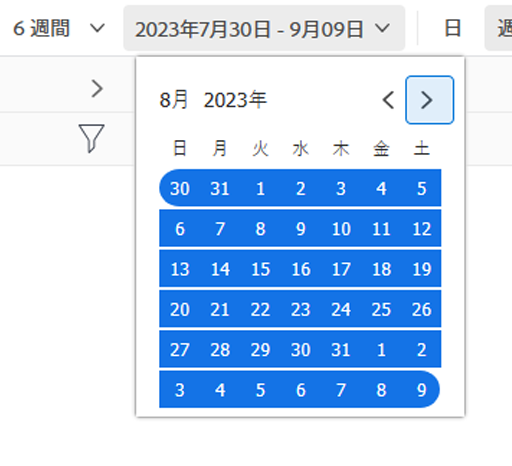
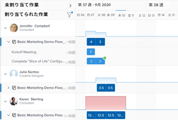

# ワークロード・バランサのナビゲート

Adobe Workfrontのワークロードバランサーを使用して、使用可否に基づいて作業をユーザーに割り当てます。 この記事では、設定とオプションを使用して、ワークロードバランサーをナビゲートし、関連する情報を表示する方法について説明します。 ここに示すその他の記事では、ワークロードバランサーを使用してリソースを管理する方法と、リソースの割り当てを有効にする方法について説明します。

ワークロードバランサーは、Adobe Workfrontの複数の領域で使用できます。 ナビゲーションは、すべての領域で同様です。

ワークロード・バランサの場所の詳細は、 [ワークロード・バランサの検索](https://experienceleague.adobe.com/docs/workfront/using/manage-resources/the-workload-balancer/locate-workload-balancer.html?lang=en).

## アクセス要件

<!--drafted - replace table for P&P:

<table style="table-layout:auto"> 
 <col> 
 <col> 
 <tbody> 
  <tr> 
   <td role="rowheader">Adobe Workfront plan*</td> 
   <td> 
Any 
 </td> 
  </tr> 
  <tr> 
   <td role="rowheader">Adobe Workfront license*</td> 
<td>
Current license: Standard 

    Or 

Legacy license:

    <ul>
    <li>
Plan, when using the Workload Balancer for a team or in the Resourcing area 
</li>
    <li>
Work, when using the Workload Balancer of a project 
</li>
    </ul>
 </td> 
  </tr> 
  <tr> 
   <td role="rowheader">Access level configurations*</td> 
   <td> 
View or higher access to the following:
 
    <ul> 
     <li> 
Resource Management
 </li> 
     <li> 
Projects
 </li> 
     <li> 
Tasks
 </li> 
     <li> 
Issues
 </li> 
    </ul> 
If you still don't have access, ask your Workfront administrator if they set additional restrictions in your access level. For information on how a Workfront administrator can change your access level, see <a href="../../administration-and-setup/add-users/configure-and-grant-access/create-modify-access-levels.md" class="MCXref xref">Create or modify custom access levels</a>.
 </td> 
  </tr> 
  <tr> 
   <td role="rowheader">Object permissions</td> 
   <td> 
View or higher permissions to the projects, tasks, and issues 
 
For information on requesting additional access, see <a href="../../workfront-basics/grant-and-request-access-to-objects/request-access.md" class="MCXref xref">Request access to objects </a>.
 </td> 
  </tr> 
 </tbody> 
</table>
-->

この記事の手順を実行するには、次のアクセス権が必要です。

<table style="table-layout:auto"> 
 <col> 
 <col> 
 <tbody> 
  <tr> 
   <td role="rowheader">Adobe Workfront plan*</td> 
   <td> 
任意 
 </td> 
  </tr> 
  <tr> 
   <td role="rowheader">Adobe Workfront license*</td> 
   <td> 
リソース領域でワークロードバランサーを使用する場合の計画

   
チームまたはプロジェクトのワークロードバランサーを使用する場合の作業

 </td> 
  </tr> 
  <tr> 
   <td role="rowheader">アクセスレベル設定*</td> 
   <td> 
次の項目へのアクセス権を表示または高くします。
 
    <ul> 
     <li> 
リソース管理
 </li> 
     <li> 
プロジェクト
 </li> 
     <li> 
タスク
 </li> 
     <li> 
問題
 </li> 
    </ul> 
まだアクセス権がない場合は、Workfront管理者に、アクセスレベルに追加の制限を設定しているかどうかを問い合わせてください。 Workfront管理者がアクセスレベルを変更する方法について詳しくは、 <a href="../../administration-and-setup/add-users/configure-and-grant-access/create-modify-access-levels.md" class="MCXref xref">カスタムアクセスレベルの作成または変更</a>.
 </td> 
  </tr> 
  <tr> 
   <td role="rowheader">オブジェクトの権限</td> 
   <td> 
プロジェクト、タスクおよび問題に対する権限を表示またはそれ以上に設定します 
 
追加のアクセス権のリクエストについて詳しくは、 <a href="../../workfront-basics/grant-and-request-access-to-objects/request-access.md" class="MCXref xref">オブジェクトへのアクセスのリクエスト </a>.
 </td> 
  </tr> 
 </tbody> 
</table>

*保有するプラン、ライセンスの種類、アクセス権を確認するには、Workfront管理者にお問い合わせください。

## ワークロードバランサーでの項目の表示に関する考慮事項

ワークロード・バランサを表示する際は、次の点を考慮してください。

* ワークロード・バランサは、割り当てに応じて、2 つの異なる領域に作業項目を表示します。 作業項目とユーザーは、次の領域に表示されます。

   * **未割り当ての作業**：アサイメントがない品目、またはジョブのロールまたはチームにのみ割り当てられている品目。
   * **割り当てられた作業**：少なくとも 1 人のユーザーに割り当てられている項目。 割り当てられた項目は、割り当てられたユーザーの名前の下に表示されます。

  >[!NOTE]
  >
  >* ジョブの役割またはチームに割り当てられ、また主な担当者であるユーザーに割り当てられた作業項目は、「未割り当て作業」領域には表示されません。
  >* ユーザーに割り当てられ、ジョブロールがアイテムの主な担当者として選択されているジョブロールに対して、「未割り当ての作業」領域に表示されます。
  >* 複数のユーザーに割り当てられた作業項目は、「割り当てられた作業」領域の割り当てられたユーザーの名前のすべてに表示されます。

* ある期間、プロジェクトにタスクがない場合は、プロジェクトレベルのバーが淡色表示になります。

  

* 特定の項目を表示する権限がない場合は、「 **アクセスできない作業項目** または **アクセスできないプロジェクト**.

  

* 作業項目の名前が左側に、タイムラインが右側に表示されます。
* 各作業項目の計画時間の合計は、作業項目名の右側と、作業項目のタイムラインを表すバーの左側に表示されます。
* 各プロジェクトの計画時間の合計は、プロジェクト名の右側と、プロジェクトのタイムラインを表すバーの左側に表示されます。

  プロジェクトの計画時間情報は、ワークロード・バランサにリストされているすべての項目からの計画時間の合計であり、プロジェクトの計画時間の合計ではありません。

ワークロード・バランサの情報の表示の詳細は、次の記事も参照してください。

* [ワークロード・バランサの検索](../workload-balancer/locate-workload-balancer.md)
* [ワークロードバランサーの情報のフィルタリング](../workload-balancer/filter-information-workload-balancer.md)
* [リンクとのワークロードバランサーの共有](../workload-balancer/share-link-for-workload-balancer.md)
* [サマリーを使用してワークロードバランサーの作業項目を更新する](../workload-balancer/update-items-in-summary-panel-in-workload-balancer.md)

ワークロード・バランサを使用したリソース管理の詳細は、次の記事も参照してください。

* [ワークロードバランサーでの作業割り当ての概要](https://experienceleague.adobe.com/docs/workfront/using/manage-resources/the-workload-balancer/assign-work-in-workload-balancer.html?lang=en)
* [ワークロードバランサーでのユーザー割り当ての管理](https://experienceleague.adobe.com/docs/workfront/using/manage-resources/the-workload-balancer/manage-user-allocations-workload-balancer.html?lang=en)

## リソース領域の複数のプロジェクトのワークロード・バランサをナビゲートします。

ワークロード・バランサのナビゲーションは、アクセス元のすべての領域で似ています。

次のサブセクションでは、複数のプロジェクトのワークロード・バランサの情報を表示する方法について説明します。

ワークロードバランサーの設定とオプションの数を調整して、最も意味のある時間枠内に集中する必要のある情報を表示できます。

ビューに適用する設定を選択すると、ワークロードバランサーは、ブラウザーまたはデバイスからアクセスするたびにこれらの設定を記憶します。

### リソース領域の複数のプロジェクト用のワークロードバランサーへのアクセス

複数のプロジェクトのワークロード・バランサをナビゲートする手順は、次のとおりです。

1. 次をクリック： **メインメニュー** アイコン  Workfrontの右上隅で、 **リソース**.
1. クリック **ワークロードバランサー** をクリックします。

   

   ワークロード・バランサは、次の 2 つの領域に、現在の週で始まる作業割当情報を表示します。

   * The **未割り当ての作業** 領域には、次の作業項目が表示されます。

      * 役割、チーム、または未割り当ての作業項目に割り当てられた作業項目（タスクとタスク）は、フィルターを適用した後に表示されます。
「未割り当て作業」領域には、デフォルトで作業項目は表示されません。 フィルターを使用して、この領域の関連情報を表示することをお勧めします。

        フィルターの使用について詳しくは、 [ワークロードバランサーの情報のフィルタリング](../workload-balancer/filter-information-workload-balancer.md).

      * プロジェクトは、「プロジェクト別にグループ化」設定を有効にした場合にのみ表示されます。 詳しくは、 [表示のカスタマイズ](#customize-the-view) 」を参照してください。

   * The **割り当てられた作業** 領域には、次の作業項目が表示されます。

      * システム内のすべてのアクティブなユーザーは、デフォルトでこの領域に表示されます。 この領域の情報量を制限するには、フィルターを使用することをお勧めします。 ユーザーがアイテムに割り当てられている場合は、作業項目もその名前で表示されます。

      * 少なくとも 1 人のユーザーに割り当てられたタスクとタスクが、ユーザー名の下に表示されます。

        「割り当てられた作業」領域で、ユーザー名の下の作業項目は、次の基準に従って並べ替えられます。

         1. 計画開始日（古い順）
         1. 計画完了日（古い順）
         1. プロジェクト別のアルファベット順（最初の 2 つの条件が複数の作業項目で同じ場合のみ）

            >[!TIP]
            >
            >* プロジェクトの並べ替えは、[ プロジェクトの並べ替え ] 設定からオプションを選択することでカスタマイズできます。
            >
            >* プロジェクトは、「プロジェクト別にグループ化」設定を有効にした場合にのみ表示されます。
            > 
            >設定のカスタマイズについて詳しくは、「 [表示のカスタマイズ](#customize-the-view) 」を参照してください。

1. （オプション） **フィルター** アイコン  （内） **割り当てられた作業** 「 」領域で、「 **デフォルトのフィルター** （内） **推奨** 領域を選択します。

   デフォルトのフィルターを適用すると、任意のチームに属するユーザーとその作業項目が表示されます。 このフィルターのコピーを編集できます。

   >[!TIP]
   >
   >デフォルト・フィルタは、リソース領域のワークロード・バランサでのみ使用できます。

1. 次の手順に従って、ワークロード・バランサをナビゲートします。

   * [ワークロードバランサーで時間枠を選択します。](#select-a-time-frame-in-the-workload-balancer)
   * [表示のカスタマイズ](#customize-the-view)
   * [作業項目の割り当てとユーザー割り当ての調整](#assign-work-items-and-adjust-user-allocations)
   * [グラフの割り当てを表示](#view-allocations-in-a-chart)

### ワークロードバランサーで時間枠を選択します。

1. のワークロードバランサーへのアクセス **リソース** 領域（「 」セクションで説明） [リソース領域の複数のプロジェクト用のワークロードバランサーへのアクセス](#access-the-workload-balancer-for-multiple-projects-in-the-resourcing-area) 」を参照してください。

   ワークロード・バランサには、現在の週で始まる作業割当情報が表示されます。

1. 画面の制限を超えて広がる作業項目のタイムラインを表示するには、水平スクロールを使用します。
1. 次をクリック： **後ろまたは前に** アイコン  左上隅でタイムラインに移動し、「 **今日** 現在の週に戻る
1. 次をクリック： **時間枠ドロップダウンメニュー** ツールバーで、表示する期間の開始日をクリックします。 デフォルトでは、カレンダーで選択された最初の週は、移動先の週です。

   

1. 次のオプションから、ワークロードバランサーに一度に表示する週数を選択します。
   * 1 週間
   * 2 週間
   * 4 週間. これはデフォルト設定です。
   * 6 週間
   * 3 か月

   

1. ツールバーで次のいずれかのオプションをクリックすると、異なる時間枠で情報が表示されます。
   * **日**：デフォルトで、今日の日付から始まる 4 週間の情報を日別に表示します。
   * **週**:4 週間の情報を週別に表示します。
   * **月**:3 ヶ月間の情報を月別に表示します。

1. 以降の項で説明するように、引き続きワークロードバランサーをナビゲートします。

### 表示のカスタマイズ

1. のワークロードバランサーへのアクセス **リソース** 領域（「 」セクションで説明） [リソース領域の複数のプロジェクト用のワークロードバランサーへのアクセス](#access-the-workload-balancer-for-multiple-projects-in-the-resourcing-area) 」を参照してください。

   作業項目の名前は、左側に表示され、ワークロードバランサーの右側のバーで表されます。 バーの長さは、作業項目のタイムラインを表します。

1. （オプションおよび推奨）「未割り当て」および「割り当て済み」の作業領域のフィルターを使用して、関連する作業項目またはユーザーのみを表示します。

   詳しくは、 [ワークロードバランサーの情報のフィルタリング](../workload-balancer/filter-information-workload-balancer.md).

   デフォルトでは、青いバーはプロジェクトとタスクのタイムラインを表し、マルーンバーは問題を表します。

   プロジェクトに合わせてカラーテーマを選択する際に、プロジェクトとタスクのバーの色を変更できます。 詳細については、この手順を引き続きお読みください。

   「割り当てられた作業」領域の作業項目は、次の基準に従って、プロジェクトごとに次の順序で並べ替えられます。
   1. 計画開始日（古い順）
   1. 計画完了日（古い順）
   1. プロジェクト別のアルファベット順（最初の 2 つの条件が複数の作業項目で同じ場合のみ）

1. 次をクリック： **右矢印** 「未割り当て」領域または「割り当て済み」領域の左側にあるので、プロジェクト名（「未割り当て」領域内）とユーザー名（「割り当て済み」領域内）の下にあるすべてのアイテムを展開できます。

   >[!TIP]
   >
   >作業項目は、「プロジェクト別にグループ化」設定を有効にした場合にのみ、「未割り当て」領域のプロジェクト名の下に表示されます。

1. 次をクリック： **下向き矢印** 「未割り当て」領域または「割り当て済み」領域の左側にあるをクリックすると、プロジェクト名（「未割り当て」領域内）とユーザー名（「割り当て済み」領域内）の下にあるすべてのアイテムが折りたたまれます。

1. 次をドラッグ&amp;ドロップ： **分離線** 左のパネルとタイムライン領域の間を移動して、左のパネルのサイズを調整します。

   

1. 次をクリック： **設定** アイコン .

   右側に [ 設定 ] パネルが表示されます。

   

   以下のオプションから選択して、ワークロード・バランサで表示する情報を更新し、 **X アイコン** をクリックして閉じます。

   * **プロジェクト別にグループ化**：このオプションを選択すると、「未割り当て」および「割り当て済み」作業領域の項目がプロジェクト別にグループ化されます。 これはデフォルトで選択されています。

   * **問題からの時間数を含める**：このオプションを選択すると、ユーザーに割り当てられたタスクが「割り当てられた作業」領域のユーザーの名前に表示され、ユーザーに割り当てられていないタスクが「未割り当ての作業」領域に表示されます。 問題からの計画時間は、プロジェクトの計画時間に対して、また、「割り当てられた作業」領域のユーザーに対してカウントされます。
   * **推定日を表示**：このオプションを選択すると、計画タイムラインに加えて、作業項目の推定タイムラインが表示されます。 次の点に注意してください。
      * プロジェクト、タスクおよびタスクの推定タイムラインは、タスク、タスクおよびプロジェクトバーの上に濃い青色の線で表示されます。
      * 以下に説明するように、カラーテーマを更新した場合でも、計画されたタイムラインの外側にある投影されたタイムラインは、明るい青で表示されます。
      * 表示するアクセス権のない項目の投影されたタイムラインは、薄いグレーで、その下に線が表示されます。
      * 予定完了日の前にタスクまたは問題が完了した場合、残りの日数の配分数は打たれ、ユーザーの配分にはカウントされません。 これは、「予定日を表示」設定と「配分を表示」アイコンの両方が有効な場合にのみ表示されます。

     >[!TIP]
     >
     >作業項目は、選択した期間中に、計画または（必ずしも両方とも同時に）予測タイムラインが発生した場合に、ワークロードバランサーに表示されます。

   * **完了した作業を表示**：このオプションを有効にすると、完了したタスクと問題が「割り当て済みの作業」領域に表示されます。 これはデフォルトで有効になっています。

     タスクまたはイシューバーが完了すると、タスクまたはイシューバーの右上隅に緑色のチェックマークアイコンが表示されます。 プロジェクトの選択した期間のタスクまたはタスクが完了すると、同じアイコンがプロジェクトに対して表示されます。
   * **残り時間を表示**：これを有効にすると、Workfrontには、ユーザーのスケジュールに基づいて、ユーザーが作業できる日次時間と、ユーザーの「割り当てられた作業時間」領域で割り当てられた時間との差が表示されます。 これはデフォルトで無効になっており、割り当てられた時間はデフォルトで表示されます。
   * Adobe Analytics の **カラーテーマを選択** [ ] セクションで、プロジェクトとタスクバーに使用する色を選択します。

     >[!TIP]
     >
     >カラーテーマを選択するための設定は、問題バーの色には影響しません。 問題は常にマルーンカラーバーに表示されます。

     次の中から選択します。
      * **デフォルト**：すべてのプロジェクトのバーとその作業項目が青で表示されます。
      * **プロジェクト**：各プロジェクトに関連付けられたバーと、そのタスクは、プロジェクトの名前に応じて変わります。 プロジェクトに属するすべてのタスクは、プロジェクトの色と一致するバーで表示されます。 プロジェクトバーは、タスクと区別するために明るい色で表示されます。 割り当てを表示しないことを選択した場合は、プロジェクトバーにプロジェクトアイコンも表示されます。
      * **プロジェクトのステータス**：各プロジェクトとその作業項目に関連付けられたバーは、プロジェクトのステータスの色に変わります。

        プロジェクトのステータスは、プロジェクトのグループに関連付けられています。 グループにグループ固有のステータスがない場合、作業項目バーの色は、システムレベルのプロジェクトステータスの色になります。 システムとカスタムステータスの両方が表示されます。 グループのステータスについて詳しくは、 [グループのステータスの作成または編集](../../administration-and-setup/manage-groups/manage-group-statuses/create-or-edit-a-group-status.md).

   * Adobe Analytics の **でのユーザー割り当ての表示** 「 」セクションで、次の中から選択します。
      * **時間**：割り当てられた時間を時間単位で表示します。 これがデフォルトです。
      * **割合**：割り当てられた時間を使用可能な合計時間に対する割合で表示します
   * Adobe Analytics の **並べ替え環境設定** 「 」セクションで、ワークロード・バランサでアイテムを並べ替える方法を選択します。 次のオプションから選択します。
      * **ユーザーの役割でのプライマリの並べ替え**：ユーザーは、「割り当てられた作業」領域で、プライマリの役割のアルファベット順に表示されます。
      * **ユーザーをアルファベット順に並べ替え**：ユーザーは、「割り当てられた作業」領域で、名をアルファベット順に表示します。
      * **プロジェクトの並べ替え基準**：ドロップダウンメニューからプロジェクトフィールドを選択して、「未割り当て」または「割り当て済み」領域のそのフィールドでプロジェクトをアルファベット順に並べ替えます。

   >[!TIP]
   >
   >プロジェクトで並べ替えできるのは、[ プロジェクトでグループ化 ] 設定が有効になっている場合のみです。 それ以外の場合は、この設定は淡色表示になります。

1. （オプションおよび条件付き）カラーテーマを「プロジェクトステータス」に変更する場合、左側のプロジェクトの名前の上にマウスポインターを置くと、プロジェクトのステータスが表示されます。

   

### 作業項目の割り当てとユーザー割り当ての調整

1. 「リソース」領域のワークロード・バランサにアクセスします。詳しくは、の項を参照してください。 [リソース領域の複数のプロジェクト用のワークロードバランサーへのアクセス](#access-the-workload-balancer-for-multiple-projects-in-the-resourcing-area) 」を参照してください。
1. 次をクリック： **割り当てアイコンを表示**  ：作業項目の日次または週次の計画時間を表示します。

   これにより、作業項目のバーの名前が、「未割り当て」および「割り当て済作業時間」領域の日単位または週単位の計画時間数に置き換えられます。 この設定は、デフォルトでは無効です。

   割り当て超過を示す日は赤で表示されます。

   >[!TIP]
   >
   >* 「割り当てを表示」オプションは、プロジェクト、タスク、問題、アクセスできない項目に対して表示される内容にのみ影響します。 ユーザーの日別計画時間はデフォルトで表示され、非表示にすることはできません。
   >* プロジェクトの日別予定時間を表示するには、[ プロジェクト別のグループ ] 設定を有効にする必要があります。
   >* ワークロード・バランサを週別に表示すると、表示される時間は週別の計画時間になります。

1. （オプション）ユーザー行の割り当て済み時間の上にマウスポインターを置いて、ユーザーの容量と割り当てを理解します。 処理能力とは、ユーザーがスケジュールに従って使用できる状態を指します。

   

1. （オプション） **割り当てアイコンを非表示にする**  をクリックして、作業項目のバーにタスクとタスクの名前を表示します。
1. 次をクリック： **その他のメニュー** アイコン  タスク名またはイシュー名の右にある下のオプションの 1 つをクリックします。

   

   * **これをに割り当てる**&#x200B;次に、作業項目を割り当てるユーザー、ロール、またはチームの名前を入力します **担当者、役割、またはチームの検索** フィールドに入力します。

     次のショートカットを使用して、タスクやタスクを割り当てることもできます。

      * Windows の場合：Ctrl キーを押しながらタスクバーまたはイシューバーをクリックします。
      * Mac:Cmd キーを押しながらタスクバーまたはイシューバーをクリックします。

     ワークロードバランサーでユーザーに作業項目を割り当てる方法の詳細は、 [ワークロードバランサーでの作業割り当ての概要](../workload-balancer/assign-work-in-workload-balancer.md).

     >[!TIP]
     >
     >お使いの環境でWorkfrontまたはグループ管理者が委任を有効にしている場合は、「割り当て」タブを使用して、ユーザーをタスクまたはイシューに割り当てます。 作業の委任について詳しくは、 [タスクと問題の委任を管理](../../manage-work/delegate-work/how-to-delegate-work.md).

   * **割り当てを編集**」をクリックし、そのユーザーの日次または週次の割り当てを編集します。 ユーザー割り当ての管理の詳細は、 [ワークロードバランサーでのユーザー割り当ての管理](../workload-balancer/manage-user-allocations-workload-balancer.md).

   * **概要を開く**. 右側に「概要」パネルが開き、「割り当て」フィールドをクリックして、 **担当者、役割、またはチームの検索** 項目を割り当てるためのフィールド。 詳しくは、 [タスクと問題に関する詳細情報を表示](#display-more-information-about-tasks-and-issues) 」を参照してください。

1. （オプション）作業項目のバー内でユーザーの日次または週次の配分をダブルクリックして、割り当てられた時間数を編集し、 **保存** アイコン  割り当てまたは **キャンセル** アイコン   調整した配分を削除します。

   >[!TIP]
   >
   >保存アイコンとキャンセルアイコンは、タスクの最後またはイシューのタイムラインバーの近くに表示されます。
   >
   >

   ユーザー割り当ての管理の詳細は、 [ワークロードバランサーでのユーザー割り当ての管理](../workload-balancer/manage-user-allocations-workload-balancer.md).

1. クリック **一括割り当て** ：作業項目を一括で割り当てます。

   詳しくは、 [ワークロードバランサーを使用して作業を一括で割り当てる](../workload-balancer/assign-work-in-workload-balancer-in-bulk.md).
1. 項目を **未割り当ての作業** 領域またはユーザーから、別のユーザーにドロップして割り当てます。

   詳しくは、 [ドラッグ&amp;ドロップによりワークロードバランサーで作業を割り当てる](../workload-balancer/assign-work-in-workload-balancer-by-drag-and-drop.md).

### グラフの割り当てを表示

日次数または週次数で配分を表示する代わりに、グラフで表示できます。

1. 「リソース」領域のワークロード・バランサにアクセスします。詳しくは、の項を参照してください。 [リソース領域の複数のプロジェクト用のワークロードバランサーへのアクセス](#access-the-workload-balancer-for-multiple-projects-in-the-resourcing-area) 」を参照してください。
1. 次をクリック： **グラフアイコン**  をクリックして、ユーザーの配分をグラフ形式で表示します。

   ユーザーの割り当てが超過した日は、赤いブロックとして表示され、ユーザーの割り当てが超過した日または容量に表示される日は、青いブロックとして表示されます。

   ブロックのサイズは、割り当ての量を示します。ボックスが大きいほど、その日または週の作業項目に割り当てられる時間が長くなります。

   

### タスクと問題に関する詳細情報を表示

ワークロードバランサーのタスクと問題に関する詳細を表示できます。

1. 「リソース」領域のワークロード・バランサにアクセスします。詳しくは、の項を参照してください。 [リソース領域の複数のプロジェクト用のワークロードバランサーへのアクセス](#access-the-workload-balancer-for-multiple-projects-in-the-resourcing-area) 」を参照してください。
1. [ 概要 ] パネルに詳細情報を表示するには、次のいずれかの操作を行います。

   * タスクまたはイシューのバーをクリックして、右側のサマリパネルを開きます。
   * 次をクリック： **概要を開く** アイコン をクリックし、タスクまたはイシューのバーをクリックして、サマリパネルを開きます。
   * 次をクリック： **その他** タスクまたはイシューの右側にあるメニューから、 **概要を開く**.

   ワークロード・バランサのサマリーでタスク情報を更新する方法の詳細は、 [サマリーを使用してワークロードバランサーの作業項目を更新する](../workload-balancer/update-items-in-summary-panel-in-workload-balancer.md).

1. タスクまたはイシューの名前の上にマウスポインターを置くと、タスクまたはイシューの詳細が表示されます。 タスクまたは問題の上に次の情報が表示されるボックスです。

   * タスクまたはタスクの名前です。
   * プロジェクトの名前。
   * 計画開始日と完了日。
   * 予定時間数。
   * タスクの場合は、先行者の番号です。
   * タスクの場合は、タスクが作業可能かどうかを示す、ボックスの上隅のインジケーター。

   

1. 左側の作業項目の名前をクリックしてアクセスします。 作業項目が新しいブラウザータブで開きます。

### ワークロードバランサーをフルスクリーンで表示

1. 「リソース」領域のワークロード・バランサにアクセスします。詳しくは、の項を参照してください。 [リソース領域の複数のプロジェクト用のワークロードバランサーへのアクセス](#access-the-workload-balancer-for-multiple-projects-in-the-resourcing-area) 」を参照してください。

1. 次をクリック： **全画面表示** アイコン  ワークロードバランサーをフルスクリーンで表示します。

   ワークロードバランサーは、画面全体を占有します。 ブラウザーウィンドウとタブは、ビューから除外されます。

1. 次をクリック： **全画面を終了** アイコン  をクリックしてデフォルトの画面に戻り、ブラウザ・タブ内にワークロード・バランサを表示します。

## チームのワークロードバランサーのナビゲート

チームのワークロードバランサーのナビゲーションは、複数のプロジェクトのワークロードバランサーのナビゲート方法と似ています。 詳しくは、 [複数のプロジェクトのワークロード・バランサをナビゲートします。](#navigate-the-workload-balancer-for-multiple-projects-in-the-resourcing-area) 」を参照してください。

1. 次をクリック： **メインメニュー** アイコン を選択し、次に **チーム**.
ホームチームのページがデフォルトで表示されます。
1. クリック **ワークロードバランサー** をクリックします。 チームのワークロードバランサーは、デフォルトで表示される必要があります。

   

   チームのワークロード・バランサには、デフォルトで次の情報が表示されます。

   * Adobe Analytics の **未割り当ての作業** 領域：チームまたはチームとジョブの役割に割り当てられ、ユーザーに割り当てられていない作業項目。
   * Adobe Analytics の **割り当てられた作業** 領域：ユーザーに割り当てられた作業項目は、ユーザー名の下に表示されます。

1. チームのワークロードバランサーのナビゲーションを続行します。詳しくは、 [リソース領域の複数のプロジェクトのワークロード・バランサをナビゲートします。](#navigate-the-workload-balancer-for-multiple-projects-in-the-resourcing-area) 」の節を参照してください。

## 単一プロジェクトのワークロードバランサーのナビゲート

1. 次をクリック： **メインメニュー** アイコン を選択し、次に **プロジェクト**.
1. プロジェクトの名前をクリックして、プロジェクトページを開きます。
1. クリック **ワークロードバランサー** をクリックします。 クリックする必要がある場合があります **表示を増やす**&#x200B;を、 **ワークロードバランサー**.

   

   プロジェクトのワークロード・バランサには、デフォルトで次の情報が表示されます。

   * Adobe Analytics の **未割り当ての作業** 領域：役割またはチームに割り当てられ、ユーザーに割り当てられていない、プロジェクト上の作業項目。
   * Adobe Analytics の **割り当てられた作業** 領域：少なくとも 1 人のユーザーに割り当てられている、プロジェクト上の作業項目。

   フィルターを使用して、重要なユーザーのみを表示することをお勧めします。

   例えば、チームまたはグループに属するユーザーのみを表示することを検討します。 詳しくは、 [ワークロードバランサーの情報のフィルタリング](../workload-balancer/filter-information-workload-balancer.md).

1. （オプション） **フィルター** アイコン  「割り当てられた作業」領域で、 **このプロジェクトの作業項目** オプションを **推奨** フィルターパネルの領域。 このフィルターは、デフォルトでは選択されていません。

   このオプションを選択すると、選択したプロジェクトのユーザーに割り当てられた項目のみが表示されます。

   このオプションを選択しない場合、アイテムが属するプロジェクトに関係なく、プロジェクト上のユーザーに割り当てられたすべてのアイテムが表示されます。

1. （オプションおよび推奨）割り当てられた作業領域にフィルターを適用して、ユーザーが重要で、プロジェクトの項目に割り当てられていない可能性のあるユーザーを表示し、 **すべてのユーザーを表示** アイコン .

   すべてのユーザーを表示することで、まだ作業に割り当てられていないWorkfront内のすべてのユーザーや、プロジェクト上の他の役割を表示できます。

   最初にフィルターを適用して、表示するユーザー数を減らすことができます。

   例えば、最初にチームまたはグループに属するユーザーをフィルタリングし、次にそれらのすべてのユーザーを表示するとします。

   フィルターの作成方法について詳しくは、 [ワークロードバランサーの情報のフィルタリング](../workload-balancer/filter-information-workload-balancer.md).

   >[!NOTE]
   >
   > 「すべてのユーザーを表示」オプションは、プロジェクトのワークロードバランサーに対してのみ使用できます。

1. （オプション） **ロールの割り当てを表示** アイコン .

   役割割り当てパネルが表示されます。

   プロジェクトのジョブ・ロールに関連する計画時間、およびシナリオ・プランナからプロジェクトにリンクされたイニシアチブに関連するジョブ・ロールに関する情報を表示できます。

   詳しくは、 [プロジェクトとイニシアチブ間でのリソース割り当て調整の概要](../../scenario-planner/overview-reconcile-allocations-between-projects-initiatives.md).

   >[!NOTE]
   >
   >組織がWorkfrontシナリオプランナーのライセンスを購入していない場合、イニシアチブ・ジョブの役割情報を表示できません。 この場合、プロジェクト上のジョブの役割に関連する予定時間のみ表示できます。 詳しくは、 [シナリオ・プランナを使用するために必要なアクセス](../../scenario-planner/access-needed-to-use-sp.md).

1. プロジェクトのワークロードバランサーのナビゲーションを続行します。詳しくは、 [複数のプロジェクトのワークロード・バランサをナビゲートします。](#navigate-the-workload-balancer-for-multiple-projects-in-the-resourcing-area) 」の節を参照してください。

<!--old content below - this used to be a one-large-procedure article - outdated, and rewrote it above with several smaller procedures: 

# Navigate the Workload Balancer

<!-drafted note for 22.4 release: remove all production/ preview references at Prod release>

The highlighted information on this page refers to functionality not yet generally available. It is available only in the Preview environment. 

Use the Workload Balancer to understand the availability of your resources as well as to assign work to your users. This article walks you through using the icons and settings available to update the view for and navigate the Workload Balancer.

>[!NOTE]
>
>The Workload Balancer is a resource scheduling tool that will eventually replace the current resource scheduling tools which are currently deprecated. 
>
>For more information about removing the resource scheduling tools and replacing them with the Workload Balancer, see [Deprecation of Resource Scheduling tools in Adobe Workfront](../../resource-mgmt/resource-mgmt-overview/deprecate-resource-scheduling.md).
>
>We recommend that you use the Workload Balancer for scheduling your resources.

The Workload Balancer is available in multiple areas of Adobe Workfront. Navigating it is similar in all areas. This article describes how to navigate the Workload Balancer for multiple projects in the Resourcing area. For more information about where the Workload Balancer is located, see [Locate the Workload Balancer](../../resource-mgmt/workload-balancer/locate-workload-balancer.md).

For information about managing resources using the Workload Balancer, also consider reading the following articles:

* [Overview of assigning work in the Workload Balancer](../../resource-mgmt/workload-balancer/assign-work-in-workload-balancer.md)
* [Manage user allocations in the Workload Balancer](../../resource-mgmt/workload-balancer/manage-user-allocations-workload-balancer.md)

## Access requirements

You must have the following access to perform the steps in this article:

<table style="table-layout:auto"> 
 <col> 
 <col> 
 <tbody> 
  <tr> 
   <td role="rowheader">Adobe Workfront plan*</td> 
   <td> 
Any 
 </td> 
  </tr> 
  <tr> 
   <td role="rowheader">Adobe Workfront license*</td> 
   <td> 
Plan, when using the Workload Balancer in all areas in the Production environment

   
Work, when using the Workload Balancer of a project, in the Preview environment 
 </td> 
  </tr> 
  <tr> 
   <td role="rowheader">Access level configurations*</td> 
   <td> 
View or higher access to the following:
 
    <ul> 
     <li> 
Resource Management
 </li> 
     <li> 
Projects
 </li> 
     <li> 
Tasks
 </li> 
     <li> 
Issues
 </li> 
    </ul> 
If you still don't have access, ask your Workfront administrator if they set additional restrictions in your access level. For information on how a Workfront administrator can change your access level, see <a href="../../administration-and-setup/add-users/configure-and-grant-access/create-modify-access-levels.md" class="MCXref xref">Create or modify custom access levels</a>.
 </td> 
  </tr> 
  <tr> 
   <td role="rowheader">Object permissions</td> 
   <td> 
View or higher permissions to the projects, tasks, and issues 
 
For information on requesting additional access, see <a href="../../workfront-basics/grant-and-request-access-to-objects/request-access.md" class="MCXref xref">Request access to objects </a>.
 </td> 
  </tr> 
 </tbody> 
</table>

*To find out what plan, license type, or access you have, contact your Workfront administrator.

## Considerations for viewing items in the Workload Balancer

Consider the following when viewing the Workload Balancer:

* Projects display in the Workload Balancer only when the Group by Project setting is enabled. This setting is enabled by default.
* Mousing over a task or an issue displays the following additional information about the task or issue:

  * Project name

  * Task or issue name

  * Parent task

  * Planned Start and Completion Dates

  * Number of Planned Hours

  * Ready to start or Not ready status

  

* When a project has no tasks during a period of time, the bar at the project level becomes a dimmed color.

  

* When you don't have permissions to see certain items, they display as **Inaccessible work items** or **Inaccessible projects**.

  

* The names of the work items display on the left and within the timeline selected on the right. 
* The total of Planned Hours for each work item displays to the right of the name of the work items on the left. 
* The total of the Planned Hours for each project displays to the right of the name of the project on the left.

  The Planned Hours information for the project is a total of Planned Hours from all items listed in the Workload Balancer, and not a total of Planned Hours on the project.

## Overview of the Unassigned Work and Assigned Work areas

The Workload Balancer displays work items in two separate areas, depending on their assignments.

The two areas of the Workload Balancer display the following information:

<table style="table-layout:auto"> 
 <col> 
 <col> 
 <tbody> 
  <tr> 
   <td role="rowheader">Unassigned Work</td> 
   <td> 
This area displays tasks and issues unassigned to users. 
 
Projects display when the Group by Project setting is enabled.
 
This area does not display any work items by default. We recommend using filters to display relevant information for you in this area.
 
After you apply a filter, this area displays the following work items:
 
    <ul> 
     <li>unassigned</li> 
     <li>assigned to a team </li> 
     <li>assigned to a job role</li> 
     <li> 
assigned to a team and a role at the same time
 </li> 
    </ul> 
Tip: Items assigned to a user as the primary assignee do not display in the Unassigned Work area. 
 </td> 
  </tr> 
  <tr> 
   <td role="rowheader">Assigned Work</td> 
   <td> 
 All active users in the system display in this area by default. We recommend using filters to limit the amount of information in this area.  
 
Both tasks and issues display in the Assigned Work area. 
 
Projects display when the Group by Project setting is enabled.
 
The work items that the users are assigned to display under their names. 
 
If a work item is assigned to multiple users, the item displays under each assigned user. 
 </td> 
  </tr> 
 </tbody> 
</table>

For information about applying a filter in the Workload Balancer, see [Filter information in the Workload Balancer](../../resource-mgmt/workload-balancer/filter-information-workload-balancer.md).

## Navigate the Workload Balancer

You can update the view in the Workload Balancer to display exactly the information you need to focus on in the time frame that makes the most sense to you.

After selecting the settings you want to apply to your view, the Workload Balancer remembers these settings every time you access it from any browser or device.

1. Click the **Main Menu** icon  in the upper-right corner of Workfront, then click **Resourcing**.
1. Click **Workload Balancer** in the left panel.

   The Workload Balancer displays work assignment information starting with the current week. The names of work items are listed on the left side as well as represented by bars on the right side of the of the Workload Balancer within their respective timelines. By default, blue bars represent the timelines of projects and tasks and maroon bars represent issues.

   >[!TIP]
   >
   >You can change the color of the bars for projects and tasks when you select your color scheme to match the project. For more information, continue reading this procedure.

   The work items that display under the name of users in the Workload Balancer are sorted by the following criteria, in this order:

   1. Planned Start Date (oldest first)
   1. Planned Completion Date (oldest first)
   1. Alphabetical by project (only when the first two criteria are identical for multiple work items)

1. Click the right-pointing arrow to the left of the Unassigned or Assigned areas to expand all items under the project names (in the Unassigned area) and under the user names (in the Assigned area).
1. Click the down-pointing arrow to the left of the Unassigned or Assigned areas to collapse all items under the project names (in the Unassigned area) and under the user names (in the Assigned area).
1. Use the horizontal scroll to navigate the timelines of work items that extends beyond the limits of the screen. 
1. Use the vertical scroll to display additional users and work items. 
1. Drag and drop the separation line between the left panel and the timeline areas to adjust the size of the left panel.

   

1. Click the **Filter icon**  in the upper-right corner of the **Unassigned Work** or the **Assigned Work** areas to select the type of information to display in the Workload Balancer.

   For information about filtering information in the Workload Balancer, see [Manage filters in the Workload Balancer](../../resource-mgmt/workload-balancer/filter-information-workload-balancer.md). 

1. Click the right-pointing arrow next to **Unassigned Work** to expand this area or the down-pointing arrow to collapse it.

   >[!TIP]
   >
   >No items display in this area by default. You must apply a filter to view unassigned work items.

1. Drag and drop the separation line between the **Unassigned Work** and **Assigned Work** areas to adjust their size.

   

1. Click the back or forward icons  to navigate the timeline, then click **Today** to return to the current week. 

1. Click the **time frame drop-down menu** on the toolbar, then click the beginning date of the period you want to display. By default, the first week selected on the calendar is the week you navigated to.

   

1. Click one of the following options in the toolbar to display information by different time frames:

   <table style="table-layout:auto"> 
    <col> 
    <col> 
    <tbody> 
     <tr> 
      <td role="rowheader">Day</td> 
      <td>Displays information by day for four weeks starting with today's date, by default. </td> 
     </tr> 
     <tr> 
      <td role="rowheader">Week</td> 
      <td>Displays information by week for four weeks. </td> 
     </tr> 
     <tr data-mc-conditions=""> 
      <td role="rowheader">Month</td> 
      <td> 
Displays information by month for three months. 
 </td> 
     </tr> 
    </tbody> 
   </table>

1. Select the number of weeks you want to display at one time in the Workload Balancer from the following options:

   * 1 week
   * 2 weeks
   * 4 weeks. This is the default setting.
   * 6 weeks
   * 3 months
        

1. Click the **Settings** icon .

   The Settings panel displays.

   

   Select from the options listed below to update the information you view in the Workload Balancer, then click the **X icon** in the upper-right of the Settings box to close it.

   * **Group by Project**: When this is selected, the items in the Unassigned and Assigned Work areas are grouped by project. This is selected by default.

     

   * **Include hours from issues**: When this is selected, issues assigned to users display under the user's name in the Assigned Work area and issues that are not assigned to users display in the Unassigned Work area. The Planned Hours from the issues count towards the Planned Hours for the project and for the user in the Assigned Work area. 

        

   
      * **Show Projected Dates**: When this is selected, the projected timeline of work items displays in addition to the planned timeline. Notice the following:

         * The projected timeline of project, tasks, and issues displays as a dark blue line above the task, issue, and project bars.
         * The projected timeline that is outside of the planned timeline displays in light blue, even when you update the color theme, as described below.
         * The projected timeline for the items that you have no access to view displays in light gray with a line underneath.
         * When a task or issue completes before the due Planned Completion Date the allocation numbers for the remaining days are struck through and do not count towards the user's allocation. This displays only when both the Show Projected Dates setting and the Show allocation icon are enabled.

         

         >[!TIP]
         >
         >Notice that work items display in the Workload Balancer when either their planned or the projected timelines (not necessarily both at the same time) occur during the timeframe selected.

   * **Show completed work**: When this is enabled, tasks and issues that are completed display in the Assigned Work area. This is enabled by default.

     A green checkmark icon  displays to the upper-right corner of a task or issue bar when they are completed. The same icon displays for a project when the tasks or issues for the selected time frame of the project are completed. 
   
   * **Show remaining time**: When this is enabled, Workfront displays the difference between the daily time for which the user is available to work based on their schedules and the hours for which they are allocated in the Assigned Work area for the users. This is disabled by default and allocated time displays by default.

   * In the **Select color theme** section, select the color that you want for the project and task bars.  

      >[!NOTE]
      >
      >The setting for selecting the color theme  does not affect the color of the issue bars. Issues always display in a maroon-color bar. 

      Select from the following:

      * **Default**: The bars for all projects and their work items display in blue.  
      * **Project**: The bars associated with each project and its tasks change according to the name of the project. All tasks that belong to the project display in bars that match the color of the project. The project bars display in a lighter shade to distinguish them from the tasks. The project bars also include a project icon when choosing not to display allocations.
      * **Project Status**: The bars associated with each project and its work items change to the color of the status of the project.

        >[!TIP]
        >
        >* The project status is that associated with the Group of the project. If the Group does not have group-specific statuses, the color of the work item bars is that of the system-level project status. Both system as well as custom statuses display. For information about group statuses, see [Create or edit a group status](../../administration-and-setup/manage-groups/manage-group-statuses/create-or-edit-a-group-status.md).
        
   * In the **Display user allocation in** section, select from the following:

      * **Hours**: Displays allocated time as hours. This is the default. 
      * **Percentage**: Displays allocated time as a percentage of the total available time

   * In the **Sorting preferences** section, select how you want the items to be sorted in the Workload Balancer. Select from the following options: 

      * **Sort users by Primary Role**: Users display in the alphabetical order of their Primary Roles in the Assigned Work area.

      * **Sort users alphabetically**: Users display in the alphabetical order of their first names in the Assigned Work area.

      * **Sort projects by**: Select a project field from the drop-down menu to sort projects alphabetically by that field in the Unassigned or Assigned Work areas. 

      >[!TIP]
      >
      >You can sort by projects only when the Group by Project setting is enabled. Otherwise, this setting is dimmed.

1. (Optional and conditional) If you changed the color theme to Project Status, hover over the name of a project on the left to view the status of the project.

   

1. (Conditional and recommended) In the Workload Balancer of a project, apply a filter in the Assigned Work area to display users that are important to you but might not be assigned to items on the project, then click the **Show all users** icon . This displays other users in the system that are not yet assigned on the project. For information about how to build a filter, see [Manage filters in the Workload Balancer](../workload-balancer/filter-information-workload-balancer.md).

 
   >[!TIP]
   >
   >The Show all users icon is available only for the Workload Balancer of a project. 

1. Click the **Chart icon**  to display the user allocation in a chart format. Days where the user is overallocated display as red blocks, and days where the user is underallocated or at capacity display as blue blocks. The size of the blocks indicates the amount of the allocation: the larger the box, the more time the user is allocated to work items for that day or week.

   

1. Click the **Show allocations icon**  to view the daily or weekly Planned Hours for work items.

   This replaces the name in the bars of the work items with the amount of daily or weekly Planned Hours in the Unassigned and Assigned Work areas. This setting is disabled by default.

   >[!TIP]
   >
   >* The Show allocations setting only affects what displays for projects, tasks, issues and inaccessible items. Daily Planned Hours for users display by default and cannot be hidden.
   >* You must enable the Group by Project setting to display daily Planned Hours for projects. 
   >* When you view the Workload Balancer by week, the hours displayed are the weekly Planned Hours. 

   Days that show overallocations display in red. 

1. (Optional) Hover over the allocated time in the user line to understand what the capacity and allocation of the user. The capacity is the availability of the user according to their schedule.

   

1. (Optional) Click the **Hide allocations icon**  to display the name of the tasks in the bars of the work items. 
1. Click the **More menu** icon  to the right of a task or issue name, then click one of options below. 

   

      * **Assign this to**, then start typing the name of a user, role, or team you want to assign the work item to in the **Search people, role, or teams** field.
    
      >[!TIP]
      >
      >You can also use the following shortcuts to assign tasks or issues:
      >
      >* In Windows: CTRL+click the task or issue bar.
      >* In Mac: CMD+click the task or issue bar.

      For more information about assigning work items to users in the Workload Balancer, see [Overview of assigning work in the Workload Balancer](../../resource-mgmt/workload-balancer/assign-work-in-workload-balancer.md). 

      >[!TIP]
      >
      >If your Workfront or group administrator enabled delegations in your environment, use the Assignments tab to assign users to the task or issue. For information about delegating work, see [Manage task and issue delegation](../../manage-work/delegate-work/how-to-delegate-work.md).

   * **Edit allocations**, then edit the daily or weekly allocations for the user. For information about managing user allocations, see [Manage user allocations in the Workload Balancer](../../resource-mgmt/workload-balancer/manage-user-allocations-workload-balancer.md).

1. Click the bar of a task or issue to open the Summary panel on the right

   Or

   Click **Open Summary** icon , then click the bar of a task or issue to open the Summary panel

   Or

   Click the **More** menu  to the right of a task or issue, then click **Open Summary**.

   For information about updating task information in the Summary in the Workload Balancer, see [Update work items in the Workload Balancer using the Summary](../../resource-mgmt/workload-balancer/update-items-in-summary-panel-in-workload-balancer.md).

    The Summary panel opens on the right. 

1. Click **Bulk Assignments** to assign work items in bulk.

   For more information, see [Assign work in bulk using the Workload Balancer](../../resource-mgmt/workload-balancer/assign-work-in-workload-balancer-in-bulk.md). 

1. Click the **Full screen** icon  to display the Workload Balancer in full screen, then click the **Exit full screen** icon  to return to the default screen. 
1. (Optional) Double-click a daily or weekly allocation for a user inside the bar of a work item to edit the number of allocated hours, then click the **Save** icon  to save the allocations or the **Cancel** icon  to remove the allocations you adjusted.

   >[!TIP]
   >
   >The Save and Cancel icons display towards the end of a task or an issue's timeline bar.

   For information about managing user allocations, see [Manage user allocations in the Workload Balancer](../../resource-mgmt/workload-balancer/manage-user-allocations-workload-balancer.md). 

1. Click the name of a work item on the left to access it. 
1. Click the **Shareable link icon**  to copy the direct URL for the Workload Balancer to your clipboard. 
1. (Optional) Share the link with any user who does not have direct access to the Workload Balancer.

   For information about sharing the Workload Balancer with a link, see [Share the Workload Balancer with a link](../../resource-mgmt/workload-balancer/share-link-for-workload-balancer.md). 

1. (Conditional) From the Workload Balancer of a project, click the **Show role allocations** icon .

   The Role Allocation panel displays. You can view information about Planned Hours associated with job roles on the project and job roles associated with initiatives from the Scenario Planner. For more information, see [Overview of reconciling resource allocations between projects and initiatives](../../scenario-planner/overview-reconcile-allocations-between-projects-initiatives.md).

   >[!TIP]
   >
   >You cannot view initiative job role information if your organization has not purchased a license for the Workfront Scenario Planner. In this case, you can only view the planned hours associated with job roles on the project. For more information, see [Access needed to use the Scenario Planner](../../scenario-planner/access-needed-to-use-sp.md).

-->