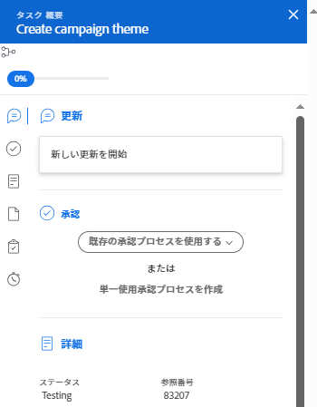

# 概要を使用してワークロードバランサーの作業アイテムを更新

タスクまたはイシューの概要パネルを使用して、その項目の重要な情報を更新できます。ワークロードバランサー内

概要パネルは、ワークロードバランサーの割り当て済み作業エリアおよび未割り当て作業エリアの両方で、タスクとイシューに対して使用できます。

## アクセス要件

以下が必要です。

<table style="table-layout:auto"> 
 <col> 
 <col> 
 <tbody> 
  <tr> 
   <td role="rowheader">Adobe Workfront プラン*</td> 
   <td> 
任意 
 </td> 
  </tr> 
  <tr> 
   <td role="rowheader">Adobe Workfront ライセンス*</td> 
   <td> 
プラン、リソース領域でワークロードバランサーを使用する場合

   
ワーク、チームまたはプロジェクトのワークロードバランサーを使用する場合
 
 
 </td> 
  </tr> 
  <tr> 
   <td role="rowheader">アクセスレベル設定*</td> 
   <td> 
次へのアクセスを編集します。
 
    <ul> 
     <li> 
リソース管理
 </li> 
     <li> 
プロジェクト
 </li> 
     <li> 
タスク
 </li> 
     <li> 
イシュー
 </li> 
    </ul> 
まだアクセス権がない場合は、Workfront 管理者に問い合わせて、アクセスレベルに追加の制限が設定されているかどうかを確認してください。Workfront 管理者がアクセスレベルを変更する方法について詳しくは、「<a href="../../administration-and-setup/add-users/configure-and-grant-access/create-modify-access-levels.md" class="MCXref xref">カスタムアクセスレベルの作成または変更</a>」を参照してください。
 </td> 
  </tr> 
  <tr> 
   <td role="rowheader">オブジェクト権限</td> 
   <td> 
プロジェクト、タスク、イシューに対する投稿権限またはそれ以上の権限 
 
追加のアクセス権のリクエストについて詳しくは、<a href="../../workfront-basics/grant-and-request-access-to-objects/request-access.md" class="MCXref xref">オブジェクトへのアクセス権のリクエスト</a>を参照してください。
 </td> 
  </tr> 
 </tbody> 
</table>

&#42;保有するプラン、ライセンスタイプ、アクセス権を確認するには、Workfront 管理者に問い合わせてください。

## ワークロードバランサーの概要パネルでのタスクとイシューの更新

1. ワークロードバランサーに移動します。

   ワークロードバランサーには、現在の週から始まる作業割当情報が表示されます。

1. **未割り当て作業**&#x200B;エリアに移動して、作業項目を検索します。

   または

   **割り当て済み作業**&#x200B;エリアに移動して、ユーザーを展開し、作業項目を検索します。

1. タスクまたはイシューのバーをクリックして、右側の概要パネルを開きます。

   または

   **概要を開く**&#x200B;アイコン  をクリックし、タスクまたはイシューのバーをクリックして、概要パネルを開きます。

   または

   タスクまたはイシューの右側にある&#x200B;**その他**&#x200B;メニュー  をクリックして、「**概要を開く**」をクリックします。

   右側に概要パネルが開きます。

   

1. 作業項目の多数のフィールドを変更したり、更新を入力したり、ここから Workfront の他のエリアに移動してドキュメントや他の情報を作業項目に追加したりします。

   >[!CAUTION]
   >
   >「概要」から「サブタスク」セクションにサブタスクを追加すると、親タスクはワークロードバランサーに表示されないので、元のタスクが削除されます。

   概要を使用して情報を更新する方法について詳しくは、[概要について](../../workfront-basics/the-new-workfront-experience/summary-overview.md)を参照してください。

1. （条件付き）作業項目のセクションを開いた場合、ブラウザーの「**戻る**」ボタンをクリックして、ワークロードバランサーに戻ります。
1. 概要の右上隅に表示される&#x200B;**閉じるアイコン**  をクリックして閉じます。
