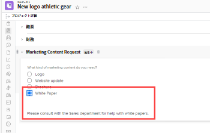
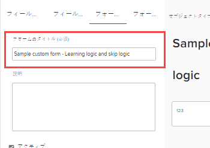
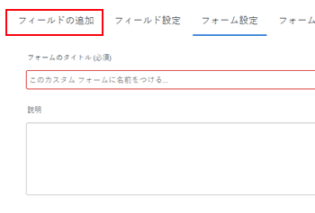
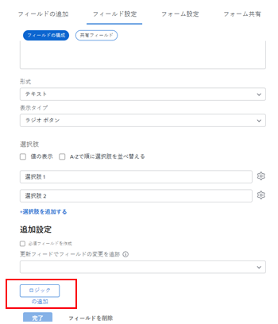
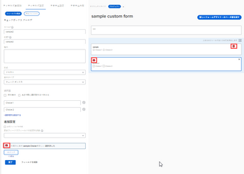
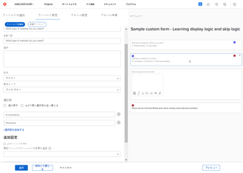

# 表示ロジックの追加とカスタムフォームへのロジックのスキップ

スマートルールを使用すると、カスタムフォームを動的に作成し、入力したユーザーにとってより関連性の高いものにすることができます。 ユーザーがフォームの複数選択フィールドに対して特定の方法で応答すると、スマートルールは、その応答に基づいて、次に何を表示するかを示します。

複数選択フィールドのタイプは、ドロップダウン、チェックボックス、ラジオボタンです。

* **ロジックを表示**:前の複数選択フィールドで特定の選択肢を選択した後にのみ表示するフィールド、ウィジェットまたはセクションに表示ロジックルールを設定します。

   **例：** マーケティングコンテンツリクエストフォームを作成し、組織の担当者が新しいロゴ、Web サイトの更新、パンフレット、その他の種類のマーケティングコンテンツをリクエストできるようにします。 ユーザーが希望するコンテンツのタイプに基づいて、ロゴが必要な場合は色やデザインのアイデア、パンフレットが必要な場合は製品機能のリストなど、様々な種類の詳細を入力するように求める必要があります。

   新しいロゴの色と詳細を尋ねるフィールドに、ユーザーが最初のフィールドで「ロゴ」ラジオボタンを選択した後にのみそのフィールドを表示する表示論理ルールを追加できます。

   同様に、製品の機能について尋ねるフィールドに、ユーザーが最初のフィールドで「パンフレット」ラジオボタンを選択した後でのみそのフィールドを表示する表示論理ルールを追加できます。

   

   複数選択フィールドに続く任意のカスタムフィールド、ウィジェット、またはセクション区切りに対して、表示ロジックルールを設定できます。

* **論理ルールをスキップ**:このルールを設定して、ユーザーが不要なフォームの一部を非表示にします。 ユーザーが前の複数選択フィールドで特定の項目を選択すると、スキップ論理ルールは、それらの項目をフォームの最後、または表示するカスタムフィールド、ウィジェット、セクションにスキップします。

   **例：** 上記のマーケティングコンテンツリクエストフォームを使用して、マーケティングではなくセールスから提供されたホワイトペーパーを求める人がいます。 このユーザーの場合、スキップ論理ルールを使用すると、詳細を求める質問を非表示にし、必要な部門を参照するテキスト行にスキップできます。

   

   この場合、ユーザーを営業部門に導く説明テキストフィールドを追加できます。 ユーザーが必要とするマーケティングコンテンツの種類を尋ねる最初のカスタムフィールドに、ユーザーが最初のフィールドでホワイトペーパーのラジオボタンを選択したときにテキスト行のみを表示するスキップ論理ルールを追加できます。

   これは、このユーザーが表示する必要のないロゴ、Web サイトの更新、パンフレットに関する他のフィールドを多数追加する場合に特に便利です。
スキップ論理ルールを適用できるのは、ウィジェットやセクションではなく、カスタムフィールドのみです。

カスタムフォームのカスタムフィールドとウィジェットについて詳しくは、 [カスタムフォームにカスタムフィールドを追加する](../../administration-and-setup/customize-workfront/create-manage-custom-forms/add-a-custom-field-to-a-custom-form.md) および [カスタムフォームでのアセットウィジェットの追加または編集](../../administration-and-setup/customize-workfront/create-manage-custom-forms/add-widget-or-edit-its-properties-in-a-custom-form.md).

## アクセス要件

この記事の手順を実行するには、次の手順を実行する必要があります。

<table style="table-layout:auto"> 
 <col> 
 <col> 
 <tbody> 
  <tr data-mc-conditions=""> 
   <td role="rowheader"> 
Adobe Workfront plan*
 </td> 
   <td>任意</td> 
  </tr> 
  <tr> 
   <td role="rowheader">Adobe Workfront license*</td> 
   <td> 
計画 
 </td> 
  </tr> 
  <tr data-mc-conditions=""> 
   <td role="rowheader">アクセスレベル設定*</td> 
   <td> 
カスタムフォームへの管理アクセス
 
Workfront管理者がこのアクセス権を付与する方法について詳しくは、 <a href="../../administration-and-setup/add-users/configure-and-grant-access/grant-users-admin-access-certain-areas.md" class="MCXref xref">特定の領域に対する管理者アクセス権をユーザーに付与する</a>.
 </td> 
  </tr>  
 </tbody> 
</table>

&#42;保有しているプラン、ライセンスタイプ、アクセスレベル設定を確認するには、Workfront管理者に問い合わせてください。

## 表示ロジックとスキップロジックを持つサンプルカスタムフォームを作成します

表示ロジックとスキップロジックをカスタムフォームに追加する方法を学ぶ最善の方法は、次の 2 つの節で説明する実際の例を通して学ぶことです。

* [表示ロジック — 実例](#display-logic-practical-example)
* [論理をスキップ — 実例](#skip-logic-practical-example)

### 表示ロジック — 実例 {#display-logic-practical-example}

この例では、複数選択のラジオボタンフィールドを持つカスタムフォームを作成します。 次に、このフィールドを 2 番目のフィールドに接続する表示ロジックを追加します。

1. 次をクリック： **メインメニュー** アイコン  Adobe Workfrontの右上隅で、 **設定** .

1. 左のパネルで、「 」を選択します。 **カスタムForms** .

1. クリック **新規カスタムフォーム**&#x200B;を選択します。 **プロジェクト** 表示されるボックスで、「 」を選択します。 **続行**.

1. 内 **フォームタイトル** テキストボックス、タイプ **サンプルカスタムフォーム — 表示ロジックの学習とロジックのスキップ** フォームに名前を付けます。

   

1. フォーム上の最初のフィールドを追加するには、次の手順を実行します。

   1. を開きます。 **フィールドを追加** タブをクリックします。

      

   1. を選択します。 **ラジオボタン** フィールドのタイプを入力し、 *どのようなタイプのマーケティングコンテンツが必要ですか？* を **ラベル** フィールドの

   1. の下 **選択肢**，置換 **選択肢 1** および **選択肢 2** 次のテキストを使用して、2 つのオプションを作成し、「 」フィールドで選択できます。

      *Web サイトの更新*

      *ロゴデザイン*

1. 次のカスタムフィールドを追加し、それに表示ロジックルールを追加するには、次の手順に従います。

   1. を開きます。 **フィールドを追加** タブを再度クリックし、新しい **ラジオボタン** ～と呼ばれるフィールド *どのような種類の Web サイトの更新が必要ですか？*

      このフィールドの選択肢は後で追加します。

   1. 内 **その他の設定** セクション、選択 **ロジックを追加**.

      

1. 表示されるボックスに、 **論理の表示** 「 」タブを開き、選択したユーザーに対してのみ表示されるように 2 番目のフィールドを設定します。 *Web サイトデザイン* 最初のフィールドで、

   1. 最初のドロップダウンで、「 」を選択します。 **どのようなタイプのマーケティングコンテンツが必要ですか？**
   1. 2 番目のドロップダウンで、 **Web サイトデザイン**.
   1. 3 番目のドロップダウンを「 **選択済み**&#x200B;を選択します。 **保存**.

   小さな色付きの四角形に D が付いているので、2 番目のフィールドが、最初のフィールドでのユーザーの選択に対する表示ロジックで接続されていることを示しています。

   

1. 選択 **プレビュー** ロジックがフォーム上で望みどおりに動作することを確認するには、「 **プレビューを終了**.

1. クリック **保存して閉じる** フォームを保存し、次に進みます。 [論理をスキップ — 実例](#skip-logic-practical-example) 下

### 論理をスキップ — 実例 {#skip-logic-practical-example}

スキップ論理関数は論理の表示と同様に機能しますが、逆関数として機能します。以前のユーザーの選択に基づいて特定のカスタム複数選択フィールドを表示する代わりに、ユーザーに関連しないので、非表示にする（スキップする）フィールドを決定します。

詳しくは、「 」セクションで作成したサンプルカスタムフォームを引き続き使用してください。 [表示ロジック — 実例](#display-logic-practical-example) 」を参照してください。

1. 次をクリック： **メインメニュー** アイコン  Adobe Workfrontの右上隅で、 **設定** .

1. クリック **カスタムForms**.
1. フォームの名前をクリックします **サンプルカスタムフォーム — 表示ロジックの学習とロジックのスキップ** 上記の手順で作成し、編集用に開くために作成した。
1. 作成したドロップダウンフィールドの名前を選択します。 *どのような種類の Web サイトが必要ですか？*&#x200B;をクリックし、次のフィールドの選択肢を追加して、 **適用**:

   *E コマース*

   *パンフレット*

   *メンバーシップ*

1. を開きます。 **フィールドを追加** 」タブをクリックし、書式設定フィールドを含む**テキストフィールドを作成します。このフィールドは、*ウェブサイトの目標は何ですか？*&#x200B;を選択し、「 **適用**.

   この組織では、ヘルプドキュメントサイトは、マーケティング部門ではなく、技術書き込みチームによって作成されます。 したがって、2 つ目のフィールドでヘルプドキュメントを選択するユーザーからの詳細情報は不要です。 テクニカルライティングチームに代わって表示するように伝えるテキスト行（説明テキストフィールド）を作成します。 そして、スキップ論理ルールを使用して、そのユーザーをそのテキスト行にスキップします。

1. テキスト行を作成するには：

   1. を開きます。 **フィールドを追加** 「 」タブをクリックし、 **説明テキストフィールド**.

   1. の **ラベル**, type *テクニカルライティングチームを参照*.

   1. の **説明テキスト**, type *オンラインヘルプドキュメントの作成については、テクニカルライティングチームを参照してください*.

   1. 選択 **適用**.

1. スキップ論理ルールを作成するには：

   1. 2 番目のドロップダウンフィールドを選択します。 *どのような種類の Web サイトが必要ですか？*
   1. 内 **追加設定** s セクションで、「 **ロジックを編集**.
   1. 表示されるボックスで、 **論理をスキップ** タブをクリックします。
   1. 最初のドロップダウンをに設定します。 **ヘルプドキュメント**&#x200B;を選択し、2 番目のドロップダウンを「 **選択済み**&#x200B;を選択し、3 番目のドロップダウンを **テクニカルライティングチームを見る**.
   1. 選択 **保存**.

   小さいスキップロジックは S で 2 乗され、2 番目のフィールドで特定の選択を選択した後にユーザーが何かをスキップすることを示しています。

   

1. クリック **プレビュー**  を使用して、ロジックが目的の方法で適用されるようにします。
1. クリック **保存+閉じる**.

このようなフォームを作成する場合、2 番目のフィールドで「E コマース」または「パンフレット」を選択したユーザーからの情報を求めるテキストフィールドをさらに追加できます。 これらのフィールドでは、ターゲットオーディエンスが Web サイトの対象者、ターゲットオーディエンスを作成する目標、予算などを確認できます。

また、論理ルールを使用して、分岐する質問のパスを作成できます。

例えば、E コマースを選択するユーザーの場合、製品の写真、説明、価格、支払いオプションに関する質問をフィールドで作成できます。 パンフレットを選択するユーザーは、コンテンツに関する質問をするフィールドを作成できます。

ヘルプドキュメントを選択したユーザーには、これらの関連のない追加フィールドは表示されません。

>[!TIP]
>
>次のすべてに当てはまる場合は、カスタムフィールドに表示ロジックとスキップロジックの両方を追加できます。
>
>* 複数選択フィールド（ラジオボタン、ドロップダウン、チェックボックス）です。
>* 前に複数選択フィールドがあります
>* その後に別のカスタムフィールドが続きます
>

<!--
<h2 data-mc-conditions="QuicksilverOrClassic.Draft mode">Multi-field display logic statements</h2>
-->

