# レビューおよび承認のレポートダッシュボードの作成

カンバスダッシュボード領域でレポートダッシュボードを作成し、統合承認機能を使用してレビューと承認に関する詳細な情報と詳細情報の両方を表示できます。

>[!IMPORTANT]
>
>この機能は、統合承認サービスを使用し、Canvas ダッシュボード ベータ版に登録されているお客様のみが利用できます。 詳しくは、[Canvas ダッシュボードのベータ情報](/help/quicksilver/product-announcements/betas/canvas-dashboards-beta/canvas-dashboards-beta-information.md)を参照してください。

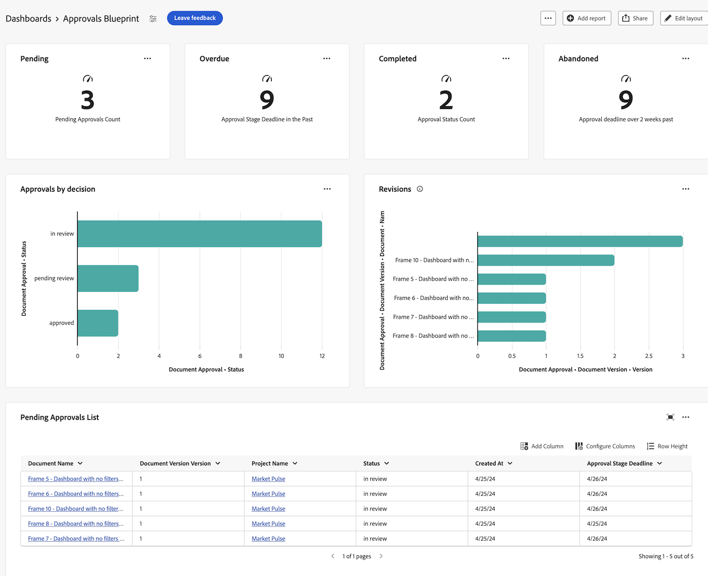

## ダッシュボードの作成

{{step1-to-dashboards}}

1. 左側のパネルで、「**キャンバスダッシュボード**」をクリックします。
1. 「**新規ダッシュボード**」をクリックします。
1. ダッシュボードに名前を付けます。
1. （オプション）説明を追加します。
1. 「**作成**」をクリックします。
   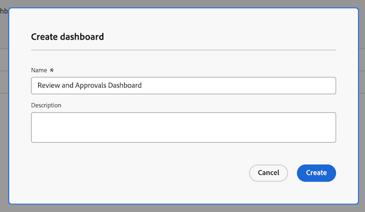

ダッシュボードを作成したら、KPI、チャート、テーブルの追加を開始できます。 詳しくは、次の節を参照してください。

* [KPIとチャートを使用して、詳細なレビューと承認の情報を追加します](#add-high-level-review-and-approval-information-with-kpis-and-charts)
* [詳細なレビュー情報と承認情報を表に追加する](#add-detailed-review-and-approval-information-with-tables)

## KPIとチャートを使用して、詳細なレビューと承認の情報を追加します

KPIとチャートを使用して、ドキュメントの承認に関する詳細情報を表示できます。

詳細については、[KPI レポートの作成](/help/quicksilver/reports-and-dashboards/canvas-dashboards/add-reports/build-kpi-report.md)および[&#x200B; グラフ レポートの作成](/help/quicksilver/reports-and-dashboards/canvas-dashboards/add-reports/build-chart-report.md)を参照してください。

### KPI

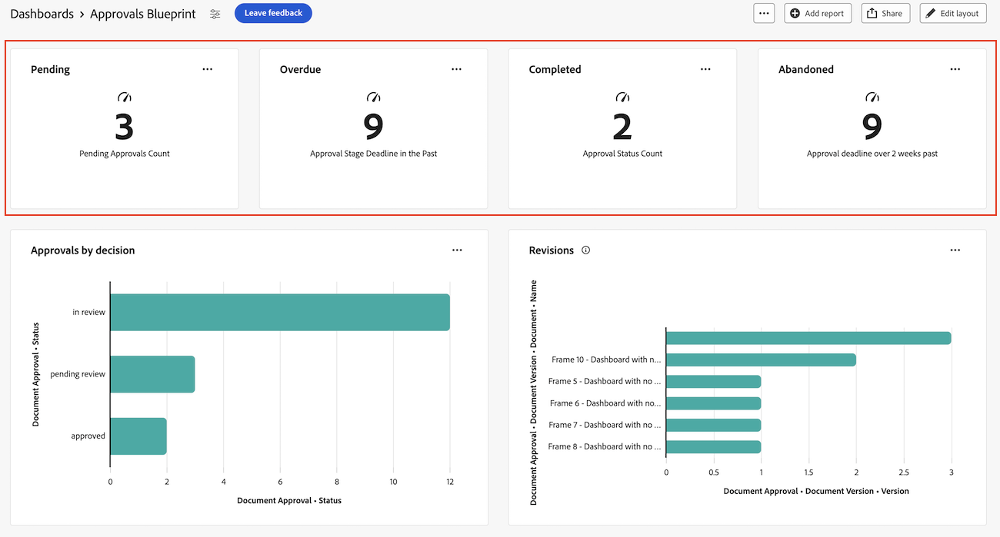

#### 保留中の承認

1. [上記の節で説明したように、](#create-a-dashboard) ダッシュボードを作成します。
1. ダッシュボードの詳細ページの右上隅にある「**レポートを追加**」をクリックします。

1. 「**レポートを追加**」ボックスで、「**レポートを作成**」を選択します。

1. 左側で、**KPI**&#x200B;を選択します。

1. 右上隅の「**レポートを作成**」をクリックします。

1. 次の手順に従って、**Details** セクションを設定します。

   1. 「**名前**」フィールドに「*保留中*」と入力します。
   1. 「**説明**」フィールドに「*承認待ち*」と入力します。 KPI値の下にキャプションとして表示されます。

1. 以下の手順に従って、**ビルド KPI** セクションを設定します。

   1. 左側のパネルで、**KPIの作成** 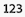をクリックします。

   1. 「**フィールドを選択**」をクリックします。

   1. **ドキュメント承認** フォルダーを探して選択します。

   1. **ステータス**&#x200B;を選択します。

   1. 「**集計タイプ**」ドロップダウンで、「**カウント**」を選択します。

1. 次の手順に従って、**Filter** セクションを設定します。

   1. 左側のパネルで、**フィルター**  アイコンをクリックします。

   1. **フィルターを編集**&#x200B;を選択します。

   1. 「**条件を追加**」をクリックします。

   1. 空の条件フィルターをクリックし、**フィールドを選択**&#x200B;をクリックしてから、**ステータス**&#x200B;を選択します。
   1. 演算子を&#x200B;**次と等しい**&#x200B;のままにし、テキストボックスに「_保留中のレビュー_」と入力します。
      
1. 画面の右上隅にある「**保存**」をクリックします。

#### 期限切れの承認

1. [上記の節で説明したように、](#create-a-dashboard) ダッシュボードを作成します。
1. ダッシュボードの詳細ページの右上隅にある「**レポートを追加**」をクリックします。

1. 「**レポートを追加**」ボックスで、「**レポートを作成**」を選択します。

1. 左側で、**KPI**&#x200B;を選択します。

1. 右上隅の「**レポートを作成**」をクリックします。

1. 次の手順に従って、**Details** セクションを設定します。

   1. 「**名前**」フィールドに「_期限切れ_」と入力します。
   1. 「**説明**」フィールドに「_承認ステージの期限を過去_」と入力します。 この説明は、KPI値の下にキャプションとして表示されます。

1. 以下の手順に従って、**ビルド KPI** セクションを設定します。

   1. 左側のパネルで、**KPIの作成** をクリックします。

   1. 「**フィールドを選択**」をクリックします。

   1. **ドキュメント承認** フォルダーを探して選択します。

   1. **ステータス**&#x200B;を選択します。

   1. 「**集計タイプ**」ドロップダウンで、「**カウント**」を選択します。

1. 次の手順に従って、**Filter** セクションを設定します。

   1. 左側のパネルで、**フィルター**  アイコンをクリックします。

   1. **フィルターを編集**&#x200B;を選択します。

   1. 「**条件を追加**」をクリックします。

   1. 空の条件フィルターをクリックし、**フィールドを選択**&#x200B;をクリックします。

   1. **承認ステージ** > **期限**&#x200B;を選択します。
   1. 演算子を&#x200B;**未満**&#x200B;に変更します。
   1. **相対日付**&#x200B;を&#x200B;**ON**&#x200B;に設定し、テキストボックスに「_$$TODAY_」と入力します。
      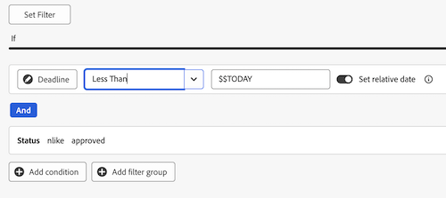
   1. 「**条件を追加**」をクリックします。
   1. 空の条件フィルターをクリックし、**フィールドを選択**&#x200B;をクリックします。
   1. **ステータス**&#x200B;を選択します。
   1. 演算子を&#x200B;**含まない**&#x200B;に変更し、テキストボックスに&#x200B;_approved_と入力します。
      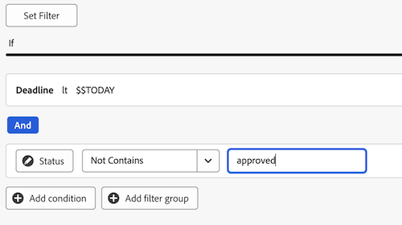
1. 画面の右上隅にある「**保存**」をクリックします。

#### 完了済み承認

1. [上記の節で説明したように、](#create-a-dashboard) ダッシュボードを作成します。
1. ダッシュボードの詳細ページの右上隅にある「**レポートを追加**」をクリックします。

1. 「**レポートを追加**」ボックスで、「**レポートを作成**」を選択します。

1. 左側で、**KPI**&#x200B;を選択します。

1. 右上隅の「**レポートを作成**」をクリックします。

1. 次の手順に従って、**Details** セクションを設定します。

   1. 「**名前**」フィールドに「_完了_」と入力します。
   1. 「**説明**」フィールドに「_承認ステータス数_」と入力します。 この説明は、KPI値の下にキャプションとして表示されます。

1. 以下の手順に従って、**ビルド KPI** セクションを設定します。

   1. 左側のパネルで、**KPIの作成** をクリックします。

   1. 「**フィールドを選択**」をクリックします。

   1. **ドキュメント承認** フォルダーを探して選択します。

   1. **ステータス**&#x200B;を選択します。

   1. 「**集計タイプ**」ドロップダウンで、「**カウント**」を選択します。

1. 次の手順に従って、**Filter** セクションを設定します。

   1. 左側のパネルで、**フィルター**  アイコンをクリックします。

   1. **フィルターを編集**&#x200B;を選択します。

   1. 「**条件を追加**」をクリックします。

   1. 空の条件フィルターをクリックし、**フィールドを選択**&#x200B;をクリックします。

   1. **ステータス**&#x200B;を選択します。

   1. 演算子を&#x200B;**Contains**&#x200B;に変更し、テキストボックスに&#x200B;_approved_と入力します。
      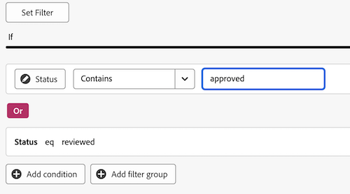
   1. 「**条件を追加**」をクリックします。
   1. 「**And**」をクリックして、**または**&#x200B;に変更します。
   1. 空の条件フィルターをクリックし、**フィールドを選択**&#x200B;をクリックします。
   1. **ステータス**&#x200B;を選択します。
   1. 演算子を&#x200B;**Equal**&#x200B;に変更し、テキストボックスに&#x200B;_reviewed_と入力します。
      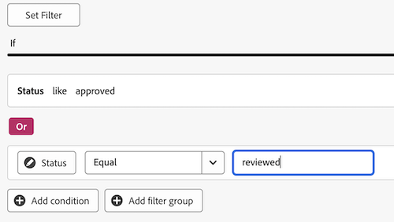
1. 画面の右上隅にある「**保存**」をクリックします。

#### 放棄された承認

1. [上記の節で説明したように、](#create-a-dashboard) ダッシュボードを作成します。
1. ダッシュボードの詳細ページの右上隅にある「**レポートを追加**」をクリックします。

1. 「**レポートを追加**」ボックスで、「**レポートを作成**」を選択します。

1. 左側で、**KPI**&#x200B;を選択します。

1. 右上隅の「**レポートを作成**」をクリックします。

1. 次の手順に従って、**Details** セクションを設定します。

   1. 「**名前**」フィールドに「_放棄_」と入力します。
   1. 「**説明**」フィールドに「_承認期限が2週間を過ぎました_」と入力します。 この説明は、KPI値の下にキャプションとして表示されます。

1. 以下の手順に従って、**ビルド KPI** セクションを設定します。

   1. 左側のパネルで、**KPIの作成** をクリックします。

   1. 「**フィールドを選択**」をクリックします。

   1. **ドキュメント承認ステージ** フォルダーを探して選択します。

   1. 「**期限**」を選択します。

   1. 「**集計タイプ**」ドロップダウンで、「**カウント**」を選択します。

1. 次の手順に従って、**Filter** セクションを設定します。

   1. 左側のパネルで、**フィルター**  アイコンをクリックします。

   1. **フィルターを編集**&#x200B;を選択します。

   1. 「**条件を追加**」をクリックします。

   1. 空の条件フィルターをクリックし、**フィールドを選択**&#x200B;をクリックします。

   1. **ステータス**&#x200B;を選択します。

   1. 演算子を&#x200B;**含まない**&#x200B;に変更し、テキストボックスに&#x200B;_approved_と入力します。
      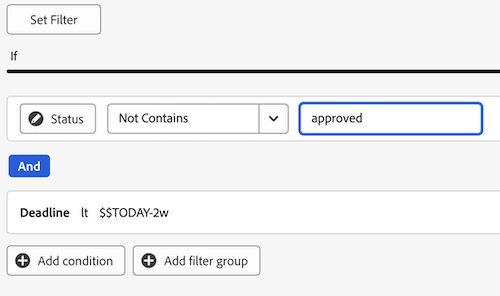
   1. 「**条件を追加**」をクリックします。
   1. 空の条件フィルターをクリックし、**フィールドを選択**&#x200B;をクリックします。
   1. 「**期限**」を選択します。
   1. 演算子を&#x200B;**未満**&#x200B;に変更し、**相対日付**&#x200B;を&#x200B;**ON**&#x200B;に設定します。
   1. テキストボックスに「_$$TODAY-2w_」と入力します。
      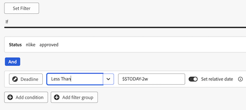
1. 画面の右上隅にある「**保存**」をクリックします。

### グラフ

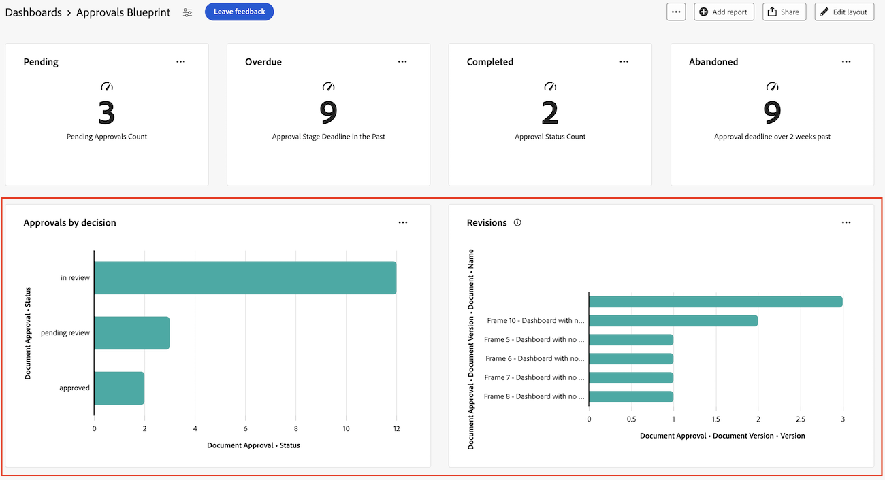

#### 決定棒グラフによる承認

1. [上記の節で説明したように、](#create-a-dashboard) ダッシュボードを作成します。
1. ダッシュボードの詳細ページの右上隅にある「**レポートを追加**」をクリックします。

1. 「**レポートを追加**」ボックスで、「**レポートを作成**」を選択します。

1. 左側で、**グラフ**&#x200B;を選択します。

1. 右上隅の「**レポートを作成**」をクリックします。

1. 次の手順に従って、**Details** セクションを設定します。

   1. 「**名前**」フィールドに「_決定による承認_」と入力します。
   1. （オプション）「**説明**」フィールドに説明を入力します。 このテキストは、グラフ名の横にツールチップとして表示されます。
1. **ビルド チャート** セクションを設定するには、次の手順に従います。

   1. 左側のパネルで、**グラフを作成**  アイコンをクリックします。

   1. **グラフの種類** ドロップダウンメニューで、**棒**&#x200B;を選択したままにします。
   1. **棒の種類** ドロップダウンメニューで、**単純**&#x200B;を選択したままにします。
   1. **下軸（X）軸**&#x200B;の&#x200B;**更新フィールド**&#x200B;をクリックし、**ドキュメント承認** > **ステータス**&#x200B;を選択します。
   1. **集計タイプ**&#x200B;を&#x200B;**カウント**&#x200B;に設定します。
   1. **左（Y）軸**&#x200B;の「**フィールドを更新**」をクリックし、**ステータス**&#x200B;を選択します。
1. 次の手順に従って、**Filter** セクションを設定します。
   1. 左側のパネルで、**フィルター** 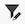 アイコンをクリックします。
   1. 「**フィルターを編集**」をクリックしてから、**条件を追加**&#x200B;をクリックします。
   1. 空の条件フィルターをクリックし、**フィールドを選択**&#x200B;をクリックします。
   1. **ドキュメントのバージョン** > **のバージョン**&#x200B;を選択します。
   1. 演算子を&#x200B;**Is Not Null**&#x200B;に変更します。
      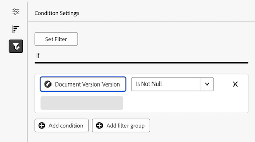
1. 画面の右上隅にある「**保存**」をクリックします。

#### リビジョン棒グラフ

1. [上記の節で説明したように、](#create-a-dashboard) ダッシュボードを作成します。
1. ダッシュボードの詳細ページの右上隅にある「**レポートを追加**」をクリックします。

1. 「**レポートを追加**」ボックスで、「**レポートを作成**」を選択します。

1. 左側で、**グラフ**&#x200B;を選択します。

1. 右上隅の「**レポートを作成**」をクリックします。

1. 次の手順に従って、**Details** セクションを設定します。

   1. 「**名前**」フィールドに「_リビジョン_」と入力します。
   1. **説明** フィールドに、_今月末までに不完全な決定が計画されたドキュメントのリビジョン数_&#x200B;を入力します。 このテキストは、グラフ名の横にツールチップとして表示されます。

1. **ビルド チャート** セクションを設定するには、次の手順に従います。

   1. 左側のパネルで、**グラフを作成**  アイコンをクリックします。

   1. **グラフの種類** ドロップダウンメニューで、**棒**&#x200B;を選択したままにします。
   1. **棒の種類** ドロップダウンメニューで、**単純**&#x200B;を選択したままにします。
   1. **下軸（X）軸**&#x200B;の&#x200B;**更新フィールド**&#x200B;をクリックし、**ドキュメント承認** > **ドキュメントバージョン** > **バージョン**&#x200B;を選択します。
   1. **集計タイプ**&#x200B;を&#x200B;**カウント**&#x200B;に設定します。
   1. **左（Y）軸**&#x200B;の&#x200B;**更新フィールド**&#x200B;をクリックし、**ドキュメント承認** > **ドキュメントバージョン** > **ドキュメント** > **名前**&#x200B;を選択します。

1. 次の手順に従って、**Filter** セクションを設定します。
   1. 左側のパネルで、**フィルター**  アイコンをクリックします。
   1. 「**フィルターを編集**」をクリックしてから、**条件を追加**&#x200B;をクリックします。
   1. 空の条件フィルターをクリックし、**フィールドを選択**&#x200B;をクリックします。

   1. **承認ステージ** > **承認ステージ参加者** > **決定日**&#x200B;を選択します。

   1. 演算子を&#x200B;**Is Null**&#x200B;に変更します。
      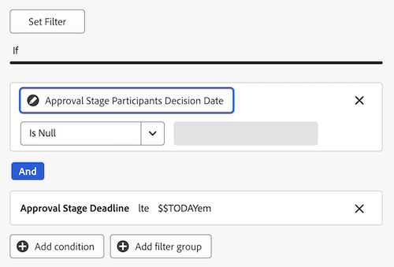
   1. 「**条件を追加**」をクリックします。
   1. 空の条件フィルターをクリックし、**フィールドを選択**&#x200B;をクリックします。
   1. **承認ステージ** > **期限**&#x200B;を選択します。
   1. 演算子を&#x200B;**次の値より小さい**&#x200B;に変更し、**相対日付**&#x200B;を&#x200B;**ON**&#x200B;に設定します。
   1. テキストボックスに「_$$TODAYem_」と入力します。
      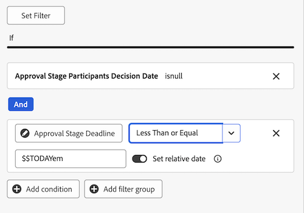
1. 画面の右上隅にある「**保存**」をクリックします。

## 詳細なレビュー情報と承認情報を表に追加する

テーブル レポートの作成について詳しくは、[&#x200B; テーブル レポートの作成](/help/quicksilver/reports-and-dashboards/canvas-dashboards/add-reports/build-table-report.md)を参照してください。

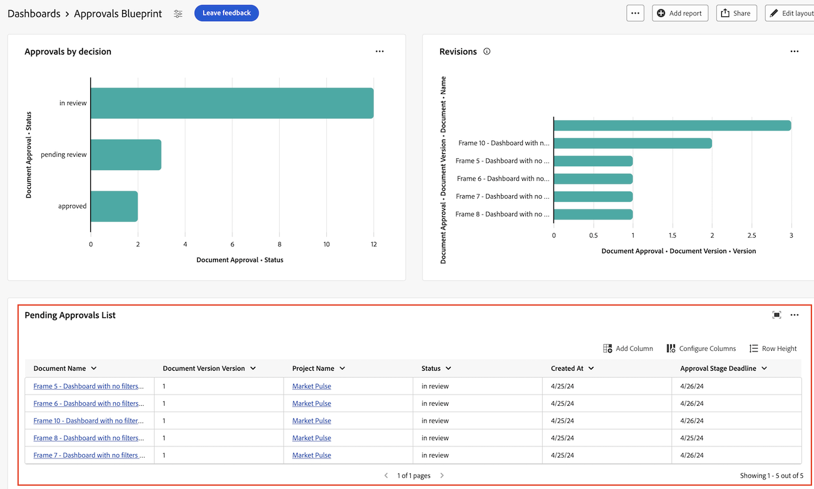

### 承認待ちリスト

1. [上記の節で説明したように、](#create-a-dashboard) ダッシュボードを作成します。
1. ダッシュボードの詳細ページの右上隅にある「**レポートを追加**」をクリックします。

1. 「**レポートを追加**」ボックスで、「**レポートを作成**」を選択します。

1. 左側で、**テーブル**&#x200B;を選択します。

1. 右上隅の「**レポートを作成**」をクリックします。

1. 次の手順に従って、**Details** セクションを設定します。

   1. 「**名前**」フィールドに「_承認待ち_」と入力します。
   1. 「**説明**」フィールドに説明を入力します。 このテキストは、グラフ名の横にツールチップとして表示されます。

1. 次の手順に従って、**ビルドテーブル** セクションを設定します。

   1. 左側のパネルで、**テーブル列**  アイコンをクリックします。
   1. 「**列を追加**」をクリックします。
   1. 下にスクロールして、**ドキュメント承認**/**ステータス**&#x200B;を選択します。
   1. 次の列を追加します。

   <table>
    <tr>
    <td><strong>プロジェクト名</strong></td>
    <td>文書バージョン/文書/プロジェクト/名前</td>
    </tr>
    <tr>
    <td><strong>ドキュメント名</strong></td>
    <td>ドキュメントのバージョン/ドキュメント/検索ボックスに「<em>名前</em>」と入力します。</td>
    </tr>
    <tr>
    <td><strong>ドキュメントのバージョン</strong></td>
    <td>ドキュメントのバージョン/ドキュメント/バージョン</td>
    </tr>
    <tr>
    <td><strong>期限</strong></td>
    <td>文書の承認/承認ステージ/期限</td>
    </tr>
    <tr>
    <td><strong>要求者</strong></td>
    <td>文書の承認/承認ステージ / 承認ステージの参加者* / リクエスター/検索ボックスに「<em>名前</em>」と入力します。</td>
    </tr>
    <tr>
    <td><strong>リクエスト日</strong></td>
    <td>文書の承認/承認ステージ/承認ステージの参加者*/作成日時</td>
    </tr>
    <tr>
    <td><strong>承認者</strong></td>
    <td>文書の承認/承認ステージ / 承認ステージの参加者* / 参加者ユーザー/検索ボックスに「<em>名前</em>」と入力します。</td>
    </tr>
    </table>

   * 承認ステージの参加者は、_承認ステージの期間_&#x200B;に切り捨てられます

1. 次の手順に従って、**Filter** セクションを設定します。
   1. 左側のパネルで、**フィルター**  アイコンをクリックします。
   1. 「**フィルターを編集**」をクリックしてから、**条件を追加**&#x200B;をクリックします。
   1. 空の条件フィルターをクリックし、**フィールドを選択**&#x200B;をクリックします。
   1. **ステータス**&#x200B;を選択します。
   1. 演算子を&#x200B;**Equal**&#x200B;に変更し、テキストボックスに「_承認待ち_」と入力します。
      
   1. （オプション）以下の「**オプションフィルター**」セクションで説明されているように、追加のフィルターを追加します。
1. 画面の右上隅にある「**保存**」をクリックします。

**オプションのフィルター**

ユースケースに応じてより具体的な情報を表示するには、フィルター条件を追加します。 テーブルを再作成し、ユースケースごとに新しいフィルター条件を追加することができます。

+++ 展開して追加のフィルターオプションを表示

**自分のプロジェクト**

1. **フィルターを編集** > **条件を追加**&#x200B;をクリックします。
   1. 空の条件フィルターをクリックし、**フィールドを選択**&#x200B;をクリックします。
   1. 検索ボックスで「**Document version** > **Document** > **Project** > **Owner** > type _Name_」を選択します。
   1. 演算子を&#x200B;**Equal**&#x200B;に変更し、**Me （Logged in user）**&#x200B;を選択して、プロジェクト所有者としてマークされたWorkfrontでプロジェクトを表示します。
      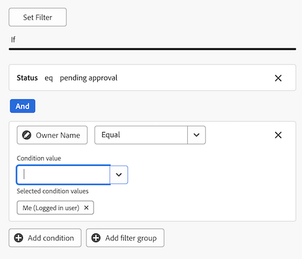
1. 画面の右上隅にある「**保存**」をクリックします。

**送信した承認**

1. **フィルターを編集** > **条件を追加**&#x200B;をクリックします。
   1. 空の条件フィルターをクリックし、**フィールドを選択**&#x200B;をクリックします。
   1. 検索ボックスで「**承認ステージ** > **承認ステージ参加者** > **依頼者** > タイプ _名前_」を選択します。
   1. 演算子を&#x200B;**Equal**&#x200B;に変更し、**Me （Logged in user）**&#x200B;を選択して、プロジェクト所有者としてマークされたWorkfrontでプロジェクトを表示します。
      
1. 画面の右上隅にある「**保存**」をクリックします。

+++

### 期限切れの承認リスト

1. [上記の節で説明したように、](#create-a-dashboard) ダッシュボードを作成します。

1. ダッシュボードの詳細ページの右上隅にある「**レポートを追加**」をクリックします。

1. 「**レポートを追加**」ボックスで、「**レポートを作成**」を選択します。

1. 左側で、**テーブル**&#x200B;を選択します。

1. 右上隅の「**レポートを作成**」をクリックします。

1. 次の手順に従って、**Details** セクションを設定します。

   1. 「**名前**」フィールドに「_期限切れの承認_」と入力します。
   1. （オプション）「**説明**」フィールドに説明を入力します。 このテキストは、グラフ名の横にツールチップとして表示されます。

1. 次の手順に従って、**ビルドテーブル** セクションを設定します。

   1. 左側のパネルで、**テーブル列**  アイコンをクリックします。
   1. 「**列を追加**」をクリックします。
   1. 下にスクロールして、**ドキュメント承認**/**ステータス**&#x200B;を選択します。
   1. 次の列を追加します。

      <table>
        <tr>
        <td><strong>プロジェクト名</strong></td>
        <td>文書バージョン/文書/プロジェクト/名前</td>
        </tr>
        <tr>
        <td><strong>ドキュメント名</strong></td>
        <td>ドキュメントのバージョン/ドキュメント/検索ボックスに「<em>名前</em>」と入力します。</td>
        </tr>
        <tr>
        <td><strong>ドキュメントのバージョン</strong></td>
        <td>ドキュメントのバージョン/ドキュメント/バージョン</td>
        </tr>
        <tr>
        <td><strong>期限</strong></td>
        <td>文書/承認ステージ/期限</td>
        </tr>
        <tr>
        <td><strong>要求者</strong></td>
        <td>文書/承認ステージ / 承認ステージ参加者* / リクエスター/検索ボックスに「<em>名前</em>」と入力します。</td>
        </tr>
        <tr>
        <td><strong>リクエスト日</strong></td>
        <td>文書/承認ステージ / 承認ステージ参加者* / 作成日時</td>
        </tr>
        <tr>
        <td><strong>承認者</strong></td>
        <td>文書/承認ステージ / 承認ステージ参加者* / 参加者ユーザー/検索ボックスに「<em>名前</em>」と入力します。</td>
        </tr>
        </table>

      * 承認ステージの参加者は、_承認ステージの期間_&#x200B;に切り捨てられます

1. 次の手順に従って、**Filter** セクションを設定します。
   1. 左側のパネルで、**フィルター**  アイコンをクリックします。
   1. 「**フィルターを編集**」をクリックしてから、**条件を追加**&#x200B;をクリックします。
   1. 空の条件フィルターをクリックし、**フィールドを選択**&#x200B;をクリックします。
   1. **承認ステージ** > **期限**&#x200B;を選択します。
   1. 演算子を&#x200B;**未満**&#x200B;に変更し、**相対日付**&#x200B;を&#x200B;**ON**&#x200B;に設定します。
   1. テキストフィールドに「_$$TODAY_」と入力します。
      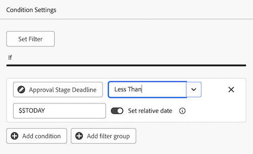
   1. （オプション）以下の「**オプションフィルター**」セクションで説明されているように、追加のフィルターを追加します。
1. 画面の右上隅にある「**保存**」をクリックします。

**オプションのフィルター**

ユースケースに応じてより具体的な情報を表示するには、フィルター条件を追加します。 テーブルを再作成し、ユースケースごとに新しいオプションのフィルター条件を追加することができます。

+++ 展開して追加のフィルターオプションを表示

**自分のプロジェクト**

1. **フィルターを編集** > **条件を追加**&#x200B;をクリックします。
   1. 空の条件フィルターをクリックし、**フィールドを選択**&#x200B;をクリックします。
   1. 検索ボックスで「**Document version** > **Document** > **Project** > **Owner** > type _Name_」を選択します。
   1. 演算子を&#x200B;**Equal**&#x200B;に変更し、**Me （Logged in User）**&#x200B;を選択して、プロジェクト所有者としてマークされたWorkfrontでプロジェクトを表示します。
      
1. 画面の右上隅にある「**保存**」をクリックします。

**送信した承認**

1. **フィルターを編集** > **条件を追加**&#x200B;をクリックします。
   1. 空の条件フィルターをクリックし、**フィールドを選択**&#x200B;をクリックします。
   1. 検索ボックスで「**承認ステージ** > **承認ステージ参加者** > **依頼者** > タイプ _名前_」を選択します。
   1. 演算子を&#x200B;**Equal**&#x200B;に変更し、**Me （Logged in User）**&#x200B;を選択して、プロジェクト所有者としてマークされたWorkfrontでプロジェクトを表示します。
      
1. 画面の右上隅にある「**保存**」をクリックします。

**自分のチーム**

1. **フィルターを編集** > **条件を追加**&#x200B;をクリックします。
   1. 空の条件フィルターをクリックし、**フィールドを選択**&#x200B;をクリックします。
   1. 検索ボックスで「**承認ステージ** > **承認ステージ参加者** > **参加者チーム** > タイプ _名_」を選択します。
   1. オペレーターを&#x200B;**Equal**&#x200B;に変更し、**デフォルトチーム （ログイン ユーザー）**&#x200B;または&#x200B;**他のチーム （ログイン ユーザー）**&#x200B;を選択して、デフォルトチームまたは所属している他のチームに割り当てられたプロジェクトを表示します。
      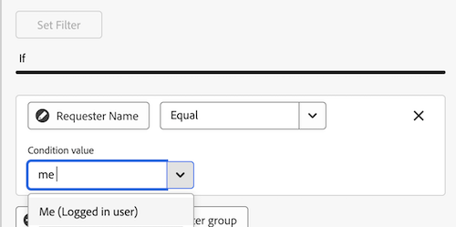
1. 画面の右上隅にある「**保存**」をクリックします。
+++
