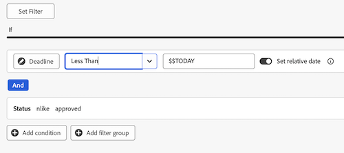
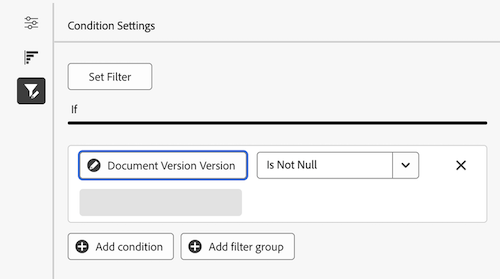

# レビューおよび承認用のレポートダッシュボードの作成

キャンバスダッシュボード エリアでレポートダッシュボードを作成すると、統合された承認機能を使用して、レビューと承認に関する情報の概要と詳細の両方を表示できます。

>[!IMPORTANT]
>
>この機能は、統合承認サービスを使用し、キャンバスダッシュボードベータ版に登録されている顧客のみが利用できます。 詳しくは、[&#x200B; キャンバスダッシュボードのベータ版情報 &#x200B;](/help/quicksilver/product-announcements/betas/canvas-dashboards-beta/canvas-dashboards-beta-information.md) を参照してください。

 例

## ダッシュボードの作成

{{step1-to-dashboards}}

1. 左側のパネルで、「**キャンバスダッシュボード**」をクリックします。
1. 「**新規ダッシュボード**」をクリックします。
1. ダッシュボードに名前を付けます。
1. （任意）説明を追加します。
1. 「**作成**」をクリックします。
   

ダッシュボードを作成したら、KPI、グラフ、およびテーブルの追加を開始できます。 詳しくは、次の節を参照してください。

* [KPI とグラフを使用して、全体的なレビューおよび承認情報を追加する](#add-high-level-review-and-approval-information-with-kpis-and-charts)
* [テーブルを使用した詳細なレビューおよび承認情報の追加](#add-detailed-review-and-approval-information-with-tables)

## KPI とグラフを使用して、全体的なレビューおよび承認情報を追加する

KPI とグラフを使用して、ドキュメントの承認に関する高レベルの情報を表示できます。

詳細については、[KPI レポートの作成 &#x200B;](/help/quicksilver/reports-and-dashboards/canvas-dashboards/add-reports/build-kpi-report.md) および [&#x200B; グラフ レポートの作成 &#x200B;](/help/quicksilver/reports-and-dashboards/canvas-dashboards/add-reports/build-chart-report.md) を参照してください。

### KPI

#### 保留中の承認

1. 前述の節で説明したように [&#x200B; ダッシュボードを作成 &#x200B;](#create-a-dashboard) します。
1. ダッシュボードの詳細ページの右上隅にある「**レポートを追加**」をクリックします。

1. **レポートを追加** ボックスで、「**レポートを作成**」を選択します。

1. 左側で、「**KPI**」を選択します。

1. 右上隅の「**レポートを作成**」をクリックします。

1. 「**詳細** セクションを設定するには、次の手順に従います。

   1. *名前* フィールドに **保留中** と入力します。
   1. *説明* フィールドに **承認待ち** と入力します。 これは、KPI 値の下にキャプションとして表示されます。

1. **ビルド KPI** セクションを設定するには、次の手順に従います。

   1. 左側のパネルで、「**KPI を作成** をクリックします。

   1. **フィールドを選択** をクリックします。

   1. **ドキュメントの承認** フォルダーを見つけて選択します。

   1. **ステータス** を選択します。

   1. **集計タイプ** ドロップダウンで「**カウント**」を選択します。

1. **フィルター** セクションを設定するには、次の手順に従います。

   1. 左側のパネルで、「**フィルター**  アイコンをクリックします。

   1. **フィルターを編集** を選択します。

   1. 「**条件を追加**」をクリックします。

   1. 空の条件フィルターをクリックし、「**フィールドを選択**」をクリックして、「**ステータス**」を選択します。
   1. 演算子を **次と等しい** のままにして、テキストボックスに _レビュー保留中_ と入力します。

      
1. 画面の右上隅にある「**保存**」をクリックします。

#### 期限切れの承認

1. 前述の節で説明したように [&#x200B; ダッシュボードを作成 &#x200B;](#create-a-dashboard) します。
1. ダッシュボードの詳細ページの右上隅にある「**レポートを追加**」をクリックします。

1. **レポートを追加** ボックスで、「**レポートを作成**」を選択します。

1. 左側で、「**KPI**」を選択します。

1. 右上隅の「**レポートを作成**」をクリックします。

1. 「**詳細** セクションを設定するには、次の手順に従います。

   1. _名前_ フィールドに **期限切れ** と入力します。
   1. _説明_ フィールドに **過去の承認ステージの期限** と入力します。 この説明は、KPI 値の下にキャプションとして表示されます。

1. **ビルド KPI** セクションを設定するには、次の手順に従います。

   1. 左側のパネルで、「**KPI を作成** をクリックします。

   1. **フィールドを選択** をクリックします。

   1. **ドキュメントの承認** フォルダーを見つけて選択します。

   1. **ステータス** を選択します。

   1. **集計タイプ** ドロップダウンで「**カウント**」を選択します。

1. **フィルター** セクションを設定するには、次の手順に従います。

   1. 左側のパネルで、「**フィルター**  アイコンをクリックします。

   1. **フィルターを編集** を選択します。

   1. 「**条件を追加**」をクリックします。

   1. 空の条件フィルターをクリックしてから、「**フィールドを選択** をクリックします。

   1. **承認ステージ**/**期限** を選択します。
   1. 演算子を **より小さい** に変更します。
   1. **相対的な日付を設定** を **オン** に切り替え、テキストボックスに _$$TODAY_ と入力します。

      
   1. 「**条件を追加**」をクリックします。
   1. 空の条件フィルターをクリックしてから、「**フィールドを選択** をクリックします。
   1. **ステータス** を選択します。
   1. 演算子を **次を含まない** に変更し、テキストボックスに _approved_ と入力します。

      
1. 画面の右上隅にある「**保存**」をクリックします。

#### 完了した承認

1. 前述の節で説明したように [&#x200B; ダッシュボードを作成 &#x200B;](#create-a-dashboard) します。
1. ダッシュボードの詳細ページの右上隅にある「**レポートを追加**」をクリックします。

1. **レポートを追加** ボックスで、「**レポートを作成**」を選択します。

1. 左側で、「**KPI**」を選択します。

1. 右上隅の「**レポートを作成**」をクリックします。

1. 「**詳細** セクションを設定するには、次の手順に従います。

   1. _名前_ フィールドに **完了** と入力します。
   1. _説明_ フィールドに **承認ステータス数** と入力します。 この説明は、KPI 値の下にキャプションとして表示されます。

1. **ビルド KPI** セクションを設定するには、次の手順に従います。

   1. 左側のパネルで、「**KPI を作成** をクリックします。

   1. **フィールドを選択** をクリックします。

   1. **ドキュメントの承認** フォルダーを見つけて選択します。

   1. **ステータス** を選択します。

   1. **集計タイプ** ドロップダウンで「**カウント**」を選択します。

1. **フィルター** セクションを設定するには、次の手順に従います。

   1. 左側のパネルで、「**フィルター**  アイコンをクリックします。

   1. **フィルターを編集** を選択します。

   1. 「**条件を追加**」をクリックします。

   1. 空の条件フィルターをクリックしてから、「**フィールドを選択** をクリックします。

   1. **ステータス** を選択します。

   1. 演算子を **次を含む** に変更し、テキストボックスに _approved_ と入力します。

      
   1. 「**条件を追加**」をクリックします。
   1. 「**And**」をクリックして「**Or**」に変更します。
   1. 空の条件フィルターをクリックしてから、「**フィールドを選択** をクリックします。
   1. **ステータス** を選択します。
   1. 演算子を **次と等しい** に変更し、テキストボックスに _reviewed_ と入力します。

      
1. 画面の右上隅にある「**保存**」をクリックします。

#### 承認を破棄

1. 前述の節で説明したように [&#x200B; ダッシュボードを作成 &#x200B;](#create-a-dashboard) します。
1. ダッシュボードの詳細ページの右上隅にある「**レポートを追加**」をクリックします。

1. **レポートを追加** ボックスで、「**レポートを作成**」を選択します。

1. 左側で、「**KPI**」を選択します。

1. 右上隅の「**レポートを作成**」をクリックします。

1. 「**詳細** セクションを設定するには、次の手順に従います。

   1. _名前_ フィールドに **放棄** と入力します。
   1. _説明_ フィールドに **2 週間が経過した承認期限** と入力します。 この説明は、KPI 値の下にキャプションとして表示されます。

1. **ビルド KPI** セクションを設定するには、次の手順に従います。

   1. 左側のパネルで、「**KPI を作成** をクリックします。

   1. **フィールドを選択** をクリックします。

   1. **ドキュメント承認ステージ** フォルダーを見つけて選択します。

   1. 「**Deadline**」を選択します。

   1. **集計タイプ** ドロップダウンで「**カウント**」を選択します。

1. **フィルター** セクションを設定するには、次の手順に従います。

   1. 左側のパネルで、「**フィルター**  アイコンをクリックします。

   1. **フィルターを編集** を選択します。

   1. 「**条件を追加**」をクリックします。

   1. 空の条件フィルターをクリックし、「**フィールドを選択** をクリックします。

   1. **ステータス** を選択します。

   1. 演算子を **次を含まない** に変更し、テキストボックスに _approved_ と入力します。

      
   1. 「**条件を追加**」をクリックします。
   1. 空の条件フィルターをクリックしてから、「**フィールドを選択** をクリックします。
   1. 「**Deadline**」を選択します。
   1. 演算子を **より小さい** に変更し、**相対的な日付を設定** を **オン** に切り替えます。
   1. テキストボックスに _$$TODAY-2w_ と入力します。

      
1. 画面の右上隅にある「**保存**」をクリックします。

### グラフ

#### 決定棒グラフ別の承認

1. 前述の節で説明したように [&#x200B; ダッシュボードを作成 &#x200B;](#create-a-dashboard) します。
1. ダッシュボードの詳細ページの右上隅にある「**レポートを追加**」をクリックします。

1. **レポートを追加** ボックスで、「**レポートを作成**」を選択します。

1. 左側で、「**グラフ**」を選択します。

1. 右上隅の「**レポートを作成**」をクリックします。

1. 「**詳細** セクションを設定するには、次の手順に従います。

   1. _名前_ フィールドに **決定別の承認** と入力します。
   1. （オプション）「**説明**」フィールドに説明を入力します。 このテキストは、グラフ名の横にツールヒントとして表示されます。
1. **グラフの作成** セクションを設定するには、次の手順に従います。

   1. 左側のパネルで「**グラフを作成** アイコンをクリックします。

   1. **グラフのタイプ** ドロップダウンメニューで、**棒** を選択したままにします。
   1. **バータイプ** ドロップダウンメニューで、「**シンプル**」を選択したままにします。
   1. **下（X）軸** の **更新フィールド** をクリックして、**ドキュメントの承認**/**ステータス** を選択します。
   1. **集計タイプ** を **Count** に設定します。
   1. **左（Y）軸** の **フィールドを更新** をクリックし、「**ステータス**」を選択します。
1. **フィルター** セクションを設定するには、次の手順に従います。
   1. 左側のパネルで、「**フィルター**  アイコンをクリックします。
   1. 「**フィルターを編集**」をクリックし、「**条件を追加**」をクリックします。
   1. 空の条件フィルターをクリックしてから、「**フィールドを選択** をクリックします。
   1. **ドキュメントバージョン**/**バージョン** を選択します。
   1. 演算子を **Is Not Null** に変更します。

      
1. 画面の右上隅にある「**保存**」をクリックします。

#### 改訂棒グラフ

1. 前述の節で説明したように [&#x200B; ダッシュボードを作成 &#x200B;](#create-a-dashboard) します。
1. ダッシュボードの詳細ページの右上隅にある「**レポートを追加**」をクリックします。

1. **レポートを追加** ボックスで、「**レポートを作成**」を選択します。

1. 左側で、「**グラフ**」を選択します。

1. 右上隅の「**レポートを作成**」をクリックします。

1. 「**詳細** セクションを設定するには、次の手順に従います。

   1. _名前_ フィールドに **リビジョン** と入力します。
   1. _説明_ フィールドに「**今月中に計画された、決定が不完全なドキュメントの改訂数**」と入力します。 このテキストは、グラフ名の横にツールヒントとして表示されます。

1. **グラフの作成** セクションを設定するには、次の手順に従います。

   1. 左側のパネルで「**グラフを作成** アイコンをクリックします。

   1. **グラフのタイプ** ドロップダウンメニューで、**棒** を選択したままにします。
   1. **バータイプ** ドロップダウンメニューで、「**シンプル**」を選択したままにします。
   1. **下（X）軸** の **更新フィールド** をクリックして、**ドキュメント承認**/**ドキュメントバージョン**/**バージョン** を選択します。
   1. **集計タイプ** を **Count** に設定します。
   1. **左（Y）軸** の **更新フィールド** をクリックし、**ドキュメント承認**/**ドキュメントバージョン**/**ドキュメント**/**名前** を選択します。

1. **フィルター** セクションを設定するには、次の手順に従います。
   1. 左側のパネルで、「**フィルター**  アイコンをクリックします。
   1. 「**フィルターを編集**」をクリックし、「**条件を追加**」をクリックします。
   1. 空の条件フィルターをクリックしてから、「**フィールドを選択** をクリックします。

   1. **承認ステージ**/**承認ステージ参加者**/**決定日** を選択します。

   1. 演算子を **Is Null** に変更します。

      
   1. 「**条件を追加**」をクリックします。
   1. 空の条件フィルターをクリックしてから、「**フィールドを選択** をクリックします。
   1. **承認ステージ**/**期限** を選択します。
   1. 演算子を **以下** に変更し、**相対的な日付を設定** を **オン** に切り替えます。
   1. テキストボックスに _$$TODAYem_ と入力します。

      
1. 画面の右上隅にある「**保存**」をクリックします。

## テーブルを使用した詳細なレビューおよび承認情報の追加

テーブルレポートの作成について詳しくは、「[&#x200B; テーブルレポートの作成 &#x200B;](/help/quicksilver/reports-and-dashboards/canvas-dashboards/add-reports/build-table-report.md)」を参照してください。

### 承認待ちリスト

1. 前述の節で説明したように [&#x200B; ダッシュボードを作成 &#x200B;](#create-a-dashboard) します。
1. ダッシュボードの詳細ページの右上隅にある「**レポートを追加**」をクリックします。

1. **レポートを追加** ボックスで、「**レポートを作成**」を選択します。

1. 左側で「**テーブル**」を選択します。

1. 右上隅の「**レポートを作成**」をクリックします。

1. 「**詳細** セクションを設定するには、次の手順に従います。

   1. _名前_ フィールドに **承認待ち** と入力します。
   1. 「**説明**」フィールドに説明を入力します。 このテキストは、グラフ名の横にツールヒントとして表示されます。

1. **テーブルを作成** セクションを設定するには、次の手順に従います。

   1. 左側のパネルで、「**テーブル列** アイコンをクリックします。
   1. **列を追加** をクリックします。
   1. 下にスクロールして、**ドキュメント承認**/**ステータス** を選択します。
   1. 次の列を追加します。

   <table>
    <tr>
    <td><strong>プロジェクト名</strong></td>
    <td>文書バージョン/文書/プロジェクト/名前</td>
    </tr>
    <tr>
    <td><strong>ドキュメント名</strong></td>
    <td>ドキュメントバージョン / ドキュメント /検索ボックスに <em> 名前 </em> と入力します。</td>
    </tr>
    <tr>
    <td><strong>ドキュメント バージョン</strong></td>
    <td>ドキュメントのバージョン/ドキュメント/バージョン</td>
    </tr>
    <tr>
    <td><strong>期限</strong></td>
    <td>ドキュメントの承認/承認ステージ/期限</td>
    </tr>
    <tr>
    <td><strong>要求者</strong></td>
    <td>ドキュメントの承認/承認ステージ /承認ステージ参加者* /依頼者/検索ボックスに <em> 名前 </em> と入力します。</td>
    </tr>
    <tr>
    <td><strong>リクエスト日</strong></td>
    <td>ドキュメント承認/承認ステージ /承認ステージ参加者* /作成日時</td>
    </tr>
    <tr>
    <td><strong>承認者</strong></td>
    <td>ドキュメント承認/承認ステージ /承認ステージ参加者* /参加者ユーザー/検索ボックスに <em> 名前 </em> と入力します。</td>
    </tr>
    </table>

   *承認ステージの参加者が _承認ステージ Pa.._ に切り捨てられる

1. **フィルター** セクションを設定するには、次の手順に従います。
   1. 左側のパネルで、「**フィルター**  アイコンをクリックします。
   1. 「**フィルターを編集**」をクリックし、「**条件を追加**」をクリックします。
   1. 空の条件フィルターをクリックしてから、「**フィールドを選択** をクリックします。
   1. **ステータス** を選択します。
   1. オペレーターを **次と等しい** に変更し、テキストボックスに _承認待ち_ と入力します。

      
   1. （オプション）以下の「**オプションフィルター** の節で説明するように、フィルターを追加します。
1. 画面の右上隅にある「**保存**」をクリックします。

**オプションのフィルター**

ユースケースに応じてより具体的な情報を表示するには、フィルター条件を追加します。 テーブルを再作成し、ユースケースに応じて新しいフィルター条件を追加できます。

+++ 展開すると、追加のフィルターオプションが表示されます

**マイプロジェクト**

1. **フィルターを編集**/**条件を追加** をクリックします。
   1. 空の条件フィルターをクリックしてから、「**フィールドを選択** をクリックします。
   1. **ドキュメントバージョン**/**ドキュメント**/**プロジェクト**/**所有者** を選択し、検索ボックスに _名前_ と入力します。
   1. 演算子を **次と等しい** に変更し、「自分 **ログインしているユーザー）** を選択して、プロジェクト所有者としてマークされているWorkfrontのプロジェクトを表示します。

      
1. 画面の右上隅にある「**保存**」をクリックします。

**送信済みの承認**

1. **フィルターを編集**/**条件を追加** をクリックします。
   1. 空の条件フィルターをクリックし、「**フィールドを選択** をクリックします。
   1. **承認ステージ**/**承認ステージ参加者**/**依頼者**/_名前_ を検索ボックスで選択します。
   1. 演算子を **次と等しい** に変更し、「自分 **ログインしているユーザー）** を選択して、プロジェクト所有者としてマークされているWorkfrontのプロジェクトを表示します。

      
1. 画面の右上隅にある「**保存**」をクリックします。

+++

### 期限切れの承認リスト

1. 前述の節で説明したように [&#x200B; ダッシュボードを作成 &#x200B;](#create-a-dashboard) します。

1. ダッシュボードの詳細ページの右上隅にある「**レポートを追加**」をクリックします。

1. **レポートを追加** ボックスで、「**レポートを作成**」を選択します。

1. 左側で「**テーブル**」を選択します。

1. 右上隅の「**レポートを作成**」をクリックします。

1. 「**詳細** セクションを設定するには、次の手順に従います。

   1. _名前_ フィールドに **期限切れの承認** と入力します。
   1. （オプション）「**説明**」フィールドに説明を入力します。 このテキストは、グラフ名の横にツールヒントとして表示されます。

1. **テーブルを作成** セクションを設定するには、次の手順に従います。

   1. 左側のパネルで、「**テーブル列** アイコンをクリックします。
   1. **列を追加** をクリックします。
   1. 下にスクロールして、**ドキュメント承認**/**ステータス** を選択します。
   1. 次の列を追加します。

      <table>
        <tr>
        <td><strong>プロジェクト名</strong></td>
        <td>文書バージョン/文書/プロジェクト/名前</td>
        </tr>
        <tr>
        <td><strong>ドキュメント名</strong></td>
        <td>ドキュメントバージョン / ドキュメント /検索ボックスに <em> 名前 </em> と入力します。</td>
        </tr>
        <tr>
        <td><strong>ドキュメント バージョン</strong></td>
        <td>ドキュメントのバージョン/ドキュメント/バージョン</td>
        </tr>
        <tr>
        <td><strong>期限</strong></td>
        <td>ドキュメント /承認ステージ /期限</td>
        </tr>
        <tr>
        <td><strong>要求者</strong></td>
        <td>ドキュメント /承認ステージ /承認ステージ参加者* /依頼者/検索ボックスに <em> 名前 </em> と入力します。</td>
        </tr>
        <tr>
        <td><strong>リクエスト日</strong></td>
        <td>ドキュメント /承認ステージ /承認ステージ参加者* /作成日時</td>
        </tr>
        <tr>
        <td><strong>承認者</strong></td>
        <td>ドキュメント /承認ステージ /承認ステージ参加者* /参加者ユーザー/検索ボックスに <em> 名前 </em> と入力します。</td>
        </tr>
        </table>

      *承認ステージの参加者が _承認ステージ Pa.._ に切り捨てられる

1. **フィルター** セクションを設定するには、次の手順に従います。
   1. 左側のパネルで、「**フィルター**  アイコンをクリックします。
   1. 「**フィルターを編集**」をクリックし、「**条件を追加**」をクリックします。
   1. 空の条件フィルターをクリックしてから、「**フィールドを選択** をクリックします。
   1. **承認ステージ**/**期限** を選択します。
   1. 演算子を **より小さい** に変更し、**相対的な日付を設定** を **オン** に切り替えます。
   1. テキストフィールドに _$$TODAY_ と入力します。

      
   1. （オプション）以下の「**オプションフィルター** の節で説明するように、フィルターを追加します。
1. 画面の右上隅にある「**保存**」をクリックします。

**オプションのフィルター**

ユースケースに応じてより具体的な情報を表示するには、フィルター条件を追加します。 テーブルを再作成し、ユースケースに応じて新しいオプションのフィルター条件を追加できます。

+++ 展開すると、追加のフィルターオプションが表示されます

**マイプロジェクト**

1. **フィルターを編集**/**条件を追加** をクリックします。
   1. 空の条件フィルターをクリックし、「**フィールドを選択** をクリックします。
   1. **ドキュメントバージョン**/**ドキュメント**/**プロジェクト**/**所有者** を選択し、検索ボックスに _名前_ と入力します。
   1. 演算子を **次と等しい** に変更し、「自分 **ログインしているユーザー）** を選択して、プロジェクトオーナーとしてマークしているWorkfrontのプロジェクトを表示します。

      
1. 画面の右上隅にある「**保存**」をクリックします。

**送信済みの承認**

1. **フィルターを編集**/**条件を追加** をクリックします。
   1. 空の条件フィルターをクリックし、「**フィールドを選択** をクリックします。
   1. **承認ステージ**/**承認ステージ参加者**/**依頼者**/_名前_ を検索ボックスで選択します。
   1. 演算子を **次と等しい** に変更し、「自分 **ログインしているユーザー）** を選択して、プロジェクトオーナーとしてマークしているWorkfrontのプロジェクトを表示します。

      
1. 画面の右上隅にある「**保存**」をクリックします。

**マイチーム**

1. **フィルターを編集**/**条件を追加** をクリックします。
   1. 空の条件フィルターをクリックし、「**フィールドを選択** をクリックします。
   1. **承認ステージ**/**承認ステージ参加者**/**参加者チーム**/_名前_ を検索ボックスで選択します。
   1. オペレーターを **次と等しい** に変更し、**デフォルトのマイチーム（ログインしたユーザー）** または **その他のマイチーム（ログインしたユーザー）** を選択して、デフォルトチームまたは所属している他のチームに割り当てられたプロジェクトを表示します。

      
1. 画面の右上隅にある「**保存**」をクリックします。
+++
