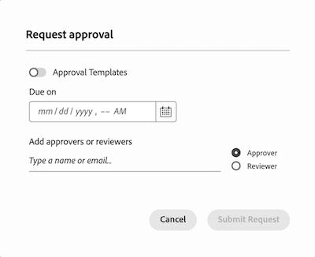

# 統合承認とプルーフの併用

Workfrontの統合承認では、ドキュメントのレビューと承認に役立つ新しい機能セットが導入されています。 既存のプルーフビューアで統合承認ワークフローを使用すると、レビュー中のドキュメントにコメントやマークアップを追加できます。

統合承認とプルーフを一緒に使用する場合、ワークフローにはいくつかの主な違いがあります。

* 参加者は、プルーフワークフローではなく、ドキュメントの概要に表示されます

* ドキュメントリストの送信済み、開封済み、コメント、決定（SOCD）の詳細は、プルーフに関連しており、ドキュメントの決定ステータスを反映していません。

## ドキュメントのアップロードとプルーフの作成

1. 新しいドキュメントを追加するプロジェクト、タスク、またはイシューに移動します。
1. **ドキュメント** タブをクリックしてから、**新規追加** ドロップダウンメニューをクリックします。
または
ドキュメントをドキュメントリストにドラッグ&amp;ドロップします。

   >[!NOTE]
   >
   >ユーザープロファイルで&#x200B;**ドキュメントのアップロード時にプルーフを自動的に生成**&#x200B;を有効にしている場合、システムはシンプルなプルーフを自動的に作成します。

1. ドキュメントにポインタを合わせ、ドキュメント名の下に表示される **プルーフを作成** リンクをクリックして、「**シンプルなプルーフ**」を選択します。 承認にはプルーフワークフローを使用しないので、シンプルなプルーフを作成する必要があります。

参加者として割り当てられたユーザーは、プルーフビューアを使用して、ドキュメントにコメントとマークアップを追加できます。 次の節に進んで、レビュー参加者の追加方法を学びます。

## ドキュメントの概要を開き、参加者を割り当てます

次のように、レビュー担当者、承認者、またはその両方を割り当てるオプションがあります。

* **レビュー担当者** は、コメントを追加したり、アセットをマークアップしたりできます。 完了したら、レビューを完了としてマークできます。 ドキュメントを承認プロセスで先に進めるために、レビューを完了とマークする必要はありません。
* **承認者** は、コメントを追加し、アセットをマークアップできます。 承認プロセスを進めるための決定を行う必要があります。

参加者を割り当てるには：

1. アップロードしたドキュメントを選択し、ドキュメントの概要を開きます。
   

1. 「承認」セクションまでスクロールし、「**追加**」をクリックします。

1. （任意）既存の承認テンプレートを選択します。 Standard ライセンスを持つユーザーは、設定エリアから適切な承認テンプレートを作成できます。 詳しくは、[ アセットおよびドキュメントの承認テンプレートの作成 ](/help/quicksilver/review-and-approve-work/document-reviews-and-approvals/manage-document-approvals/create-approval-template.md) を参照してください。

1. （任意）承認の期限を設定します。 ユーザーとチームには、指定した期限の 72 時間前と 24 時間前にメールで通知が届きます。

1. 承認者を追加するには、「承認者」ボタンをクリックし、ユーザー名またはチーム名を入力します。

1. レビュー担当者を追加するには、「レビュー担当者」ボタンをクリックして、ユーザー名またはチーム名を入力します。

   

1. すべてのレビュー担当者と承認者を追加したら、「**リクエストを送信**」をクリックします。 参加者には、メールで通知されます。

## 必要に応じて新しいバージョンを作成します

別のラウンドでのレビューと承認が必要な場合は、新しいプルーフバージョンを作成して、以前の参加者、新しい参加者または両方を追加できます。 以前のバージョンと参加者に関する情報は、ドキュメントの概要で確認できます。

新しいバージョンを追加するには：

1. 新しいファイルをWorkfrontの前のドキュメントの上にドラッグ&amp;ドロップします。 これにより、新しいバージョンが自動的に作成されます。

1. ドキュメントのアップロードが完了したら、ドキュメントを選択し、**プルーフを作成**/**シンプルなプルーフ** をクリックします。

1. ドキュメントを再度選択し、ドキュメントの概要を開きます。
   

1. 「承認」セクションまでスクロールし、「**追加**」をクリックします。

1. （任意）既存の承認テンプレートを選択します。 Standard ライセンスを持つユーザーは、設定エリアから適切な承認テンプレートを作成できます。 詳しくは、[ アセットおよびドキュメントの承認テンプレートの作成 ](/help/quicksilver/review-and-approve-work/document-reviews-and-approvals/manage-document-approvals/create-approval-template.md) を参照してください。

1. （任意）承認の期限を設定します。 ユーザーとチームには、指定した期限の 72 時間前と 24 時間前にメールで通知が届きます。

1. 承認者を追加するには、「承認者」ボタンをクリックしてユーザー名またはチーム名の入力を開始するか、以前のバージョンから承認者を選択します。

1. レビュー担当者を追加するには、「レビュー担当者」ボタンをクリックしてユーザー名またはチーム名を入力し始め、以前のバージョンからレビュー担当者を選択します。

   

1. すべてのレビュー担当者と承認者を追加したら、「**リクエストを送信**」をクリックします。 参加者には、メールで通知されます。

<!-- add info about reusing previous participants once released -->

## プルーフを確認し、決定します

割り当てられたすべての承認者が「承認済み」を選択するまで、ドキュメントは承認済みステータスに移動しません。

いずれかの承認者が「作業が必要」を選択した場合、ドキュメントのステータスは直ちに「作業が必要」に変わります。 ドキュメントは、新しい承認ワークフローで新しいバージョンとして改訂およびアップロードする必要があります。

ドキュメントをレビューおよび承認するには：

1. レビューメール通知に移動し、「**レビューに移動**」をクリックします。

1. Workfrontに移動したら、「**プルーフに移動** をクリックします。

1. コンテンツをレビューし、コメントやマークアップを追加します。 プルーフビューアの使用方法について詳しくは、[Adobe Workfront内でプルーフを確認する：記事インデックス ](/help/quicksilver/review-and-approve-work/proofing/reviewing-proofs-within-workfront/review-proofs-in-wf.md) を参照してください。

1. 次のいずれかの決定を選択します。

   * **承認**: ドキュメントは変更する必要がなく、使用できる状態になっています。
   * **変更を加えて承認**: ドキュメントには変更が必要です。変更が行われると使用できるようになります。 追加の承認は必要ありません。
   * **作業が必要**：ドキュメントに変更が必要ですが、使用する準備ができていません。 指定した変更を加えたら、ドキュメントを新しいバージョンとしてアップロードし、別の承認を行う必要があります。 新しいバージョンのアップロードについて詳しくは、この記事の [ 必要に応じて新しいバージョンを作成する ](#create-a-new-version-as-needed) を参照してください。

決定を行うと、ドキュメント所有者にメールで通知されます。

