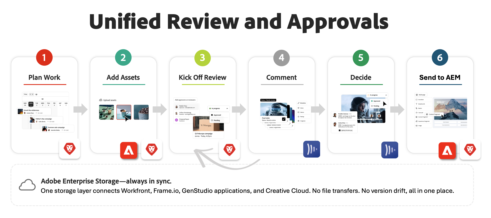

# 統一されたレビューと承認の概要

「レビューと承認の統合」により、Adobe WorkfrontとAdobe Frame.ioが単一の緊密に連携されたエクスペリエンスに統合され、マーケティング管理、クリエイティブレビュー、コンテンツ配信のギャップを埋めることができます。
プロジェクトコーディネーターがWorkfrontで作業を管理し、クリエイター、マーケター、ステークホルダーがプロフェッショナル級のFrame.io ビューアでアセットをレビューし承認します。これらのツール間でファイルを移動する必要はありません。

<!--
## Integration requirements

* The Workfront instance must be enabled on the Adobe Unified Experience.

-->

## Adobe Enterprise Storage上に構築

統一されたレビューと承認は、Adobeエンタープライズストレージ上に構築されています。WorkfrontやFrame.ioなどのAdobeエンタープライズ製品全体のアセットの中央リポジトリとして機能する、クラウドベースのストレージソリューションです。<!--, and Creative Cloud.-->

Adobeエンタープライズストレージの主な利点は次のとおりです。

* クリエイティブおよび作業管理アセット向けの統合ストレージレイヤー
* 安全なアクセス制御のためのAdobe Identity Managementシステム（IMS）による一元的な権限
* WorkfrontとFrame.io全体でエンドツーエンドのアセットを可視化<!--, and Creative Cloud apps -->
* エンタープライズニーズに対応する拡張性の高いストレージとノルマの管理

詳しくは、[Adobe エンタープライズストレージの概要](/help/quicksilver/review-and-approve-work/esm-overview.md)を参照してください。

## 統一されたレビューと承認

統一されたレビューと承認を利用することで、次のことが可能になります。

* Workfrontから直接レビューや承認を作成、管理できます
* レビューと承認のステータスをリアルタイムで追跡し
* フィードバックと承認を一元化したい
* あらゆる関係者が最新バージョンのアセットにアクセスできる
* AI レビュー担当者を活用してブランドコンプライアンスのレビューを自動化する
* その他

詳しくは、[統一ドキュメント承認：記事インデックス ](/help/quicksilver/review-and-approve-work/document-reviews-and-approvals/document-reviews-and-approvals.md)を参照してください。

### Frame.io ビューアの使用

Frame.io ビューアを使用したアセットのレビューと承認 Frame.io ビューアには

* マークアップツールとコメントツール
* バージョン履歴と比較
* ビデオレビュー用のタイムスタンプ付きコメント
* 外出先でのレビューと承認のためのモバイルアクセス

詳しくは、[統合レビューと承認の概要](/help/quicksilver/review-and-approve-work/get-started-with-unified-approvals.md)を参照してください。

#### ビデオレビューの制限

ビデオプルーフのリクエストには、組織の有料Workfront ユーザーライセンスの10%であるStandardとLightの年間上限が設定されています。 このキャップは、組織レベルで適用されます。

Workfront管理者は、使用率がキャップの80%と100%に達すると、通知を受け取ります。

この制限は、Frame.io Enterpriseのお客様には適用されません。

#### Frame.io ビューアでサポートされているファイルタイプ

Frame.io ビューアは、一般的なビデオ、画像、オーディオ、PDF、MS® Officeのすべてのタイプをサポートしています。 サポートされているファイルの詳細なリストについては、[Frame.ioでサポートされているファイルタイプ ](https://help.frame.io/en/articles/9436564-supported-file-types-on-frame-io)を参照してください。

#### Frame.io ビューアへのアクセスとライセンス

Frame.io ビューアは、すべてのWorkfront レビューおよび承認ワークフローのデフォルトビューアです。 有料ライセンスを持つすべてのWorkfront ユーザーに対して自動的に含まれます。 レビューや承認にFrame.io ビューアを使用するために、追加のFrame.io ライセンスは必要ありません。

Frame.ioでアセットをプロジェクトに直接アップロードするなど、この統合で利用可能な追加のFrame.io機能を利用したい場合は、Frame.io エンタープライズライセンスを購入できます。 Adobeの担当者にお問い合わせいただき、デモを予約したり、Frame.io ソリューション全体のメリットをご確認ください。

Workfront プルーフ機能は、この統合では使用できません。

## Workfrontの強力なプロジェクト管理

プロジェクトコーディネーターは、Workfrontの強力なプロジェクト管理機能を活用して、作業を計画、追跡、管理できます。

Workfrontでのプロジェクトの管理について詳しくは、[ プロジェクト：記事インデックス ](/help/quicksilver/manage-work/projects/create-projects/create-project.md)を参照してください。

### 構造と命名規則の適用

統一されたレビューと承認はAdobe エンタープライズストレージを使用して構築されるので、プロジェクトやドキュメントを管理する際に認識すべき構造と命名規則がいくつかあります。

* プログラムとプロジェクトが同じポートフォリオに属している場合、同じ名前を付けることはできません。
* ドキュメントが同じプロジェクトに属している場合、ドキュメントに同じ名前を付けることはできません。
* オブジェクト名に次の特殊文字を含めることはできません：\ / : * ? &quot; | &lt; >
* オブジェクト名は最大255文字に制限されています。

これらの制限を念頭に置いて、Workfrontでは、競合を防ぐために、必要に応じてオブジェクトまたはドキュメントの名前が自動的に変更されます。

### 共有と権限

この統合の一環として、Workfrontでユーザー権限が制御され、Frame.ioに流れ込みます。 つまり、Frame.ioのプロジェクトにユーザーを招待したり、Frame.ioのユーザー権限を変更したりすることはできません。 これらの操作は、Workfrontのプロジェクト共有モーダルを使用して実行する必要があります。

次の表は、Workfrontの権限がFrame.ioの権限にどのようにマッピングされるかを示しています。

<table>
<tr>
<th>Workfront ユーザー権限</th>
<th>Frame.io ユーザー権限</th>
</tr>
<tr>
<td>管理</td>
<td>編集して共有</td>
</tr>
<tr>
<td>参加</td>
<td>編集して共有</td>
</tr>
<tr>
<td>表示</td>
<td>コメントのみ</td>
</tr>
</table>

### Workfrontのドキュメント管理

Workfrontにアップロードされたドキュメントは、Adobe エンタープライズストレージに保存され、WorkfrontとFrame.ioの両方からアクセスできます。 Workfrontでタスクまたはイシューにドキュメントをアップロードすると、タスクまたはイシューから権限を継承するシステム生成フォルダーがAdobe エンタープライズストレージに作成されます。 そのタスクまたはイシューにアップロードされたすべてのドキュメントは、そのフォルダーに保存され、そこから権限を継承します。 Workfrontのドキュメントについて詳しくは、[新しいドキュメント エリアの概要](/help/quicksilver/documents/managing-documents/documents-area.md)および[Adobe エンタープライズ ストレージ モデルのオブジェクト権限とアクセス レベルの概要](/help/quicksilver/review-and-approve-work/esm-access-permissions.md)を参照してください。

### ドキュメントエクスペリエンスの制限

次のドキュメント機能は含まれていません。

<!--* External document providers-->
* Workfrontのプルーフへのアクセス
* Workfrontのドキュメントビューア
* お気に入りドキュメント
* ドキュメントのリクエスト

## レビューと承認の統合を始める

統一されたレビューと承認を開始するには、[統一されたレビューと承認を開始](/help/quicksilver/review-and-approve-work/get-started-with-unified-approvals.md)を参照してください。

## よくある質問

### レビューと承認の統合を始める

+++ 展開すると、統一されたレビューと承認を開始するためのFAQが表示されます。

**統一レビューと承認とは何ですか？**

統一されたレビューと承認とは、Adobe WorkfrontとAdobe Frame.ioのネイティブ統合により、作業管理とクリエイティブレビューを単一の接続されたシステムで連携します。 プロジェクトコーディネーターは、Workfrontで作業を計画、追跡します。一方、レビュー担当者や承認担当者は、プロ級のFrame.io ビューアを使用して、フィードバックの提供、アセットのマークアップ、承認の意思決定をおこないます。ツールを切り替えたり、ファイルを手動で移動したりすることはありません。

レビューと承認はすべてのコンテンツ作業の中心にあります。 クリエイティブワーク、関係者からの意見、ビジネス上の意思決定が一体化する場所です。 そのプロセスが、メールスレッド、チャットメッセージ、スクリーンショットマークアップなど、連携していないツールに分散されていると、市場投入までの時間の短縮、フィードバックの損失、バージョンの混乱、コンテンツ制作ではなくファイル管理に費やす時間などの結果が生じます。

統一されたレビューと承認により、分断されたレビューツールのパッチワークを、作業が既に行われている場所に存在する信頼できる唯一の情報源である1つの最新システムに置き換えることができます。

**この統合を使用するための要件を教えてください。**

統一されたレビューと承認を使用するには、次の条件を満たす必要があります。

* WorkfrontとFrame.ioは、同じAdobe Identity Management System （IMS）組織にデプロイする必要があります。

* ユーザーは、IMS組織内の1つのWorkfront インスタンスにのみ属することができます。

* Workfront インスタンスは、Adobe Unified ExperienceおよびAdobe エンタープライズストレージで有効にする必要があります。

* Workfrontのお客様は、V2 SKUを使用している必要があります（これには契約手続きが必要な場合があります。Adobeの担当者にお問い合わせください）。

**この統合を使用するにはFrame.io ライセンスが必要ですか？**

いいえ。 Frame.io ビューアは、有料ライセンスを持つすべてのWorkfront ユーザーに対して、追加費用なしで自動的に含まれます。 Workfrontを通じてアセットをレビューおよび承認するために、別のFrame.io ライセンスは必要ありません。

組織がFrame.ioの追加機能（アセットをFrame.ioのプロジェクトに直接アップロードするなど）を利用したい場合は、Frame.io エンタープライズライセンスを購入できます。 詳細については、Adobeの担当者にお問い合わせください。

**これはWorkfront Proofに取って代わるものですか？**

はい。 統一されたレビューと承認が有効になっている場合、Frame.io ビューアはWorkfront Proofに代わってWorkfrontの主要なレビューサーフェスになります。

既存のお客様は、統合が有効になる前に作成されたすべてのプロジェクトに対して、Workfront プルーフ機能へのアクセス権を保持します。

**統一されたレビューと承認にアクセスするにはどうすればよいですか？**

**アクセスを取得するにはどうすればよいですか？**

統合されたレビューと承認にアクセスするには、組織がWorkfront V2 SKUを使用している必要があります。 現在V2 SKUを使用していない場合は、Adobeとの契約イベントが必要になります。 開始するには

* 現在のAdobe プランが統一されたレビューと承認をサポートしているかどうかを確認するには、Workfront アカウント担当者にお問い合わせください。

* SKUのアップグレードが必要な場合は、アカウント担当者が契約プロセスをご案内します。

* アカウントが適切なSKUに登録されると、Adobe Professional Servicesが自社の統合を設定します。

   * Adobeの担当者がわからない場合は、Adobe サポートポータルから連絡するか、Experience Leagueにアクセスして問い合わせオプションをご確認ください。

+++

### 統一されたレビューと承認の仕組み

+++ 展開すると、統一されたレビューと承認の仕組みに関するよくある質問が表示されます。

**レビューと承認ワークフローの仕組みはどのようになっていますか？**

ワークフローは次の一般的な手順に従います。

1. プロジェクトコーディネーターは、Workfrontでプロジェクトを作成し、アセットをアップロードまたはリンクします。

1. アセットのレビューの準備が整うと、コーディネーターは、単回使用の承認か再利用可能な承認テンプレートの適用のいずれかにより、承認ワークフローを作成します。

1. 割り当てられたレビュー担当者や承認者には電子メールで通知が送られ、Frame.io ビューアで直接アセットを開くことができます。

1. レビュー担当者はコメントやマークアップを追加できます。 承認者は正式な決定を下す必要があります。

1. コーディネーターは、Workfrontからリアルタイムでステータスを追跡します。

**レビュアーと承認者の違いは何ですか？**

レビュー担当者は、Frame.io ビューアでコメントを追加したり、アセットにマークを付けたりできます。 完了したら、レビューは「完了」とマークされます。 ただし、承認ワークフローを進めるためにそれらのアクションは必要ありません。

承認者は、承認ワークフローを前進させるために、次のいずれかの決定をおこなう必要があります。

* **承認**: アセットをそのまま使用する準備ができました。

* **作業が必要**: アセットは変更が必要で、再承認のために新しいバージョンとして再送信する必要があります。

**どのような承認ワークフローを作成できますか？**

* **単回使用の承認**: プロジェクト、タスク、イシュー内のドキュメントに対して、単回使用の承認を直接作成できます。 レビュー担当者や承認者の割り当て、期限の設定、必要に応じた複数のステージの設定などをおこなえます。 自動メールリマインダーは、72時間前、24時間前、および期限内に送信されます。

* **承認テンプレート**:Workfront設定で再利用可能なテンプレートを作成できます。 テンプレートは、レビュー担当者、承認者、相対的な完了期間を定義します。 必要に応じて複数のステージを作成できます。 テンプレートがアセットに適用されると、期限が自動的に計算されます。

**外部ユーザーはどのようにレビューに参加しますか？**

外部のWorkfront ユーザーは、レビューまたは承認に割り当てられるときに、メールで通知されます。 ビューアにアクセスし、レビュープロセスに参加するためのFrame.io ログインを作成するように求められます。

**レビューと承認の進捗状況を追跡するにはどうすればよいですか？**

プロジェクトコーディネーターは、いくつかの方法であらゆる進行中の承認を監視できます。

* Workfrontのホーム領域の「マイ承認」ウィジェットには、保留中および期限切れの承認の概要がリアルタイムで表示されます。

* ドキュメント承認指標ウィジェットには、平均承認時間と意思決定の内訳が表示されます。

* カスタムレポートダッシュボードは、Canvas ダッシュボードに組み込むことで、レビューと承認アクティビティをより詳細に可視化できます。

+++

### アセットとビデオの確認と承認

+++ 拡大して、アセットとビデオのレビューと承認に関するよくある質問を表示します。

**動画のレビューに制限はありますか？**

はい。 ビデオプルーフのリクエストには、組織の有料Workfront ユーザーライセンス（標準およびライト）の10%に対する年間上限が設定されています。 この上限は、組織レベルで適用されます。

Workfront管理者は、使用率が上限の80%と100%に達すると、アプリ内通知を受け取ります。

この制限は、Frame.io Enterpriseのお客様には適用されません。 大量のビデオコンテンツを定期的にレビューする場合は、Adobeのアカウント担当者に連絡して、Frame.io Enterpriseのライセンスについて確認してください。

**同じユーザーを承認ワークフローの複数のステージに表示できますか？**

はい。 ユーザーは、同じ承認ワークフロー内の複数のステージに割り当てることができます。

**ステージを追加して多段階の承認ワークフローを作成できますか？**

はい。 複数ステージの承認ワークフローをサポートしており、各ステージで異なる参加者がレビューと承認を順番に行うことができます。

<!--
**Can I modify the trigger for a later stage---for example, based on all approved versus the due date ending?**

Stages in a multi-stage approval workflow proceed sequentially based on all required decisions being made in the current stage. When all assigned approvers in a stage have made their decisions, the next stage begins and the previous stage is locked. There is no option to trigger a stage based on the due date ending. If the "One decision required" toggle is enabled on a stage, the first approver decision completes that stage and advances the workflow.

**Can I remove the due date from an approval?**

Yes. Due dates are optional for both single-use approvals and approval templates. When creating a single-use approval, you can leave the deadline field empty. For approval templates, the relative completion timeframe is also optional.

**Can I change the default due date on new approval templates?**

Yes. When creating or editing an approval template, the timeframe (or "Workdays until due date" for multi-stage templates) can be adjusted per stage or left empty. The deadline is calculated automatically from this timeframe when the template is applied to an asset, so updating the template changes the default for all future approvals that use it.

**What happens when the deadline is reached for a review stage?**

For both single-stage and multi-stage reviews, automated reminder emails are sent at 72 hours, 24 hours, and on the deadline. However, reaching the deadline does not automatically reject the asset, lock the stage, or advance the workflow. Approvers and reviewers can still make decisions or complete their review after the deadline has passed. In a multi-stage workflow, each stage has its own independent deadline, and stages still advance based on all required decisions being made---not based on the deadline.
-->

**承認テンプレートには、グループまたはチーム、または個々のユーザーのみを含めることができますか？**

現在、承認テンプレートは個々のユーザーとチームをサポートしています。

**承認者は、レビュー用の電子メールで通知を受け取りますか？**

はい。 承認者とレビュー担当者は、レビューや承認に割り当てられたときにメール通知を受け取ります。 また、自動リマインダーメールは、締切の72時間前、24時間前、締切そのものに送信されます。

メール通知メッセージのカスタマイズ機能は現在利用できませんが、製品ロードマップに記載されています。

<!--
**Can I change the notification frequency for a unified approver or reviewer (for example, all comments, replies to my comments, or daily summaries)?**

No. Notification frequency settings such as receiving all comments, only replies to your comments, or daily digest summaries are not currently available for unified review and approval. The system sends email notifications automatically when a user is assigned as a reviewer or approver, and automated reminder emails are sent at 72 hours, 24 hours, and on the deadline. The ability to customize notification messages and frequency is on the product roadmap.
-->

**レビューステージを他の参加者から非公開にできますか？**

現在、プライベートステージ機能はありません。 レビューを他の参加者から非公開にするために、レビューグループ専用のアセットの個別コピーを作成することをお勧めします。 コメントは、現在、1つのアセット内の参加者グループごとにセグメント化されていません。

過去と現在のバージョンを含むバージョン履歴は、そのアセットを表示するアクセス権を持つ人なら誰でも常に表示されます。

**コメントを解決済みとしてマークできますか？**

はい。 コメントは、Frame.io ビューア内で解決済みとしてマークできます。

**Frame.io ビューアで使用できるマークアップ ツールと注釈ツールは何ですか？**

Frame.io ビューアには、フリーハンド描画や、円、矢印、正方形などの標準的なシェイプを含む、視覚的なマークアップツールのフルセットが含まれています。 ビデオアセットの場合、コメントはフレーム単位の精度でタイムスタンプ付けされるため、フィードバックは通常のタイムスタンプではなく、クリップ内の正確な瞬間に常に関連付けられます。

**Frame.io ビューアで行ったコメントは、Workfront プロジェクトに表示されますか？**

コメントや注釈はFrame.ioのビューア内に残るので、タイムスタンプやビジュアルマークアップなどの完全なコンテキストを維持できます。 これは、今後のリリースで進化する可能性があります。

**ダウンロードしたバージョンのアセット（PDFなど）にコメントを追加できますか？**

この機能は現在サポートされていませんが、今後のリリースで検討中の一般的な機能です。

**複数のアセットを1つのグループとしてレビューできますか？**

強化された一括審査オプションは近日リリース予定です。 また、ビデオやWord文書など、様々なタイプのファイルのアセットを、グループ化されたアセットレビューにまとめることができます。

**統一されたレビューと承認はビデオに対してのみですか、それとも他のファイル形式をサポートしていますか？**

統一されたレビューと承認は、動画だけでなく、あらゆるタイプのアセットに対応します。 Frame.io ビューアが大幅に更新され、ビデオに加えて、画像、ドキュメント、PDF、その他の一般的なファイル形式をサポートするようになりました。

サポートされているファイルタイプの完全なリストについては、Experience LeagueでサポートされているFrame.ioのファイルタイプに関するドキュメントを参照してください。

**Workfrontにアクセスできない関係者と外部でアセットを共有できますか？**

はい。 Assetsは外部で共有できます。 外部ユーザーには電子メールで通知され、Frame.io ログインを作成してビューアにアクセスし、レビューに参加するよう求められます。

<!--
**Before unified review and approval, is a reviewer just directed to a proof?**

Yes. In the legacy proofing workflow (prior to unified review and approval), when a user was assigned as a reviewer they were directed to the Workfront Proof viewer (ProofHQ) to review the proof. With unified review and approval, reviewers are instead directed to the Frame.io viewer, which replaces the Workfront Proof viewer as the primary review surface.

**When I upload a document and not a proof, a proof gets generated. Will a proof always be generated?**

No. With unified review and approval enabled and Adobe enterprise storage active, uploading a document does not automatically generate a proof. Documents are stored in Adobe enterprise storage and are reviewed using the Frame.io viewer. A proof is only generated if you explicitly create one using the legacy proofing workflow. The Frame.io viewer serves as the primary review surface, so a separate proof is not needed for standard review and approval workflows.

**What is the difference between uploading a document and a proof after the 26.2 release?**

With unified review and approval enabled, uploading a document stores it in Adobe enterprise storage and makes it available for review in the Frame.io viewer. A unified approval workflow can be created directly on the document. Uploading a proof, by contrast, uses the legacy Workfront Proof viewer (ProofHQ) and its own proofing workflow. Both options are available for projects created before the integration was enabled, but the Frame.io viewer is the primary review surface going forward. The key difference is that a document uses the unified approval workflow and Frame.io viewer, while a proof uses the legacy proofing workflow and viewer.

**Reviews under My Approvals only show a "Complete my review" button and no link to the proofing viewer or the document. Is this intended?**

For unified review and approval, the My Approvals widget provides an "Open review" button that opens the asset in the Frame.io viewer, as well as action buttons to approve, request changes, or complete a review. Reviewers can complete their review directly from the widget. If you are only seeing a "Complete my review" button without a link to the viewer, this may reflect the reviewer role behavior---reviewers are not required to open the asset to mark their review as complete, though they can choose to open it in the Frame.io viewer to provide feedback before completing.

**Before unified review and approval, if a user is both an approver in a document approval and a reviewer/approver on a proof, both show up in the proof window. How do these work together?**

When using unified approvals alongside legacy proofing on the same document, the two workflows operate independently. Document approval participants are shown in the Document Summary panel, while proof participants are shown in the proofing workflow. The SOCD (Sent, Opened, Comment, Decision) indicators in the document list are proofing-related and do not reflect the unified approval decision status. These two workflows do not automatically sync---a decision made in one does not carry over to the other.

**If you upload a new version, the document approval users do not get repopulated. Is that intended?**

Yes. When a new version is uploaded, previous approval participants are not automatically repopulated. The previous version's approval process is closed and any outstanding approvals are marked as "Withdrawn." The document owner must manually add participants to the new version's approval workflow. An "Add all" button is available to quickly repopulate all participants from the previous version, and you can also selectively add previous participants or add new ones.
-->

+++

### ストレージとファイル管理

+++ 展開して、ストレージとファイル管理に関するよくある質問を表示します。

**Adobe エンタープライズ ストレージとは何ですか。この統合とどのように関係しますか？**

Adobeエンタープライズストレージは、Workfront、Frame.io、Adobe Creative Cloudを接続する一般的なストレージレイヤーです。 Assetsなら、あらゆるツールからアクセスでき、ファイルを手動で転送する必要はありません。 クリエイターは適切な場所で作業でき、レビュー担当者は常に最新バージョンを確認できます。

Adobeエンタープライズストレージの主な利点は次のとおりです。

* WorkfrontとFrame.ioをまたいで進行中のあらゆるアセットを一元管理できるストレージレイヤー

* 一元化されたアクセス制御（IMS:Identity Managementシステム）による管理）

* エンドツーエンドのアセットを可視化：バージョンのドリフトやメタデータの損失を回避

* スケーラブルなエンタープライズグレードのストレージ管理

**ファイルやプロジェクトに名前や構造の要件はありますか？**

はい。 統合ではAdobe エンタープライズストレージを使用するため、次の規則が適用されます。

* プログラムとプロジェクトが同じポートフォリオに属している場合、同じ名前を付けることはできません。

* ドキュメント名は、フォルダー階層内の同じ親内で一意である必要があります。

* 同じプロジェクト内のドキュメントは名前を共有できません。

* プログラム、ポートフォリオ、プロジェクト、テンプレート、タスク、イシュー、ドキュメント、ドキュメントフォルダー名に次の特殊文字を含めることはできません：`\ / : * ? " | < >`。255文字に制限されています。

Workfrontでは、競合を防ぐために、必要に応じてオブジェクトやドキュメントの名前が自動的に変更されます。

**Frame.io ビューアでサポートされているファイルタイプは何ですか？**

Frame.io ビューアは、一般的なビデオ、画像、オーディオ、PDF、Microsoft Officeなど、40種類以上のファイル形式をサポートしています。 ビデオのサポートには、ProRes、H.265、DNxHDなどのプロフェッショナル形式のネイティブ再生が含まれており、最大500 GBのファイルをサポートしています。

Frame.ioはクリエイティブレビュー向けに構築されているため、マーケティングチームやクリエイティブチームが利用するあらゆるアセットタイプを扱うことができます。

+++

### 権限とアクセス

+++ 拡大して、権限とアクセスに関するよくある質問を表示します。

**ユーザー権限はどのように管理されますか？**

ユーザー権限はWorkfrontで設定および制御され、自動的にFrame.ioに送信されます。 この統合では、Frame.ioでユーザーを招待したり権限を直接変更したりすることはできません。 すべてのアクセス管理は、Workfrontのプロジェクト共有モーダルを使用して行う必要があります。

次の表は、Workfrontの権限がFrame.ioの権限にどのようにマッピングされるかを示しています。

<table>
  <thead>
    <tr>
      <th>Workfront権限</th>
      <th>Frame.io権限</th>
    </tr>
  </thead>
  <tbody>
    <tr>
      <td>管理</td>
      <td>編集して共有</td>
    </tr>
    <tr>
      <td>参加</td>
      <td>編集して共有</td>
    </tr>
    <tr>
      <td>表示</td>
      <td>コメントのみ</td>
    </tr>
  </tbody>
</table>

+++

### 統合と高度な機能

+++ 展開して、統合と高度な機能に関するよくある質問を表示します。

**これは、既存のCreative Cloud プラグインとAdobe ExpressおよびGenStudioとの統合にどのような影響を与えますか？**

Frame.ioのビューアエクスペリエンスをサポートする統合機能は、現在、Adobe ExpressおよびGenStudio Performance Marketing向けに開発中です。 新しい統合は、同じ統合されたレビューと承認のシステム上に構築されるため、3つの製品すべてで一貫したレビューエクスペリエンスを実現するためにFrame.io ビューアを活用します。

**Frame.ioはWorkfrontに統合されていますか？それとも、ユーザーは別のインターフェイスに移動しますか？**

Frame.io ビューアは、Workfrontから直接ローンチできます。 レビューと承認のアクティビティはすべてFrame.ioのビューア内で行われ、Workfrontに自動的に同期されます。

**承認済みアセットをAdobe Experience Manager （AEM）に送信できますか？**

はい。 アセットのレビューと承認サイクルが完了したら、最終的な保存と配信のためにAdobe Experience Manager Assetsに転送できます。 これにより、Workfrontの作業管理機能、Frame.ioのレビュー機能、AEMのデジタルアセット管理機能が、統合されたコンテンツsupply chainに連携されます。

詳しくは、「[Frame.io統合でAdobe Experience Managerを使用する](/help/quicksilver/review-and-approve-work/native-integrations/frame-io/use-aem-with-frame.md)」を参照してください。

**統一されたレビューと承認は、Adobe GenStudioにどのように適合しますか？**

統一されたレビューと承認は、Adobe GenStudio（Adobeのコネクテッドコンテンツに関する広範なビジョン）の基盤となるsupply chainです。 GenStudioは、Workfront、Frame.io、Creative Cloud、Adobe Express、Adobe Experience Manager Assets、GenStudio for Performance Marketingを連携させ、キャンペーンブリーフの作成からコンテンツの配信に至るまでのワークフローを統合します。

そのエコシステム内では、レビューと承認が、制作と配信の重要な接点となります。 この段階でクリエイティブ作業は関係者の意見を聞き、品質を検証し、コンテンツの公開を許可します。 その引き継ぎが迅速で目に見える信頼性の高いものであれば、コンテンツ全体のスピードが向上します。supply chainなら、AIを利用して制作を迅速化し、配信を自動化できますが、レビュープロセスのボトルネックが原因で両方の面で利益が生じてしまいます。 WorkfrontとFrame.ioを連携すれば、こうしたボトルネックを取り除くことができます。

**AI レビュアー機能とは何ですか？**

統一されたレビューと承認には、レビュープロセスの一部としてブランドコンプライアンスチェックを自動化するAI レビュアー機能が含まれています。 AI レビュアーは、アセットをブランドガイドラインと照らし合わせて評価し、人間のレビュアーが関与する前に潜在的な問題をフラグ付けすることで、問題をより早く捉え、迅速に対処できるようになります。

AI Reviewerの設定と使用について詳しくは、Experience Leagueに関するWorkfrontのドキュメントを参照してください。

+++

### 契約、SKU、ストレージ

+++ 展開して、契約、SKU、ストレージに関するよくある質問を表示します。

**統一されたレビューと承認はいつ利用できるようになりますか？**

統一されたレビューと承認は現在利用可能です。 アクセスするには、Workfront V2 SKUへのアップグレードが必要です。 V2 SKUが利用可能になる前に契約が署名された場合は、次の2つの方法のいずれかでアクセスできます。

* 更新時：次の契約更新日にアクセスが有効になります。

* 早期リトラクト：Adobe アカウントチームは、既存の契約終了日を維持しながら、早期にリトラクトして新しいSKU使用権限を追加することができます。 同等のパッケージに移行する際に価格の上昇はありません。

自社に最適なパスを見つけるには、Adobeのアカウント担当者にお問い合わせください。

<!--
**Before we sign the contract, what changes will we see in Workfront?**

Before signing the V2 SKU contract, your Workfront instance will continue to operate using the existing document and proofing experience. No unified review and approval features---such as the Frame.io viewer, Adobe enterprise storage, or multi-stage approval templates---will be available until the V2 SKU is contracted and Adobe Professional Services configures the integration for your organization.
-->

**V2 SKUにアップグレードすると、ストレージが増えますか？**

はい。 V2 SKUでは、ライセンスを取得した各ユーザーは60 GBのストレージを受け取り、以前のバージョンの30 GBから増加します。

**Adobe エンタープライズ ストレージと従来のWorkfront ストレージを選択する方法を教えてください。**

エンタープライズストレージは、Frame.ioのビューアエクスペリエンスを有効にし、統一されたレビューと承認のために必要です。 従来のストレージでは、引き続きWorkfront Proof ビューア（ProofHQ）がデフォルトとして使用されます。

シンプルなワークフローと複雑な校正ワークフローが混在している場合は、最初に移行するワークフローの優先順位を付けることができます。

エンタープライズストレージは、最もメリットを享受できるワークフローから始めて、新しいエクスペリエンスを段階的に展開できる柔軟性を提供します。

**Frame.io ライセンスはどのように管理されますか？**

V2 SKUに署名すると、すべてのWorkfront ユーザーはレビューおよび承認ワークフローのためにFrame.io ビューアにアクセスできるようになります。これには個別のFrame.io Enterprise ライセンスは必要ありません。

組織でFrame.io Enterpriseの追加機能が必要な場合は

* 高度な透かし（動的およびフォレンジック）
* アセットの自動削除機能によるデジタル著作権管理
* AIが生成したコンテンツのコンテンツ認証情報
* カスタムクリエイティブメタデータ
* Camera to Cloudの統合
* クリエイティブな作業中の作業に使用できる独自のワークスペース

Adobe アカウントチームと協力して、適切な数のFrame.io Enterprise ライセンスを指定できます。 すべてのライセンスは、Adobe Admin Consoleを通じて管理されます。

+++

### サンドボックスとロールアウト

+++ 展開して、サンドボックスとロールアウトに関するよくある質問を表示します。

**サンドボックス環境で統一されたレビューと承認をテストできますか？**

部分的に。 承認ワークフローは、Workfront サンドボックス環境でテストできます。 ただし、Frame.io ビューアエクスペリエンスはサンドボックスでは使用できません。 レビューサーフェス自体をテストするには、実稼動環境が必要です。

ロールアウト中の公開を制限するには、Workfront実稼動環境内の特定のグループに対して、統一されたレビューと承認を有効にします。 これにより、少数のユーザーでターゲットを絞った試験運用をおこない、より広範な展開が可能になります。

<!--
**How should we test future quarterly releases involving unified review and approval if the Frame.io viewer is not available in sandbox?**

Because the Frame.io viewer experience is not available in the Workfront sandbox environment, testing future quarterly releases should be done using a controlled pilot group in your production environment. You can enable unified review and approval for a specific group within your Workfront production instance, allowing a smaller set of users to validate new features as they release. Approval workflow configuration and template setup can still be tested in sandbox, but the full review experience---including the Frame.io viewer---must be validated in production.
-->

+++

### インタラクティブな校正とHTML

+++ を展開して、インタラクティブなプルーフとHTMLに関するよくある質問を表示します。

**統一されたレビューと承認は、インタラクティブなプルーフまたはHTML URLをサポートしていますか？**

Zip HTML ファイルは現在、インタラクティブレビューでサポートされています。 HTML URL サポート（ライブ web URL レビュー）はロードマップに掲載されており、第3四半期に予定されています。

アップデートについては、Experience LeagueのWorkfront リリースノートを参照してください。

+++

### Fusionと自動化

+++ 展開して、Fusionと自動化に関するよくある質問を表示します。

**統一されたレビューと承認を使用するには、Workfront Fusionが必要ですか？**

いいえ。 統一されたレビューと承認はネイティブ製品の統合であり、Fusionを必要としません。 Workfrontに直接組み込まれています。

**Fusion コネクタは統一されたレビューと承認に使用できますか？**

はい。 統一されたレビューと承認のためのFusion アクションは現在開発中で、第3四半期に利用可能になる予定です。 利用可能になったアップデートについては、Experience LeagueのWorkfront リリースノートを参照してください。

**ドキュメントがアップロードされたときに、Fusionを使用してレビューを自動的にトリガーできますか？**

はい。 この種類の自動化は、WorkfrontのWebhookとFusionを組み合わせて使用することで可能です。

**Workfront Proof上に構築された既存のFusion ワークフローは、どのような影響を受けますか？**

その効果は、各ワークフローがどのように構築されているかによって異なります。 一般：

* **編集または更新**：既存のプルーフ関連アクションが統合承認で直接同等のアクションを持つワークフローを更新して、新しいアクションを使用できます。

* **再構築**：基礎となる手順が大幅に変更されたワークフロー、または新しい機能が存在するワークフローをゼロから再構築する必要がある場合があります。

統合承認のためのFusion APIが利用可能になれば、より明確な全体像が明らかになります。 既存のFusion ワークフローを監査し、その時点で新しい統合承認機能に照らして評価することをお勧めします。

+++

