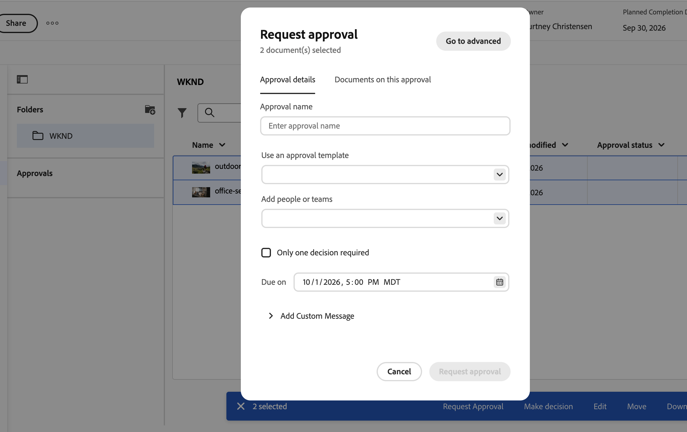

# グループ化された承認の作成

このページの情報は、Frame.io統合が使用できないため、プレビューサンドボックス環境では使用できません。 この機能は、2026年10月14日と15日に実稼動環境で利用できるようになります。

グループ化された承認では、複数のアセットが単一の承認ワークフローの下にバンドルされます。 単一アセットの承認と同様に、基本モードと詳細モード、複数ステージ、グループ化された承認を持つ並列パスを使用できます。

グループ化された承認は、組織がAdobe クラウドストレージを使用する場合に表示される新しいドキュメント領域でのみ使用できます。 詳しくは、[Adobe クラウドストレージの概要](/help/quicksilver/review-and-approve-work/esm-overview.md)を参照してください。

## アクセス要件

+++ 展開すると、この記事の機能のアクセス要件が表示されます。

<table style="table-layout:auto">
 <col>
 <col>
 <tbody>
  <tr>
   <td role="rowheader">Adobe Workfront パッケージ</td>
   <td> 
Adobeのクラウドストレージを使用して承認を管理する任意のワークフローパッケージ
 </td>
  </tr>
  <tr>
   <td role="rowheader">Adobe Workfront プラン</td>
   <td>
   
コントリビューター以上

   
レビュー以上

   
Adobe クラウドストレージを使用するオブジェクトの場合、承認ワークフローを作成するには標準ライセンスが必要です。

   </td>
  </tr>
  <tr>
   <td role="rowheader">アクセスレベル設定</td>
   <td> 
プロジェクト、タスク、イシュー、テンプレート、ポートフォリオ、プログラム、レポート、ダッシュボード、カレンダー、ドキュメントへの表示以上のアクセス
</td>
  </tr>
  <tr>
   <td role="rowheader">オブジェクト権限</td>
   <td> 
リクエストまたは承認に関連付けられているオブジェクトへのアクセスを管理します
</td>
  </tr>
 </tbody>
</table>

詳しくは、[Workfront ドキュメントのアクセス要件](/help/quicksilver/administration-and-setup/add-users/access-levels-and-object-permissions/access-level-requirements-in-documentation.md)を参照してください。

+++

## 基本的なグループ化された承認の作成

単一ステージのグループ化された承認を作成するには：

1. ドキュメントを含むプロジェクト、タスク、またはイシューに移動し、左側のパネルで「**ドキュメント**」を選択します。

1. 最初に含めるアセットをクリックし、Shift キーを押しながら追加のアセットをクリックして複数のアセットを選択します。

1. アセットを選択した状態で、下部メニューの「**承認を依頼**」をクリックします。 **承認依頼** ダイアログが基本モードで開きます。

   

1. 次の詳細を入力します。

   <table>
   <tr>
   <td><strong>承認テンプレートの使用（オプション）</strong></td>
   <td>デフォルトでは、「テンプレート」フィールドは折りたたまれています。 フィールドをクリックして展開し、ドロップダウンメニューからテンプレートを選択します。 テンプレートに1つのパスと1つのステージがある場合は、基本モードで適用されます。 テンプレートに複数のステージまたは複数のパスがある場合、ダイアログは自動的に詳細モードに切り替わり、基本モードで入力した入力は、テンプレートのコンテンツに置き換えられます。</td>
   </tr>
   <tr>
   <td><strong>プレビューでのユーザーまたはチームの追加</strong></td>
   <td>
ユーザー名、チーム、または電子メールアドレスを入力し、そのユーザーが<strong>承認者</strong>か<strong> レビュー担当者</strong>かを選択します。 Workfrontは、チームのアクティブな各メンバーを個別に追加します。

   
注：ユーザーが既に追加されているか、追加した複数のチームに属している場合、ユーザーは1回含まれます。
</td>
   </tr>
   <tr>
   <td><strong>1つの決定のみが必要です（オプション）</strong></td>
   <td>最初に決定を下した人がステージを完了します。</td>
   </tr>
   <tr>
   <td><strong>期限（オプション）</strong></td>
   <td>承認の期日を設定します。 利用者には、指定された期日の72時間、24時間前にメールで通知されます。</td>
   </tr>
   <tr>
   <td><strong>カスタムメッセージの追加（オプション）</strong></td>
   <td>「<strong> カスタムメッセージを追加</strong>」テキストボックスにメッセージを入力します。 このメッセージは、Workfrontの承認電子メール通知および「承認」タブに表示されます。</td>
   </tr>
   </table>

1. （オプション）この承認に含まれるアセットを確認するには、「**ドキュメント**」タブをクリックします。

1. 「**承認を依頼**」をクリックします。

   

## 高度なグループ化された承認の作成

高度なモードは並列パスをサポートしています。 各パスは独立して実行され、1つ以上のシーケンシャルステージを含みます。 ステージで必要なすべての意思決定が行われると、そのパスの次のステージが開始され、前のステージがロックされ、新しいステージのレビュー担当者と承認者にメール通知が送信されます。

「作業が必要」という決定は、そのパスを停止しますが、他のパスの承認ワークフローには影響しません。

<!--
You can configure up to 30 paths and 100 stages total.
-->

高度なグループ化された承認を作成するには：

1. ドキュメントを含むプロジェクト、タスク、またはイシューに移動し、左側のパネルで「**ドキュメント**」を選択します。

1. 最初に含めるアセットをクリックし、Shift キーを押しながら追加のアセットをクリックして複数のアセットを選択します。

1. アセットを選択した状態で、下部メニューの「**承認を依頼**」をクリックします。

   

1. **承認を依頼** ダイアログの右上にある「**詳細に移動**」をクリックします。 基本モードで入力した入力はすべて保持され、**パス 1**、**ステージ 1**&#x200B;に適用されます。

   >[!TIP]
   >
   >承認の作成中に、右上の「**基本に移動**」をクリックして基本モードに戻ることができます。 承認リクエストを送信すると、**基本に移動** オプションは使用できなくなります。

1. パス 1のステージ 1の詳細を入力：

   <table>
   <tr>
   <td><strong>ステージ名</strong></td>
   <td>ステージには、デフォルトで<em> ステージ 1</em>、<em> ステージ 2</em>などの名前が付けられます。 ステージの名前を、<em>初期審査</em>や<em>最終承認</em>などのより記述的な名前に変更します。</td>
   </tr>
   <tr>
   <td><strong>プレビューでのユーザーまたはチームの追加</strong></td>
   <td>
ユーザー名、チーム、または電子メールアドレスを入力し、そのユーザーが<strong>承認者</strong>か<strong> レビュー担当者</strong>かを選択します。 Workfrontは、チームのアクティブな各メンバーを個別に追加します。

   
注：ユーザーが既に追加されているか、追加した複数のチームに属している場合、ユーザーは1回含まれます。
</td>
   </tr>
   <tr>
   <td><strong>1つの決定のみが必要です（オプション）</strong></td>
   <td>最初に決定を下した人がステージを完了します。</td>
   </tr>
   <tr>
   <td><strong>期限（オプション）</strong></td>
   <td>各パスの最初のステージでは、絶対期日をサポートします。 パスの後続の各ステージは、相対的な期日（そのステージが開くまでの日数）をサポートします。 利用者には、期日の72時間、24時間前にメールで通知されます。</td>
   </tr>
   <tr>
   <td><strong>カスタムメッセージの追加（オプション）</strong></td>
   <td>「<strong> カスタムメッセージを追加</strong>」テキストボックスにメッセージを入力します。 このメッセージは、Workfrontの承認電子メール通知および「承認」タブに表示されます。
2番目のステージを追加すると、<strong>すべてのステージでこのメッセージを表示</strong>がデフォルトで選択されます。 各段階で同じメッセージを使用するように選択したままにします。 各ステージに異なるメッセージを使用するには、<strong>すべてのステージでこのメッセージを表示</strong>をクリアしてから、各ステージの<strong> カスタムメッセージを追加</strong> テキストボックスにステージ固有のメッセージを入力します。
</td>
   </tr>
   </table>

1. （オプション）パス 1にステージを追加します。
   1. 「**ステージを追加**」をクリックして、現在のパスに別のステージを追加します。 パス内のステージは、リストされている順序で順次実行されます。
   1. 新しいステージの詳細を入力してから、この手順を繰り返して必要に応じてステージを追加します。

      >[!NOTE]
      >
      >パス内のステージを並べ替えることはできますが、あるパスから別のパスにステージを移動することはできません。 各パスには異なる数のステージを設定できます。

1. （オプション）並行パスを追加します。
   1. 画面の左側にある&#x200B;**平行パス**&#x200B;の下で、**パスを追加**&#x200B;をクリックして別のパスを追加します。
   1. 同じ手順に従って、ステージと参加者を新しいパスに追加します。 各パスは独立して実行されるため、各パスに異なるステージ数と異なる参加者を設定できます。

1. （オプション）パスを削除するには、パスラベルにカーソルを合わせて、ごみ箱アイコンをクリックします。 **パス 1**&#x200B;を削除できません。パスを並べ替えることはできません。 その他のパスは、パス内のステージがロックまたは完了していない場合にのみ削除できます。

1. （オプション）すべてのパスとステージをクリアして最初からやり直すには、右上隅の「**リセット**」をクリックします。

1. （オプション）この承認に含まれるアセットを確認するには、「**ドキュメント**」タブをクリックします。

1. 「**承認を依頼**」をクリックします。

   

<!--

## Add additional documents to a grouped approval

You can add additional documents to a grouped approval after the approval has been created as long as the first stage has not been completed. 

To add an additional document to a grouped approval:

1. Click any document in the grouped approval, then click **Manage Approval** in the bottom menu.
1. Click **Documents on this approval**, then click **Add**.

   
1. Choose the documents you want to add, then click **Add to approval**. 
1. Once you add all of the documents, click **Edit approval**. The new documents are added to the grouped approval and all participants are notified of the change.

-->

## 既知の制限事項

* 現在、グループ化された承認ワークフローを作成した後は、ドキュメントを追加または削除することはできません。 この機能は、今後のリリースでリリースされる予定です。
* グループ化された承認は、1 グループにつき3つのパスと25のアセットに一時的に制限されます。