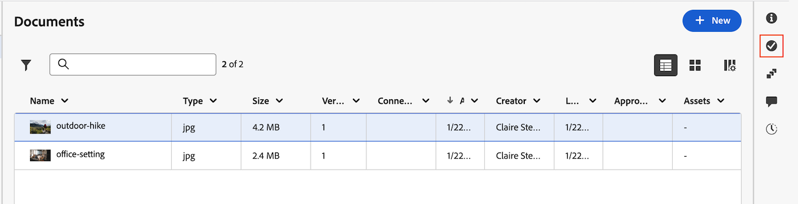

# グループ化された承認の管理

{{highlighted-preview-article-level}}

グループ化された承認では、複数のアセットが単一の承認ワークフローにバンドルされるため、アセットごとに個別の承認を必要とするのではなく、あらゆるアセットが同じステージを進むことができます。 ワークフローを再作成することなく、アクティブなグループ化された承認の参加者とアセットを追加または削除できます。

グループ化された承認は、単一アセットの承認と同じように、基本モードと詳細モード、複数ステージ、並行パスをサポートします。 詳しくは、[&#x200B; ドキュメント承認ワークフローの作成](/help/quicksilver/review-and-approve-work/document-reviews-and-approvals/manage-document-approvals/create-a-document-approval.md)を参照してください。

>[!IMPORTANT]
>
>この記事では、特定のアカウントでのみ利用できる更新済みのドキュメントの承認機能について説明します。 標準の承認プロセスについて詳しくは、[作業承認](/help/quicksilver/review-and-approve-work/manage-approvals/manage-approvals.md)にリストされている記事を参照してください。

## アクセス要件

+++ 展開すると、この記事の機能のアクセス要件が表示されます。

<table style="table-layout:auto">
 <col>
 <col>
 <tbody>
  <tr>
   <td role="rowheader">Adobe Workfront パッケージ</td>
   <td> 
Adobeのクラウドストレージを使用して承認を管理する任意のワークフローパッケージ
 </td>
  </tr>
  <tr>
   <td role="rowheader">Adobe Workfront プラン</td>
   <td>
   
コントリビューター以上

   
レビュー以上

   
Frame.io統合を使用している場合は、承認ワークフローを作成するための標準ライセンスが必要です。

   </td>
  </tr>
  <tr>
   <td role="rowheader">アクセスレベル設定</td>
   <td> 
プロジェクト、タスク、イシュー、テンプレート、ポートフォリオ、プログラム、レポート、ダッシュボード、カレンダー、ドキュメントへの表示以上のアクセス
</td>
  </tr>
  <tr>
   <td role="rowheader">オブジェクト権限</td>
   <td> 
リクエストまたは承認に関連付けられているオブジェクトへのアクセスを管理します
</td>
  </tr>
 </tbody>
</table>

詳しくは、[Workfront ドキュメントのアクセス要件](/help/quicksilver/administration-and-setup/add-users/access-levels-and-object-permissions/access-level-requirements-in-documentation.md)を参照してください。

+++

## アクティブなグループ化された承認への参加者の追加

ステージがアクティブな間、既に進行中の承認を中断することなく、承認者またはレビュー担当者をグループ化された承認に追加できます。

アクティブなグループ化された承認に参加者を追加するには：

1. グループ化された承認を含むプロジェクト、タスク、またはイシューに移動し、左側のパネルで「**ドキュメント**」を選択します。

1. グループ内の任意のドキュメントをクリックし、ページの右側にある&#x200B;**承認** アイコンをクリックします。

   

1. 「**ワークフローを編集**」をクリックします。

1. アクティブなステージの&#x200B;**名前またはメールを追加** フィールドにユーザー、チーム、またはメールを入力します。

1. 追加する各ユーザーについて、承認者かレビュアーかを選択します。

1. 「**保存**」をクリックします。

   新しい参加者には、グループ内のすべてのオープン承認がキューに表示されます。 追加される前に決定がおこなわれたことは表示されないので、現在開いているすべての承認を自分で完了する必要があります。

## アクティブなグループ化された承認から参加者を削除する

ステージがアクティブな間、グループ化された承認から承認者またはレビュー担当者を削除できます。 削除された参加者は、グループの承認をキューに表示するのをただちに停止しますが、既に行った決定は保持され、リセットされません。

アクティブなグループ化された承認から参加者を削除するには：

1. グループ化された承認を含むプロジェクト、タスク、またはイシューに移動し、左側のパネルで「**ドキュメント**」を選択します。

1. グループ内の任意のドキュメントをクリックし、ページの右側にある&#x200B;**承認** アイコンをクリックします。

1. 「**ワークフローを編集**」をクリックします。

1. アクティブなステージから削除する参加者を見つけ、名前の横にある&#x200B;**削除** アイコンをクリックします。

1. 「**保存**」をクリックします。

   残りの参加者の承認ステータスは、変更を考慮して再評価されます。

## グループ化された承認へのアセットの追加

最初のステージがロックされるまで、グループ化された承認にアセットを追加できます。 最初のステージがロックされると、そのステージの参加者はレビューする機会がないので、アセットを追加することができなくなります。

グループ化された承認にアセットを追加するには：

1. グループ化された承認を含むプロジェクト、タスク、またはイシューに移動し、左側のパネルで「**ドキュメント**」を選択します。

1. グループ内の任意のドキュメントをクリックし、ページの右側にある&#x200B;**承認** アイコンをクリックします。

1. 「**ワークフローを編集**」をクリックし、「**ドキュメント**」タブをクリックします。

1. グループに追加するアセットを選択します。

1. 「**保存**」をクリックします。

   グループ内のすべての参加者には、レビュー用に追加のアセットが追加されたことが通知されます。

## グループ化された承認からのアセットの削除

グループ化された承認から、ワークフローの任意の時点でアセットを削除できます。 削除されたアセットは、単独の承認として扱われ、再起動することなく、既存の決定、コメント、履歴のすべてを保持します。 アセットには既に承認決定が含まれているため、後でグループ化された承認にアセットを追加することはできません。

グループ化された承認からアセットを削除するには：

1. グループ化された承認を含むプロジェクト、タスク、またはイシューに移動し、左側のパネルで「**ドキュメント**」を選択します。

1. 削除するドキュメントをクリックし、ページの右側にある&#x200B;**承認** アイコンをクリックします。

1. 「**ワークフローを編集**」をクリックし、「**ドキュメント**」タブをクリックします。 選択した文書はリストの上部にピン留めされ、既にチェックされています。

1. グループから削除する文書の選択範囲をクリアします。

1. 「**保存**」をクリックします。

   アセットの承認ステータスは、削除された時点から表示され、変更されません。 グループ化された承認ビューが更新され、グループ内の残りのアセットが反映されます。

## 多段階のグループ化された承認で「ニーズ作業」の決定を解決する

多段階のグループ化された承認では、グループが次のステージに進むためには、ステージ内のあらゆるアセットが決定に達する必要があります。 アセットに「**作業が必要**」というマークが付いている場合、グループの残りの部分を進めることができないため、ステージを進めるにはグループからアセットを削除する必要があります。

「作業が必要」の決定を解決するには：

1. 「**作業が必要**」とマークされたアセットをグループから削除します。 詳細については、[&#x200B; グループ化された承認からアセットを削除](#remove-assets-from-a-grouped-approval)を参照してください。 削除されたアセットは、独立した承認となり、既存の決定、コメント、履歴を保持します。

1. アセットが更新されたら、単一のアセットとして、または新しいグループの一部として、アセットに対する承認を再度要求します。 アセットには既に承認決定が含まれているため、元のグループにアセットを追加することはできません。

   詳細については、[&#x200B; ドキュメント承認ワークフローの作成](create-a-document-approval.md)および[&#x200B; グループ化された承認の作成](create-a-grouped-approval.md)を参照してください。
