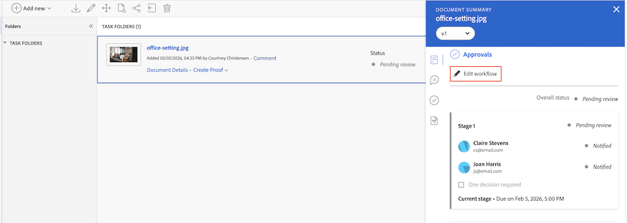

# ドキュメント承認ワークフローからの承認者またはレビュー担当者の削除

このページでハイライト表示されている情報は、まだ一般に利用できない機能を示します。プレビューサンドボックス環境でのみ使用できます。

アセットまたはドキュメントを割り当てた後に、個々の承認者またはレビュー担当者をアセットまたはドキュメントから削除できます。

>[!IMPORTANT]
>
>この記事では、特定のアカウントでのみ利用できる更新済みのドキュメントの承認機能について説明します。標準の承認プロセスについて詳しくは、[作業承認](/help/quicksilver/review-and-approve-work/manage-approvals/manage-approvals.md)にリストされている記事を参照してください。

## アクセス要件

+++ 展開すると、この記事の機能のアクセス要件が表示されます。

<table style="table-layout:auto"> 
 <col> 
 <col> 
 <tbody> 
  <tr> 
   <td role="rowheader">Adobe Workfront パッケージ</td> 
   <td> 
任意
 </td> 
  </tr> 
  <tr> 
   <td role="rowheader">Adobe Workfront プラン</td> 
   <td> 
   
コントリビューター以上

   
レビュー以上

   
Frame.io 統合を使用している場合、承認ワークフローを作成するには Standard ライセンスが必要です。

   </td> 
  </tr> 
  <tr> 
   <td role="rowheader">アクセスレベル設定</td> 
   <td> 
プロジェクト、タスク、タスク、タスク、テンプレート、ポートフォリオ、プログラム、レポート、ダッシュボード、カレンダー、ドキュメントへの表示アクセス権、またはより高いレベルのアクセス権
 </td> 
  </tr> 
  <tr> 
   <td role="rowheader">オブジェクト権限</td> 
   <td> 
リクエストのアクセスまたは承認に関連付けられたオブジェクトへのアクセス管理 
  </td> 
  </tr> 
 </tbody> 
</table>

詳しくは、[Workfront ドキュメントのアクセス要件](/help/quicksilver/administration-and-setup/add-users/access-levels-and-object-permissions/access-level-requirements-in-documentation.md)を参照してください。

+++

## 実稼動環境のドキュメントの詳細ページから承認者またはレビュー担当者を削除します

1. ドキュメントの名前をクリックしてドキュメントページに移動し、バージョンドロップダウンで承認を削除したいドキュメントのバージョンを選択します。デフォルトでは、最新バージョンが選択されています。

1. 左側のパネルで **承認** を選択します。

1. 削除する承認者またはレビュアーの名前にポインタを合わせ、名前の後に表示される **削除** アイコン  をクリックします。

   承認またはレビューリクエストが削除され、承認者は、承認が不要になったという通知を受け取ります。承認関連の共有アクセスも削除されます。

1. （オプション）承認者を完全に削除するのではなく、レビュアーに降格するには、名前の横にある「**承認者**」チェックボックスをオフにします。

1. 上記の手順を繰り返して、その他の承認者またはレビュアーを削除します。

## 実稼動環境のドキュメントの概要から承認者またはレビュー担当者を削除します

1. ドキュメントを含むプロジェクト、タスクまたはイシューに移動し、「**ドキュメント**」を選択します。

1. 必要なドキュメントをクリックすると、そのドキュメントのドキュメント概要パネルが開きます。

1. バージョンドロップダウンで、承認者またはレビュアーを削除するドキュメントのバージョンを選択します。デフォルトでは、最新バージョンが選択されています。

1. ドキュメントの概要パネルの「**承認**」セクションまでスクロールします。 削除する承認者またはレビュアーの名前にポインタを合わせ、名前の後に表示される **削除** アイコン  をクリックします。

   承認またはレビューリクエストが削除され、承認者は、承認が不要になったという通知を受け取ります。承認関連の共有アクセスも削除されます。

1. （オプション）承認者を完全に削除するのではなく、レビュアーに降格するには、名前の横にある「**承認者**」チェックボックスをオフにします。

1. 上記の手順を繰り返して、その他の承認者またはレビュアーを削除します。

## 従来のドキュメント領域のプレビュー環境で、承認ワークフローから承認者またはレビュー担当者を削除する

組織がWorkfront ストレージ上にある場合、Workfrontでドキュメントにアクセスすると、従来のドキュメント領域が表示されます。 Workfront ストレージについて詳しくは、[Workfront ストレージとAdobe エンタープライズストレージの比較 &#x200B;](/help/quicksilver/review-and-approve-work/esm-overview.md#workfront-storage-vs-adobe-enterprise-storage) を参照してください。

承認ワークフローから承認者またはレビュー担当者を削除する手順は、次のとおりです。

1. ドキュメントを含むプロジェクト、タスクまたはイシューに移動し、左パネルで **ドキュメント** を選択します。

1. 必要なドキュメントをクリックすると、そのドキュメントのドキュメント概要パネルが開きます。

1. ドキュメントの概要パネルの「**承認**」セクションまでスクロールします。

1. **ワークフローを編集** をクリックします。

1. 削除する参加者を見つけ、名前の横にある **削除** アイコンをクリックします。

   承認またはレビューリクエストが削除され、承認者は、承認が不要になったという通知を受け取ります。承認関連の共有アクセスも削除されます。

   

1. （オプション）承認者の役割をレビュアーに変更する（またはその逆に変更する）には、ユーザー名の横にあるドロップダウンメニューをクリックし、新しい役割を選択します。

1. 上記の手順を繰り返して、その他の承認者またはレビュアーを削除します。

## 新しいドキュメント領域で承認ワークフローに対する承認者またはレビュー担当者の削除

エンタープライズストレージを使用している場合、Workfrontでドキュメントにアクセスすると、新しいドキュメント エリアが表示されます。 エンタープライズストレージについて詳しくは、[&#x200B; エンタープライズストレージの概要 &#x200B;](/help/quicksilver/review-and-approve-work/esm-overview.md) を参照してください。

承認ワークフローを作成するには：

1. ドキュメントを含むプロジェクト、タスクまたはイシューに移動し、左パネルで **ドキュメント** を選択します。

1. ドキュメントをクリックしてから、ページの右側にある **承認** アイコンをクリックします。

   

1. **ワークフローを編集** をクリックします。

1. 削除する参加者を見つけ、名前の横にある **削除** アイコンをクリックします。

   承認またはレビューリクエストが削除され、承認者は承認が不要になったという通知を受け取ります。

1. （オプション）承認者の役割をレビュアーに変更する（またはその逆に変更する）には、ユーザー名の横にあるドロップダウンメニューをクリックし、新しい役割を選択します。

1. 上記の手順を繰り返して、その他の承認者またはレビュアーを削除します。

   
1. 「**保存**」をクリックします。