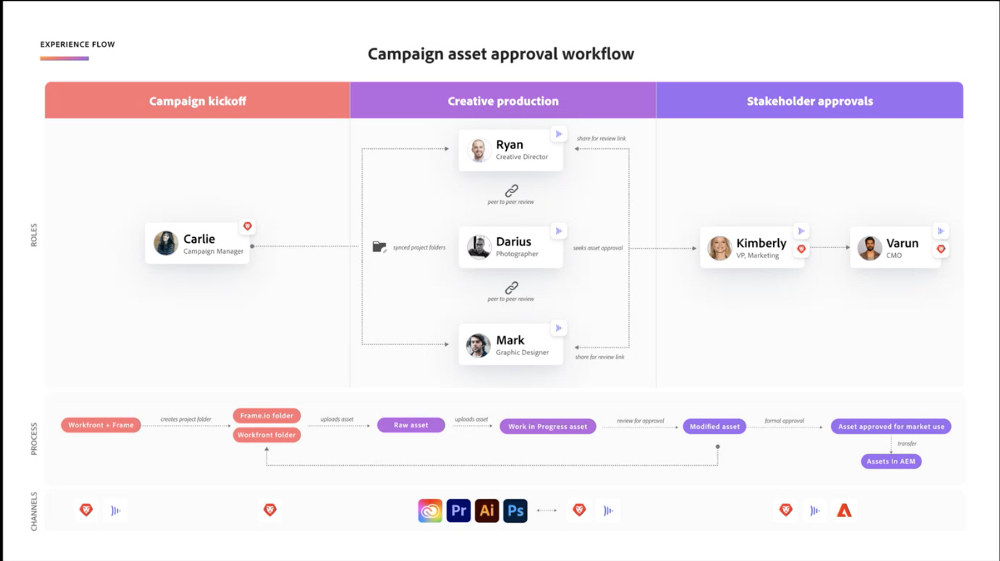

# アセットのレビューと承認の概要

新しいアセットのレビューと承認ワークフローは、Workfrontと Frame.io の緊密な統合を中心に構築されています。 この統合は、各製品で提供される機能の最大限のメリットを活用し、それを組み合わせて、コンテンツ作成に関わるすべてのユーザーが選択したツールで機能し、両方のシステム間でリアルタイムに同期されるコメント、ファイル、ステータス更新にアクセスできます。

<!-- link to frame docs-->

## Workfrontでの作業の開始と計画

プロジェクトコーディネーターは、Workfrontから始まります。 プロジェクトが作成され、タスクが割り当てられ、導入が送信されます。

プロジェクトコーディネータは WF プロジェクトを作成し、同期されたプロジェクトフォルダを使用して、Frame.io 内のクリエイティブに情報やサポート資料を送信します。

承認ワークフローをゼロから、またはテンプレートを使用して設定する

タスクを割り当て

プロジェクトを「現在」に設定するか、フレームプロジェクトとアラートクリエイティブを作成すると等しく設定します

### デフォルトの Frame.io アカウントを設定する

Workfrontの管理者は、Workfrontの「セットアップ」領域にデフォルトの Frame.io アカウントを追加して、Workfrontと Frame.io の統合を開始します。 デフォルトの Frame.io アカウントを設定すると、統合によってWorkfrontと Frame.io の間に接続されたプロジェクトを作成できます。

詳しくは、[] を参照してください。

<!-- in procedure article we need to cover how groups work with projects and how the frame account is associated with a group. And that accounts other than the default can be added on a 1:1 basis using the dev token. -->

### Frame.io ユーザーを有効にする

Frame.io を定期的に使用するWorkfrontユーザーは、Frame.io ユーザーとしてマークする必要があります。 Workfrontの管理者は、Workfrontユーザープロファイルで Frame.io ユーザーを指定できます。

ユーザーがWorkfrontで Frame.io ユーザーとしてマークされ、プロジェクトに追加された場合：

* Frame.io に共同作業者として追加されます。
* 正式なレビューと承認を得るために、Frame.io からWorkfrontにアセットを送信できます。

詳しくは、[] を参照してください。

>[!TIP]
>
>クリエイティブツールで定期的に作業するユーザーを有効にし、Frame.io ユーザーとしてレビューおよび承認用にアセットをアップロードすることをお勧めします。

### Frame.io と連携するプロジェクトを作成する

プロジェクトコーディネーターは、Frame.io と連携するWorkfrontプロジェクトを作成できます。 接続されたプロジェクトを作成する際に、次の操作を実行できます。

* **タスクに Frame.io ユーザーを割り当て**:Frame.io 対応のユーザーは、完了する作業があることを通知するタスクに割り当てられると、電子メールで通知されます。
* **プロジェクトを Frame.io ユーザーと共有します**:Frame.io と共有されるプロジェクトは、ユーザーが Frame.io 内のプロジェクトへのアクセス権を付与します。
* **クリエイティブマテリアルを Frame.io と共有する**：一方向同期プロジェクトフォルダーを使用して、Workfrontからクリエイティブユーザーに Frame.io で直接手順と資料を送信できます。
* **タスクの進行状況の追跡**：クリエイティブは、完了したアセットを送信し、Frame.io を終了することなくタスクを完了とマークできます。

詳しくは、[] を参照してください。

<!--Preassign approval templates to asks coming in the future-->

## Frame.io でのコンテンツ作成とコラボレーション

クリエイティブは、選択したツールにとどまり、Frame.io 内でピアレビューを作成、繰り返し、実行する自由を持つことができます。

クリエイティブが統合プロジェクトに追加されると、Frame.io を離れることなく、次のすべての操作を実行できます。

* プロジェクトコーディネーターからの手順にアクセスする
* 非公式のピアレビューを行う
* 正式なレビューと承認を得るために、完了したアセットをWorkfrontに送信
* タスクのステータスを変更するか、タスクを完了に設定します
<!-- * Notification of decision
* Upload new versions of connected assets marked as needs more work < will automatically connect>-->

## Workfrontでのアセットのレビューと承認

クリエイティブが Frame.io からWorkfrontに完了したアセットを送信すると、プロジェクトコーディネーターは、Workfrontでの正式なレビューおよび承認プロセスを開始できます。 すべてのレビューと承認アクティビティは、Workfrontに記録されます。

Frame.io でのコメントは、Workfrontの「更新」タブにも反映されます。 Workfrontでおこなわれた返信は、Frame.io では反映されません。

「チームのみ」とマークされたコメントは、「Workfrontの更新」タブに表示されません。

### 正式なレビューと承認の開始

1 回限りのレビューおよび承認を作成することも、ワークフロントの「設定」領域で、再生可能な承認テンプレートを作成することもできます。

レビュー担当者、承認者、またはその両方を割り当てることができます。

* **レビュー担当者** では、アセットのコメント化とマークアップを行うことができます。 完了したら、レビューが完了したとマークできます。 <!--example of when to add reviewers-->
* **承認者** 承認プロセスを前に進めるために、コメント化、アセットのマークアップおよび決定をおこなう必要があります。

レビュー担当者と承認者は、次のように、単一使用または承認テンプレートに追加できます。

<!--can also assign teams and set deadline-->

* **単一使用の承認**：承認期限の設定

* **承認テンプレート**
「Workfrontの設定」領域で、標準ライセンスを持つユーザーは、結果として得られる承認テンプレートを作成できます。 テンプレート内で、ユーザーは期間を指定し、レビュー担当者と承認者を追加できます。 <!--do we want to mention any upcoming plans here? -->

  テンプレートを作成したら、Frame.io から送信されるアセットに適用して、Workfrontでの正式なレビューと承認プロセスを開始できます。
  

<!-- can set timreframe which calculates deadline once approval is started. >

    For more information, see [Create and manage Approval Templates](/)<!--don't forget link-->

### レビューと承認の通知

他のセクションと組み合わせる

ホーム承認待ちウィジェットメール — 締切メール 72、24、および期限

<!-- upload assets directly to workfront to be reviewed in Frame.io/ Will have to send manually at first

Reviewer/approver needs to go through email to get to frame vier
-->

### アセットのレビューと承認

Frame.io 接続されたアセットの関係者は、ワークフロントの更新ストリーム、決定、その他に同期されるコメントを使用して、フレームビューア内でレビューおよび承認できます。

<!-- include screenshot from frame.io-->

外部 WF ユーザは、フレームのログインを作成するように求められます。

アセットがフレームに接続されていない場合は、WF でサムネールを表示し、コメントストリームを使用できます。 レビューおよび承認の決定をおこなうことができます。

### レビューおよび承認指標の追跡

ホームの承認速度レポートのウィジェット

<!--
### Published approved assets to Adobe Experience Manager Assets

Use the native integration to send approved assets to AEM.
-->

* Workfrontからアセットをアップロードし、レビューおよび承認のためにフレームに送信します。近日公開ですか？

## キャンペーンアセット承認ワークフローの例

導入準則？

 <!-- probbly need a different version of this but add something similar rather than typing all out?-->