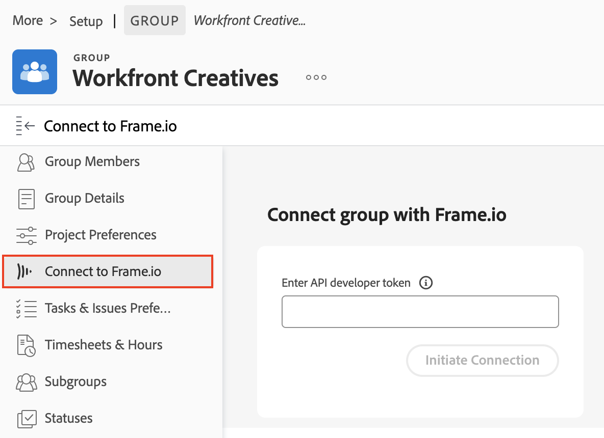

# Workfrontと Frame.io の接続

>[!IMPORTANT]
>
>この記事では、特定のアカウントでのみ利用できる更新済みのドキュメントの承認機能について説明します。標準の承認プロセスについて詳しくは、[作業承認](/help/quicksilver/review-and-approve-work/manage-approvals/manage-approvals.md)にリストされている記事を参照してください。

Workfrontは、レビューおよび承認プロセスで Frame.io を使用して、働きたい人物に会います。 プロジェクトの管理と承認のプロセスはWorkfrontで管理され、レビュープロセスは Frame.io で完了します。 統合を正常に設定するには、次のすべての節を完了する必要があります。

* [Frame.io チームにWorkfront グループを接続する](#connect-a-workfront-group-to-a-frameio-team)
* [Workfront プロジェクトを作成し、接続されたグループを追加します。](#create-a-workfront-project-and-add-a-connected-group)

## アクセス要件

* この記事で説明されている機能を使用するには、組織をベータ版に手動でオンボーディングする必要があります。 詳しくは、を参照してください [Adobe Workfrontと Frame.io のネイティブ統合ベータ版](/help/quicksilver/review-and-approve-work/Documents/wf-frame-alpha.md).

## Frame.io チームにWorkfront グループを接続する

5 月の一般公開に向けて、この機能を積極的に改善しています。

### 前提条件

* Frame.io チームを作成して、Workfront グループにマッピングします。
* チームの API デベロッパートークンを見つけます。 詳しくは、を参照してください [開発者トークン](https://developer.frame.io/docs/getting-started/authentication#developer-tokens) （Frame.io デベロッパーサイト上）

### Frame.io チームにWorkfront グループを接続する

{{step-1-to-setup}}

1. 左側のパネルで、「**グループ**」をクリックします。
1. 既存のグループを選択するか、 **グループを作成**.
1. 左側のパネルで、 **Frame.io に接続**.
   
1. API 開発者トークンを入力します。
1. クリック **接続の開始**.
1. （条件付き）複数の Frame.io アカウントの管理者である場合は、使用するアカウントを選択します。

## Workfront プロジェクトを作成し、接続されたグループを追加します。

Workfront グループを Frame.io チームに接続したら、その接続されたグループでプロジェクトを作成する必要があります。

### 前提条件

* 前の節で説明したように、Workfront グループが Frame.io チームに接続されている必要があります。

### Workfront プロジェクトを作成し、接続されたグループを追加します。

{{step1-to-projects}}

1. 新規プロジェクトをゼロまたはテンプレートから作成します。 プロジェクトの作成方法については、を参照してください。 [プロジェクトの作成](/help/quicksilver/manage-work/projects/create-projects/create-project.md).

1. 左側のパネルで、以下を検索します **プロジェクト詳細**.

1. の検索 **グループ** フィールドをクリックし、デフォルト グループを削除します。

1. ドロップダウンメニューで、目的のグループを見つけます。 Frame.io に接続されているグループには、Frame.io アイコンが表示されます。
   

1. その他のプロジェクト設定の変更を行います。

1. 「**変更を保存**」をクリックします。

1. 次の節に進みます。

### タスクを追加し、統合ステータスをアクティブに設定します

>[!NOTE]
>
>接続された Frame.io プロジェクトでは、サブタスクは現在サポートされていません。

1. Frame.io に入力する必要があるタスクを作成します。

1. 必要なタスクを選択し、 **編集**.

1. スクロール先： **カスタムForms** を参照し、Frame.io 統合フォームを見つけます。

   >[!IMPORTANT]
   >
   >このフォームを表示するには、[ プロジェクトの詳細 ] 領域で接続された Frame.io グループを割り当てる必要があります。 詳しくは、次を参照してください [Workfront プロジェクトを作成し、接続されたグループを追加します。](#create-a-workfront-project-and-add-a-connected-group) この記事の内容です。

1. を有効にする **このタスクの統合状態** チェックボックスを選択し、 **アクティブ**.
   

1. クリック **変更を保存**. プロジェクト名の横に Frame.io アイコンが表示されます。

1. ユーザーまたはチームをタスクに割り当てます。

   >[!NOTE]
   >
   >タスクに追加されたユーザーまたはチームも Frame.io プロジェクトに追加されます。

1. プロジェクトドキュメントエリアに、ドキュメントまたはクリエイティブブリーフィングをアップロードします。

プロジェクトがまだ接続されていません。統合を完了するには、次の節に進む必要があります。

### Frame.io でプロジェクトを有効にする

1. プロジェクトの状態を次から変更する： **計画** 対象： **現在** または現在と等しいカスタムステータスです。 これにより、統合が完了し、Frame.io にプロジェクト、タスク、ドキュメントが生成されます。

プロジェクト名の横にある Frame.io アイコンが紫色に変わり、統合が成功したことを示します。 Frame.io プロジェクトに招待するメールがユーザーに届きます。

>[!IMPORTANT]
>
>プロジェクトが Frame.io に接続されると、プロジェクト グループに加えられた変更は Frame.io に反映されません。
