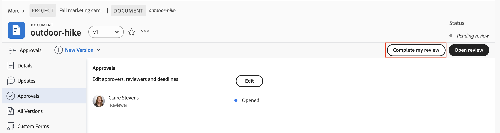

# Frame.io ビューアでのレビューと承認

Frame.io ビューアを使用して、Workfrontでドキュメントをレビューし、承認できます。

Frame.io ビューアを使用してWorkfront ドキュメントをレビューすると、コメントを残したり、ドキュメント、画像、ビデオの特定のセクションをマークアップしたりして、チームとの効率的な共同作業を行い、フィードバックが明確で実用的であることを確認できます。

<!--For more information on the Frame.io integration with Workfront, see [Frame.io integration overview](/help/quicksilver/review-and-approve-work/native-integrations/frame-io/frame-int-overview.md).-->

## アクセス要件

+++ 展開すると、この記事の機能のアクセス要件が表示されます。

<table style="table-layout:auto"> 
 <col> 
 </col> 
 <col> 
 </col> 
 <tbody> 
  <tr> 
   <td role="rowheader">Adobe Workfront パッケージ</td> 
   <td> 
 任意
 </td> 
  </tr> 
  <tr> 
   <td role="rowheader">Adobe Workfront ライセンス*</td> 
   <td> 
リクエスト以上

   
投稿者以上
 </td> 
  </tr> 
  <tr data-mc-conditions=""> 
   <td role="rowheader">アクセスレベル設定</td> 
   <td> 
ドキュメントへのアクセスを編集
 
メモ：まだアクセス権がない場合は、アクセスレベルに追加の制限が設定されていないかどうか Workfront 管理者にお問い合わせください。Workfront 管理者がアクセスレベルを変更する方法について詳しくは、<a href="/help/quicksilver/administration-and-setup/add-users/configure-and-grant-access/create-modify-access-levels.md" class="MCXref xref">カスタムアクセスレベルの作成または変更</a>を参照してください。
 </td> 
  </tr> 
  <tr data-mc-conditions=""> 
   <td role="rowheader">オブジェクト権限</td> 
   <td> 
ドキュメントに関連付けられたオブジェクトへの編集アクセス権
 
追加のアクセス権のリクエストについて詳しくは、<a href="/help/quicksilver/workfront-basics/grant-and-request-access-to-objects/grant-and-request-access-to-objects.md" class="MCXref xref">オブジェクトへの利用申請</a>を参照してください。
 </td> 
  </tr> 
 </tbody> 
</table>

詳しくは、[Workfront ドキュメントのアクセス要件](/help/quicksilver/administration-and-setup/add-users/access-levels-and-object-permissions/access-level-requirements-in-documentation.md)を参照してください。

+++

## ドキュメントのレビュー

レビュー担当者は、にコメントを追加したり、アセットをマークアップしたりできます。 完了したら、Workfrontでレビューを完了済みとしてマークできます。 アセットを承認プロセスで先に進めるために、レビューを完了とマークする必要はありません。

1. レビューメール通知に移動し、「**レビューに移動**」をクリックします。
または
Workfrontのホームページに移動して、「自分の承認」ウィジェットを見つけ、「**レビューを開く**」をクリックします。

   >[!NOTE]
   > 
   >のホームページに自分の承認ウィジェットを追加する必要がある場合があります。 詳しくは、[ ホームでのウィジェットの追加、編集、削除 ](/help/quicksilver/workfront-basics/using-home/using-the-home-area/add-edit-remove-widgets-in-new-home.md) を参照してください。

1. Frame.io では、コメント ツールを使用して、フィードバックを残したり質問したりします。
コメントとアセットのマークアップは、Frame.io ビューアでのみ表示されます。 Frame.io ビューアの使用について詳しくは、[ メディアへのコメント ](https://help.frame.io/en/articles/9105251-commenting-on-your-media) を参照してください。
1. ドキュメントの設定が完了したら、Workfrontのドキュメントの詳細ページに戻って、レビューを完了としてマークします。

   

## ドキュメントを承認

承認者は、コメントを追加し、アセットにマークアップできます。 承認プロセスを先に進めるための決定を行う必要があります。

割り当てられたすべての承認者が「承認済み」を選択するまで、ドキュメントは承認済みステータスに移動しません。

ドキュメントに対して決定を行うには：

1. レビューメール通知に移動し、「**レビューに移動**」をクリックします。
または
Workfrontのホームページに移動して、「自分の承認」ウィジェットを見つけ、「**レビューを開く**」をクリックします。

   >[!NOTE]
   > 
   >のホームページに自分の承認ウィジェットを追加する必要がある場合があります。 詳しくは、[ ホームでのウィジェットの追加、編集、削除 ](/help/quicksilver/workfront-basics/using-home/using-the-home-area/add-edit-remove-widgets-in-new-home.md) を参照してください。

1. Frame.io では、コメント ツールを使用して、フィードバックを残したり質問したりします。
コメントとアセットのマークアップは Frame.io ビューアでのみ表示されます。 Frame.io ビューアの使用について詳しくは、[ メディアへのコメント ](https://help.frame.io/en/articles/9105251-commenting-on-your-media) を参照してください。
1. ドキュメントの設定が完了したら、Frame.io ビューアで次のいずれかの決定を選択できます。

   * **承認**：アセットは変更する必要がなく、使用できる状態になっています。
   * **作業が必要**：アセットに変更が必要ですが、使用する準備ができていません。 指定した変更を行ったら、アセットを新しいバージョンとしてアップロードし、別の承認を行う必要があります。 詳しくは、[ 新しいドキュメントバージョンをアップロードし、承認をリクエストする ](/help/quicksilver/review-and-approve-work/document-reviews-and-approvals/manage-document-approvals/upload-new-doc-version.md) を参照してください。<!--do they need to tell someone it was uploaded via comment tagging?-->

   決定を行うと、ドキュメント所有者にメールで通知されます。

   Workfrontの決定について詳しくは、[ 決定ステータスの概要のドキュメント ](/help/quicksilver/review-and-approve-work/document-reviews-and-approvals/manage-document-approvals/document-approval-status.md) を参照してください。

   

<!--is document owner the correct term?-->

