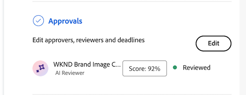

# AI レビュアーのスコアとフィードバックの表示

レビューと承認リクエストを送信してから数秒後、ドキュメントの概要パネルでAI レビュアーのスコアとフィードバックを表示できます。

AI レビュアーは、レビューと承認ワークフローの意思決定者となるように設計されていません。 指定されたブランド要件に合致するスコアとレコメンデーションのみが提供されます。

## スコアの計算方法の理解

AI レビュアーは、レビュータイプに応じてスコアを異なる方法で計算します。

* 画像レビュー：このスコアは、合格したガイドラインと失敗したガイドラインの比率を反映しています。
* レビューをコピー：このスコアは、主観的な結果と客観的な結果のバランスのとれた重み付けを使用します。 目的のガイドライン（「修正」に表示）は、主観的なガイドライン（「検討」に表示）の3倍の重み付けになります。

客観的なガイドラインは、コピーレビューに重きを置くため、具体的で測定可能なガイドラインを作成することをお勧めします。 詳しくは、AI レビュアーのブランドの作成と管理の記事の「[ ブランドガイドラインの作成に関するベストプラクティス ](/help/quicksilver/review-and-approve-work/document-reviews-and-approvals/create-a-brand.md#best-practices-for-writing-brand-guidelines)」の節を参照してください。

## スコアとフィードバックの表示

AI レビュアーのスコアとフィードバックは、ドキュメントの概要パネルまたはドキュメントの詳細ページの「承認」タブで表示できます。

1. Workfrontの通知メールで、**レビューに移動**&#x200B;をクリックします。

   または

   ドキュメントをアップロードするドキュメント領域に移動し、ドキュメントの概要パネルを開きます。
1. 「**スコア**」をクリックします。
   

スコアとフィードバックウィンドウで、AI レビュアーは、アセットが指定されたガイドラインを満たさない方法を説明します。

## 新しいバージョンをアップロードし、AI レビュアーをもう一度追加します

AI レビュアーのフィードバックに基づいてアセットを調整する必要がある場合は、新しいバージョンをアップロードして新しいレビューを開始できます。

詳しくは、[新しいドキュメントのバージョンをアップロードし、承認をリクエスト ](/help/quicksilver/review-and-approve-work/document-reviews-and-approvals/manage-document-approvals/upload-new-doc-version.md)するを参照してください。
