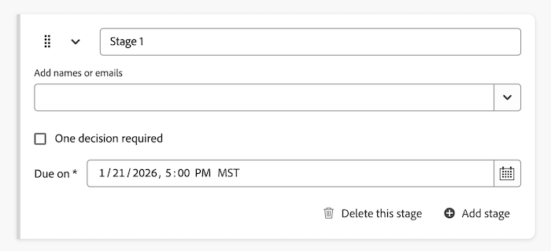

# Workfront Content Reviewerの基本を学ぶ

コンテンツレビュアーはAI共同作業者の一種で、プロジェクト、タスク、ドキュメントに追加できます。 AI共同作業者は、設定エリアで設定し、ユーザーと同じように割り当てることができます。

WorkfrontのContent Reviewerは、レビューと承認のプロセス全体を通じてコンテンツ制作をスピードアップし、ブランドコンプライアンスを向上させるのに役立ちます。 コンテンツレビュー担当者を承認テンプレートに追加したり、個々のレビューおよび承認要求に含めたりできます。

## アクセス要件

Workfrontでコンテンツレビューアーを設定するには、システム管理者である必要があります。

任意のユーザーが、レビューおよび承認リクエストにコンテンツレビュアーを追加できます。

## 要件

* Workfront インスタンスでは、統合承認が有効になっている必要があります。
* 組織にはGenStudio Foundationが必要です。
   * WorkfrontのContent Reviewerには、GenStudio Foundationでアセットのレビューおよび承認ワークフローに使用できる機能が用意されています。 作業を完了するためにGenStudio Foundationに直接アクセスする必要はありません。 Content Reviewerを介したGenStudio Foundation機能へのアクセスは、Workfront契約の条件に該当します。
* Adobeには、署名済みのAdobe Gen AI契約書がファイルに登録されている必要があります。
契約書への署名について詳しくは、[Adobe Gen AI契約書への署名](/help/quicksilver/workfront-basics/ai-assistant/ai-assistant-overview.md#sign-the-adobe-gen-ai-agreement)を参照してください。
* サンドボックス環境では、コンテンツレビュアーは使用できません。

## サポートされているファイルタイプ {#supported-file-types-ai-reviewer}

>[!CONTEXTUALHELP]
>id="wf_document_approvals_ai_supported_files"
>title="サポートされていないファイルタイプ"
>abstract="このコンテンツレビュアーは、選択したファイル形式をサポートしていません。 サポートされているファイルタイプをアップロードするか、コンテンツレビュアーを削除してリクエストを送信します。"

コンテンツレビュー担当者は、次のファイルタイプを確認できます。

* PNG （.png）
* JPEG （.jpeg、.jpg）
* WEBP （.webp）
* GIF以外（.gif）
* PDF （.pdf）
* PPT （.ppt, .pptx）
* DOC （.doc, .docx）

サポートされていないファイルタイプをアップロードした場合、承認ワークフローの作成時にコンテンツレビューアーオプションは使用できません。

## ブランドガイドラインの設定

Workfront Content Reviewerは、コンテンツをレビューする際にブランドガイドラインを使用します。 Workfront管理者は、Workfrontの設定領域でブランドガイドラインを設定できます。 GenStudio Foundationで作成されたブランドは、Workfrontでも利用できます。

ブランドガイドラインを設定するには、システム管理者は次の手順に従う必要があります。

1. [ブランド権限へのアクセス権の付与](/help/quicksilver/administration-and-setup/add-users/configure-and-grant-access/grant-access-brands.md)
1. [&#x200B; コンテンツレビュアー](/help/quicksilver/review-and-approve-work/document-reviews-and-approvals/create-a-brand.md)のブランドを作成および管理します。

## コンテンツレビュアーの作成

1つ以上のブランドを設定すると、Workfront管理者は設定領域でコンテンツレビューアーの作成を開始できます。 異なるガイドラインに焦点を当てた複数のコンテンツレビューアーを作成できます。

* **画像**：このコンテンツレビュアーは、Workfrontで設定した画像ブランドガイドラインに照らし合わせてアセットをレビューします。 [!BADGE Beta]{type=Positive tooltip="この機能は現在ベータ版です。"}
   * この機能を有効にするには、システム管理者がベータ版の契約書に署名する必要があります。
* **ブランドボイス**: コンテンツレビュー担当者は、Workfrontで設定したブランドボイスのガイドラインに照らし合わせてアセットを確認します。

その後、コンテンツレビュー担当者を承認テンプレートや個別のレビューおよび承認リクエストに割り当てることができます。

詳しくは、[AI コラボレーターの設定](/help/quicksilver/administration-and-setup/set-up-workfront/configure-system-defaults/configure-ai-collaborators.md)を参照してください。

## レビュー担当者と承認リクエストにコンテンツレビュー担当者を追加

ユーザーは、コンテンツレビュー担当者を既存の承認テンプレートに追加したり、個々のレビューおよび承認要求に追加したりできます。

### 承認テンプレート

同じユーザーが同じユーザーをレビューリクエストと承認リクエストに追加することが多い場合、Standard ライセンスユーザーはWorkfrontの設定領域で承認テンプレートを作成できます。

ユーザーは、コンテンツレビューアーを承認テンプレートに追加することで、テンプレートを使用してリクエストを作成する際に、ブランドコンプライアンスを自動的にチェックできます。

作成した承認テンプレートは、プロジェクト、タスク、イシューの「ドキュメント」エリアのアセットに適用できます。

詳しくは、[&#x200B; ドキュメントの承認ワークフローテンプレートの作成](/help/quicksilver/review-and-approve-work/document-reviews-and-approvals/manage-document-approvals/create-approval-template.md)を参照してください。

AI レビューアーを表示する

### 個人のレビューと承認のリクエスト

ユーザーが個々のレビューと承認のリクエストを作成する場合、他の参加者と一緒にコンテンツレビュー担当者を追加したり、コンテンツレビュー担当者のみで1つのリクエストを作成してブランドコンプライアンスを確認したりできます。

詳しくは、[&#x200B; ドキュメント承認ワークフローの作成](/help/quicksilver/review-and-approve-work/document-reviews-and-approvals/manage-document-approvals/create-a-document-approval.md)を参照してください。

## コンテンツレビュー担当者のスコアとフィードバックを表示

コンテンツレビュー担当者によるレビューと承認のリクエストが送信された数秒後、他の参加者がまだレビューと意思決定を行っている場合でも、コンテンツレビュー担当者からのスコアとフィードバックがドキュメントの概要パネルに表示されます。

また、承認担当者には、アセットのレビューが完了したことを知らせるメールが送信されます。 メールから、**レビューに移動**&#x200B;をクリックし、Workfrontでスコアとフィードバックを確認します。

コンテンツレビュアーは、レビューと承認ワークフローの意思決定者となるように設計されていません。 指定されたブランド要件に合致するスコアとレコメンデーションのみが提供されます。

アセットがブランドガイドラインを満たしていない場合、クリエイターは新しいバージョンをアップロードでき、承認所有者はコンテンツレビュアーで2回目のレビューと承認リクエストを作成できます。

スコアとフィードバックの表示について詳しくは、[&#x200B; コンテンツレビュー担当者のスコアとフィードバックの表示](/help/quicksilver/review-and-approve-work/document-reviews-and-approvals/view-ai-reviewer-feedback.md)を参照してください。

