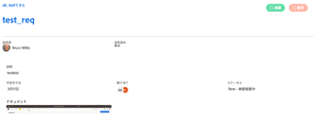

# 作業の承認

<!--

(NOTE:&nbsp;From&nbsp;Courtney: Linked to Training sites/ articles , don't change title and link)

-->

承認者として設定されている場合は、承認を待っている作業を定期的にレビューする必要があります。

承認プロセスの作成については、[作業アイテムの承認プロセスの作成](../../administration-and-setup/customize-workfront/configure-approval-milestone-processes/create-approval-processes.md)を参照してください。

Workfront での作業への承認の関連付けについては、[新規または既存の承認プロセスと作業の関連付け](../../review-and-approve-work/manage-approvals/associate-approval-with-work.md)を参照してください。

## アクセス要件

この記事の手順を実行するには、次のアクセス権が必要です。

<table style="table-layout:auto"> 
 <col> 
 <col> 
 <tbody> 
  <tr> 
   <td role="rowheader">Adobe Workfront プラン*</td> 
   <td> 
任意
 </td> 
  </tr> 
  <tr> 
   <td role="rowheader">Adobe Workfront ライセンス*</td> 
   <td> 
レビュー以上
 </td> 
  </tr> 
  <tr> 
   <td role="rowheader">アクセスレベル設定*</td> 
   <td> 
承認に関連付けられたオブジェクトに対する表示以上のアクセス権
 
メモ：まだアクセス権がない場合は、アクセスレベルに追加の制限が設定されていないかどうか Workfront 管理者にお問い合わせください。Workfront 管理者がアクセスレベルを変更する方法について詳しくは、<a href="../../administration-and-setup/add-users/configure-and-grant-access/create-modify-access-levels.md" class="MCXref xref">カスタムアクセスレベルの作成または変更</a>を参照してください。
 </td> 
  </tr> 
  <tr> 
   <td role="rowheader">オブジェクト権限</td> 
   <td> 
承認に関連付けられたオブジェクトに対する表示以上の権限
 
追加のアクセス権のリクエストについて詳しくは、<a href="../../workfront-basics/grant-and-request-access-to-objects/request-access.md" class="MCXref xref">オブジェクトへのアクセス権のリクエスト</a>を参照してください。
 </td> 
  </tr> 
 </tbody> 
</table>

&#42;保有するプラン、ライセンスタイプ、アクセス権を確認するには、Workfront 管理者に問い合わせてください。

## Adobe Workfront で承認を検索

Workfront の様々な領域で承認を表示または管理できます。 

承認待ちの項目または自分で承認用に送信した項目の表示について詳しくは、[承認の表示](../../review-and-approve-work/manage-approvals/view-approvals.md)を参照してください。

## ホーム領域から作業項目を承認

1. Adobe Workfront の左上隅にある&#x200B;**ホーム** アイコン  をクリックします。

   >[!NOTE]
   >
   >Workfront 管理者が、環境内のホームアイコンに次の変更を加える場合があります。
   >
   >   
   >* 組織を説明するようにカスタマイズされた画像に置き換える。この場合、アイコンはこの記事に示すものとは異なる外観になります。
   >* リンクされたページを別のページに置き換える。この場合、ページの右上隅にある&#x200B;**メインメニュー** 、**ホーム**&#x200B;の順にクリックします。

1. **フィルター**&#x200B;ドロップダウンメニューをクリックします。

   

1. 「**承認**」を選択します。\
   承認を必要とするすべての作業項目が表示されます。 

   >[!NOTE]
   >
   >担当業務またはグループに割り当てられた承認は、ホームに表示されません。 チームに割り当てられた承認は、ワークリストの「チームリクエスト」グループに表示されます。

1. （オプション）[ホーム領域の作業リストでの項目の表示](../../workfront-basics/using-home/using-the-home-area/display-items-in-home-work-list.md)の「日付、プロジェクト、または優先度によるグループ化と並べ替え」節で説明されているように、承認が表示される順序を変更します。 
1. 承認する項目を選択します。

   

1. 右側のパネルで承認を決定する際に、使用可能なオプションの 1 つをクリックします。 承認する項目のタイプに応じて、ページの右上隅に次のオプションが表示されます。

   * **プロジェクト：**「**承認**」または「**却下**」をクリックします。

   * **タスク：**「**承認**」または「**却下**」をクリック します。

   * **イシュー：**「**承認**」または「**却下**」をクリックします。

   * **タイムシート：**「**承認**」または「**却下**」をクリック します。

   * **ドキュメント：**「**承認**」、「**却下**」、「**変更**」のいずれかをクリックします。\
     承認を表示する際は、次の点を考慮してください。

      * [Adobe Workfront 内でのプルーフの共有](../../review-and-approve-work/proofing/managing-proofs-within-workfront/share-a-proof-in-workfront.md)の「プルーフリンクを共有」節で説明されているように、ユーザーがプルーフを共有すると、プルーフの承認がここに表示されます。
      * Workfront 環境が Workfront Proof Premium アカウントと統合されている場合にのみ、プルーフはホーム領域に表示されます。 ここで説明したようにプルーフを使用できない場合は、Workfront 管理者にお問い合わせください。
      * プルーフの承認を通知するアプリ内通知が届きます。\
        アプリ内通知について詳しくは、[アプリ内通知の表示と管理](../../workfront-basics/using-notifications/view-and-manage-in-app-notifications.md)を参照してください。

      * ホーム領域のサムネール画像の横に、承認をリクエストしたユーザーの名前が次のようなテキストと共に表示されます。\
        「*ユーザー A* が次の承認を求めています：...」

        <!--      
        <MadCap:conditionalText data-mc-conditions="QuicksilverOrClassic.Draft mode">      
        (NOTE:&nbsp;From&nbsp;Courtney: Is this true?)      
        </MadCap:conditionalText>      
        -->

        ユーザー名が使用できない場合は、次のようなテキストが表示されます。\
        「プルーフの新しいバージョンを確認してください」
      * プルーフの承認を行うには、「**プルーフに移動**」をクリックし、「**レビューを終了**」をクリックし、使用可能なオプションの 1 つをクリックします。 プルーフを承認する際に使用できるオプションは、**承認済み**、**変更して承認済み**、**変更が必要です**、**無関係**&#x200B;です。 

      * 承認に対して決定が下されると、承認は「マイ承認」タブに残り、「決定が行われました」というテキストが表示されます。このテキストは、「**更新**」ボタンをクリックするか、ブラウザーページを更新するまで表示されたままになります。

        プルーフの確認について詳しくは、[Adobe Workfront でのプルーフのレビュー](../../review-and-approve-work/proofing/reviewing-proofs-within-workfront/review-proofs-in-wf.md)を参照してください。

   * **アクセス：** **アクセスを変更**&#x200B;ドロップダウンメニューから、付与するアクセスレベルを選択して、「**アクセスを付与**」をクリックします。または、「**無視**」をクリックします。

## プロジェクト、タスク、イシューから直接作業を承認

プロジェクト、タスク、イシューが承認保留中の場合、プロジェクト、タスク、イシューから直接承認または却下できます。 また、承認プロセスに関する詳細も表示できます。

プロジェクト、タスク、イシューから直接作業を承認するには、次の手順に従います。

1. 承認が必要なプロジェクト、タスク、イシューに移動します。

   プロジェクト、タスク、イシューの現在の承認プロセスに関する承認情報が、項目のヘッダーに表示されます。

   

   次の承認情報が表示されます。

   <table style="table-layout:auto"> 
    <col> 
    <col> 
    <tbody> 
     <tr> 
      <td role="rowheader">ステータス</td> 
      <td>プロジェクト、タスク、イシューの現在のステータス。 これは、承認待ちの項目の現在のステータスです。 承認プロセスの各ステージが承認されると、ステータスが承認済みになります。</td> 
     </tr> 
     <tr> 
      <td role="rowheader">承認ステージ</td> 
      <td>承認プロセスのステージ。  承認待ちの現在のステージは、「保留」と表示されます。既に承認済みのステージは「承認済み」と表示され、まだ承認されていないステージは「開始前」と表示されます。</td> 
     </tr> 
    </tbody> 
   </table>

1. 承認プロセスを承認するか却下するかに応じて、「**承認**」または「**却下**」をクリックします。\
   承認待ちだった承認ステージが承認され、承認プロセスが次のステージに移動します。すべてのステージが承認されると、ステータスが承認済みになります。

## ドキュメントから直接ドキュメントを承認 

1. 承認を必要とするドキュメントが含まれているドキュメントエリアに移動します。
1. ドキュメントを選択し、「**承認**」、「**変更**」、または「**却下**」をクリックします。\
   \
   

1. （オプション）ドキュメントのプルーフが生成されている場合は、プルーフインターフェイス内でドキュメントを承認できます（[プルーフからのドキュメントの承認](#approve-a-document-from-a-proof)参照）。

## 承認通知メールからのドキュメントの承認

通知設定に応じて、他のユーザーがあなたによる承認決定を必要としているドキュメントについて通知するメールを受け取る場合があります。「**承認決定する**」ボタンを含むメールを受信した場合は、そのメールから直接承認プロセスを開始できます。

1. メールで「**承認決定する**」をクリックすると、プルーフのドキュメントの詳細ページが開きます。
1. ドキュメントをレビューするには、次のいずれかの操作を行います。

   * ドキュメントに関するメタデータを表示します。
   * マークアップとコメントを含むドキュメントをレビューするためにプルーフが作成されている場合は、右上隅近くの&#x200B;**プルーフを開く**  をクリックしてプルーフをレビューします。

     <!--   
     [Andrzej, does it make sense to leave this here if it's s document approval?&nbsp;Would there never be a proof in that situation?]   
     -->

     プルーフの確認について詳しくは、[Adobe Workfront でのプルーフのレビュー](../../review-and-approve-work/proofing/reviewing-proofs-within-workfront/review-proofs-in-wf.md)を参照してください。

1. 右上隅にある「**決定**」オプションをクリックして、ドキュメントを承認、変更して承認、または却下します。

## プルーフからのドキュメントの承認 {#approve-a-document-from-a-proof}

プルーフビューア内でプルーフを承認できます。詳しくは、[プルーフビューアでのプルーフの決定](../../review-and-approve-work/proofing/reviewing-proofs-within-workfront/make-a-decision-on-a-proof/make-decisions-on-proof.md)の記事の[プルーフビューアでのプルーフの決定](../../review-and-approve-work/proofing/reviewing-proofs-within-workfront/make-a-decision-on-a-proof/make-decisions-on-proof.md)を参照してください。
