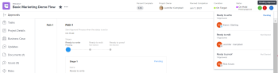
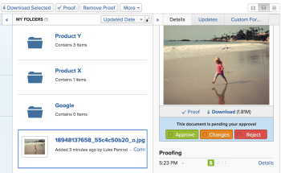
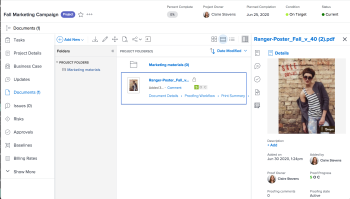

# 作業の承認

<!--

(NOTE:&nbsp;From&nbsp;Courtney: Linked to Training sites/ articles , don't change title and link)

-->

承認者として設定されている場合は、承認を待っている作業を定期的にレビューする必要があります。

承認プロセスの作成については、[作業アイテムの承認プロセスの作成](../../administration-and-setup/customize-workfront/configure-approval-milestone-processes/create-approval-processes.md)を参照してください。

Workfront での作業への承認の関連付けについては、[新規または既存の承認プロセスと作業の関連付け](../../review-and-approve-work/manage-approvals/associate-approval-with-work.md)を参照してください。

## アクセス要件

+++ 展開すると、この記事の機能のアクセス要件が表示されます。

<table style="table-layout:auto"> 
 <col> 
 <col> 
 <tbody> 
  <tr> 
   <td role="rowheader">Adobe Workfront パッケージ</td> 
   <td> 
任意
 </td> 
  </tr> 
  <tr> 
   <td role="rowheader">Adobe Workfront プラン</td> 
   <td> 
   
コントリビューター以上

   
レビュー以上
 </td> 
  </tr> 
  <tr> 
   <td role="rowheader">アクセスレベル設定</td> 
   <td> 
承認に関連付けられたオブジェクトに対する表示以上のアクセス権
</td> 
  </tr> 
  <tr> 
   <td role="rowheader">オブジェクト権限</td> 
   <td> 
承認に関連付けられたオブジェクトに対する表示以上の権限
</td> 
  </tr> 
 </tbody> 
</table>

詳しくは、[Workfront ドキュメントのアクセス要件](/help/quicksilver/administration-and-setup/add-users/access-levels-and-object-permissions/access-level-requirements-in-documentation.md)を参照してください。

+++

## Adobe Workfront で承認を検索

Workfront の様々な領域で承認を表示または管理できます。

承認待ちの項目または自分で承認用に送信した項目の表示について詳しくは、[承認の表示](../../review-and-approve-work/manage-approvals/view-approvals.md)を参照してください。

## ホーム領域から作業項目を承認

1. 右上隅の&#x200B;**[!UICONTROL メインメニュー]** をクリックし、**[!UICONTROL ホーム]**&#x200B;をクリックします。
1. （条件付き）「**カスタマイズ**」をクリックして、**自分の承認** ウィジェットを追加します。
1. （条件付き）「**フィルター**」ドロップダウンメニューをクリックし、**すべて**&#x200B;を選択して、自分に割り当てられた承認と委任された承認を表示します。

   >[!NOTE]
   >
   >担当業務またはグループに割り当てられた承認は、ホームに表示されません。 チームに割り当てられた承認は、各チームメンバーのマイ承認ウィジェットに表示されます。

1. 承認する項目を選択します。

   

1. 右側のパネルで承認を決定する際に、使用可能なオプションの 1 つをクリックします。 承認する項目のタイプに応じて、ページの右上隅に次のオプションが表示されます。

   <table>
   <tr>
      <td>
      
<strong>アクセス</strong>

      </td>
      <td>
      
<strong>作業項目</strong>

      </td>
      <td>
      
<strong>ドキュメント</strong>

      </td>
      <td>
      
<strong>プルーフ</strong>

      </td>
   </tr>
   <tr>
      <td>
       <ul>
      <li>付与</li>
      <li>無視</li>
      </ul>
      必要に応じて、<b> アクセス権の変更</b> ドロップダウンメニューでアクセス権のレベルを調整できます。
      </td>
      <td>
         <ul>
         <li>承認</li>
         <li>Reject</li>
         </ul>
      決定ボタンのドロップダウンメニューをクリックして、決定にコメントを残すことができます。
      </td>
      <td>
   承認者として割り当てられた
         <ul>
         <li>承認</li>
         <li>変更して承認</li>
         <li>作業が必要</li>
         </ul>
   レビュアーとして割り当てられました
         <ul>
         <li>レビューの完了</li>
         </ul>
      この列のオプションは、統合承認にのみ適用されます。レガシードキュメントの承認は、作業項目の承認と同じように表示されます。 
      </td>
      <td>
         <ul>
         <li>プルーフを見る</li>
         </ul>
         プルーフビューアで決定します。プルーフのレビューについて詳しくは、<a href="../../review-and-approve-work/proofing/reviewing-proofs-within-workfront/review-proofs-in-wf.md">Adobe Workfront内のプルーフのレビュー</a>を参照してください。
      </td>
   </tr>
   </table>

決定を行うと、承認はマイ承認ウィジェットから削除されます。

## プロジェクト、タスク、イシューから直接作業を承認

プロジェクト、タスク、イシューが承認保留中の場合、プロジェクト、タスク、イシューから直接承認または却下できます。 また、承認プロセスに関する詳細も表示できます。

プロジェクト、タスク、イシューから直接作業を承認するには、次の手順に従います。

1. 承認が必要なプロジェクト、タスク、イシューに移動します。

   プロジェクト、タスク、イシューの現在の承認プロセスに関する承認情報が、項目のヘッダーに表示されます。

   

   次の承認情報が表示されます。

   <table style="table-layout:auto"> 
    <col> 
    <col> 
    <tbody> 
     <tr> 
      <td role="rowheader">ステータス</td> 
      <td>プロジェクト、タスク、イシューの現在のステータス。 これは、承認待ちの項目の現在のステータスです。 承認プロセスの各ステージが承認されると、ステータスが承認済みになります。</td> 
     </tr> 
     <tr> 
      <td role="rowheader">承認ステージ</td> 
      <td>承認プロセスのステージ。  承認待ちの現在のステージは、「保留」と表示されます。 既に承認済みのステージは「承認済み」と表示され、まだ承認されていないステージは「開始前」と表示されます。</td> 
     </tr> 
    </tbody> 
   </table>

1. 承認プロセスを承認するか却下するかに応じて、「**承認**」または「**却下**」をクリックします。\
   承認待ちだった承認ステージが承認され、承認プロセスが次のステージに移動します。 すべてのステージが承認されると、ステータスが承認済みになります。

## ドキュメントから直接ドキュメントを承認

1. 承認を必要とするドキュメントが含まれているドキュメントエリアに移動します。
1. ドキュメントを選択し、「**承認**」、「**変更**」、または「**却下**」をクリックします。\
   \
   

1. （オプション）ドキュメントのプルーフが生成されている場合は、プルーフインターフェイス内でドキュメントを承認できます（[プルーフからのドキュメントの承認](#approve-a-document-from-a-proof)参照）。

## 承認通知メールからのドキュメントの承認

通知設定に応じて、他のユーザーがあなたによる承認決定を必要としているドキュメントについて通知するメールを受け取る場合があります。 「**承認決定する**」ボタンを含むメールを受信した場合は、そのメールから直接承認プロセスを開始できます。

1. メールで「**承認決定する**」をクリックすると、プルーフのドキュメントの詳細ページが開きます。
1. ドキュメントをレビューするには、次のいずれかの操作を行います。

   * ドキュメントに関するメタデータを表示します。
   * マークアップとコメントを含むドキュメントを確認するためのプルーフが作成されている場合は、右上隅付近にある「**プルーフを開く** 」をクリックして、プルーフを確認します。

     <!--   
     [Andrzej, does it make sense to leave this here if it's s document approval?&nbsp;Would there never be a proof in that situation?]   
     -->

     プルーフの確認について詳しくは、[Adobe Workfront でのプルーフのレビュー](../../review-and-approve-work/proofing/reviewing-proofs-within-workfront/review-proofs-in-wf.md)を参照してください。

1. 右上隅にある「**決定**」オプションをクリックして、ドキュメントを承認、変更して承認、または却下します。

## プルーフからのドキュメントの承認 {#approve-a-document-from-a-proof}

プルーフビューア内でプルーフを承認できます。 詳しくは、[プルーフビューアでのプルーフの決定](../../review-and-approve-work/proofing/reviewing-proofs-within-workfront/make-a-decision-on-a-proof/make-decisions-on-proof.md)の記事の[プルーフビューアでのプルーフの決定](../../review-and-approve-work/proofing/reviewing-proofs-within-workfront/make-a-decision-on-a-proof/make-decisions-on-proof.md)を参照してください。
