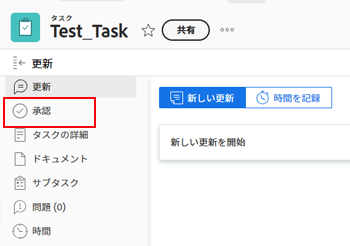
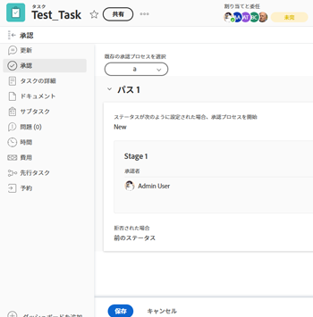

# 新規または既存の承認プロセスを作業に関連付ける

この記事では、承認プロセスを作業アイテムに関連付ける方法について説明します。承認をプルーフまたはドキュメントと関連付ける方法について詳しくは、次の記事を参照してください。

* [自動ワークフローを使用した詳細なプルーフを作成](../../review-and-approve-work/proofing/creating-proofs-within-workfront/create-automated-proof-workflow.md)
* [ドキュメント承認のリクエスト](../../review-and-approve-work/manage-approvals/request-document-approvals.md)

グローバルまたは1 回限りの承認プロセスを Adobe Workfront の作業アイテムに関連付けることができます。次のシナリオが存在します。

* 既存のグローバル承認プロセスをプロジェクト、タスク、イシュー、テンプレートまたはテンプレートのタスクに関連付けます。一部のグローバル承認プロセスは、システム内のすべてのグループで使用できます。グループレベルのグローバル承認プロセスは、特定のグループに対してのみ使用できます。
* 1 回限りの承認プロセスを作成し、既存のプロジェクト、タスク、イシュー、テンプレートまたはテンプレートのタスクに関連付けます。

>[!NOTE]
>
>この記事では、「グローバル承認プロセス」という用語を使用して、「1 回限りの承認プロセス」と区別します。グローバル承認プロセスは繰り返し使用できます。
>
>「グループレベルのグローバル承認プロセス」とは、特定のグループにのみ関連付けられたステータスを持つ項目に対して繰り返し使用できる承認プロセスを指します。

承認プロセスの一般的な情報について詳しくは、[承認プロセスの概要](../../review-and-approve-work/manage-approvals/approval-process-in-workfront.md)を参照してください。

グローバル承認プロセスの作成について詳しくは、[作業アイテムの承認プロセスの作成](../../administration-and-setup/customize-workfront/configure-approval-milestone-processes/create-approval-processes.md)を参照してください。

## アクセス要件

この記事の手順を実行するには、次のアクセス権が必要です。

<table style="table-layout:auto"> 
 <col> 
 <col> 
 <tbody> 
  <tr> 
   <td role="rowheader">Adobe Workfront プラン*</td> 
   <td> 
任意 
 </td> 
  </tr> 
  <tr> 
   <td role="rowheader">Adobe Workfront ライセンス*</td> 
   <td> 
ワークまたはそれ以上
 </td> 
  </tr> 
  <tr> 
   <td role="rowheader">アクセスレベル*</td> 
   <td> 
プロジェクト、タスク、イシューまたはテンプレートへのアクセス権以上の編集
 
メモ：まだアクセス権がない場合は、アクセスレベルに追加の制限が設定されていないかどうか Workfront 管理者にお問い合わせください。Workfront 管理者がアクセスレベルを変更する方法について詳しくは、<a href="../../administration-and-setup/add-users/configure-and-grant-access/create-modify-access-levels.md" class="MCXref xref">カスタムアクセスレベルの作成または変更</a>を参照してください。
 </td> 
  </tr> 
  <tr> 
   <td role="rowheader">オブジェクト権限</td> 
   <td> 
プロジェクト、タスク、イシューまたはテンプレートに対する権限を管理する
 
追加のアクセス権のリクエストについて詳しくは、<a href="../../workfront-basics/grant-and-request-access-to-objects/request-access.md" class="MCXref xref">オブジェクトへのアクセス権のリクエスト</a>を参照してください。
 </td> 
  </tr> 
 </tbody> 
</table>

&#42;保有するプラン、ライセンスタイプ、アクセス権を確認するには、Workfront 管理者にお問い合わせください。

## 承認プロセスと作業アイテムの関連付けに関する考慮事項

以下に説明する考慮事項に加えて、Workfront の承認プロセスに関する一般的な考慮事項を再度参照することをお勧めします。詳しくは、[承認プロセスの概要](../../review-and-approve-work/manage-approvals/approval-process-in-workfront.md)を参照してください。

<!--
  <li data-mc-conditions="QuicksilverOrClassic.Draft mode">Approvals can only be associated with the status of a project, task, or issue in Workfront.</li>
  -->

<!--
  <li data-mc-conditions="QuicksilverOrClassic.Draft mode"> 
Each approval process corresponds with a status option in the Workfront system. When you change the status of a work item, an attached approval for that status requires the status change to be confirmed before the new status can be assigned to the item.
 
(NOTE: the two drafted bullets have been moved to the approval-process-in-workfront article)
 </li>
  -->

* 承認プロセスを関連付ける前に、プロジェクト、タスク、イシュー、テンプレートまたはテンプレートのタスクを作成する必要があります。
* 過ぎたステータスを持つ項目および現在のステータスを持つ項目に対して承認プロセスを項目に添付する場合、承認プロセスはトリガーされず、承認者に通知は送信されません。

  **例：** タスクのステータスが完了で、完了のステータスに関連付けられた承認プロセスを添付した場合、承認はトリガーされません。

* （タスクとプロジェクトのテンプレートを使用、イシューのキュー設定を使用または新規タスクのプロジェクトのタスク設定を定義することで）項目の最初のステータスに承認プロセスを添付すると、送信された承認が取り消されると、承認プロセスは回避されます。この場合、承認者は通知を受け取りません。

  承認の取り消しについて詳しくは、[承認を表示](../../review-and-approve-work/manage-approvals/view-approvals.md)を参照してください。

  >[!TIP]
  >
  >タスクまたはイシューの最初のステータスは新規です。プロジェクトの最初のステータスは、Workfront 管理者がシステムのプロジェクト環境設定で選択したステータスです。詳しくは、[システム全体のプロジェクト環境設定の設定](../../administration-and-setup/set-up-workfront/configure-system-defaults/set-project-preferences.md)を参照してください。

* 承認プロセスとオブジェクトの関連付けは、オブジェクトの更新エリアには記録されません。
* 承認プロセスを親タスクに関連付けることはできません。
* 承認者としてユーザー、チームまたは役割を追加しても、その承認に関連付けられたオブジェクトに対する権限は自動的には付与されません。承認ステップがトリガーされると、オブジェクトに対する権限が付与されます。そうでない場合は、承認を決定する前に、オブジェクトをユーザー、チームまたは役割と共有する必要があります。

次の節では、承認プロセスをプロジェクト、タスクまたはイシューに関連付ける様々な方法について説明します。

## グローバル承認プロセスと作業アイテムの関連付け {#associate-a-global-approval-process-with-a-work-item}

グローバル承認プロセスを作業アイテム（プロジェクト、タスク、イシュー、テンプレート、テンプレートのタスク）に関連付けることができます。

グローバル承認プロセスは、作業アイテムに関連付けられたグループまたはシステム内のすべてのグループに対して使用可能である必要があります。

>[!NOTE]
>
テンプレートにプロジェクト承認プロセスを添付し、テンプレートのタスクにタスク承認プロセスを添付できます。この操作を行うと、テンプレートを使用してプロジェクトを作成する場合、承認プロセスがそれぞれプロジェクトまたはタスクの承認プロセスになります。テンプレートまたはテンプレートのタスクに添付された1 回限りの承認プロセスは、プロジェクトやタスクに対して1 回限りの承認プロセスのままです。

Workfront 管理者がシステム内のすべてのグループに対してグローバル承認プロセスを設定する方法およびグループ管理者がグループの承認を作成する方法について詳しくは、[作業アイテムの承認プロセスを作成](../../administration-and-setup/customize-workfront/configure-approval-milestone-processes/create-approval-processes.md)を参照してください。

>[!NOTE]
>
また、特定のニーズに合わせてグローバル承認プロセスを変更できます。詳しくは、この記事の[特定のオブジェクトで使用するグローバル承認プロセスを変更する](#modify-a-global-approval-process-for-use-on-a-specific-object)の節を参照してください。

既存のグローバル承認プロセスをプロジェクト、タスク、イシュー、テンプレートまたはテンプレートのタスクに関連付けるには、次の操作を実行します。

1. 承認プロセスを関連付ける作業アイテムに移動します。
1. 左パネルの「**承認**」をクリックします。

   場合によっては、「**さらに表示**」をクリックしてから「**承認**」をクリックする必要があります。

   

1. 

   選択した承認プロセスが表示されます。

1. **既存のものを使用**&#x200B;ドロップダウンメニューを展開して、既存の承認プロセスを選択します。

   

   選択した承認プロセスが表示されます。

   

1. 「**保存**」をクリックします。
1. （オプション）項目に添付した既存の承認を変更する場合は、「承認プロセスを編集」をクリックします。これにより、グローバル承認プロセスが単一使用承認プロセスに変更されます。詳しくは、この記事の[特定のオブジェクトで使用するグローバル承認プロセスの変更](#modify-a-global-approval-process-for-use-on-a-specific-object)の節を参照してください。

## 特定のオブジェクトで使用するグローバル承認プロセスの変更 {#modify-a-global-approval-process-for-use-on-a-specific-object}

[作業項目の承認プロセスの作成](../../administration-and-setup/customize-workfront/configure-approval-milestone-processes/create-approval-processes.md)の説明に従って、使用するグローバル承認プロセスを Workfront 管理者またはグループ管理者が作成します。

項目に添付されたグローバル承認プロセスの変更は、単一使用承認プロセスの変更と同じです。

関連付けたプロジェクト、タスクまたはイシューの特定のニーズに合わせて、グローバル承認プロセスを変更できます。

>[!IMPORTANT]
>
グローバル承認プロセスを変更すると、変更したオブジェクトでのみ使用できる単一使用承認プロセスになります。グローバル承認プロセスは変更されません。
>
グローバル承認プロセスを変更する際は、次の制限事項を考慮します。
>
* 承認プロセスは、承認プロセスを関連付けるプロジェクト、タスクまたはイシューの場合にのみ変更されます。
* 管理者が元のグローバル承認プロセスに対して今後行う変更は、変更したグローバル承認プロセスには反映されません。
>

項目に既に添付されている承認プロセスを変更するには、次の手順に従います。

1. プロジェクト、タスクまたはイシューにグローバル承認プロセスを追加します。

   手順については、この記事の[グローバル承認プロセスと作業項目の関連付け](#associate-a-global-approval-process-with-a-work-item)の節を参照してください。

   >[!IMPORTANT]
   >
   承認を追加する際は、必ず「**保存**」をクリックします。

1. グローバル承認プロセスを追加したら、承認ページの右上隅にある&#x200B;**編集**&#x200B;アイコン  をクリックします。このアクションにより、グローバルまたはグループレベルの承認プロセスが、単一使用承認プロセスに変わります。
1. 既存の承認プロセスに変更を加えます。詳しくは、この記事の[プロジェクト、タスク、イシュー、テンプレートまたはテンプレートタスクへの単一使用承認プロセスの関連付け](#associate-a-single-use-approval-process-with-a-project-task-issue-template-or-template-task)の節を参照してください。
1. グローバル承認プロセスを、このオブジェクトでのみ使用可能な単一使用承認プロセスに変換することを確定するには、「**保存**」をクリックしたあと、再度「**保存**」をクリックします。

## プロジェクト、タスク、イシュー、テンプレートまたはテンプレートタスクへの単一使用承認プロセスの関連付け {#associate-a-single-use-approval-process-with-a-project-task-issue-template-or-template-task}

特定のプロジェクト、タスクまたはイシューでのみ使用する単一使用承認プロセスを作成できます。

また、単一使用承認プロセスをテンプレートまたはテンプレートタスクに関連付けて、テンプレートから作成されたプロジェクトやタスクで使用できるようにすることもできます。

>[!NOTE]
>
単一使用承認プロセスを、プロジェクト、タスク、イシュー、テンプレートまたはテンプレートタスクのシステムレベルまたはグループレベルのステータスに関連付けることができます。Workfront ステータスについては、[ステータスの作成または編集](../../administration-and-setup/customize-workfront/creating-custom-status-and-priority-labels/create-or-edit-a-status.md)を参照してください。

この方法で承認プロセスを作成すると、ニーズに合わせてカスタム承認プロセスを作成できます。ただし、承認プロセスは、今後、他の作業項目と関連付けることはできません。

または、特定の項目のグローバル承認プロセスを変更して、そのプロセスを単一使用承認プロセスにすることもできます。詳しくは、この記事の[特定のオブジェクトで使用するためのグローバル承認プロセスの変更](#modify-a-global-approval-process-for-use-on-a-specific-object)の節を参照してください。

単一使用承認プロセスを作成するには、次の手順に従います。

1. 承認プロセスを関連付けるプロジェクト、タスク、イシュー、テンプレートまたはテンプレートタスクに移動します。
1. 左パネルの「**承認**」をクリックします。

   場合によっては、**さらに表示**／**承認**&#x200B;をクリックする必要があります。

   

1. 「**1 回の使用を作成**」をクリックします。

   

1. [作業項目の承認プロセスの作成](../../administration-and-setup/customize-workfront/configure-approval-milestone-processes/create-approval-processes.md)の記事の「作業項目のシステムレベルまたはグループレベルのグローバル承認プロセスの作成」の手順 6 からの手順を実行します。

   <!--
   
(NOTE: overtime, ensure step 6 is still accurate here)&nbsp;

   -->

   >[!TIP]
   >
   単一使用承認プロセスを添付すると、テンプレートおよびテンプレートタスクの編集ボックス内の「承認プロセス」フィールドに「`<Custom>`」として表示されます。テンプレートやテンプレートタスクの編集については、次の記事を参照してください。
   >
   * [プロジェクトテンプレートの編集](../../manage-work/projects/create-and-manage-templates/edit-templates.md)
   * [テンプレートタスクの編集](../../manage-work/projects/create-and-manage-templates/edit-template-task.md)

   <!--
   >
(NOTE: this will need to be removed when they bring the new Edit Template/ Template Task boxes to NWE) 
   >
   -->

## 作業項目からの承認プロセスの解除または削除

グローバルまたはグループレベルの承認プロセスを解除したり、以前に関連付けられていたプロジェクト、タスクまたはイシューから単一使用承認プロセスを削除したりできます。

次のシナリオが存在します。

* グローバルまたはグループレベルの承認プロセスを解除しても、承認は削除されません。承認は、今後も引き続き使用できます。
* 単一使用承認プロセスを削除すると、Workfront からそのプロセスが削除され、復元できなくなります。

作業項目から承認プロセスを解除または削除するには、次の手順に従います。

1. 以前に追加した承認プロセスを解除するプロジェクト、タスク、イシュー、テンプレートまたはテンプレートタスクに移動します。
1. 左パネルの「**承認**」をクリックします。

   場合によっては、**さらに表示**／**承認**&#x200B;をクリックする必要があります。

   

1. 項目に関連付けられている承認のタイプに応じて、「承認」セクションの右上隅にある次のアイコンの 1 つをクリックします。

   * **解除**&#x200B;アイコン （グローバルまたはグループレベルの承認の場合）。
   * **削除**&#x200B;アイコン （単一使用承認の場合）。

1. **解除**&#x200B;または&#x200B;**削除**&#x200B;アイコンをクリックして確定します。

   承認プロセスが作業項目から解除されます。

## 承認プロセスと作業項目の自動的な関連付け

次のワークフローを使用して、承認プロセスを作業項目に自動的に関連付けることができます。

* プロジェクトとタスクの場合は、テンプレートを使用して承認プロセスを関連付けることができます。既存の承認プロセスを「テンプレート承認」タブまたは「テンプレートタスク承認」タブに添付できます。作業項目に既存の承認を関連付ける方法については、[グローバル承認プロセスと作業項目の関連付け](#associate-a-global-approval-process-with-a-work-item)を参照してください。
* 既存のプロジェクトにおける新規タスクの場合は、プロジェクトを編集ボックスの「タスク設定」エリアで、グローバル承認プロセスまたはグループレベルのグローバル承認プロセスを関連付けることができます。詳しくは、[プロジェクトの編集](../../manage-work/projects/manage-projects/edit-projects.md)の記事の「タスク設定」の節を参照してください。
* イシューの場合は、既存の承認プロセスをリクエストキューに関連付けることで、プロジェクトに追加されるすべての新規イシューに承認を関連付けることができます。リクエストキューの設定については、[リクエストキューの作成](../../manage-work/requests/create-and-manage-request-queues/create-request-queue.md)を参照してください。
