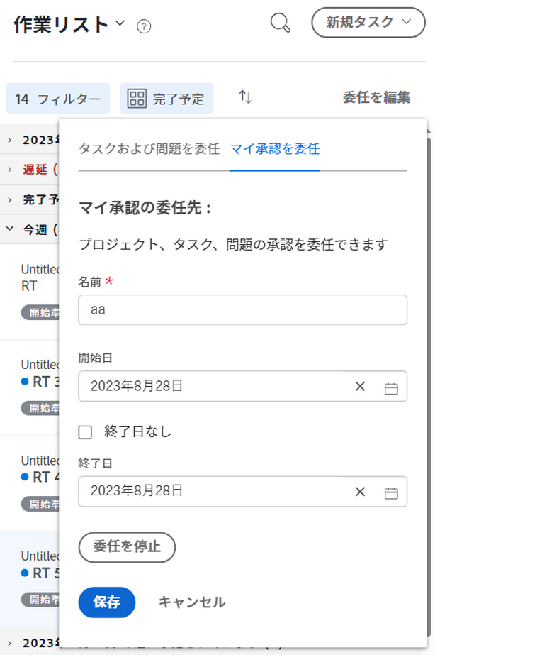
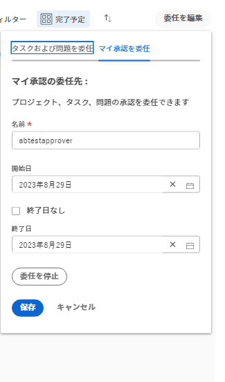
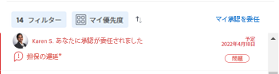

# 承認リクエストをデリゲート

不在時に割り当てられた作業を、一時的にデリゲートできます。タスクやイシューの割り当てをデリゲートしたり、承認リクエストを委任したりすることができます。この記事では、承認リクエストをデリゲートする方法について説明します。タスクとイシューの割り当てのデリゲートについて詳しくは、[タスクとイシューのデリゲートの管理](../../manage-work/delegate-work/how-to-delegate-work.md)を参照してください。

承認の割り当て方法（直接自分に割り当てられたか、自分が所属するチームに割り当てられたか、自分の担当業務に割り当てられたか）に関係なく、以下のタイプの承認をデリゲートできます。

* プロジェクト承認
* タスク承認
* イシュー承認

タイムシート、ドキュメント、または配達確認の承認を委任することはできません。

>[!NOTE]
>
>承認をデリゲートするようにスケジュールした日付に不一致が発生しないように、ユーザープロファイルのタイムゾーンをスケジュールのタイムゾーンと一致させることをお勧めします。詳しくは、次の記事を参照してください。
>
>* [スケジュールを作成](../../administration-and-setup/set-up-workfront/configure-timesheets-schedules/create-schedules.md)
>* [ユーザーのプロファイルを編集](../../administration-and-setup/add-users/create-and-manage-users/edit-a-users-profile.md)
>

## アクセス要件

この記事の手順を実行するには、次のアクセス権が必要です。

<table style="table-layout:auto"> 
 <col> 
 </col> 
 <col> 
 </col> 
 <tbody> 
  <tr> 
   <td role="rowheader">
Adobe Workfront プラン*
</td> 
   <td> 
任意
 </td> 
  </tr> 
  <tr> 
   <td role="rowheader">
Adobe Workfront ライセンス*
</td> 
   <td> 
レビュー以上
 </td> 
  </tr> 
 </tbody> 
</table>

&#42;ご利用のプランまたはライセンスタイプを確認するには、Workfront 管理者にお問い合わせください。

## デリゲートされた承認のユーザーのアクセス権について

指定された承認期間中、承認リクエストをデリゲートされたユーザーは、以下の能力を持ちます。

* 決定が下されていない既存の承認リクエストを承認または却下できます
* 指定した期間中に受け取った新しい承認リクエストを承認および却下できます
* 承認待ちのオブジェクトに対する表示アクセス権が付与されます

  >[!NOTE]
  >
  >Adobe Workfront の管理者は、特定のオブジェクトタイプにアクセスできないように、ユーザーを制限できます。ユーザーがオブジェクトタイプに対するアクセス権を持たず、そのタイプの承認がユーザーに委任された場合、ユーザーはオブジェクトに対する表示アクセス権を持ちません。ただし、[作業の承認](../../review-and-approve-work/manage-approvals/approving-work.md)で説明されているように、ユーザーは&#x200B;**ホーム**&#x200B;ページから承認リクエストを承認または拒否することができます。\
  例えば、ユーザー A はグループ A に属しています。Workfront 管理者がグループ A のアクセス権を制限したため、このグループのユーザーは Workfront 内のタスクを表示できません。タスクの承認リクエストがユーザー A に委任されている場合、ユーザー A は承認が関連付けられているタスクを表示できません。ただし、ユーザー A はホームページから承認リクエストを承認または却下できます。

  Workfront 管理者が設定内のオブジェクトタイプへのアクセスを制限する方法について詳しくは、[カスタムアクセスレベルを作成または変更](../../administration-and-setup/add-users/configure-and-grant-access/create-modify-access-levels.md)を参照してください。

承認の委任が停止またはキャンセルされた後、承認者として指定されたユーザーは、以下の状態になります。

* 承認が必要な項目の作業を承認するアクセス権がなくなりました
* 作業アイテムに対しては、引き続き表示アクセス権があります\
  承認の委任経由でオブジェクトに対する表示アクセス権を付与されたユーザーは、承認の委任が停止したり取り消されたりした後でも、その表示アクセス権を保持します。承認が委任されている期間中に、ユーザーがアクセス権を持つオブジェクトに対する表示アクセス権を削除するには、オブジェクトに移動し、そのオブジェクトから直接アクセス権を削除する必要があります。

## ホームエリアでの承認リクエストをデリゲート

* [別のユーザーに承認をデリゲート](#delegate-your-approvals-to-another-user)
* [承認デリゲートの更新または停止](#update-or-stop-an-approval-delegation)
* [委任された承認の表示](#view-delegated-approvals)

### 別のユーザーに承認をデリゲート {#delegate-your-approvals-to-another-user}

承認の割り当て方法（直接自分に割り当てられたか、自分が所属するチームに割り当てられたか、自分の担当業務に割り当てられたか）に関係なく、以下のタイプの承認をデリゲートできます。

* プロジェクト承認
* タスク承認
* イシュー承認

タイムシート、ドキュメント、または配達確認の承認を委任することはできません。

承認をデリゲートする際は、以下の点を考慮してください。

* 承認をデリゲートすると、すべての承認がデリゲートされます。個別の承認リクエストをデリゲートすることはできません。
* 承認は、1 名のユーザーに対してのみデリゲートできます。同時に複数のユーザーに承認をデリゲートすることはできません。\
  すべてのプロジェクト、タスクおよびイシューの承認はすべて、指定したユーザーに委任されます。
* 最大 5 名のユーザーが、同時に同じユーザーに承認を委任できます。つまり、1 人のユーザーを同時に 6 人以上のユーザーの一時的な承認者に指定することはできません。
* 承認に関するアクティビティは、「更新」タブに表示されます。「システム更新を表示」を有効にしておく必要があります。承認を委任したユーザーと承認を委任されたユーザーの両方に、承認アクティビティに関するメール通知が届きます。

別のユーザーに承認を委任するには、次の手順に従います。

1. Adobe Workfront の左上隅にある&#x200B;**ホーム**&#x200B;アイコン  をクリックします。

   >[!NOTE]
   >
   Workfront 管理者が、環境内のホームアイコンに次の変更を加える場合があります。
   >
   * 組織を説明するようにカスタマイズされた画像に置き換える。この場合、アイコンはこの記事に示すものとは異なる外観になります。
   * リンクされたページを別のページに置き換える。この場合、ページの右上隅にある&#x200B;**メインメニュー**&#x200B;アイコン  をクリックしたあと、「**ホーム**」をクリックします。

   または

   左パネルで&#x200B;**メインメニュー**&#x200B;アイコン／**[自分の名前]**／**休暇**&#x200B;をクリックします。

1. （オプションおよび条件付き）ホームエリアで、**フィルター**&#x200B;ドロップダウンメニューをクリックして、「**承認**」をクリックします。

1. （条件付き）「**マイ承認を委任**」をクリックします。

   または

   システム管理者またはグループ管理者がタスクとイシューの委任を有効にした場合は、「**委任**」をクリックし、次に「**承認を委任**」をクリックします。

   

1. 「マイ承認を委任」セクションで、次の情報を指定します。

   * **名前**：承認の委任先となるユーザーの名前を入力していき、ドロップダウンメニューに表示される名前をクリックします。
   * **開始日**：承認の転送が開始される日付を選択します。選択した日の午前 12:00 に転送が始まります。\
     開始日は、現在の日付または将来の日付にする必要があります。
   * **終了日**：次のいずれかを行います。

      * 承認の転送を停止する日付を選択します。選択した日の午後 11:59 に転送が終了します。
      * 「**終了日なし**」を選択して、承認を無期限に委任するように Workfront を設定します。

1. 「**保存**」をクリックします。

### 承認委任の更新または停止 {#update-or-stop-an-approval-delegation}

1. Adobe Workfront の左上隅にある&#x200B;**ホーム** アイコン  をクリックします。

   >[!NOTE]
   >
   Workfront 管理者が、環境内のホームアイコンに次の変更を加える場合があります。
   >
   * 組織を説明するようにカスタマイズされた画像に置き換える。この場合、アイコンはこの記事に示すものとは異なる外観になります。
   * リンクされたページを別のページに置き換える。この場合、ページの右上隅にある&#x200B;**メインメニュー**&#x200B;アイコン  をクリックしたあと、「**ホーム**」をクリックします。

1. **フィルター**&#x200B;ドロップダウンメニューをクリックして、「**承認**」をクリックします。

1. （条件付き）「**委任を編集**」をクリックします。

   または

   システム管理者またはグループ管理者がタスクとイシューの委任を有効にした場合は、「**委任を編集**」をクリックしたあと、「**承認を委任**」をクリックします。

1. （条件付き）次のいずれかを行います。

   * 既存の承認委任を更新するには、表示されている情報を変更し、「**保存**」をクリックします。

   * 既存の委任を停止するには、「**委任を停止**」をクリックしたあと、「**委任を停止**」をクリックして確定します。

     

### 委任された承認の表示 {#view-delegated-approvals}

作業リストには、次のタイプの承認委任のみ表示されます。

* プロジェクト承認
* タスク承認
* イシュー承認

委任された承認を表示するには、次の手順に従います。

1. Adobe Workfront の左上隅にある&#x200B;**ホーム**&#x200B;アイコン  をクリックします。

   >[!NOTE]
   >
   Workfront 管理者が、環境内のホームアイコンに次の変更を加える場合があります。
   >
   * 組織を説明するようにカスタマイズされた画像に置き換える。この場合、アイコンはこの記事に示すものとは異なる外観になります。
   * リンクされたページを別のページに置き換える。この場合、ページの右上隅にある&#x200B;**メインメニュー**&#x200B;アイコン  をクリックしたあと、「**ホーム**」をクリックします。

1. **フィルター**&#x200B;ドロップダウンメニューをクリックして、「**承認**」をクリックします。\
   自分に割り当てられた承認や自分に委任された承認を含め、すべての承認がデフォルトでリストに表示されます。

   
