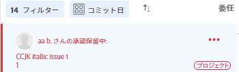
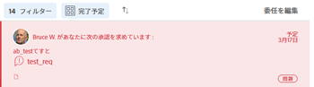
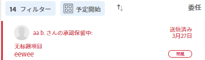
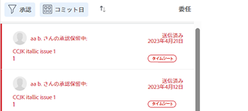
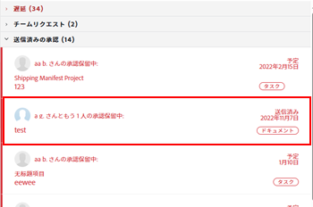
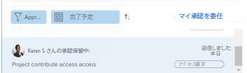

# 送信済み承認の取り消し

承認用に送信された次のオブジェクトのいずれかを思い出すことができます。

* プロジェクト
* タスク
* 問題
* タイムシート
* ドキュメント
* アクセス要求

## アクセス要件

この記事の手順を実行するには、次のアクセス権が必要です。

<table style="table-layout:auto"> 
 <col> 
 <col> 
 <tbody> 
  <tr> 
   <td role="rowheader">Adobe Workfront plan*</td> 
   <td> 
任意
 </td> 
  </tr> 
  <tr> 
   <td role="rowheader">Adobe Workfront license*</td> 
   <td> 
リクエスト以上
 </td> 
  </tr> 
  <tr> 
   <td role="rowheader">アクセスレベル設定*</td> 
   <td> 
プロジェクト、タスク、タスク、タスク、タイムシート、ドキュメントへのアクセス権を表示または上限に設定する
 
注意：まだアクセス権がない場合は、Workfront管理者に、アクセスレベルに追加の制限を設定しているかどうかを問い合わせてください。 Workfront管理者がアクセスレベルを変更する方法について詳しくは、 <a href="../../administration-and-setup/add-users/configure-and-grant-access/create-modify-access-levels.md" class="MCXref xref">カスタムアクセスレベルの作成または変更</a>.
 </td> 
  </tr> 
  <tr> 
   <td role="rowheader">オブジェクト権限</td> 
   <td> 
承認に関連付けられたオブジェクトへの表示またはそれ以上のアクセス権 
 
追加のアクセス権のリクエストについて詳しくは、 <a href="../../workfront-basics/grant-and-request-access-to-objects/request-access.md" class="MCXref xref">オブジェクトへのアクセスのリクエスト </a>.
 </td> 
  </tr> 
 </tbody> 
</table>

&#42;保有しているプラン、ライセンスの種類、アクセス権を確認するには、Workfront管理者に問い合わせてください。

## プロジェクト

プロジェクトの承認を思い出すと、承認プロセスが開始される前のステータスにプロジェクトが戻ります。

プロジェクトの開始ステータスに関連付けられた承認を思い出した場合、承認プロセスは回避され、プロジェクトは開始ステータスのままになります。

>[!NOTE]
>
>テンプレートを使用して、プロジェクトまたはタスクの最初のステータスを承認プロセスに関連付けることができます。 テンプレートへの承認の追加について詳しくは、  [プロジェクトテンプレートの編集](../../manage-work/projects/create-and-manage-templates/edit-templates.md).

送信したプロジェクトの承認を取り消すには、次の手順に従います。

1. 次をクリック： **ホーム** アイコン  Adobe Workfrontの左上隅に

   >[!NOTE]
   Workfront管理者は、お使いの環境のホームアイコンに次の変更を加えることができます。
   * 組織を説明するようにカスタマイズされた画像に置き換えます。 この場合、この記事に示すアイコンは異なります。
   * リンクされたページを別のページに置き換えます。 この場合、 **メインメニュー**  ページの右上隅にある「 **ホーム**.

1. 内 **作業用リスト** 領域で、 **送信した承認** グループ化。

1. クリック **プロジェクト** 承認が必要です。

   これにより、作業リストの右側にプロジェクトが開きます。

   

1. クリック **再現率** をクリックします。

## タスク

タスクの承認を取り消すと、承認プロセスの開始前のステータスに戻ります。

タスクの開始ステータスに関連付けられた承認を取り消すと、承認プロセスは回避され、タスクは開始ステータスのままになります。

>[!NOTE]
テンプレートを使用して、プロジェクトまたはタスクの最初のステータスを承認プロセスに関連付けることができます。 テンプレートへの承認の追加について詳しくは、 [プロジェクトテンプレートの編集](../../manage-work/projects/create-and-manage-templates/edit-templates.md).

送信したタスクの承認を取り消すには、次の手順に従います。

1. 次をクリック： **ホーム** アイコン  Adobe Workfrontの左上隅に

   >[!NOTE]
   Workfront管理者は、お使いの環境のホームアイコンに次の変更を加えることができます。
   * 組織を説明するようにカスタマイズされた画像に置き換えます。 この場合、この記事に示すアイコンは異なります。
   * リンクされたページを別のページに置き換えます。 この場合、 **メインメニュー**  ページの右上隅にある「 **ホーム**.

1. 内 **作業用リスト** 領域で、 **送信した承認** グループ化。

1. クリック **タスク** 承認が必要です。

   これにより、作業用リストの右側にタスクが開きます。

   

1. クリック **再現率** をクリックします。

## 問題

問題の承認を思い出すと、承認プロセスが開始される前のステータスに問題が戻ります。

イシューの開始ステータスに関連付けられた承認を思い出した場合、承認プロセスは回避され、イシューは開始ステータスのままになります。

>[!NOTE]
テンプレートを使用して、イシューの最初のステータスを承認プロセスに関連付けることができます。 リクエストキューの作成について詳しくは、 [リクエストキューの作成](../../manage-work/requests/create-and-manage-request-queues/create-request-queue.md).

1. 次をクリック： **ホーム** アイコン  Adobe Workfrontの左上隅に

   >[!NOTE]
   Workfront管理者は、お使いの環境のホームアイコンに次の変更を加えることができます。
   * 組織を説明するようにカスタマイズされた画像に置き換えます。 この場合、この記事に示すアイコンは異なります。
   * リンクされたページを別のページに置き換えます。 この場合、 **メインメニュー**  ページの右上隅にある「 **ホーム**.

1. 内 **作業用リスト** 領域で、 **送信した承認** グループ化。

1. 次をクリック： **問題** 承認が必要です。

   これにより、作業リストの右側に問題が開きます。

   

1. クリック **再現率** をクリックします。

## タイムシート

タイムシートの承認を取り消すと、タイムシートは承認用に送信される前の状態に戻ります。

1. 次をクリック： **ホーム** アイコン  Adobe Workfrontの左上隅に

   >[!NOTE]
   Workfront管理者は、お使いの環境のホームアイコンに次の変更を加えることができます。
   * 組織を説明するようにカスタマイズされた画像に置き換えます。 この場合、この記事に示すアイコンは異なります。
   * リンクされたページを別のページに置き換えます。 この場合、 **メインメニュー**  ページの右上隅にある「 **ホーム**.

1. 内 **作業用リスト** 領域で、 **送信した承認** グループ化。

1. クリック **タイムシート** 承認が必要です。

   これにより、作業用リストの右側にタイムシートが開きます。

   

1. クリック **再現率** をクリックします。

## ドキュメント

ドキュメントの承認を取り消すには、1 人またはすべてのユーザーを手動で承認から削除する必要があります。

1. 次をクリック： **ホーム** アイコン  Adobe Workfrontの左上隅に

   >[!NOTE]
   Workfront管理者は、お使いの環境のホームアイコンに次の変更を加えることができます。
   * 組織を説明するようにカスタマイズされた画像に置き換えます。 この場合、この記事に示すアイコンは異なります。
   * リンクされたページを別のページに置き換えます。 この場合、 **メインメニュー**  ページの右上隅にある「 **ホーム**.

1. 内 **作業用リスト** 領域で、 **送信した承認** グループ化。

1. クリック **文書** 承認が必要です。

   これにより、作業リストの右側にドキュメントが開きます。

   

1. クリック **承認を管理** をクリックします。 承認を管理ボックスが開きます。
1. 次をクリック： **削除** 「承認を管理」ボックス内のユーザーの名前を示すアイコン。 ドキュメントの承認を完全に取り消すには、すべてのユーザーを削除します。

   

## アクセス要求

1. 次をクリック： **ホーム** アイコン  Adobe Workfrontの左上隅に

   >[!NOTE]
   Workfront管理者は、お使いの環境のホームアイコンに次の変更を加えることができます。
   * 組織を説明するようにカスタマイズされた画像に置き換えます。 この場合、この記事に示すアイコンは異なります。
   * リンクされたページを別のページに置き換えます。 この場合、 **メインメニュー**  ページの右上隅にある「 **ホーム**.

1. 内 **作業用リスト** 領域で、 **送信した承認** グループ化。

1. 次をクリック： **アクセス要求** 承認が必要です。

   これにより、作業リストの右側にアクセス要求が開きます。

   

1. クリック **再現率** をクリックします。
