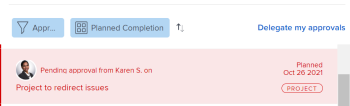
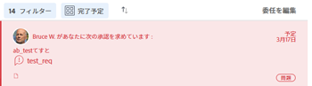
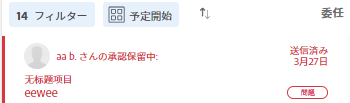

# 送信した承認の取り消し

承認のために送信した以下のオブジェクトを取り消すことができます。

* プロジェクト
* タスク
* イシュー
* タイムシート
* ドキュメント
* アクセスリクエスト

## アクセス要件

+++ 展開すると、この記事の機能のアクセス要件が表示されます。

<table style="table-layout:auto"> 
 <col> 
 <col> 
 <tbody> 
  <tr> 
   <td role="rowheader">Adobe Workfront パッケージ</td> 
   <td> 
任意
 </td> 
  </tr> 
  <tr> 
   <td role="rowheader">Adobe Workfront プラン</td> 
   <td>
   
Contribute以上

   
リクエスト以上

   </td> 
  </tr> 
  <tr> 
   <td role="rowheader">アクセスレベル設定</td> 
   <td> 
プロジェクト、タスク、イシュー、タイムシート、ドキュメントに対する表示以上の権限。
</td> 
  </tr> 
  <tr> 
   <td role="rowheader">オブジェクト権限</td> 
   <td> 
承認に関連付けられたオブジェクトに対する表示以上のアクセス権 
</td> 
  </tr> 
 </tbody> 
</table>

詳しくは、[Workfront ドキュメントのアクセス要件](/help/quicksilver/administration-and-setup/add-users/access-levels-and-object-permissions/access-level-requirements-in-documentation.md)を参照してください。

+++

## プロジェクト

プロジェクトの承認を取り消すと、承認プロセスを開始する前のステータスにプロジェクトが戻ります。

プロジェクトの開始ステータスに関連付けられた承認を取り消すと、承認プロセスは回避され、プロジェクトは開始ステータスのままになります。

>[!NOTE]
>
>テンプレートを使用して、プロジェクトまたはタスクの最初のステータスを承認プロセスに関連付けることができます。 テンプレートへの承認の追加について詳しくは、[プロジェクトテンプレートの編集](../../manage-work/projects/create-and-manage-templates/edit-templates.md)を参照してください。

送信したプロジェクトの承認を取り消すには：

1. Adobe Workfront の左上隅にある&#x200B;**ホーム**&#x200B;アイコン  をクリックします。

   >[!NOTE]
   >
   >Workfront 管理者が、環境内のホームアイコンに次の変更を加える場合があります。
   >
   >* 組織を説明するようにカスタマイズされた画像に置き換える。 この場合、アイコンはこの記事に示すものとは異なる外観になります。
   >* リンクされたページを別のページに置き換える。 この場合、ページの右上隅にある&#x200B;**メインメニュー** をクリックし、**ホーム**&#x200B;をクリックします。

1. **作業リスト**&#x200B;エリアで、「**送信した承認**」グループに移動します。

1. 作業リストで「**プロジェクト**」の承認をクリックします。

   これにより、作業リストの右側にプロジェクトが開きます。

   

1. 右側のパネルの右上隅にある「**取り消し**」をクリックします。

## タスク

タスクの承認を取り消すと、承認プロセスを開始する前のステータスにタスクが戻ります。

タスクの開始ステータスに関連付けられた承認を取り消すと、承認プロセスは回避され、タスクは開始ステータスのままになります。

>[!NOTE]
>
>テンプレートを使用して、プロジェクトまたはタスクの最初のステータスを承認プロセスに関連付けることができます。 テンプレートへの承認の追加について詳しくは、[プロジェクトテンプレートの編集](../../manage-work/projects/create-and-manage-templates/edit-templates.md)を参照してください。

送信したタスクの承認を取り消すには：

1. Adobe Workfront の左上隅にある&#x200B;**ホーム**&#x200B;アイコン  をクリックします。

   >[!NOTE]
   >
   >Workfront 管理者が、環境内のホームアイコンに次の変更を加える場合があります。
   >
   >* 組織を説明するようにカスタマイズされた画像に置き換える。 この場合、アイコンはこの記事に示すものとは異なる外観になります。
   >* リンクされたページを別のページに置き換える。 この場合、ページの右上隅にある&#x200B;**メインメニュー** をクリックし、**ホーム**&#x200B;をクリックします。

1. **作業リスト**&#x200B;エリアで、「**送信した承認**」グループに移動します。

1. 作業リストで「**タスク**」の承認をクリックします。

   これにより、作業リストの右側にタスクが開きます。

   

1. 右側のパネルの右上隅にある「**取り消し**」をクリックします。

## イシュー

イシューの承認を取り消すと、承認プロセスを開始する前のステータスにイシューが戻ります。

イシューの開始ステータスに関連付けられた承認を取り消すと、承認プロセスは回避され、イシューは開始ステータスのままになります。

>[!NOTE]
>
>テンプレートを使用して、イシューの最初のステータスを承認プロセスに関連付けることができます。 リクエストキューの作成について詳しくは、[リクエストキューの作成](../../manage-work/requests/create-and-manage-request-queues/create-request-queue.md)を参照してください。

1. Adobe Workfront の左上隅にある&#x200B;**ホーム**&#x200B;アイコン  をクリックします。

   >[!NOTE]
   >
   >Workfront 管理者が、環境内のホームアイコンに次の変更を加える場合があります。
   >
   >* 組織を説明するようにカスタマイズされた画像に置き換える。 この場合、アイコンはこの記事に示すものとは異なる外観になります。
   >* リンクされたページを別のページに置き換える。 この場合、ページの右上隅にある&#x200B;**メインメニュー** をクリックし、**ホーム**&#x200B;をクリックします。

1. **作業リスト**&#x200B;エリアで、「**提出した承認**」グループに移動します。

1. 作業リストで「**イシュー**」の承認をクリックします。

   これにより、作業リストの右側にイシューが開きます。

   

1. 右側のパネルの右上隅にある「**取り消し**」をクリックします。

## タイムシート

タイムシートの承認を取り消すと、タイムシートは承認用に送信する前の状態に戻ります。

1. Adobe Workfront の左上隅にある&#x200B;**ホーム**&#x200B;アイコン  をクリックします。

   >[!NOTE]
   >
   >Workfront 管理者が、環境内のホームアイコンに次の変更を加える場合があります。
   >
   >* 組織を説明するようにカスタマイズされた画像に置き換える。 この場合、アイコンはこの記事に示すものとは異なる外観になります。
   >* リンクされたページを別のページに置き換える。 この場合、ページの右上隅にある&#x200B;**メインメニュー** をクリックし、**ホーム**&#x200B;をクリックします。

1. **作業リスト**&#x200B;エリアで、「**提出した承認**」グループに移動します。

1. 作業リストで「**タイムシート**」の承認をクリックします。

   これにより、作業用リストの右側にタイムシートが開きます。

   

1. 右側のパネルの右上隅にある「**取り消し**」をクリックします。

## ドキュメント

ドキュメントの承認を取り消すには、1 人またはすべてのユーザーを手動で承認から削除する必要があります。

1. Adobe Workfront の左上隅にある&#x200B;**ホーム**&#x200B;アイコン  をクリックします。

   >[!NOTE]
   >
   >Workfront 管理者が、環境内のホームアイコンに次の変更を加える場合があります。
   >
   >* 組織を説明するようにカスタマイズされた画像に置き換える。 この場合、アイコンはこの記事に示すものとは異なる外観になります。
   >* リンクされたページを別のページに置き換える。 この場合、ページの右上隅にある&#x200B;**メインメニュー** をクリックし、**ホーム**&#x200B;をクリックします。

1. **作業リスト**&#x200B;エリアで、「**提出した承認**」グループに移動します。

1. 作業リストで「**ドキュメント**」の承認をクリックします。

   これにより、作業リストの右側にドキュメントが開きます。

   

1. 右側のパネルの右上隅にある「**承認を管理**」をクリックします。 「承認を管理」ボックスが開きます。
1. 「承認を管理」ボックス内のユーザー名の横にある&#x200B;**削除**&#x200B;アイコンをクリックします。 ドキュメントの承認を完全に取り消すには、すべてのユーザーを削除します。

   

## アクセスリクエスト

1. Adobe Workfront の左上隅にある&#x200B;**ホーム**&#x200B;アイコン  をクリックします。

   >[!NOTE]
   >
   >Workfront 管理者が、環境内のホームアイコンに次の変更を加える場合があります。
   >
   >* 組織を説明するようにカスタマイズされた画像に置き換える。 この場合、アイコンはこの記事に示すものとは異なる外観になります。
   >* リンクされたページを別のページに置き換える。 この場合、ページの右上隅にある&#x200B;**メインメニュー** をクリックし、**ホーム**&#x200B;をクリックします。

1. **作業リスト**&#x200B;エリアで、「**提出した承認**」グループに移動します。

1. 作業リストで「**アクセス要求**」の承認をクリックします。

   これにより、作業リストの右側にアクセス要求が開きます。

   

1. 右側のパネルの右上隅にある「**取り消し**」をクリックします。
