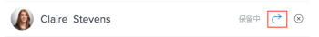

# 承認者に送信済みの承認を通知する

次のオブジェクトの承認が保留中であることを承認者に通知できます。

* アクセスリクエスト
* ドキュメント

## アクセス要件

この記事の手順を実行するには、次のアクセス権が必要です。

<table style="table-layout:auto"> 
 <col> 
 <col> 
 <tbody> 
  <tr> 
   <td role="rowheader">Adobe Workfront プラン*</td> 
   <td> 
任意
 </td> 
  </tr> 
  <tr> 
   <td role="rowheader">Adobe Workfront ライセンス*</td> 
   <td> 
リクエスト以上
 </td> 
  </tr> 
  <tr> 
   <td role="rowheader">アクセスレベル設定*</td> 
   <td> 
プロジェクト、タスク、タスク、タスク、テンプレート、ポートフォリオ、プログラム、レポート、ダッシュボード、カレンダー、ドキュメントへの表示アクセス権、またはより高いレベルのアクセス権
 
メモ：まだアクセス権がない場合は、アクセスレベルに追加の制限が設定されていないかどうか Workfront 管理者にお問い合わせください。Workfront 管理者がアクセスレベルを変更する方法について詳しくは、<a href="../../administration-and-setup/add-users/configure-and-grant-access/create-modify-access-levels.md" class="MCXref xref">カスタムアクセスレベルの作成または変更</a>を参照してください。
 </td> 
  </tr> 
  <tr> 
   <td role="rowheader">オブジェクト権限</td> 
   <td> 
リクエストのアクセスまたは承認に関連付けられたオブジェクトへの表示以上のアクセス権 
 
追加のアクセス権のリクエストについて詳しくは、<a href="../../workfront-basics/grant-and-request-access-to-objects/request-access.md" class="MCXref xref">オブジェクトへのアクセス権のリクエスト</a>を参照してください。
 </td> 
  </tr> 
 </tbody> 
</table>

&#42;保有するプラン、ライセンスタイプ、アクセス権を確認するには、Workfront 管理者に問い合わせてください。

## アクセスリクエスト

次のオブジェクトに対する追加のアクセス権を要求できます。

* プロジェクト
* タスク
* イシュー
* ポートフォリオ
* プログラム
* テンプレート
* レポート
* ダッシュボード
* カレンダー
* ドキュメント

オブジェクトへのアクセス要求を承認するように別のユーザーに通知するには、次の手順に従います。

1. Adobe Workfront の左上隅にある&#x200B;**ホーム**&#x200B;アイコン をクリックします。

   >[!NOTE]
   >
   >Workfront 管理者が、環境内のホームアイコンに次の変更を加える場合があります。
   >
   >* 組織を説明するようにカスタマイズされた画像に置き換える。この場合、アイコンはこの記事に示すものとは異なる外観になります。
   >* リンクされたページを別のページに置き換える。この場合、ページの右上隅にある&#x200B;**メインメニュー**、**ホーム**&#x200B;の順にクリックします。

1. **作業リスト**&#x200B;エリアで、「**送信済みの承認**」グループに移動します。

1. 作業リストで「**アクセス要求**」の承認を選択します。

   作業リストの右側にアクセス要求が開きます。

   

1. 右パネルの右上隅にある「**通知**」をクリックして、承認者に通知を送信します。

## ドキュメント

1. Adobe Workfront の左上隅にある&#x200B;**ホーム**&#x200B;アイコン  をクリックします。

   >[!NOTE]
   >
   >Workfront 管理者が、環境内のホームアイコンに次の変更を加える場合があります。
   >
   >* 組織を説明するようにカスタマイズされた画像に置き換える。この場合、アイコンはこの記事に示すものとは異なる外観になります。
   >* リンクされたページを別のページに置き換える。この場合、ページの右上隅にある&#x200B;**メインメニュー**、**ホーム**&#x200B;の順にクリックします。

1. **作業リスト**&#x200B;エリアで、**送信済みの承認**&#x200B;グループに移動します。

1. 作業リストで「**ドキュメント**」の承認をクリックします。

   作業リストの右側にドキュメントの承認が開きます。\
   

1. 右パネルの右上隅にある「**承認を管理**」をクリックします。
1.  **通知**&#x200B;アイコンをクリックして、承認者に通知を送信します。\
   
