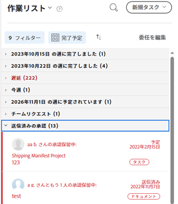
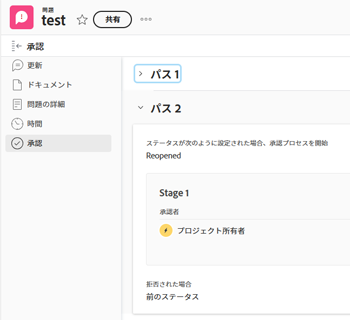

# 承認の表示

承認プロセスを使用すると、プロジェクト、タスクおよびイシューに対する複数手順の承認を柔軟に作成できます。Adobe Workfront 管理者は、システム全体で一貫性を保つための承認プロセスを定義します。

承認プロセスの作成については、[作業アイテムの承認プロセスの作成](../../administration-and-setup/customize-workfront/configure-approval-milestone-processes/create-approval-processes.md)を参照してください。

Workfront での作業への承認の関連付けについては、[新規または既存の承認プロセスと作業の関連付け](../../review-and-approve-work/manage-approvals/associate-approval-with-work.md)を参照してください。

## アクセス要件

この記事の手順を実行するには、次のアクセス権が必要です。

<table style="table-layout:auto"> 
 <col> 
 <col> 
 <tbody> 
  <tr> 
   <td role="rowheader">Adobe Workfront プラン*</td> 
   <td> 
任意
 </td> 
  </tr> 
  <tr> 
   <td role="rowheader">Adobe Workfront ライセンス*</td> 
   <td> 
レビュー以上
 </td> 
  </tr> 
  <tr> 
   <td role="rowheader">アクセスレベル設定*</td> 
   <td> 
承認に関連付けられたオブジェクトに対する表示以上のアクセス権
 
メモ：まだアクセス権がない場合は、アクセスレベルに追加の制限が設定されていないかどうか Workfront 管理者にお問い合わせください。Workfront 管理者がアクセスレベルを変更する方法について詳しくは、<a href="../../administration-and-setup/add-users/configure-and-grant-access/create-modify-access-levels.md" class="MCXref xref">カスタムアクセスレベルの作成または変更</a>を参照してください。
 </td> 
  </tr> 
  <tr> 
   <td role="rowheader">オブジェクト権限</td> 
   <td> 
承認に関連付けられたオブジェクトに対する表示以上の権限
 
追加のアクセス権のリクエストについて詳しくは、<a href="../../workfront-basics/grant-and-request-access-to-objects/request-access.md" class="MCXref xref">オブジェクトへのアクセス権のリクエスト</a>を参照してください。
 </td> 
  </tr> 
 </tbody> 
</table>

&#42;保有するプラン、ライセンスタイプ、アクセス権を確認するには、Workfront 管理者に問い合わせてください。

## Adobe Workfront で承認を検索

Workfront の複数のエリアで承認を表示または管理できます。様々なエリアで承認を管理する方法については、[作業の承認](../../review-and-approve-work/manage-approvals/approving-work.md)を参照してください。

次のエリアで承認を表示または管理できます。

* ホームエリア

   * すべてまたは承認を表示するように選択すると、ホームエリアに、承認待ちのすべてのプロジェクト、タスク、イシュー、タイムシート、ドキュメント、アクセスが表示されます。
   * 自分が送信した承認は、作業リストの「送信済み承認」セクションのホームエリアにも表示されます。詳しくは、[ホームエリアで承認用に送信する作業を確認](#review-work-you-submit-for-approval-in-the-home-area)の節を参照してください。
   * 関連するプロジェクト、タスク、イシューが「解決済み」、「保留中」、「クローズ済み」または「キャンセル済み」とマークされると、承認はホームエリアから削除されます。

  ホームの使用については、[ホームの基本を学ぶ](../../workfront-basics/using-home/using-the-home-area/get-started-with-home.md)を参照してください。

* プロジェクト、タスク、イシュー、ドキュメント、プルーフのヘッダー内
* プロジェクト、タスク、イシューの「承認」セクション内
* レポート内

  >[!NOTE]
  >
  >レポートから承認を決定することはできません。

  承認情報を含むプロジェクト、タスク、イシュー、ドキュメントの承認レポートを作成できます。

  レポートの作成について詳しくは、[カスタムレポートの作成](../../reports-and-dashboards/reports/creating-and-managing-reports/create-custom-report.md)を参照してください。

## ホームエリアで承認用に作成する作業を確認 {#review-work-you-submit-for-approval-in-the-home-area}

1. Adobe Workfront の左上隅にある&#x200B;**ホーム**&#x200B;アイコン  をクリックします。

   >[!NOTE]
   >
   >Workfront 管理者が、環境内のホームアイコンに次の変更を加える場合があります。
   >
   >* 組織を説明するようにカスタマイズされた画像に置き換える。この場合、アイコンはこの記事に示すものとは異なる外観になります。
   >* リンクされたページを別のページに置き換える。この場合、ページの右上隅にある&#x200B;**メインメニュー**&#x200B;アイコン  をクリックしたあと、「**ホーム**」をクリックします。

1. **作業リスト**&#x200B;を選択し、**フィルター**&#x200B;ドロップダウンメニューをクリックして、「**承認**」を選択します。
1. 「**送信済みの承認**」セクションを展開して、送信した承認を確認します。

   

## オブジェクトの承認ステータスを表示

オブジェクトの以下のセクションで、オブジェクトの承認ステータスを確認できます。

<table style="table-layout:auto"> 
 <col> 
 <col> 
 <tbody> 
  <tr> 
   <td role="rowheader">アップデート </td> 
   <td> 
発生したすべての承認ステータスが表示されます。承認ステータスは、<strong>更新</strong>セクションに表示される他のステータスと並んで表示されます。
 </td> 
  </tr> 
  <tr> 
   <td role="rowheader">承認</td> 
   <td> 
承認プロセスの各ステージや、承認者が承認したかどうかなど、承認プロセスに関する詳細情報が表示されます。
 </td> 
  </tr> 
 </tbody> 
</table>

* [アップデートエリアを使用して承認ステータスを表示](#use-the-updates-area-to-view-an-approval-status)
* [承認エリアを使用して承認ステータスを表示](#use-the-approvals-area-to-view-an-approval-status)

### 承認エリアを使用して承認ステータスを表示 {#use-the-updates-area-to-view-an-approval-status}

プロジェクト、タスクまたはイシューで承認が開始されると、オブジェクトの「**更新**」タブにステータスが表示され、承認ステータスを示します。承認プロセスを通じてオブジェクトが遷移するたびに新しいステータスが表示されます。これには、次のイベントが含まれます。

* オブジェクトに対して承認プロセスが開始される。ステータスが変更されると、承認プロセスが開始されます。
* オブジェクトが却下される。
* オブジェクトが承認される。

>[!TIP]
>
>タスクに承認を適用すると、承認のアップデートは、タスクの「アップデート」タブに表示されますが、タスクが存在するプロジェクトの「アップデート」タブには表示されません。

### 承認エリアを使用して承認ステータスを表示 {#use-the-approvals-area-to-view-an-approval-status}

現在作業中のタスクやイシューが承認プロセスのどこにあるかを明確に把握できます。次の情報が表示されます。

* 承認プロセスのフェーズ
* 既に承認を行った承認者
* まだ承認を行っていない承認者

タスクまたはイシューの承認プロセスの現在の状態を確認するには：

1. 承認が関連付けられているプロジェクト、タスクまたはイシューに移動します。
1. 左側のパネルで、「**承認**」をクリックします。最初に&#x200B;**さらに表示**&#x200B;をクリックする必要がある場合もあります。

   「承認」タブには、過去のすべての承認パスおよび承認ステージに関する完全な情報が表示されます。承認決定者や、承認がチーム、担当業務、ユーザーのいずれに対して設定されているかを正確に確認できます。

   

   承認プロセスの作成について詳しくは、[作業アイテムの承認プロセスを作成](../../administration-and-setup/customize-workfront/configure-approval-milestone-processes/create-approval-processes.md)を参照してください。
