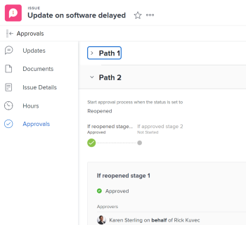

# 承認の表示

このページでハイライト表示されている情報は、まだ一般に利用できない機能を示します。 プレビューサンドボックス環境でのみ使用できます。

承認プロセスを使用すると、プロジェクト、タスクおよびイシューに対する複数手順の承認を柔軟に作成できます。 Adobe Workfront 管理者は、システム全体で一貫性を保つための承認プロセスを定義します。

承認プロセスの作成については、[作業アイテムの承認プロセスの作成](../../administration-and-setup/customize-workfront/configure-approval-milestone-processes/create-approval-processes.md)を参照してください。

Workfront での作業への承認の関連付けについては、[新規または既存の承認プロセスと作業の関連付け](../../review-and-approve-work/manage-approvals/associate-approval-with-work.md)を参照してください。

## アクセス要件

+++ 展開すると、この記事の機能のアクセス要件が表示されます。

<table style="table-layout:auto"> 
 <col> 
 <col> 
 <tbody> 
  <tr> 
   <td role="rowheader">Adobe Workfront パッケージ</td> 
   <td> 
任意
 </td> 
  </tr> 
  <tr> 
   <td role="rowheader">Adobe Workfront プラン</td> 
   <td>
   

貢献度以上

   
レビュー以上

   </td> 
  </tr> 
  <tr> 
   <td role="rowheader">アクセスレベル設定</td> 
   <td>
承認に関連付けられたオブジェクトに対する表示以上のアクセス権
 </td> 
  </tr> 
  <tr> 
   <td role="rowheader">オブジェクト権限</td> 
   <td> 
承認に関連付けられたオブジェクトに対する表示以上の権限
</td> 
  </tr> 
 </tbody> 
</table>

詳しくは、[Workfront ドキュメントのアクセス要件](/help/quicksilver/administration-and-setup/add-users/access-levels-and-object-permissions/access-level-requirements-in-documentation.md)を参照してください。

+++

## Adobe Workfront で承認を検索

Workfront の複数のエリアで承認を表示または管理できます。 様々なエリアで承認を管理する方法については、[作業の承認](../../review-and-approve-work/manage-approvals/approving-work.md)を参照してください。

次のエリアで承認を表示または管理できます。

* ホームエリア

   * 承認待ちのすべてのプロジェクト、タスク、イシュー、タイムシート、ドキュメント、アクセス、およびWorkfront計画リクエスト は、ホーム領域のMy Approvals ウィジェットに表示されます。
   * 自分で送信した承認は、「自分で送信した承認」フィルターオプションを選択すると、ホーム領域の「自分の承認」ウィジェットにも表示されます。 詳しくは、[ホームエリアで承認用に送信する作業を確認](#review-work-you-submit-for-approval-in-the-home-area)の節を参照してください。
   * 関連するプロジェクト、タスク、またはイシューが「解決済み」、「保留中」、「クローズ」、「キャンセル済み」とマークされている場合、ホーム領域の「マイ承認」ウィジェットから承認が削除されます。

  ホームの使用については、[ホームの基本を学ぶ](../../workfront-basics/using-home/using-the-home-area/get-started-with-home.md)を参照してください。

* プロジェクト、タスク、イシュー、ドキュメント、プルーフのヘッダー内
* プロジェクト、タスク、イシューの「承認」セクション内
* レポート内

  >[!NOTE]
  >
  >レポートから承認を決定することはできません。

  承認情報を含むプロジェクト、タスク、イシュー、ドキュメントの承認レポートを作成できます。

  レポートの作成について詳しくは、[カスタムレポートの作成](../../reports-and-dashboards/reports/creating-and-managing-reports/create-custom-report.md)を参照してください。

## ホームエリアで承認用に作成する作業を確認 {#review-work-you-submit-for-approval-in-the-home-area}

1. 右上隅の&#x200B;**[!UICONTROL メインメニュー]** をクリックし、**[!UICONTROL ホーム]**&#x200B;をクリックします。
1. （条件付き）「**カスタマイズ**」をクリックして、**自分の承認** ウィジェットを追加します。
1. （条件付き）「**フィルター**」ドロップダウンメニューをクリックし、**送信した承認**」を選択して、送信した承認を表示します。

## オブジェクトの承認ステータスを表示

オブジェクトの以下のセクションで、オブジェクトの承認ステータスを確認できます。

<table style="table-layout:auto"> 
 <col> 
 <col> 
 <tbody> 
  <tr> 
   <td role="rowheader">アップデート </td> 
   <td> 
発生したすべての承認ステータスが表示されます。 承認ステータスは、<strong>更新</strong>セクションに表示される他のステータスと並んで表示されます。
 </td> 
  </tr> 
  <tr> 
   <td role="rowheader">承認</td> 
   <td> 
承認プロセスの各ステージや、承認者が承認したかどうかなど、承認プロセスに関する詳細情報が表示されます。
 </td> 
  </tr> 
 </tbody> 
</table>

### 更新エリアを使用して承認ステータスを表示 {#use-the-updates-area-to-view-an-approval-status}

プロジェクト、タスク、またはイシューで承認が開始されると、承認ステータスを示すステータスがオブジェクトの「**更新**」タブに表示されます。 新しいステータスは、オブジェクトが承認プロセスを移行するたびに表示されます。 これには、次のイベントが含まれます。

* オブジェクトに対して承認プロセスが開始されます。 ステータスが変更されると、承認プロセスが開始されます。
* オブジェクトが拒否されました
* オブジェクトは承認済みです

>[!TIP]
>
>タスクに承認を適用すると、承認のアップデートは、タスクの「アップデート」タブに表示されますが、タスクが存在するプロジェクトの「アップデート」タブには表示されません。

### 承認エリアを使用して承認ステータスを表示 {#use-the-approvals-area-to-view-an-approval-status}

現在作業しているタスクやイシューが承認プロセスのどの段階にあるのかを可視化することができます。 次の情報が表示されます。

* 承認プロセスのフェーズ
* 既に承認を行った承認者
* まだ承認を行っていない承認者

タスクまたはイシューの承認プロセスの現在の状態を確認するには：

1. 承認が関連付けられているプロジェクト、タスクまたはイシューに移動します。
1. 左側のパネルで、「**承認**」をクリックします。

   「承認」タブには、過去のすべての承認パスおよび承認ステージに関する完全な情報が表示されます。 承認決定者や、承認がチーム、担当業務、ユーザーのいずれに対して設定されているかを正確に確認できます。

   

   承認プロセスの作成について詳しくは、[作業アイテムの承認プロセスを作成](../../administration-and-setup/customize-workfront/configure-approval-milestone-processes/create-approval-processes.md)を参照してください。
