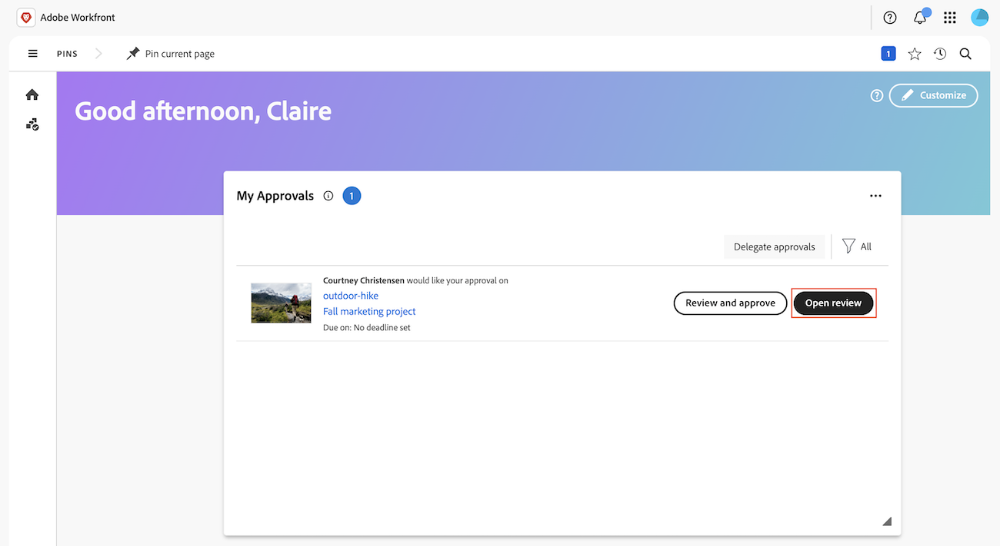

# Frame.io 統合の概要

Workfrontと Frame.io の統合により、クリエイティブ、マーケター、利害関係者がシームレスなワークフローに関連付けられます。 リアルタイムの更新にアクセスし、重複した作業を回避し、ローンチ前にアセットが承認されていることを確認します。

Frame.io について詳しくは、[Frame.io の概要 ](https://support.frame.io/en/collections/49298-getting-started) を参照してください。

## Workfrontでの作業の開始と計画

プロジェクトコーディネーターは、Workfrontでプロジェクトを作成し、作業を計画できます。 Frame.io 統合が有効なインスタンスで作成されたプロジェクトでは、Adobe Enterprise Storage を使用して、Adobe エコシステム内でアセットを保存および管理できます。

組織が Frame.io Enterprise ライセンスを保有している場合、Workfrontで作成されたプロジェクトは Frame.io にも表示され、ユーザーはどちらの製品でもアセットを操作したりアップロードしたりできます。

Adobe エンタープライズストレージまたは Frame.io のプロジェクトについて詳しくは、以下を参照してください。

* [Workspaceの概要：プロジェクト ](https://help.frame.io/en/articles/9101001-workspace-overview#h_d9f8654895)
* [Adobe エンタープライズストレージの概要](/help/quicksilver/review-and-approve-work/esm-overview.md)

## アセットのレビューと承認

アセットが完了したら、プロジェクトコーディネーターはWorkfrontで正式なレビューと承認プロセスを開始できます。

承認ワークフローが作成されると、レビュー担当者と承認者は Frame.io ビューアを使用して、コメントを追加したり、アセットをマークアップしたりできます。 また、Frame.io ビューアで承認の決定を行うこともできます。

プロジェクトのセットアップの詳細については、を参照してください。

* [プロジェクトを作成](/help/quicksilver/manage-work/projects/create-projects/create-project.md)
* [Frame.io 統合の概要](/help/quicksilver/review-and-approve-work/native-integrations/frame-io/frame-int-overview.md)

### Workfrontでの正式なレビューと承認の開始

プロジェクトコーディネーターは、1 回限りのレビューと承認、または再利用可能な承認テンプレートを作成できます。 レビュー担当者、承認者、またはその両方を割り当てることができます。

* **レビュー担当者** は、コメントを追加したり、アセットをマークアップしたりできます。 完了したら、レビューを完了としてマークできます。 アセットを承認プロセスで先に進めるために、レビューを完了とマークする必要はありません。
* **承認者** は、コメントを追加し、アセットをマークアップできます。 承認プロセスを進めるための決定を行う必要があります。

#### レビューおよび承認ワークフローの作成

レビュー担当者と承認者は、1 回限りの承認ワークフローまたは再利用可能な承認テンプレートに追加できます。

* **1 回限りの承認**：プロジェクトコーディネーターは、アセットが存在するプロジェクトまたはタスクで、レビュー担当者と承認者を割り当て、完了期限を設定できます。 レビュー担当者と承認者には、期限の 72 時間前、24 時間前、そして期限に電子メールで通知が送信されます。

  詳しくは、[ドキュメントのレビューまたは承認リクエストの作成](/help/quicksilver/review-and-approve-work/document-reviews-and-approvals/manage-document-approvals/create-a-document-approval.md)を参照してください。

* **承認テンプレート**:Workfrontの「設定」エリアで、プロジェクトコーディネーターは作成可能な承認テンプレートを作成できます。 ユーザーはテンプレート内で、レビュー担当者と承認者を追加し、完了期間を指定できます。 承認テンプレートがアセットに適用されると、期限が指定された期間から計算されます。

  テンプレートを作成したら、そのテンプレートをアセットに適用して、Workfrontでの正式なレビューと承認プロセスを開始できます。

  詳しくは、[承認テンプレートの作成](/help/quicksilver/review-and-approve-work/document-reviews-and-approvals/manage-document-approvals/create-approval-template.md)を参照してください。

  

### Frame.io ビューアでのアセットの確認と承認

Workfrontでレビューと承認のワークフローが開始されると、レビュー担当者と承認者は Frame.io ビューアにアクセスして、コメントを追加し、アセットをマークアップして、決定を下すことができます。

詳しくは、[Frame.io ビューアを使用した確認と承認 ](/help/quicksilver/review-and-approve-work/document-reviews-and-approvals/review-with-frame.md) を参照してください。

#### Frame.io ビューアへのアクセス

ユーザーは、次の方法で Frame.io ビューアにアクセスできます。

* Workfrontのメール通知
* Workfrontのホームエリアの「自分の承認」ウィジェット

>[!NOTE]
>
>Workfrontの社外ユーザーにはメールで通知され、アセットをレビューおよび承認するために Frame.io ログインを作成するよう求められます。

#### コメントの追加とアセットのマークアップ

コメントとアセットのマークアップが Frame.io ビューアに表示されます。 Frame.io ビューアの使用について詳しくは、[ メディアへのコメント ](https://help.frame.io/en/articles/9105251-commenting-on-your-media) を参照してください。

#### 決定を下す

すべてのレビューアクティビティが完了したら、承認者は次のいずれかの決定を行う必要があります。

* **承認**：アセットは変更する必要がなく、使用できる状態になっています。
* **作業が必要**：アセットに変更が必要ですが、使用する準備ができていません。 指定した変更を行ったら、アセットを新しいバージョンとしてアップロードし、別の承認を行う必要があります。<!--is the same approval workflow automatically applied? Does the coordinator have to do anything to get the approval going? -->

レビュー担当者は、Workfront内でレビューを完了とマークできますが、アセットが承認プロセスを進めるためにレビューを完了する必要はありません。

Workfrontの決定について詳しくは、[ 決定ステータスの概要のドキュメント ](/help/quicksilver/review-and-approve-work/document-reviews-and-approvals/manage-document-approvals/document-approval-status.md) を参照してください。

### レビューおよび承認指標の追跡

プロジェクトコーディネーターは、Workfrontのホームエリアまたはキャンバスダッシュボードのカスタマイズされたレポートで、進行中のすべての承認の進行状況を監視できます。

* **カスタムダッシュボード**：キャンバスダッシュボード領域でレポートダッシュボードを作成して、統合された承認機能を使用したレビューと承認に関する情報の概要と詳細情報の両方を表示します。 開始方法について詳しくは、[ レビューおよび承認用のレポートダッシュボードの作成 ](/help/quicksilver/review-and-approve-work/document-reviews-and-approvals/create-review-and-approval-dashboard.md) を参照してください。
* **ドキュメント承認指標のホームウィジェット**：平均承認時間と決定に関する情報を含む 2 つのグラフと、保留中および期限切れの承認のリストビューを表示します。
  