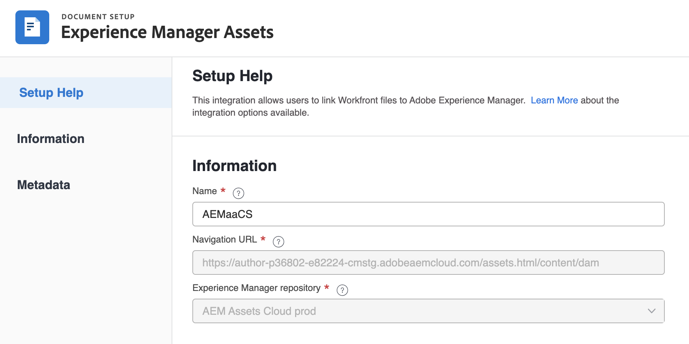

# Frame.io 統合でのAdobe Experience Managerの使用

[!DNL Experience Manager Assets]&#x200B;&#x200B;を使用して、レビューと承認のサイクルを経たデジタルアセットを管理および保存できます。 この統合により、Adobe Experience Manager、Frame.io、Workfrontの機能を活用して、コンテンツ管理や共同作業のプロセスを合理化できます。

## Experience Manager Assets統合の設定

[!DNL Experience Manager Assets] のコンテンツと作業内容を連携できます。

* アセットとメタデータを [!DNL Adobe Workfront] から [!DNL Experience Manager Assets] にプッシュ
* ユースケースのバージョン管理を容易化
* アセットのメタデータの追跡
* [!DNL Workfront] および [!DNL Experience Manager Assets] の間でプロジェクトメタデータを同期

>[!NOTE]
>
>複数の [!DNL Experience Manager Assets] リポジトリを 1 つの [!UICONTROL Workfront] 環境に接続するか、または複数の [!DNL Workfront] 環境を組織 ID をまたいで 1 つの [!DNL Experience Manager Assets] リポジトリに接続できます。設定する統合ごとに、この記事の設定手順に従ってください。

## アクセス要件

+++ 展開すると、この記事の機能のアクセス要件が表示されます。

<table>
  <tr>
   <td>Adobe Workfront パッケージ
   </td>
   <td> 
PrimeまたはUltimate

    
ワークフロー Ultimate

   </td>
  </tr>
    <tr>
   <td>Adobe Workfront ライセンス
   </td>
   <td>
  
統合を設定するには：

   
Standard

   
プラン

ドキュメントをExperience Manager Assetsに送信するには：

   
投稿者以上

   
リクエスト以上

   </td>
  </tr>
  </tr>
    <tr>
   <td>Adobe Experience Manager ライセンス
   </td>
   <td>Standard
   </td>
  </tr>
  <tr>
   <td>その他の製品
   </td>
   <td>[!DNL Experience Manager Assets as a Cloud Service] があり、製品にユーザーとして追加されている必要があります。
   </td>
  </tr>
   <tr>
   <td>アクセスレベル設定
   </td>
   <td>[!DNL Workfront] 管理者である必要があります。
   </td>
  </tr>
</table>

この表の情報について詳しくは、[Workfront ドキュメントのアクセス要件](/help/quicksilver/administration-and-setup/add-users/access-levels-and-object-permissions/access-level-requirements-in-documentation.md)を参照してください。

+++

## 前提条件

開始する前に、

* [!DNL Adobe Admin Console] の組織 ID に [!DNL Workfront] と [!DNL Adobe Experience Manager Assets] が関連付けられている必要があります。詳しくは、[プラットフォームベースの管理の違い（[!DNL Adobe Workfront]／[!DNL Adobe Business Platform]）](/help/quicksilver/administration-and-setup/get-started-wf-administration/actions-in-admin-console.md)を参照してください。
* Workfront インスタンスは、Adobe Enterprise Storage を使用している必要があります。

## 統合情報の設定

{{step-1-to-setup}}

1. 左のパネルで、「**[!UICONTROL ドキュメント]**」をクリックし、「**[!UICONTROL [!DNL Experience Manager]統合]**」を選択します。
1. 「**[!UICONTROL [!DNL Experience Manager] 統合を追加]**」を選択します。
1. 「**[!UICONTROL 名前]**」フィールドに、Workfront と Experience Manager Assets でこの統合を操作する際にユーザーに表示する名前を入力します。
1. 「**[!UICONTROL ナビゲーション URL]**」フィールドには、ナビゲーション URL がシステムによって自動的に入力されます。この読み取り専用 URL は、クイックアクセスの[!UICONTROL メインメニュー]からお使いの組織の [!DNL Experience Manager] にリンクするために使用されます。
1. **[!UICONTROL [!DNL Experience Manager]Assets リポジトリ]**&#x200B;ドロップダウンメニューからリポジトリを選択します。システムでは自動的にお使いのユーザープロファイルが割り当てられる組織 ID に関連する [!DNL Experience Manager] リポジトリが入力されます。
   

1. 「**[!UICONTROL 保存]**」をクリック、または、この記事の[メタデータの設定（オプション）](#set-up-metadata-optional)の節へ移動してください。

   >[!IMPORTANT]
   >
   >統合が複雑であるため、初期設定を保存した後はリポジトリを変更できません。

## メタデータを設定（オプション）

[!DNL Workfront] オブジェクトデータと [!DNL Experience Manager] Assets のメディアフィールドをマッピングできます。

>[!NOTE]
>
>メタデータのマッピングは、[!DNL Workfront] から [!DNL Experience Manager] への一方向にのみ実行できます。[!DNL Experience Manager] から [!DNL Workfront] にリンクされたドキュメントのメタデータは、[!DNL Workfront] に転送できません。

### メタデータフィールドの設定

メタデータフィールドのマッピングを開始する前に、Workfront と Experience Manager Assets の両方でメタデータフィールドを設定する必要があります。

メタデータフィールドを設定するには、次の手順に従います。

1. [Adobe [!DNL Workfront] と [!DNL Experience Manager Assets] 間でのアセットメタデータマッピングの設定](https://experienceleague.adobe.com/en/docs/experience-manager-cloud-service/content/assets/integrations/configure-asset-metadata-mapping)での説明に従って、[!DNL Experience Manager Assets] でメタデータスキーマを設定します。

1. Workfront でカスタムフォームフィールドを設定します。[!DNL Workfront] には、使用できるビルトインのカスタムフィールドが多数あります。ただし、[&#x200B; カスタムフォームの作成 &#x200B;](/help/quicksilver/administration-and-setup/customize-workfront/create-manage-custom-forms/form-designer/design-a-form/design-a-form.md) で説明されているように、独自のカスタムフィールドを作成することもできます。

+++ **サポートされている Workfront フィールドおよび Experience Manager Assets フィールドについて詳しくはこちらを展開** 

**Experience Manager Assets タグ**

Workfront でサポートされている任意のフィールドを、Experience Manager Assets のタグにマッピングできます。それには、Experience Manager Assets のタグ値が Workfront と一致するようにする必要があります。

* タグと Workfront フィールド値は、つづりと形式が完全に一致する必要があります。
* Experience Manager Assets のタグに大文字が含まれているように見える場合でも、Experience Manager Assets タグにマッピングされる Workfront フィールドの値はすべて小文字にする必要があります。
* Workfront フィールドの値にスペースを含めることはできません。
* Workfront のフィールド値には、Experience Manager Assets タグのフォルダー構造も含める必要があります。
* 複数の 1 行テキストフィールドをタグにマッピングするには、メタデータマッピングの Workfront 側にタグ値のコンマ区切りリストを入力し、Experience Manager Assets 側に `xcm:keywords` を入力します。各フィールド値は、別個のタグにマッピングされます。計算フィールドを使用すると、複数の Workfront フィールドを組み合わせて、1 つのコンマ区切りテキストフィールドにすることができます。
* ドロップダウンフィールド、ラジオボタンフィールドまたはチェックボックスフィールドの値をマッピングするには、それぞれのフィールドで使用可能な値のコンマ区切りリストを入力します。

>[!INFO]
>
>**例**：ここのフォルダー構造に表示されるタグと一致させるために、Workfront のフィールド値は `landscapes:trees/spruce` になります。Workfront フィールド値の小文字に注意してください。
>
>タグをタグツリーの左端の項目にする場合は、タグの後にコロンを付ける必要があります。この例では、landscapes タグにマッピングするために、Workfront のフィールド値は `landscapes:` になります。
>
>

Experience Manager Assets でタグを作成すると、タグは「メタデータ」セクションのタグドロップダウンに表示されます。フィールドをタグにリンクするには、メタデータマッピングエリアの Experience Manager Assets フィールドドロップダウンで `xcm:keywords` を選択します。

タグの作成および管理方法など、Experience Manager Assets のタグについて詳しくは、[タグの管理](https://experienceleague.adobe.com/en/docs/experience-manager-64/administering/contentmanagement/tags)を参照してください。

**Experience Manager Assets のカスタムメタデータスキーマフィールド**

ビルトインのフィールドとカスタム Workfront フィールドの両方を、Experience Manager Assets のカスタムメタデータスキーマフィールドにマッピングできます。

Experience Manager Assets で作成したカスタムメタデータフィールドは、メタデータ設定エリアの独自のセクションに整理されます。

<!-- 
link to documentation about creating schema - waiting on response from Anuj about best article to link to
-->

**Workfront フィールド**

ビルトインのフィールドとカスタム Workfront フィールドの両方を、Experience Manager Assets にマッピングできます。以下のフィールド値は、Workfront と Experience Manager Assets の間で、大文字小文字の区別とつづりの両方が一致する必要があります。

* ドロップダウンフィールド
* 複数選択フィールド

>[!TIP]
>
> フィールド値が正確に一致するかどうかを確認するには、以下に移動します。
>
> * Workfront またはオブジェクトフィールドで、設定／カスタムフォーム
> * Experience Manager Assets で、アセット／メタデータスキーマ

+++

### アセットのメタデータのマッピング

アセットが初めて [!DNL Workfront] からプッシュされると、メタデータがマッピングされます。ビルトインのフィールドやカスタムフィールドを持つドキュメントは、アセットが [!DNL Experience Manager Assets] に初めて送信されたときに、指定のフィールドに自動的にマッピングされます。

アセットのメタデータをマッピングするには、次の手順に従います。

<!--
1. Select **[!UICONTROL Assets]** above the metadata table.
-->
1. **[!UICONTROL [!DNL Workfront]フィールド]**&#x200B;列で、ビルトインのフィールドまたはカスタム Workfront フィールドを選択します。

   >[!NOTE]
   >
   >単一の [!DNL Workfront] フィールドを複数の [!UICONTROL Experience Manager Assets] フィールドにマッピングできます。複数の [!DNL Workfront] フィールドを単一の [!DNL Experience Manager Assets] フィールドにマッピングすることはできません。
   ><!--To map a Workfront field to an Experience Manager Assets tag, see -->

1. [!DNL Experience Manager Assets] フィールドで、事前入力されたカテゴリを検索するか、検索フィールドに 2 文字以上入力して、追加のカテゴリにアクセスします。
1. 必要に応じて、手順 2 および 3 を繰り返します。
   
1. [!UICONTROL **保存**] をクリックするか、この記事の [&#x200B; オブジェクトメタデータの同期 &#x200B;](#object-metadata-sync) の節に移動します。

### オブジェクトメタデータの同期

[!DNL Workfront] ポートフォリオ、プログラム、プロジェクト、タスク、イシューおよびドキュメントフィールドにマッピングされた [!DNL Experience Manager] フィールドは、[!DNL Workfront] でフィールドが変更されると自動的に更新されます。

このオプションを有効にすると、Adobe Experience Manager にプッシュされたすべてのアセットが、Workfrontのドキュメントの詳細ページにドキュメントのAdobe Experience Manager メタデータのリアルタイム表示を表示します。

1. 「**[!UICONTROL オブジェクトメタデータを同期]**」フィールドを有効にし、「**保存** をクリックします。

>[!IMPORTANT]
>
>メタデータの更新時に同期するために、ユーザーはオブジェクト内に存在するアセットに対して [!DNL Experience Manager] への書き込みアクセス権が必要です。

## Experience Manager Assets または Assets Essentials へのドキュメントの送信

Workfront から Experience Manager Assets または Assets Essentials にドキュメントを送信できます。Workfrontから Assets Essentials にアップロードおよび送信されたドキュメントは、引き続きドキュメントストレージ全体にカウントされます。

この統合を通じてExperience Managerに送信されるAssetsのサイズ制限は、**5o TB** です。

<!--In the Preview environment, Assets sent to Experience Manager through this integration have a size limit of **30 GB**.-->

Workfront から Experience Manager Assets または Assets Essentials にアセットを送信する際、メタデータフィールドが最初にマッピングされます。親オブジェクトに対してマッピングするように設定されたメタデータも送信されます。メタデータマッピングの設定について詳しくは、[Experience Manager Assets as a Cloud Service 統合の設定](/help/quicksilver/administration-and-setup/configure-integrations/configure-aacs-integration.md)または [Experience Manager Assets Essentials 統合の設定](/help/quicksilver/documents/adobe-workfront-for-experience-manager-assets-essentials/setup-asset-essentials.md)を参照してください。

>[!INFO]
>
>**例** プロジェクトに添付されたアセットを最初に送信すると、メタデータは、Experience Manager Assetsまたは Assets Essentials にマッピングされ、ポートフォリオやプログラムなどの親オブジェクトからマッピングされたメタデータもマッピングされます。

### Workfront からドキュメントを送信

Workfront から Experience Manager Assets または Assets Essentials にユーザーがドキュメントを送信すると、マッピングされたメタデータはドキュメントに沿って転送されます。ドキュメントの送信後、Workfront でドキュメントのメタデータに加えた変更は、Assets や Assets Essentials には反映されません。Workfrontのマッピングされたフィールドが変更された場合は、更新されたメタデータを含む新しいバージョンのドキュメントをAssetsまたは Assets Essentials に送信する必要があります。

ドキュメントを送信するには：

1. **ドキュメント**&#x200B;に移動して、Workfront エリアに移動し、送信するドキュメントを選択します。
1. 「**送信先**」をクリックして、管理者が設定した Experience Manager 統合を選択します。

   >[!NOTE]
   >
   >Workfront 管理者は、この統合に対して任意の名前を選択できるので、Assets や Assets Essentials とは明記されていない場合があります。

   

1. アセットの保存先を選択し、「**フォルダーを選択**」をクリックします。
1. 目的の宛先が見つかったら、「**保存**」をクリックします。

### 新しいバージョンを送信

以前に Workfront にアップロードしたドキュメントに新しいバージョンを追加できます。詳しくは、[新しいバージョンのドキュメントのアップロード](/help/quicksilver/documents/managing-documents/upload-new-document-version.md)を参照してください。最新バージョンがアップロードされたら、そのバージョンを Assets Essentials に送信できます。Workfront でマッピングされたフィールドが変更された場合、新しいバージョンは、送信時に Assets Essentials のメタデータを更新します。

>[!IMPORTANT]
>
>新しいバージョンを Workfront にアップロードする前に、ファイル名を変更することをお勧めします。以前のバージョンと同じファイル名を持つ新しいバージョンをアップロードした場合、Workfront からダウンロードできるのは最新バージョンのみです。ファイル名に関係なく、すべてのバージョンをExperience Manager Assetsまたは Assets Essentials からダウンロードできます。<!--Is this still a thing with ESM?-->

最新バージョンを送信するには、次の手順に従います。

1. Workfront の&#x200B;**ドキュメント**&#x200B;エリアに移動して、ドキュメントを探します。
1. 「**送信先**」を選択し、管理者が設定した Experience Manager 統合を選択します。

   >[!NOTE]
   >
   >Workfront 管理者は、この統合の名前を任意に選択できるので、Assets や Assets Essentials とは明記されていない場合があります。

   

1. 「**保存**」をクリックします。新しいバージョンは、以前のバージョンと同じ場所に保存されます。
