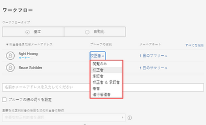
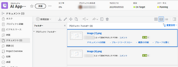

# 基本ワークフローを使用した詳細な配達確認の作成

<!-- Audited: 1/2024 -->

基本的なワークフローでは、配達確認に対して複数のレビュー担当者を指定できますが、レビュー担当者は段階別に整理されません。 追加したすべてのレビュー担当者は、作成後すぐに配達確認にアクセスできます。

## アクセス要件

この記事の手順を実行するには、次のアクセス権が必要です。

<table style="table-layout:auto"> 
 <col> 
 <col> 
 <tbody> 
  <tr> 
   <td role="rowheader">Adobe Workfront plan*</td> 
   <td>
   
新規：任意

    
現在のプラン： Pro 以上

   
レガシープラン：選択またはそれ以上
 
様々なプランでのアクセスの検証について詳しくは、 <a href="/help/quicksilver/administration-and-setup/manage-workfront/configure-proofing/access-to-proofing-functionality.md" class="MCXref xref">Workfrontの校正機能へのアクセス</a>.
 </td> 
  </tr> 
  <tr> 
   <td role="rowheader">Adobe Workfrontライセンス</td> 
   <td>
   
新規：標準

    
現行：作業または計画
 
レガシープラン：任意（ユーザーの校正が有効になっている必要があります）
 </td> 
  </tr> 
  <tr> 
   <td role="rowheader">プルーフ権限プロファイル </td> 
   <td>マネージャ以降</td> 
  </tr> 
  <tr> 
   <td role="rowheader">アクセスレベル設定</td> 
   <td> 
ドキュメントへのアクセスを編集
 </td> 
  </tr> 
 </tbody> 
</table>

&#42;保有しているプラン、役割、配達確認権限プロファイルを確認するには、WorkfrontまたはWorkfrontの配達確認管理者に問い合わせてください。

## 基本ワークフローを使用した詳細な配達確認の作成

1. 配達確認を行うプロジェクト、タスクまたは問題報告に移動し、 **ドキュメント** タブをクリックします。
1. クリック **新規追加** /配達確認に移動し、コンテンツをアップロードして、以下のセクションを操作します。

   または

   既存のドキュメントにカーソルを合わせ、 **配達確認を作成** > **高度な配達確認** およびは、以下の節で説明しています。

## ワークフローの設定とレビュー担当者の追加

1. 「ワークフロータイプ」セクションで、「 **基本**.
1. 追加するユーザーを指定し、配達確認の役割を選択します。

   

1. 次の表に、各役割とそれに関連する権限を示します。

   <table border="1" cellspacing="15" cellpadding="1"> 
    <col> 
    <col> 
    <col> 
    <col> 
    <col> 
    <col> 
    <col> 
    <col> 
    <col> 
    <col> 
    <col> 
    <col> 
    <col> 
    <col> 
    <thead> 
     <tr> 
      <th> 
 
 </th> 
      <th> 
<strong>配達確認を表示</strong> 
 </th> 
      <th> 
<strong>マークアップを追加</strong> 
 </th> 
      <th> 
<strong>コメントを追加</strong> 
 </th> 
      <th> 
<strong>返信がない場合は自分のコメントを編集</strong> 
 </th> 
      <th> 
<strong>決定を下す</strong> 
 </th> 
      <th> 
<strong>他のユーザーが行ったコメントを削除</strong> 
 </th> 
      <th>コメントを解決</th> 
      <th>コメントにアクションを適用</th> 
      <th> 
<strong>配達確認を編集</strong> 
 </th> 
      <th>他のユーザーと配達確認を共有</th> 
      <th>新しいバージョンを作成</th> 
      <th> 
<strong>ホーム領域での承認リクエストの表示</strong> 
 </th> 
      <th>新しいレビュー担当者を追加</th> 
     </tr> 
    </thead> 
    <tbody> 
     <tr> 
      <td> 
<strong>読み取り専用</strong> 
 </td> 
      <td> 
✓
 </td> 
      <td> 
 
 </td> 
      <td> 
 
 </td> 
      <td> 
 
 </td> 
      <td> 
 
 </td> 
      <td> 
 
 </td> 
      <td> </td> 
      <td>✓</td> 
      <td> 
 
 </td> 
      <td>✓</td> 
      <td> </td> 
      <td> </td> 
      <td> </td> 
     </tr> 
     <tr> 
      <td> 
<strong>レビュアー</strong> 
 </td> 
      <td> 
✓
 </td> 
      <td> 
✓
 </td> 
      <td> 
✓
 </td> 
      <td> 
✓
 </td> 
      <td> 
 
 </td> 
      <td> 
 
 </td> 
      <td> </td> 
      <td>✓</td> 
      <td> 
 
 </td> 
      <td>✓</td> 
      <td> </td> 
      <td> </td> 
      <td> </td> 
     </tr> 
     <tr> 
      <td> 
<strong>承認者</strong> 
 </td> 
      <td> 
✓
 </td> 
      <td> 
 
 </td> 
      <td> 
 
 </td> 
      <td> 
 
 </td> 
      <td> 
✓
 </td> 
      <td> 
 
 </td> 
      <td> </td> 
      <td>✓</td> 
      <td> 
 
 </td> 
      <td>✓</td> 
      <td> </td> 
      <td> 
✓
 </td> 
      <td> </td> 
     </tr> 
     <tr> 
      <td> 
<strong>レビュー担当者と承認者</strong> 
 </td> 
      <td> 
✓
 </td> 
      <td> 
✓
 </td> 
      <td> 
✓
 </td> 
      <td> 
✓
 </td> 
      <td> 
✓
 </td> 
      <td> 
 
 </td> 
      <td> </td> 
      <td>✓</td> 
      <td> 
 
 </td> 
      <td>✓</td> 
      <td> </td> 
      <td> 
✓
 </td> 
      <td> </td> 
     </tr> 
     <tr> 
      <td> 
<strong>作成者</strong> 
 </td> 
      <td> 
✓
 </td> 
      <td> 
✓
 </td> 
      <td> 
✓
 </td> 
      <td> 
✓
 </td> 
      <td> 
✓
 </td> 
      <td> 
 
 </td> 
      <td>✓</td> 
      <td>✓</td> 
      <td> 
✓
 </td> 
      <td>✓</td> 
      <td>✓</td> 
      <td> </td> 
      <td>✓</td> 
     </tr> 
     <tr> 
      <td> 
<strong>調整者</strong> 
 </td> 
      <td> 
✓
 </td> 
      <td> 
✓
 </td> 
      <td> 
<strong>✓</strong> 
 </td> 
      <td> 
✓
 </td> 
      <td> 
✓
 </td> 
      <td> 
✓
 
 
 </td> 
      <td>✓</td> 
      <td>✓</td> 
      <td> 
✓
 </td> 
      <td>✓</td> 
      <td>✓</td> 
      <td>✓</td> 
      <td>✓</td> 
     </tr> 
    </tbody> 
   </table>

1. 新しいWorkfrontプランのユーザーは、システム内の任意のユーザーに作成者またはモデレーターの役割を付与できます。 レガシープランのユーザーは、システム内の配達確認ライセンスを持つすべてのユーザーに、作成者またはモデレーターの役割を付与できます。
1. （オプション）ドロップダウンメニューが開いたままの状態で、メニューの下部で使用可能な追加の権限を選択します。

   <table style="table-layout:auto"> 
    <col> 
    <col> 
    <tbody> 
     <tr> 
      <td role="rowheader">コメントを解決してアクションを適用する </td> 
      <td> 
Workfrontユーザーに対し、次の操作を許可します。
 
       <ul> 
        <li>コメントに対する修正後、コメントを解決します ( <a href="../../../review-and-approve-work/proofing/reviewing-proofs-within-workfront/comment-on-a-proof/resolve-proof-comments.md" class="MCXref xref">配達確認コメントを解決</a>.</li> 
        <li>コメントにアクションを適用します ( <a href="../../../review-and-approve-work/proofing/reviewing-proofs-within-workfront/comment-on-a-proof/use-actions-on-comments-in-viewer.md" class="MCXref xref">配達確認コメントに対するアクションの使用</a>. </li> 
       </ul> </td> 
     </tr> 
     <tr> 
      <td role="rowheader">タグでプルーフを共有する</td> 
      <td> 
レビュー担当者が、任意のWorkfrontユーザーを配達確認に追加できます ( <a href="../../../review-and-approve-work/proofing/reviewing-proofs-within-workfront/comment-on-a-proof/tag-users-to-share-proof.md" class="MCXref xref">配達確認を共有するようユーザーにタグを付けます</a>.
 
注意：  
これら 2 つのオプションを使用できない（淡色表示）場合、ユーザーは既に権限プロファイルを持ち、コメントの解決、コメントへのアクションの適用、任意のユーザーへのタグ付けを実行できます。 
 
オプションが表示されない場合、追加したユーザーはWorkfrontライセンス所有者ではありません。
 
 </td> 
     </tr> 
    </tbody> 
   </table>

1. 配達確認に追加した他のユーザーに対して、手順 1～3 を繰り返します。
1. 共有するユーザーごとに、 **E メールアラート** ドロップダウンリストで、ユーザーが配達確認に対してコメントや決定をする際に受け取る E メールアラートのタイプを選択します。

   <table style="table-layout:auto"> 
    <col> 
    <col> 
    <tbody> 
     <tr> 
      <td role="rowheader">すべてのアクティビティ</td> 
      <td>Workfrontは、新しいコメント、返信、決定など、配達確認に関するアクティビティが発生するたびにレビュー担当者に電子メールを送信します。 
これは、アクティビティの発生を確認できるので、校正プロセスを管理するユーザーにとって最適なオプションです。 

ユーザーは、自分のアクティビティに関する電子メールアラートを受け取りません。
</td> 
     </tr> 
     <tr> 
      <td role="rowheader">自分のコメントへの返信</td> 
      <td>メールは、誰かが自分のコメントに明示的に返信した場合（自分のコメントに対する自分の返信を除く）にのみ、レビュー担当者に送信されます。 つまり、配達確認の担当者が新しいコメントを作成した場合、レビュー担当者には通知されません。
この設定は、配達確認に関する他のコメントが通知されないように、また、自分のコメントに対する返信のみが通知されるように、配達確認のクライアントに対して推奨されます。

この電子メールアラート設定を持つレビュー担当者は、他の新しいコメントについては通知されませんが、校正ビューアでは、配達確認に関するすべてのコメントを表示できます。

コメントについて詳しくは、 <a href="../../../review-and-approve-work/proofing/reviewing-proofs-within-workfront/comment-on-a-proof/view-proof-comments.md" class="MCXref xref">配達確認コメントを表示して返信します</a>.
</td> 
     </tr> 
     <tr> 
      <td role="rowheader">決定</td> 
      <td>Workfrontは、誰かが決定した場合にのみ、レビュー担当者に電子メールを送信します。
これは、承認プロセスを管理し、配達確認の進行状況を監視し、どのユーザーが決定したかを確認する必要がある人（プロジェクトマネージャーなど）に役立ちます。

決定を送信する際に電子メールの確認オプションを選択しない限り、自分の決定に関する通知は送信されません。
</td> 
     </tr> 
     <tr> 
      <td role="rowheader">最終決定</td> 
      <td>Workfrontは、配達確認の最後の承認者が決定したときに電子メールを送信します。
この警告は多くの場合、実際のレビューディスカッションに参加する必要がないデザイナーが使用します。 最終的な決定が下されると、デザイナーに通知が届き、必要な変更に対して対処できます。

このアラートは、レビュープロセスが完了した場合にのみ通知を受け取る必要がある部署のリーダーにも役立ちます。
</td> 
     </tr> 
     <tr> 
      <td role="rowheader">時間別サマリ</td> 
      <td>Workfrontは、1 時間ごとにレビュー担当者に電子メールを送信し、1 時間ごとに発生したすべてのコメント、返信および決定の概要を記載します。
この E メールは、過去 1 時間以内に自分自身のアクティビティが発生した場合にのみ送信されます。 

このアラートは、プロジェクトの概要を確認するのに適しています。

この概要の使用例としては、プロジェクトの概要を必要とする上級レビュー担当者が挙げられますが、配達確認のすべてのアクティビティをすぐに通知する必要はありません。
</td> 
     </tr> 
     <tr> 
      <td role="rowheader">日別サマリ</td> 
      <td>Workfrontは、自分の以外にアクティビティがある日にのみ、すべてのコメント、返信および決定を記載した 1 つの電子メールを送信します。
このアラートは、1 日を通じて複数の更新で圧倒されることなく、プロジェクトの概要を確認するのに適しています。

このサマリの使用例の 1 つに、部門のリーダーがプロジェクトの全体的な進行状況を監視する場合があります。

詳しくは、 <a href="../../../review-and-approve-work/proofing/reviewing-proofs-within-workfront/manage-notifications-for-proof-comments.md" class="MCXref xref">配達確認のコメントおよび決定に関する通知を管理</a>.
</td> 
     </tr> 
     <tr data-mc-conditions=""> 
      <td role="rowheader">メールなし</td> 
      <td>Workfrontは電子メールアラートを送信しません。 これは、参照用としてのみ配達確認に追加され、変更を通知する必要がない人に役立ちます。
システムのデフォルトは、「毎日の概要」（「未設定」とも呼ばれます）です。 自分または自分のレビュー担当者が他の変更を加えない場合、すべての配達確認にこの設定が適用されます。
</td> 
     </tr> 
    </tbody> 
   </table>

1. 次で続行 [配達確認の電子メール設定を指定](#configure-email-settings-for-the-proof) 下

## 配達確認の電子メール設定を指定 {#configure-email-settings-for-the-proof}

1. Adobe Analytics の **電子メール通知** セクションで、電子メール通知とカスタムメッセージを、 [基本ワークフローを使用した詳細な配達確認の作成](#workflow) この記事の前の部分：

   <table>
   <tbody>
   <tr>
   <td>この配達確認について受信者に通知</td>
   <td>ユーザーに電子メール通知を送信する場合は、このオプションを選択します。 条件 <strong>基本共有</strong> が <strong>ワークフロー</strong> 」セクションに入力すると、配達確認の作成時に e メール通知が送信されます。 条件 <strong>自動ワークフロー</strong> が <strong>ワークフロー</strong> 「 」セクションに入力すると、配達確認が、ユーザーが関連付けられている自動ワークフローのステージに入ったときに電子メール通知が送信されます。</td>
   </tr>
   <tr>
   <td>カスタムメッセージを追加</td>
   <td>通知にカスタムメッセージを含める場合は、このオプションを選択します。 件名とメッセージ本文を指定できます。 メッセージ本文には、太字、箇条書き記号、ハイパーリンクなどのリッチテキスト書式を含めることができます。</td>
   </tr>
   </tbody>
   </table>

1. 次で続行 [配達確認の設定](#configure-proof-settings) 下

## 配達確認の設定 {#configure-proof-settings}

1. Adobe Analytics の **配達確認の設定** 「 」セクションで、次のいずれかのオプションを選択します。

   <table style="table-layout:auto"> 
    <col> 
    <col> 
    <tbody> 
     <tr> 
      <td role="rowheader">ログインが必要 — 配達確認は他のユーザーとのみ共有できます</td> 
      <td>このオプションを無効にすると（デフォルト）、URL を持つすべてのユーザーが配達確認を表示できます。  このオプションを選択した場合：
       <ul>
        <li>Workfrontの配達確認ユーザーのみが配達確認を表示できます。</li>
        <li>ユーザーは、配達確認に追加されていない限り、配達確認にサインインできません。</li>
        <li>購読を有効にできません。</li>
       </ul></td> 
     </tr> 
     <tr> 
      <td role="rowheader">この配達確認に必要な決定は 1 つだけです</td> 
      <td>このオプションを選択すると、レビューは、ある意思決定者が決定した後に完了します。 このオプションはデフォルトでは無効になっています。</td> 
     </tr> 
     <tr> 
      <td role="rowheader">電子署名するには決定が必要です</td> 
      <td>配達確認を決定する際には、ユーザー名とパスワードを指定する必要があります。</td> 
     </tr> 
     <tr> 
      <td role="rowheader">すべての必要な決定がおこなわれたら配達確認をロックする</td> 
      <td>この設定を有効にすると、すべての決定がおこなわれた後、配達確認の状態がロックされます。 最終承認者が決定を下すと、状態は自動的にロック解除からロックに変更されます。 このオプションはデフォルトでは無効になっています。</td> 
     </tr> 
     <tr> 
      <td role="rowheader">元のファイルをダウンロード</td> 
      <td>このオプションを選択すると、レビュー担当者は、配達確認の作成元のファイルをダウンロードできます。 このオプションの選択を解除すると、ダウンロードアイコンは表示されなくなります。 このオプションは、デフォルトで有効になっています。</td> 
     </tr> 
     <tr> 
      <td role="rowheader">パブリック URL または埋め込みコードを使用して配達確認を共有</td> 
      <td>このオプションを選択した場合、配達確認はパブリック URL または埋め込みコード経由で共有できます。</td> 
     </tr> 
     <tr> 
      <td role="rowheader">パブリック URL または埋め込みコードで配達確認に登録</td> 
      <td>このオプションを選択すると、配達確認に明示的に追加されていないユーザーも配達確認を購読できます。 配達確認を購読しているユーザーには、次の設定で定義した役割と E メールが付与されます。
       <ul>
        <li><strong>購読者の役割：</strong> 配達確認を購読するすべてのレビュー担当者に割り当てられる、デフォルトの配達確認の役割です。 </li>
        <li><strong>購読者向けの E メールアラート設定：</strong> 配達確認を購読するすべてのレビュー担当者に割り当てられるデフォルトの E メールアラートです。</li>
       </ul>

        <ul>
         <li><strong>次の項目に必要な電子メールリンクを使用した配達確認へのアクセス</strong> 配達確認へのリンクを含む E メールを購読者が受信するかどうかを設定します。 次の項目を選択できます。 <strong>メールなし</strong> （配達確認にアクセスするには、E メールリンクは必要ありません）。 <strong>配達確認通知 E メールのみ</strong> （購読者が、確認なしで E メールで配達確認へのリンクを受け取る）、または <strong>検証および配達確認の通知 E メール</strong> （購読者は、E メールで配達確認へのリンクを受け取り、リンクをクリックして配達確認にアクセスする必要があります。このオプションの目的は、ユーザーがアクセスできる正しい E メールアドレスを入力したことを確認することです）。</li>
        </ul>
注意：配達確認に自動ワークフローがすべて添付されている場合、すべての購読が配達確認の所有者に確認 E メールを生成するので、配達確認の所有者は、人物を追加するステージを決定できます。 

</td> 
     </tr> 
    </tbody> 
   </table>

1. クリック **配達確認を作成**.

   Workfrontは、選択したドキュメントまたは Web サイトの配達確認の生成を開始します。 ドキュメントのアップロードに関する遅延時間は、ファイルサイズとタイプに応じて異なる場合があります。 大きなファイルの生成に時間がかかるので、しばらくお待ちください。 ページから移動すると、Workfrontは引き続きファイルを生成します。 最大ファイルアップロードサイズは 4GB です。

1. 配達確認が生成されたら、「 **配達確認を開く** をクリックして、校正ビューアを起動します。

   

   自分のアカウントで校正が有効になっていないユーザーは、引き続きドキュメントを表示し、配達確認にコメントを付けることができます。