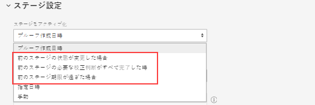
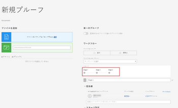

# 自動ワークフローを使用した高度な配達確認の作成

自動ワークフローを使用すると、プロセスが複雑な場合や、同じ担当者に定期的にレビュー用のコンテンツを送信する場合に、レビュープロセスの管理が容易になります。 配達確認はステージからステージに移動し、Adobe Workfrontは、レビューの順番が来たことを各ユーザーに通知します。 自動ワークフローについて詳しくは、 [自動ワークフローの概要](../../../review-and-approve-work/proofing/proofing-overview/automated-workflow.md).

## アクセス要件

この記事の手順を実行するには、次のアクセス権が必要です。

<table style="table-layout:auto"> 
 <col> 
 <col> 
 <tbody> 
  <tr> 
   <td role="rowheader">Adobe Workfront plan*</td> 
   <td> 
現在のプラン：Pro 以上
 
または
 
レガシープラン：選択またはそれ以上
 
様々なプランでのアクセスの検証について詳しくは、 <a href="/help/quicksilver/administration-and-setup/manage-workfront/configure-proofing/access-to-proofing-functionality.md" class="MCXref xref">Workfrontの校正機能へのアクセス</a>.
 </td> 
  </tr> 
  <tr> 
   <td role="rowheader">Adobe Workfront license*</td> 
   <td> 
現在のプラン：作業または計画
 
レガシープラン：任意（ユーザーの校正が有効になっている必要があります）
 </td> 
  </tr> 
  <tr> 
   <td role="rowheader">プルーフ権限プロファイル </td> 
   <td>マネージャ以降</td> 
  </tr> 
  <tr> 
   <td role="rowheader">アクセスレベル設定*</td> 
   <td> 
ドキュメントへのアクセスを編集
 
注意：まだアクセス権がない場合は、Workfront管理者に、アクセスレベルに追加の制限を設定しているかどうかを問い合わせてください。 Workfront管理者がアクセスレベルを変更する方法について詳しくは、 <a href="../../../administration-and-setup/add-users/configure-and-grant-access/create-modify-access-levels.md" class="MCXref xref">カスタムアクセスレベルの作成または変更</a>.
 </td> 
  </tr> 
 </tbody> 
</table>

&#42;保有しているプラン、役割、配達確認権限プロファイルを確認するには、WorkfrontまたはWorkfrontの配達確認管理者に問い合わせてください。

## 自動ワークフローを使用した高度な配達確認の作成

1. 配達確認を行うプロジェクト、タスクまたは問題報告に移動し、 **ドキュメント** タブをクリックします。
1. クリック **新規追加** /配達確認に移動し、コンテンツをアップロードして、以下のセクションを操作します。

   または

   既存のドキュメントにカーソルを合わせ、 **配達確認を作成** > **高度な配達確認** およびは、以下の節で説明しています。

## 配達確認のステージの設定

1. 「ワークフロータイプ」セクションで、「 **自動**.
1. （オプション） Workfront管理者が作成し、自分と共有した自動ワークフローテンプレートを使用する場合は、 **テンプレートを追加**&#x200B;をクリックし、表示されるボックスでテンプレートを選択して、 **テンプレートを追加**.

   >[!NOTE]
   >
   >自動ワークフローテンプレートを使用する際は、次の点に注意してください。
   >   
   >* 自動ワークフローテンプレートの設定によって、配達確認の自動ワークフローで何ができるかが決まります。 例えば、テンプレートで「ステージを追加」ボタンが無効になっている場合、配達確認の自動ワークフロー設定で作業している間は表示されません。
   * 自動ワークフローテンプレート内のステージにユーザーが追加され、配達確認のレビュー担当者としても既に存在する場合に、テンプレートを適用すると、レビュー担当者がステージから削除されます。 別のレビュー担当者をステージに追加しない場合は、レビュー担当者を追加するように促すメッセージが表示されます。
   * 自動ワークフローテンプレートを変更できるかどうかは、 Workfront管理者が設定したテンプレート設定によって異なります（を参照）。 テンプレートを変更する機能が無効になっている場合、変更できるのはテンプレートの所有者だけです。

1. 自動ワークフローの最初のステージを設定します。

   1. （オプション）最初のステージの名前を作成する場合は、 **ステージ 1**&#x200B;をクリックし、名前を入力します。
   1. 内 **受信者** 「 」セクションで、レビュー担当者をステージに追加します。

      >[!NOTE]
      ステージにレビュー担当者を追加する際は、次の点を考慮してください。
      * 電子メールアドレスを持つステージに外部ユーザーを追加できます。
      * ステージにユーザーを追加した後で、配達確認に対してそのユーザーの設定を指定できます。
      * ユーザーを別のステージに直接ドラッグすることも、ユーザーを **ステージ** 図。 複数のユーザーを選択するには、Shift + Ctrl キー（Windows の場合）または Shift + Command キー (Macの場合 ) を押します。
      * 配達確認にレビュー担当者を追加できるのは 1 回のみです。つまり、配達確認の複数のステージに同じ人物を追加することはできません。
      * 非公開ステージに追加されていないレビュー担当者は、そのステージで作成された配達確認またはコメントにそのステージを表示できません。
      * デフォルトでは、ユーザーをステージに追加すると、配達確認の作成時からそのユーザーに対して配達確認を表示するアクセス権が付与されます。\
         Workfront管理者は、ワークフローがユーザーの追加ステージに入るまで、ユーザーによる配達確認へのアクセスを制限できます。

   1. クリック **ステージ設定**.
   1. 次をクリック： **ステージを有効化** オプションを使用して、ステージのアクティブ化方法を指定します。

      最初のステージでは、次の項目のみを選択できます **配達確認の作成時**, **特定の日時に**&#x200B;または **手動**.

   1. （条件付き） **特定の日時に** 前の手順で、 **有効化日** 」ボックスが表示されます。

   1. ステージをさらに設定するには、以下の任意のオプションを使用します。

      <table style="table-layout:auto">
       <col>
       <col>
       <tbody>
        <tr>
         <td role="rowheader">ステージ期限を設定</td>
         <td>
ステージの期限を設定するには、 <strong>期限オプション</strong> 」ドロップダウンリストから選択できます。 次に、 <strong>期限</strong>、次のいずれかの操作を行います。

          <ul>
           <li>次を選択した場合： <strong>特定の日付を設定</strong>:期限の日時を選択します。</li>
           <li>次を選択した場合： <strong>ステージ有効化日から計算</strong>:ステージのアクティベーション日に追加する営業日数を選択して、期限を決定します。</li>
          </ul></td>
        </tr>
        <tr>
         <td role="rowheader">ステージをロック</td>
         <td>ステージをロックできるタイミングを指定します。 </td>
        </tr>
        <tr>
         <td role="rowheader">主な決定権限の転送先</td>
         <td>
ステージ上のプライマリの意思決定者を選択します（承認者以上の配達確認の役割を持つステージに少なくとも 1 人の人を追加した後にのみ使用できます）。 決定者をプライマリする場合、 <strong>1 つの決定のみが必要です</strong> このステージでは、オプションは無効になっています。
</td>
        </tr>
        <tr>
         <td role="rowheader">このステージでは 1 つの決定のみを必要とします</td>
         <td>意思決定者の 1 人が決定を下すと、レビュープロセス全体が終了します。
このオプションは、 <strong>プライマリ意思決定者</strong>ドロップダウンメニュー。
</td>
        </tr>
        <tr>
         <td role="rowheader">このステージを非公開にする</td>
         <td>この段階でおこなわれたコメントおよび決定の表示を、以下の担当者のみに許可します。スーパーバイザー、Workfront管理者、Workfront配達確認管理者</td>
        </tr>
       </tbody>
      </table>

1. 別のステージを追加して設定するには、次の手順に従います。

   1. クリック **新しいステージ**.
   1. （オプション）最初のステージの名前を作成する場合は、 **ステージ 2** ( または **ステージ 3**, **ステージ 4**&#x200B;など ) を含め、名前を入力します。

   1. 次をクリック： **ステージを有効化**&#x200B;次に、ステージを自動的にアクティブにするか、手動でアクティブにするかを指定するオプションを選択します。

      オプションに加えて **配達確認の作成時**, **特定の日時に**&#x200B;または **手動**&#x200B;を使用すると、前の手順で発生した内容に応じたオプションを選択できます。

      

   1. 前の手順で発生した内容に応じて「ステージをアクティブ化」オプションを選択した場合は、表示されるオプションを使用してアクティベーション設定を構成します。

      例えば、 **前のステージのステータスが変更された場合**&#x200B;を選択し、 **前のステージ**&#x200B;をクリックし、「 **ステータスがに変更されました** ボックス

1. 必要に応じて、前の手順を繰り返し、さらにステージを追加します。

   自動ワークフローにステージを追加すると、画面にダイアグラムが表示され、ステージを表します。

   

1. 続行 [配達確認の電子メール設定を指定](#configure-email-settings-for-the-proof) 下

## 配達確認の電子メール設定を指定 {#configure-email-settings-for-the-proof}

1. 内 **電子メール通知** セクションで、電子メール通知とカスタムメッセージを [自動ワークフローを使用した高度な配達確認の作成](#workflow) この記事の前の部分：

   <table>
      <tbody>
      <tr>
      <td>この配達確認について受信者に通知</td>
      <td>ユーザーに電子メール通知を送信する場合は、このオプションを選択します。 条件 <strong>基本共有</strong> が <strong>ワークフロー</strong> 」セクションに入力すると、配達確認の作成時に e メール通知が送信されます。 条件 <strong>自動ワークフロー</strong> が <strong>ワークフロー</strong> 「 」セクションに入力すると、配達確認が、ユーザーが関連付けられている自動ワークフローのステージに入ったときに電子メール通知が送信されます。</td>
      </tr>
      <tr>
      <td>カスタムメッセージを追加</td>
      <td>通知にカスタムメッセージを含める場合は、このオプションを選択します。 件名とメッセージ本文を指定できます。 メッセージ本文には、太字、箇条書き記号、ハイパーリンクなどのリッチテキスト書式を含めることができます。</td>
      </tr>
      </tbody>
      </table>

1. 続行 [配達確認の設定](#configure-proof-settings) 下

## 配達確認の設定 {#configure-proof-settings}

1. 内 **配達確認の設定** 「 」セクションで、次のいずれかのオプションを選択します。

   <table style="table-layout:auto"> 
    <col> 
    <col> 
    <tbody> 
     <tr> 
      <td role="rowheader">ログインが必要 — 配達確認は他のユーザーとのみ共有できます</td> 
      <td>このオプションを無効にすると（デフォルト）、URL を持つすべてのユーザーが配達確認を表示できます。  このオプションを選択した場合：
       <ul>
        <li>Workfrontの配達確認ユーザーのみが配達確認を表示できます。</li>
        <li>ユーザーは、配達確認に追加されていない限り、配達確認にサインインできません。</li>
        <li>購読を有効にできません。</li>
       </ul></td> 
     </tr> 
     <tr> 
      <td role="rowheader">この配達確認に必要な決定は 1 つだけです</td> 
      <td>このオプションを選択すると、レビューは、ある意思決定者が決定した後に完了します。 このオプションはデフォルトでは無効になっています。</td> 
     </tr> 
     <tr> 
      <td role="rowheader">電子署名するには決定が必要です</td> 
      <td>配達確認を決定する際には、ユーザー名とパスワードを指定する必要があります。</td> 
     </tr> 
     <tr> 
      <td role="rowheader">すべての必要な決定がおこなわれたら配達確認をロックする</td> 
      <td>この設定を有効にすると、すべての決定がおこなわれた後、配達確認の状態がロックされます。 最終承認者が決定を下すと、状態は自動的にロック解除からロックに変更されます。 このオプションはデフォルトでは無効になっています。</td> 
     </tr> 
     <tr> 
      <td role="rowheader">元のファイルをダウンロード</td> 
      <td>このオプションを選択すると、レビュー担当者は、配達確認の作成元のファイルをダウンロードできます。 このオプションの選択を解除すると、ダウンロードアイコンは表示されなくなります。 このオプションは、デフォルトで有効になっています。</td> 
     </tr> 
     <tr> 
      <td role="rowheader">パブリック URL または埋め込みコードを使用して配達確認を共有</td> 
      <td>このオプションを選択した場合、配達確認はパブリック URL または埋め込みコード経由で共有できます。</td> 
     </tr> 
     <tr> 
      <td role="rowheader">パブリック URL または埋め込みコードで配達確認に登録</td> 
      <td>このオプションを選択すると、配達確認に明示的に追加されていないユーザーも配達確認を購読できます。 配達確認を購読しているユーザーには、次の設定で定義した役割と E メールが付与されます。
       <ul>
        <li><strong>購読者の役割：</strong> 配達確認を購読するすべてのレビュー担当者に割り当てられる、デフォルトの配達確認の役割です。 </li>
        <li><strong>購読者向けの E メールアラート設定：</strong> 配達確認を購読するすべてのレビュー担当者に割り当てられるデフォルトの E メールアラートです。</li>
       </ul>

        <ul>
         <li><strong>次の項目に必要な電子メールリンクを介した配達確認へのアクセス</strong> 配達確認へのリンクを含む E メールを購読者が受信するかどうかを設定します。 次を選択できます。 <strong>メールなし</strong> （配達確認にアクセスするには、E メールリンクは必要ありません）。 <strong>配達確認通知 E メールのみ</strong> （購読者が、確認なしで E メールで配達確認へのリンクを受け取る）、または <strong>検証および配達確認の通知 E メール</strong> （購読者は、E メールで配達確認へのリンクを受け取り、リンクをクリックして配達確認にアクセスする必要があります。このオプションの目的は、ユーザーがアクセスできる正しい E メールアドレスを入力したことを確認することです）。</li>
        </ul>
<strong>注意：</strong> 配達確認に自動ワークフローが添付されている場合、すべての購読が配達確認の所有者に確認 E メールを生成するので、配達確認の対象となる人物を追加するステージを決定できます。 

</td> 
     </tr> 
    </tbody> 
   </table>

1. クリック **配達確認を作成**.

   Workfrontは、選択したドキュメントまたは Web サイトの配達確認の生成を開始します。 ドキュメントのアップロードに関する遅延時間は、ファイルサイズとタイプに応じて異なる場合があります。 大きなファイルの生成に時間がかかるので、しばらくお待ちください。 ページから移動すると、Workfrontは引き続きファイルを生成します。 最大ファイルアップロードサイズは 4GB です。

1. 配達確認が生成されたら、「 **配達確認を開く** 校正ビューアを起動します。

   

   自分のアカウントで校正が有効になっていないユーザーは、引き続きドキュメントを表示し、配達確認にコメントを付けることができます [.](../../../timesheets/config-timesheet-prefs/config-time-logged-hrs-days.md)
